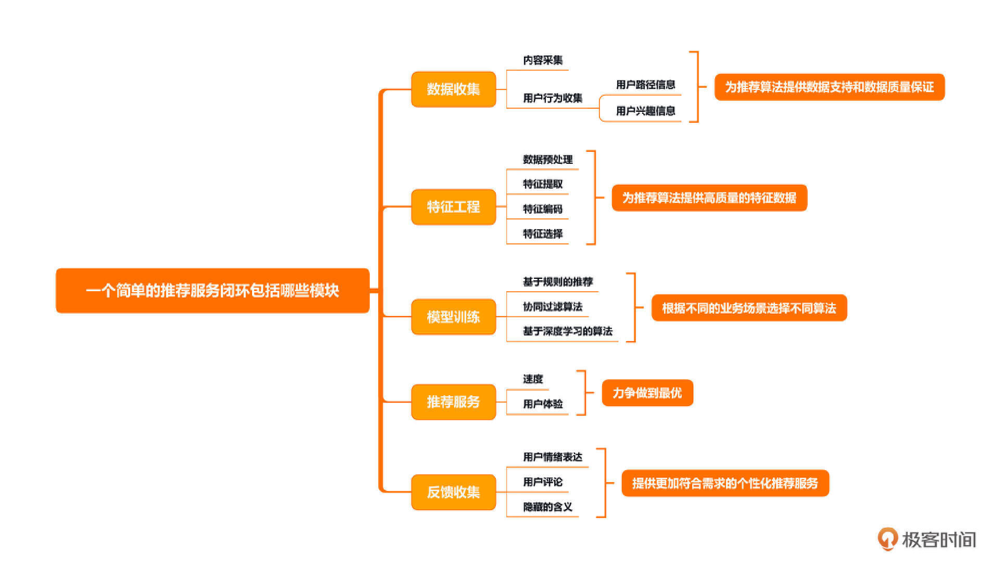

# 18｜一个简单的推荐服务闭环包括哪些模块？
你好，我是黄鸿波。

在前面的课程中，我们讲了关于爬虫的知识、画像的知识，还讲了基于规则的召回和一个简单的推荐系统服务，可以说，现在已经形成了一个非常小的闭环。今天这节课你可以把它看作是期中总结，我们来整体过一下一个简单的推荐服务闭环包括哪些模块，看看各个部分怎么流转。

## 数据收集模块

推荐系统服务中的数据收集（采集）模块是整个推荐系统的基础，它决定了推荐结果的质量和高效性，这是推荐系统流程的第一步。

数据收集模块负责从各个数据源中收集用户和物品的数据。一般来讲，在推荐系统中，我们可以将数据采集分成两个大部分：内容采集和用户行为收集。

**内容采集** 是推荐系统收集数据的基础，推荐系统需要通过分析用户对内容的兴趣来推荐最合适的内容。由于需要对内容进行充分地挖掘，内容采集会包含对内容来源的确定、内容分类、内容获取以及内容预处理等。

**用户行为收集** 对于推荐系统非常重要，我们可以通过收集用户行为信息，理解用户的兴趣、提高推荐效果以及改进产品的设计。

一般来讲，在用户行为数据中，最重要的数据有以下两类。

- 用户的路径信息。也就是用户从进入到退出这一段期间之内，用户所点击过的每一个按钮都会记录下来（一般都会往关键的位置打上锚点），从而记录用户的行为信息。
- 用户的兴趣信息。也就是我们在画像中所记录的给哪些内容点了赞、进行了收藏、评论和转发等。

数据收集模块的意义在于收集和提供推荐系统所需的各种数据资源，包括用户数据、商品数据、行为数据等，为推荐算法提供数据支持和数据质量保证，并帮助推荐系统更准确地了解用户需求和行为模式，提高推荐结果的准确性和实用性。同时，数据收集模块还能对推荐算法的训练和优化提供支持，不断提高推荐系统的性能和用户体验。

## **特征工程模块**

特征工程一般来讲是推荐系统闭环流程的第二步。特征工程模块的作用是对原始数据进行预处理和特征提取，从而得到可用于推荐算法的格式化和标准化的特征数据。这些特征数据可以帮助推荐算法更好地理解用户需求、内容属性和行为模式，提高推荐结果的准确性和实用性。

特征工程模块实际上可以参考我们之前做的 [内容画像](https://time.geekbang.org/column/article/655495) 的处理流程，总结起来就是对数据预处理、特征提取、特征编码以及特征选择。

- 数据预处理：针对原始数据进行清洗、去重、填充缺失值、归一化等处理，以保证数据的可用性和准确性。
- 特征提取：从用户特征、商品特征、行为特征中提取出有信息量的特征，如用户的兴趣、商品的属性、用户与商品之间的关系等，为推荐算法提供有效的特征数据。
- 特征编码：将提取出的特征进行编码，转换为向量或矩阵形式，以便于推荐算法进行计算和处理。
- 特征选择：从所有特征中选择出最具有代表性和区分度的特征，提高推荐算法的准确性和效率。

特征工程模块是推荐系统中重要的预处理环节，能够为推荐算法提供高质量的特征数据，提高推荐结果的准确性和实用性。

## **模型训练模块**

模型训练模块是推荐系统闭环中的第三步。一般来讲，有了数据和特征，接下来就是进行模型训练，这一步也是从根本上决定了整个推荐系统的效果。

在推荐系统中，模型训练模块对用户行为数据进行建模，从而能够更好地理解用户的兴趣、行为和偏好，提供更加准确的推荐结果。模型训练模块的输出结果是一个预测模型，包含了用户与物品之间的关系、用户特征和物品特征等信息。

在模型训练这个阶段中，我们会获取来自前面两个阶段的数据，有原始内容、用户行为以及我们在上一阶段处理好的特征。你可以通过一些机器学习或者深度学习的方法将这些内容组合起来，从而得到一个不错的推荐模型，取得不错的推荐效果。

**在这个阶段，准确率和效率是我们最应该关心的内容**。准确率指的是模型训练出来的内容有多少真的会被用户所喜欢。效率是指模型在进行推理过程中，需要耗费多长时间的开销。只有不断去优化准确率和效率，才能更好地推荐出优质的内容。

在模型训练模块中，我们需要根据实际的业务场景来选择模型和特征，并不是说一个模型效果好，就可以适用于所有的数据。在推荐系统中，常见的算法模型有基于规则的算法、协调过滤、基于内容的模型、基于深度学习的模型等，很多时候我们会将不同的模型进行组合，从而达到更好的效果。

比如对于一个新平台或者新产品， **基于规则的推荐** 非常适用。我们可以将热度、时间等信息作为推荐的规则，这样可以有效提高一个新平台用户的黏性和用户对产品的熟悉度。

但是对于有了一定的内容和用户的行为，但是并没有大规模的数据的产品，这时我们就要考虑一些比较传统的推荐算法，比如说 **协同过滤算法**。协同过滤算法的核心就是基于内容相似度和用户相似度找相关联的内容，然后去掉已经给用户推荐过或者用户已经浏览过的内容，将剩下的内容按照一定的分数进行推荐。

但是这种算法也有一个致命的问题，那就是无法给新用户推荐内容。由于新用户没有与其他用户产生交集或者交集较少，因此推荐出来的内容就非常少。如果推荐出来的内容用户没有点击，就会使得后面没有内容可推。因此，新用户还是建议使用基于规则的推荐算法。

当产品的规模变得非常大而且各种特征也变得密集时，前面的两种算法就会显得心有余而力不足了，这时 **基于深度学习的算法** 就会派上用场。基于深度学习的算法适用于大量的数据并且用户特征丰富的场景，可以自动地从原始数据中选择和提取特征，通过神经网络进行建模和训练，这种算法对于高维稀疏数据具有比较好的泛化能力。但是，这种方式一般对算力的要求也比较高，因此它的成本需求就会变得比较大。比如我们常见的YoutubeDNN和DIN这类的模型，都是基于深度学习的算法。

由此可见，要在训练的过程中根据不同的业务场景选择不同的算法，这样才能达到更好的效果。

## **推荐服务模块**

推荐服务模块是推荐系统闭环中的第四步。在这一步中，我们要将内容推荐给用户，也是推荐系统直接接触最终用户的一步。在这里用户直接能够感受推荐系统所推荐的内容，因此，用户体验是最重要的。

在推荐服务这一步，一般要考虑两方面的内容。第一方面是速度，第二方面就是用户体验。

所谓速度，就是响应要快。在用户请求之后，要及时作出响应。这个时间一般来讲控制在300ms以内是最好，这样的话用户才不会感觉系统的卡顿。

所谓用户体验，一般来讲指推出来的内容易读、美观。比如说，我们在推荐出来的内容中包含了10条文章、5个视频、3篇论坛帖子（并且他们的得分排序也是这么排），如果不做修改，那么用户将会看到前10篇都是文章，接下来5个内容都是视频，最后3个都是帖子，看起来千篇一律，会给人一种视觉疲劳。那么在推荐服务这个模块中，我们就需要做一定的优化，将文章、视频和帖子穿插起来，最好能做到每两个之间是不同的类型，从而提升了用户体验。

总而言之，推荐服务模块是推荐系统闭环中的一个核心组件，也是用户能够直接接触到的模块，无论是在用户体验还是在效率上，一定要力争做到最优。

## **反馈收集模块**

反馈收集模块是推荐系统流程中最后一个模块，也是最重要的一个模块。它的作用就是收集用户的反馈，将反馈信息用于优化系统、提高推荐的准确性和用户满意度。

反馈收集其实是一个非常广义的概念，根据业务需求的不同，所需要收集的反馈内容也有很大的差别。并且推荐系统要和整个产品进行配合，才能使反馈收集模块做得更好。以下三个方面是最需要收集的。

**第一个方面，** **用户的点赞、收藏、喜欢、不喜欢等行为**，这些是用户情绪最直观地表达。

**第二个方面，** **用户的评论**。对于用户的评论机器一般无法直接识别出含义，一般需要结合情感分析和文本分类等方法来为内容进行打标签，从而反推出用户的情绪。

**第三个** **方面，** **隐藏的含义**。比如说用户的某些流程走不通导致放弃，也就是一些流程或者bug给用户带来了不好的体验，会对用户后续的行为产生影响。这类的信息反馈也需要收集起来。

反馈收集模块不仅提供反馈方式、记录用户反馈信息，同时还可以通过反馈数据进行推荐算法的调优和推荐策略优化，为用户提供更加符合需求的个性化推荐服务。

## **总结**

到这里，这节课也就接近尾声了。今天这节课实际上是对前面的课程做一个比较系统的总结，也对后面的课程做一个铺垫。今天没有课后作业，希望你可以通过这节课查缺补漏，看看自己是否已经掌握了表格里的这几个模块。

当然，也欢迎你在评论区留下你的建议和想法，并把这节课分享给有需要的朋友。