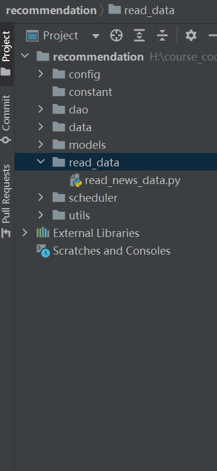
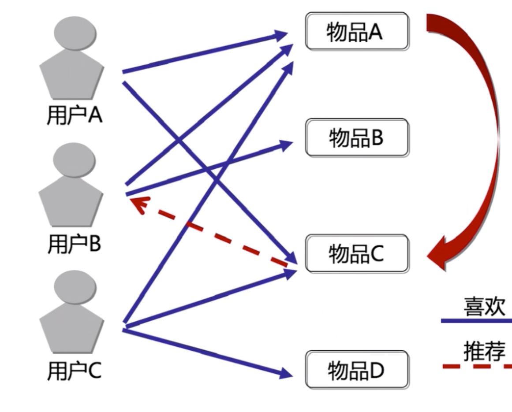
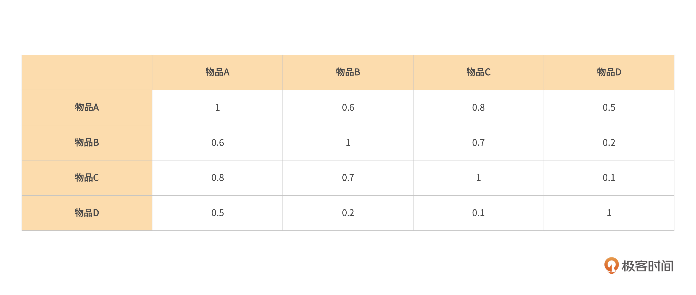

# 23｜流程串联：数据处理和协同过滤串联进行内容推荐
你好，我是黄鸿波。

在前面的课程中讲了很多召回算法，也讲了关于Flask和用户界面相关的内容，今天我们把所有的东西做一个流程串联。

今天主要会做下面五件事。

1. 将数据采集到协同过滤算法的召回中训练协同过滤算法。
2. 使用协同过滤算法训练出基于Item的协同过滤矩阵。
3. 利用协调过滤矩阵，将用户ID传入进去预测出每一个用户的Item list。
4. 将预测出来的结果存入到Redis数据库。
5. 通过WebService做成接口。

接下来，我们针对上面的内容，看看怎么一步步实现。

## 训练协同过滤算法

要想把之前的那一套协同过滤算法跑起来，首先要做的就是做好数据，并喂给协同过滤算法。

先来回顾一下在 [协同过滤](https://time.geekbang.org/column/article/662725) 那一节写的训练代码。

```plain
def cf_Item_train(self):
	"""

	:return:相似度矩阵：{content_id:{content_id:score}}
	"""
	print("start train")
	self.Item_to_Item, self.Item_count = dict(), dict()

	for user, Items in self.train.Items():
		for i in Items.keys():
			self.Item_count.setdefault(i, 0)
			self.Item_count[i] += 1  # Item i 出现一次就加1分

	for user, Items in self.train.Items():
		for i in Items.keys():
			self.Item_to_Item.setdefault(i, {})
			for j in Items.keys():
				if i == j:
					continue
				self.Item_to_Item[i].setdefault(j, 0)
				self.Item_to_Item[i][j] += 1 / (
					math.sqrt(self.Item_count[i] + self.Item_count[j])) # Item i 和 j 共现一次就加1

	# 计算相似度矩阵
	for _Item in self.Item_to_Item:
		self.Item_to_Item[_Item] = dict(sorted(self.Item_to_Item[_Item].Items(),
											   key=lambda x: x[1], reverse=True)[0:30])

```

在这段代码中，我们通过训练数据集可以取出User和所对应的Item，然后最后生成一个相似度矩阵。矩阵的格式如下，这里面实际上是算出每一个内容与其他内容之间的相似度关系。

```plain
{content_id:{content_id:score}}

```

我们继续分析这段代码，这段代码中需要的数据集就是代码中的self.train，然后取里面的每一条内容（User和Items），然后再做共现矩阵。

知道这些内容能够让我们更好地去制作数据集。在数据集中，应该至少包含下面三个部分。

1. 用户ID。
2. 内容ID。
3. 用户对内容的评分。

我先给你一个简单的数据集参考格式。

```plain
1,2,6117caee32002fb435aab0e4
1,2,6117caef32002fb435aab22e
1,2,6117caef32002fb435aab231
1,3,6117caef32002fb435aab242
4,2,6117caef32002fb435aab23d
4,17,6117caef32002fb435aab232
4,15,6117caef32002fb435aab231
4,13,6117caef32002fb435aab22e
4,16,6117caef32002fb435aab23c
3,4,6117caef32002fb435aab231

```

我们要做的数据集就是上面的这种形式。这里面一共分成三列：第一列是用户的ID、第三列是内容ID，而第二列就是用户对内容的评分。

这里面还有一个小小的疑问，那就是中间的评分是怎么来的呢？

还记得 [加权热度](https://time.geekbang.org/column/article/656948) 吗？比如阅读加1分、点赞加2分、收藏加2分、评论加3分，今天我们就在这个基础上来再做一个加权，形成数据集的分数。

我们可以设置下面这么一个规则。

- 阅读加1分。
- 点赞加2分。
- 收藏加3分。
- 如果同时存在2项多加1分。
- 如果同时存在3项多加2分。

接下来从MongoDB数据库中读取需要的数据，再通过规则来进行加权。最后再把得分存入到一个CSV表中，供训练使用。

我们在recommendation-class项目里新建一个叫read\_data的目录，以后读取数据都用这个目录，然后再在里面新建一个叫read\_news\_data.py的文件，新建之后目录格式如下。



先来看代码。

```plain
from dao.mongo_db import MongoDB
import os


class NewsData(object):
    def __init__(self):
        self.mongo = MongoDB(db='recommendation')
        self.db_client = self.mongo.db_client
        self.read_collection = self.db_client['read']
        self.likes_collection = self.db_client['likes']
        self.collection = self.db_client['collection']
        self.content = self.db_client['content_labels']

    """
    阅读 1
    点赞 2
    收藏 3

    如果同时存在2项 加 1分
    如果同时存在3项 加 2分
    """
    def cal_score(self):
        result = list()
        score_dict = dict()
        data = self.likes_collection.find()
        for info in data:
            #这里面做分数的计算
            score_dict.setdefault(info['user_id'], {})
            score_dict[info['user_id']].setdefault(info['content_id'], 0)

            query = {"user_id": info['user_id'], "content_id": info['content_id']}

            exist_count = 0
            # 去每一个表里面进行查询，如果存在数据，就加上相应的得分
            read_count = self.read_collection.find(query).count()
            if read_count > 0:
                score_dict[info['user_id']][info['content_id']] += 1
                exist_count += 1

            like_count = self.likes_collection.find(query).count()
            if like_count > 0:
                score_dict[info['user_id']][info['content_id']] += 2
                exist_count += 1

            collection_count = self.collection.find(query).count()
            if collection_count > 0:
                score_dict[info['user_id']][info['content_id']] += 2
                exist_count += 1

            if exist_count == 2:
                score_dict[info['user_id']][info['content_id']] += 1
            elif exist_count == 3:
                score_dict[info['user_id']][info['content_id']] += 2
            else:
                pass

            result.append(str(info['user_id']) + ',' + str(score_dict[info['user_id']][info['content_id']]) + ',' + str(info['content_id']))

        self.to_csv(result, '../data/news_score/news_log.csv')

    def rec_user(self):
        data = self.read_collection.distinct('user_id')
        return data

    def to_csv(self, user_score_content, res_file):
        if not os.path.exists('../data/news_score'):
            os.mkdir('../data/news_score')
        with open(res_file, mode='w', encoding='utf-8') as wf:
            # info = "1,8,6145ec828451a2b8577df7b3"
            for info in user_score_content:
                wf.write(info + '\n')

```

解释下这段代码，在项目的最开始，我们初始化了MongoDB数据库，并将数据库的各个集合存储到了相应的变量中。

接着我们定义了一个cal\_score()函数，这个函数的主要作用就是计算每个用户对于每篇新闻的得分，该函数遍历点赞数据集（likes\_collection），对每个用户和新闻计算其得分。计算该用户点赞该新闻的次数（like\_count）、阅读该新闻的次数（read\_count）和收藏该新闻的次数（collection\_count），对于每个存在的操作，可以给相应的新闻加分（点赞+2，阅读+1，收藏+2）。如果同时存在2项操作，则额外加1分，如果同时存在3项操作，则额外加2分。然后将每个用户的得分和对应的新闻ID写入CSV文件中。

最后我们还实现了两个函数，一个是rec\_user()函数，用来计算用户；另一个是to\_csv函数，用来将计算好的矩阵与CSV格式存储。

## 训练出基于Item的协同过滤矩阵

有了数据之后，就可以使用协同过滤算法来进行计算了。

我们在讲 [协同过滤](https://time.geekbang.org/column/article/662725) 时讲了怎么训练和推理，现在补全读取数据这一部分。

我们进到recommendation-class这个项目，来到models目录下的recall目录，在这里找到之前写的Item\_base\_cf.py文件。

首先，这个文件应该是在一个大类里，所以要建立一个类为ItemBaseCF，并在里面去写init函数，代码如下。

```plain
class ItemBaseCF(object):
    def __init__(self, train_file):
        """
        读取文件
        用户和Item历史
        Item相似度计算
        训练
        """
        self.train = dict()
        self.user_Item_history = dict()
        self.Item_to_Item = dict()
        self.read_data(train_file)

```

这段代码的init函数下面有几个变量，我们分别来看一下。

首先在init函数中传入一个train\_file文件（也就是训练文件），这个训练文件就是在前面保存到CSV中的文件。

然后我们定义了以下三个变量。

- self.train是一个字典，主要用来保存训练数据。读取出来的数据最终要保存成一个字典，然后从字典中获取相应的数据再进行训练。
- self.user\_Item\_history变量是用来保存用户读取内容的一个字典，这个字典的格式是self.user\_Item\_history\[“user\_id”\] 中用户所阅读过的所有内容列表。
- self.Item\_to\_Item变量实际上是一个内容的相似度矩阵，这个矩阵是整个协同过滤的核心所在。在self.Item\_to\_Item中会存放每一个内容与其他内容的相似度，这个相似度一般是对称的。

先来看下面这张图。



这张图是一张典型的基于Item的 [协同过滤图](https://www.cnblogs.com/chaojunwang-ml/p/11567088.html)，左侧是用户，右侧是物品（物品可以理解为推荐系统中的内容）。

用户A买了物品A和C，用户B买了物品A和B，我们假设物品A和物品C的相似度很高，那么这个时候，就会把物品C推荐给用户B。这个推荐实际上就是利用了基于Item的协同过滤，再把这四个物品转换成一个表格来表示相似度，就会看到下面这样一个表格。



这个表只是一个例子，在这个例子中，两个相同的物品相似度一定为1，那么可以看到A对B和B对A的相似度一定是一样的，同理A对C和C对A的相似度也一定是一样的，以此类推可以发现，这个表有一个很明显的特性，就是对称性。也就是说在实际的协同过滤算法中，我们会只计算其中的一半数据，这样可以减少计算量。在存储到字典中时，就会减少一半数据的大小，使得推理速度加快。

最后一个变量实际上是一个读取数据的函数，来看下这部分代码应该怎么来写。

```plain
def read_data(self, train_file):
	"""
	读文件，并生成数据集（用户、分数、新闻，user,score,Item）
	:param train_file: 训练文件
	:return: {"user_id":{"content_id":predict_score}}
	"""
	with open(train_file, mode='r', encoding='utf-8') as rf:
		for line in tqdm(rf.readlines()):
			user, score, Item = line.strip().split(",")
			self.train.setdefault(user, {})
			self.user_Item_history.setdefault(user, [])
			self.train[user][Item] = int(score)
			self.user_Item_history[user].append(Item)

```

这段代码将前面生成的CSV数据集传入进来，然后使用with open方法打开。打开之后，逐行读取文件中的每一行数据，并使用split进行分隔，这样就可以把用户ID、分数、文章ID分开并分别赋值。

在这里，我们使用setdefault方法将用户ID、评分和新闻ID添加到字典self.train中。如果用户ID不存在，新建一个空字典；如果用户已存在，则直接添加。用户读取内容的历史操作也是同理。

接着，将评分转换为整数类型，并将用户ID和新闻ID添加到self.train字典中。然后把新闻ID添加到self.user\_Item\_history字典中，表示该用户已经浏览过该新闻。

最终，这段代码返回一个字典，其中键为用户ID，值为字典，表示该用户浏览过的新闻及评分。另外，这段代码还把每个用户浏览过的新闻ID添加到self.user\_Item\_history字典中，以便后续使用。

## 搭建整个运行流程

前面的步骤相当于已经把相关的数据跑通了，下一步就是搭建整个流程，把它们串起来。

我们在scheduler目录下新建一个sched\_rec\_news.py文件，主要用来跑通整个协同过滤从数据进入到将结果存入到数据库的流程，需要做下面这四个步骤。

1. 知道要推荐给谁，也就是要先计算一下推荐用户的列表，分成冷启动和有推荐记录两种，只需要计算有阅读记录的人。
2. 通过训练，得到协同过滤矩阵。
3. 做推荐。
4. 把推荐的结果写到数据库里面，以备后面应用。

我们直接来看代码。

```plain
from read_data import read_news_data
from models.recall.Item_base_cf import ItemBaseCF
import pickle
from dao import redis_db


class SchedRecNews(object):
    def __init__(self):
        self.news_data = read_news_data.NewsData()
        self.Redis = redis_db.Redis()

    def schedule_job(self):
        """
        1、首先我们要知道要推荐给谁，也就是说，我们要先计算一下推荐用户的列表，分成冷启动、有推荐记录的两种，我们只需要给有阅读记录的人计算
        2、我们通过训练，得到协同过滤矩阵
        3、做推荐
        4、把推荐的结果写到数据库里面，以备后面应用
        :return:
        """
        user_list = self.news_data.rec_user()
        # self.news_data.cal_score()
        self.news_model_train = ItemBaseCF("../data/news_score/news_log.csv")
        self.news_model_train.cf_Item_train()
        # 模型固化
        with open("../data/recall_model/CF_model/cf_news_recommend.m", mode='wb') as article_f:
            pickle.dump(self.news_model_train, article_f)
        for user_id in user_list:
            self.rec_list(user_id)

    def rec_list(self, user_id):
        recall_result = self.news_model_train.cal_rec_Item(str(user_id))
        recall = []
        scores = []
        for Item, score in recall_result.Items():
            recall.append(Item)
            scores.append(score)
        data = dict(zip(recall_result, scores))
        self.to_redis(user_id, data)
        print("Item_cf to redis finish...")

    def to_redis(self, user_id, rec_conent_score):
        rec_Item_id = "rec_Item:" + str(user_id)
        res = dict()
        for content, score in rec_conent_score.Items():
            res[content] = score

        if len(res) > 0:
            data = dict({rec_Item_id: res})
            for Item, value in data.Items():
                self.Redis.redis.zadd(Item, value)


if __name__ == '__main__':
    sched = SchedRecNews()
	sched.schedule_job()


```

解释下这段代码。

1. 创建一个SchedRecNews类对象，其中包含新闻数据类对象和Redis数据库类对象。
2. 调用NewsData类中的rec\_user函数，获取需要进行推荐的用户列表。
3. 创建一个ItemBaseCF类对象并传入新闻评分数据的文件路径，然后调用ItemBaseCF类中的cf\_Item\_train函数，训练基于物品的协同过滤模型。
4. 将训练好的模型固化保存到本地文件中。
5. 对于每个用户调用rec\_list函数进行推荐。
6. 在rec\_list函数中，调用ItemBaseCF类中的cal\_rec\_Item函数获取每个用户的推荐列表（包括推荐内容和推荐得分），然后将推荐列表和相应的推荐得分保存到Redis数据库中。
7. 完成任务，程序结束。

## 做成WebService服务

接下来就是把协同过滤算法的输出和推荐接口进行对接，从而完成整个流程。

在这个阶段，我们要用的是recommendation-service这个项目，要做的有以下两件事。

1. 在Redis数据库中进行查询，然后把数据返回给前端进行展示。
2. 如果查询结果是空，还是走之前的接口，可以将它理解成为一个冷启动。

首先回忆一下之前的推荐接口代码。

```plain
@app.route("/recommendation/get_rec_list", methods=['POST'])
def get_rec_list():
    if request.method == 'POST':
        req_json = request.get_data()
        rec_obj = json.loads(req_json)
        page_num = rec_obj['page_num']
        page_size = rec_obj['page_size']

        try:
            data = page_query.get_data_with_page(page_num, page_size)
            print(data)
            return jsonify({"code": 0, "msg": "请求成功", "data": data})
        except Exception as e:
            print(str(e))
            return jsonify({"code": 2000, "msg": "error"})

```

这段代码实际上是请求一个冷启动的翻页代码。也就是说用户进来之后不管是谁，都会按照时间倒序进行推荐。但现在有了协同过滤，我们应该将协同过滤的结果引入进来，需要做下面这么两个更改。

1. 接收的参数增加user\_id这个字段。
2. 拿到user\_id去Redis数据库中进行查询，如果查到了就把里面的推荐列表给到前端；如果查不到，继续走冷启动（也就是按照时间排序进行推荐）。

先把从Redis中查找是否存在可推荐数据的方法写出来。我们在utils下面建立一个叫redis\_query.py的文件，然后在里面写入下面的内容。

```plain
from dao import redis_db


class RedisQuery:
    def __init__(self):
        self.redis_client = redis_db.Redis()

    def check_key_exist(self, key):
        return self.redis_client.redis.exists(key)
这段代码很简单，就是把redis导入进去之后，使用redis.exists()命令查看key是不是存在，如果存在就返回true。
紧接着，我们在这段代码中增加一个函数：
    def get_data_with_redis(self, user_id, page_num, page_size):
        redis_key = "rec_Item:" + str(user_id)
        if self.check_key_exist(redis_key):
            start_index = (page_num - 1) * page_size
            end_index = start_index + page_size - 1
            result = self.redis_client.redis.zrange(redis_key, start_index, end_index)

            lst = list()
            for x in result:
                info = self._redis.redis.get("news_detail:" + x)
                lst.append(info)
            return lst

```

这个函数就是从Redis中取数据，然后获得内容的ID列表，再从Redis的 “news\_detail:” 中获取相应的数据，返回给前端。

最后把推荐接口的代码再合入进来，变成如下代码即可。

```plain
@app.route("/recommendation/get_rec_list", methods=['POST'])
def get_rec_list():
    if request.method == 'POST':
        req_json = request.get_data()
        rec_obj = json.loads(req_json)
        user_id = rec_obj['user_id']
        page_num = rec_obj['page_num']
        page_size = rec_obj['page_size']

        try:
            redis_key = "rec_Item:" + str(user_id)
            if redis_query.check_key_exist(redis_key):
                data = redis_query.get_data_with_redis(user_id, page_num, page_size)
                print(data)
                return jsonify({"code": 0, "msg": "请求成功", "data": data})
            else:
                data = page_query.get_data_with_page(page_num, page_size)
                print(data)
                return jsonify({"code": 0, "msg": "请求成功", "data": data})
        except Exception as e:
            print(str(e))
            return jsonify({"code": 2000, "msg": "error"})

```

## 总结

到目前为止，整个流程就已经串起来了，接下来我对这节课做一个总结。

首先，训练基于 Item 的协同过滤矩阵的一般步骤：确定推荐对象、计算推荐矩阵、进行推荐、记录推荐结果。

其次，你应该熟悉如何将数据和协同过滤算法串联起来，并存入到Redis数据库。

最后，熟悉推荐系统的流程，一共可以分为四步。

1. 确定推荐对象：需要确定推荐系统的用户群体，并对他们的阅读记录进行收集和分析。同时，针对不同的用户群体，还需要选择不同的推荐算法和模型。
2. 计算推荐矩阵：得到用户的阅读记录之后，通过训练生成协同过滤矩阵（它反映了用户与文章之间的关联度），能够告诉我们哪些文章与用户更相关。
3. 进行推荐：基于得到的协同过滤矩阵就可以对用户进行推荐了。根据不同的算法和模型，我们可以选择不同的推荐方式，如基于用户的协同过滤、基于物品的协同过滤、基于内容的推荐等。
4. 记录推荐结果：把推荐的结果写到数据库里并实时更新，这样可以为后续应用提供支持和展示。同时，记录推荐结果也可以反哺推荐算法的迭代，提升推荐效果。

## 课后练习

这节课学完了，给你留两道课后题。

1. 实现上面的代码。
2. 把前端和这个推荐的结果串联起来。

期待你的分享，如果今天的内容让你有所收获，也欢迎你推荐给有需要的朋友！