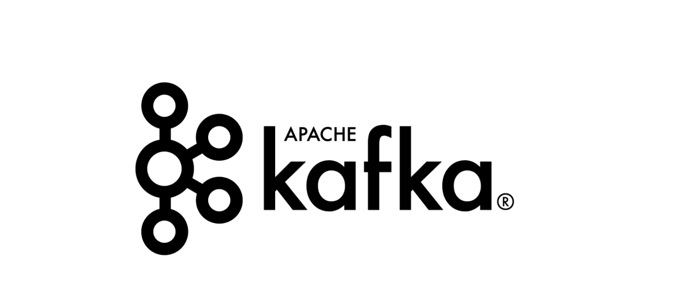

# 28｜珠联璧合：Kafka与推荐服务的联动
你好，我是黄鸿波。

这是推理部署篇的第二节课，学习完在Linux上部署推荐服务后，今天我们沿着推荐服务这条线，继续来讲Kafka相关的内容。

我把本节课分为了下面三大部分。

1. 什么是Kafka。
2. Kafka在推荐系统中的作用和用法。
3. 如何在我们的Service项目中加入Kafka。

## Kafka概述

首先，我们来大概了解一下什么是Kafka。

Kafka是一种基于发布/订阅模式的消息队列系统，它具有高性能、高可靠性和可扩展性等特点。Kafka最初由LinkedIn公司开发，用于解决其大规模数据流的处理和传输问题。今天，Kafka被广泛应用于流处理、实时处理、数据管道、日志聚合等场景中。

Kafka的核心设计思想在于，将消息发送者称为生产者（Producer），将消息接收者称为消费者（Consumer），将消息数据的缓存区称为主题（Topic），并通过多个分区（Partition）来平衡负载和扩展性。



Kafka的核心组件包括下面五个部分。

**1\. Producer**

Producer是消息的生产者，负责向Kafka中发送消息。Producer将消息发布到指定的Topic中，同时负责将消息插入到Topic中指定的Partition中，实现了数据的分区存储。在Kafka中，可以拥有多个Producer向同一个Topic发送消息。

**2\. Broker**

Broker是Kafka的中间层，承担了接收消息、存储消息以及转发消息的功能。每个Broker都是一个独立的Kafka服务器，代表了一组Kafka服务。

多个Broker可以组成一个Kafka集群，在集群中，Broker互相通信，将数据交换到其他的Broker中。通过使用集群中的多个Broker来处理同一个Topic的消息，可以提高系统吞吐量和可用性。

**3.** **Consumer**

Consumer是消息的消费者，负责从Kafka指定的Topic中消费消息。通过订阅Topic，Consumer可以接收来自Producer发送的消息，并可以按照特定的规则处理这些消息。在Kafka中，一个或多个Consumer可以订阅同一个Topic，并行消费其中的消息。

**4\. Partition**

Partition是将Topic分割成多个子集，以达到分布式的目的。每个Topic可以被划分成多个Partition，每个Partition存储一部分数据。每个Partition都有一个唯一的标识符，称为Partition ID。

Partition的存在使得消息可以被并行地处理，每个Partition被一个或多个Broker运行，由Consumer对其中的每个Partition进行处理。

**5\. Topic**

Topic是指在Kafka中组织数据的基本单位，它可以视作日志文件。每个Topic都是由一个或多个Partition组成，每个Partition中的消息按照时间顺序存储。消息被生产者推送到指定的Topic中，同时也是由消费者从指定的Topic中消费。

在Kafka中，可以创建多个Topic，每个Topic都是一个独立的逻辑集合，其包含一组相关的消息。Topic允许根据数据的处理方式进行逻辑分组，以方便后续的数据处理和管理。


我们常将Kafka用于消息队列的处理，作为一个优秀的消息队列系统，Kafka有非常多的优点，例如下面七个。

1. 高吞吐量：Kafka为高吞吐量而设计，可以实现每秒数百万条消息的生产和消费，并且可以轻松地水平扩展集群。
2. 可扩展性：Kafka的分布式架构可以轻松地扩展到数百个节点，并可以实现多个数据中心的复制和同步。
3. 节省存储空间：Kafka使用基于日志的存储方式，只会保留最近的消息，并定期删除旧数据，节约存储空间。
4. 可靠性高：Kafka使用副本机制和分布式消息提交来保证数据的可靠性和不丢失性。
5. 支持多种客户端：Kafka支持多种开发语言的客户端，包括Java、C++、Python、Go等，同时允许三方开发者自行开发。
6. 实时性：Kafka采用流式处理架构，可以实现实时数据处理，以及处理流媒体和实时数据分析。
7. 易于应用开发：Kafka提供了简单而有力的API，可以轻松地集成到任何应用程序中。

一般来讲，在以Web和App为主的应用程序中，一般都会使用Kafka来作为中间的流处理平台，在Web和App的项目中，一般常见的应用场景主要有日志采集、消息系统和用户活动追踪。

**日志收集**: Kafka 最初是为了构建日志收集系统而开发的，它的高吞吐量、持久性和可扩展性使得 Kafka 成为了日志收集领域的首选。Kafka 可以连接日志发生器（Log Generator），将高速流式的数据源发送到 Kafka 消息队列中存储，以供其他系统使用。它所提供的数据容错的机制保证了数据流的持久性，让日志数据可以在不同的系统节点之间进行共享、使用。

**消息系统**: Kafka 是一个分布式的消息系统，它支持实时、可扩展、高吞吐量的数据处理。Kafka 的消息队列可以被自由扩展，因此可以轻松地在 Kafka 集群上扩大消息处理的规模。同时，Kafka 的消息队列中每个消息都会持久化到磁盘上，从而可以在需要的时候被重新使用。 另一方面，通过多分区和多消费者组，Kafka 可以同时为不同的应用场景提供不同的消息消费方式。

**活动追踪**: Kafka 的高吞吐量和低延迟可帮助应用程序实时监控、分析事件和异常。通过将所有应用程序事件发送到 Kafka 消息队列，可以将活动追踪数据作为一个实时数据流进行采集和分析. Kafka 通过高吞吐量和立即可用的低延迟消息处理，使活动追踪变得更加实时化，从而可以了解系统的实时状态，及时发现并快速解决问题。

## Kafka在推荐系统中的用法

了解完什么是Kafka后，我们再来聊聊如何在推荐系统中应用Kafka，以及Kafka在推荐系统中起到的作用。

你可以从下面四点很明显地看出Kafka对于推荐系统的重要性。

**实时流处理**：推荐系统数据更新的速度非常快，需要实时对数据进行处理。Kafka支持高效的实时数据流处理机制，能够实时接收、存储、处理用户和商品的数据，以便推荐系统能够实时作出相应的推荐决策。

**分布式架构**：Kafka是一个分布式的消息队列系统，能够在可扩展的集群中保证高可用性和可靠性。在企业级的推荐系统中，需要处理的数据量非常大，分布式架构可以保证系统能够处理大规模任务，并在系统出现故障时保障服务的持续性。

**解耦架构**：当我们做日志分析和大规模数据处理时，推荐系统需要对大量的数据进行深度挖掘和分析，在此过程中，需要对数据进行批处理，以便能够更好地对数据进行统计和分析。

**批处理**：Kafka支持批处理模式，可以对大量的数据进行高效的批处理，这样就可以在数据处理和存储上优化系统的性能。

我们继续来讲Kafka在推荐系统中的用法。假设现在要开发一个基于电影推荐的在线视频服务，通过Kafka可以收集用户关于电影的浏览、评分和收藏等行为数据，这些数据可以存储在不同的Topic中，例如viewed-movies、rated-movies和favorite-movies。这些数据可以帮助我们了解用户的兴趣和喜好，进而为用户提供更加个性化的推荐。

当收集了大量的用户行为数据后，我们需要对这些数据进行处理，以便能够为用户提供更加有效的推荐服务。通过Kafka的实时数据分析能力，可以对收集的用户行为数据进行实时统计，并基于用户行为数据实时生成推荐候选。例如我们可以使用Kafka Stream来对Topic中的数据进行聚合，以便能够快速计算出电影的热度指数，并实时反馈给用户推荐列表。

收集的用户行为数据可能存在一些无效或错误的数据，我们就需要将这些数据进行过滤和清理，并对数据进行分类和整理以便能够快速处理。Kafka消费者可以将数据从Topic中取出后进行分类、清理、整合等操作，并将转换后的数据再次插入到新的Topic中，方便被后续的数据处理程序使用。

关于如何使用Kafka在推荐系统中关于收集用户行为和数据处理，可以整体分成下面五个步骤。

**1.创建Kafka集群**

首先创建一个Kafka集群，集群可以由多个Kafka节点组成。在每个节点上开启Kafka服务，并创建多个Topics，每个Topic可以存储某一类用户行为数据。例如可以创建watched-movies、rated-movies和favorite-movies等Topic，分别存储用户的浏览、评分和收藏行为数据。

**2.采集用户行为数据**

接下来，我们需要在程序中编写代码，采集用户行为数据并写入到对应的Topic中。假设用户在观看了一部电影，可以在程序中编写代码将观看行为数据写入到watched-movies这个Topic中。

**3.配置Kafka消费者**

为了对用户行为数据进行实时的数据统计和处理，需要编写Kafka消费者程序来读取Topic中的用户行为数据。在消费者代码中需要指定要消费的Topic名称，并定义处理消费到的数据的逻辑，例如统计用户某种电影类型的偏好程度。

**4.实时数据统计**

接下来在消费者程序中，我们可以使用Kafka Stream等开源工具实现实时数据统计。例如可以使用Kafka Stream来进行基于Topic数据的聚合，计算出每部电影的热度指数，并实时反馈给用户推荐列表。

**5.数据清洗和分类**

最后，在消费者代码中可以对数据进行清洗和分类。例如在watched-movies这个Topic中，可以将数据按照用户的年龄和性别进行分类，以便实现更细致的用户画像分析。在实现分类的过程中，我们可以使用Kafka Consumer来消费这些Topic中的消息，并将数据处理后存储到新的Topics中。

## 在Service项目中加入Kafka

最后就是在项目中加入Kafka。一般来讲Kafka用于Web端的处理，所以我们把Kafka加入到recommendation-Service这个项目中。首先要使用下面的命令在Python中安装Kafka相关的库。

```java
pip install Kafka-python

```

然后在根目录下创建一个新的目录为“Kafka\_Service”，然后在里面创建下面两个文件。

- Kafka\_producer.py：Kafka的生产者模块，主要用来向参数Topic所代表的Kafka主题发送msg指定的消息。
- Kafka\_consumer.py：Kafka的消费者模块，从指定的Topic和Partition中获取消息。

接下来要做下面三个操作。

1. 创建一个生产者并发送消息。
2. 创建一个消费者并接收消息。
3. 在app.py接入，对点赞等数据以Kafka的形式消费。

我们一步一步来，首先来写Kafka\_producer.py文件的代码。

```plain
rom Kafka import KafkaProducer
from Kafka.errors import KafkaError
import time

def main(Topic, msg):
    producer = KafkaProducer(bootstrap_servers=["localhost:9092"])     #生成者
    t = time.time()
    for i in range(10):
        future = producer.send(Topic, msg)       #发送主题和信息
        try:
            record_metadata = future.get(timeout=10) #每隔10S发送一次数据
            print(record_metadata)
        except KafkaError as e:
            print(e)

    print(time.time() - t)

if __name__ == '__main__':
	main("recommendation", b"hello")

```

这段代码就是使用Kafka-Python模块创建一个生产者，向参数Topic所代表的Kafka主题发送msg指定的消息。该程序使用了一个for循环，向主题发送10个消息。在每次发送后，程序将等待10秒钟来确认是否成功发送。如果发送成功，程序将打印发送的元数据。否则，将打印产生的Kafka错误。在数据发送完毕后，程序将打印总共花费的时间。

然后我们在这里写了一个简单的测试用例（就是那个main函数），如果是直接运行该Python文件，将向recommendation主题发送10条值为hello的消息。

接下来，我们再来看看消费者的代码是怎么写的。

```plain
from Kafka import KafkaConsumer
from Kafka.structs import TopicPartition
import time


class Consumer:
    def __init__(self):
        self.consumer = KafkaConsumer(
            group_id="test",          # 用户所在的组
            auto_offset_reset="earliest",   # 用户的位置
            enable_auto_commit=False,  # enable.auto.commit 设置为 true，既可能重复消费，也可能丢失数据
            bootstrap_servers=["localhost:9092"]  # Kafka群集信息列表，用于连接Kafka集群，如果集群中机器数很多，只需要指定部分的机器主机的信息即可
        )

    def consumer_data(self, Topic, partition):
        my_partition = TopicPartition(Topic=Topic, partition=partition)   #指定消费者的消费分区,Topic下,partition的消息
        self.consumer.assign([my_partition])

        print(f"consumer start position:{self.consumer.position(my_partition)}")

        try:
            while True:
                poll_num = self.consumer.poll(timeout_ms=1000, max_records=5)  #Kafka轮询一次就相当于拉取（poll）一定时间段broker中可消费的数据，在这个指定时间段里拉取，时间到了就立刻返回数据
                if poll_num == {}:
                    print("empty")
                    exit(1)   #exit(1)表示异dao常退出，在退出前可以给du出一些zhi提示信息，或在调试程序中察dao看出错原回因
                for key, record in poll_num.items():
                    for message in record:
                        # 数据处理
                        print(
                            #以 f 开头，包含的{}表达式在程序运行时会被表达式的值代替
                            f"{message.Topic}:{message.partition}:{message.offset}: key={message.key} value={message.value}")

                try:
                    self.consumer.commit_async()  #成功消费后,手动返回,进行下一次迭代
                    time.sleep(0.05)

                except Exception as e:
                    print(e)
        except Exception as e:
            print(e)

        finally:
            try:
                self.consumer.commit()    #最后将消费者提交
            finally:
                self.consumer.close()     #消费结束

def main():
    Topic = "recommendation"
    partition = 0
    my_consumer = Consumer()
    my_consumer.consumer_data(Topic, partition)


if __name__ == '__main__':
    main()


```

为了便于理解，我在这段代码中比较重要的部分加了注释。进一步解释一下这段代码，这段代码的主要作用是创建一个Kafka消费者，从指定的Topic和Partition中获取消息。

在类Consumer的构造函数中，使用KafkaConsumer创建一个消费者对象。

- group\_id用于标识当前消费者所属的消费组。
- auto\_offset\_reset指定消费者从哪个偏移量开始读取消息，默认为Latest，即从最新偏移量处开始消费。
- enable\_auto\_commit参数设置为False，表示关闭自动提交偏移量，采用手动提交的方式。

在函数consumer\_data中，使用TopicPartition指定消费的Topic和Partition。使用Assign方法指定当前消费者消费的分区。打印该消费者当前所处的位置，即已消费几条消息。

随后进入一个死循环，在每次循环中使用poll方法获取可消费消息。设定timeout\_ms的值为1000（1秒），max\_records的值为5，即每次获取最多5条消息。如果poll\_num为{}，表示没有消息，直接退出。否则，遍历poll\_num得到的条目，遍历其中的记录Record，最后对每个消息进行数据处理并打印。

成功消费后，手动进行提交。在这里，使用commit\_async方法保证消费者不会重复消费数据，同时使用time.sleep方法确保提交请求被正确处理。在任意进程可能发生的异常情况下，finally子句将负责处理程序的清理和资源释放。最后，调用close方法关闭消费者。

当然，在这里我只是写了一个简单的打印来进行消费，在实际的项目中，可以根据真实需求来进行处理。

最后就可以在app.py这个文件中，引入Kafka\_Service来生产内容。

首先，我们需要在最上面引入Kafka。

```java
from Kafka_Service import Kafka_producer

```

然后在需要操作的地方进行生产，比如在点赞的函数中可以加入下面这行代码。

```plain
Kafka_producer.main("recommendation", content_id + ":likes")

```

现在整个函数可以是下面这样的。

```plain
@app.route("/recommendation/likes", methods=['POST'])
def likes():
    if request.method == 'POST':
        req_json = request.get_data()
        rec_obj = json.loads(req_json)
        user_id = rec_obj['user_id']
        content_id = rec_obj['content_id']
        title = rec_obj['title']
    try:
        mysql = Mysql()
        sess = mysql._DBSession()
        if sess.query(User.id).filter(User.id == user_id).count() > 0:
            if log_data.insert_log(user_id, content_id, title, "likes") \
                    and log_data.modify_article_detail("news_detail:" + content_id, "likes"):
                Kafka_producer.main("recommendation", content_id + ":likes")
                return jsonify({"code": 0, "msg": "点赞成功"})
            else:
                return jsonify({"code": 1001, "msg": "点赞失败"})
        else:
            return jsonify({"code": 1000, "msg": "用户名不存在"})

    except Exception as e:
        return jsonify({"code": 2000, "msg": "error"})


```

这个时候，我们的内容就会到Kafka的消费程序中处理消费了。

## **总结**

到这里这节课的内容就已经学完了，接下来我来总结一下本节课的重点内容，学完本节课你应该知道以下四个要点。

1. Kafka是一个分布式流处理平台，主要用于实时流数据的传输和处理。它可以将大量的消息和事件以分布式、持久化、高可靠性、高吞吐量的方式传输和存储。
2. Kafka有5个核心组件，分别是Producer、Broker、Consumer、Partition和Topic。你需要熟悉各个组件的作用。
3. Kafka是一个高效、可扩展、低延迟、可靠的消息传递平台，适用于推荐系统中的大规模异步消息传递和实时处理。
4. 你应该知道如何在Service项目中引入Kafka进行消费和数据处理。

## 课后练习

学完本节课，给你留一道课后题：深入理解本节课内容，并用自己的想法实现消费端的代码。

期待你的分享，如果今天的内容让你有所收获，也欢迎你推荐给有需要的朋友！