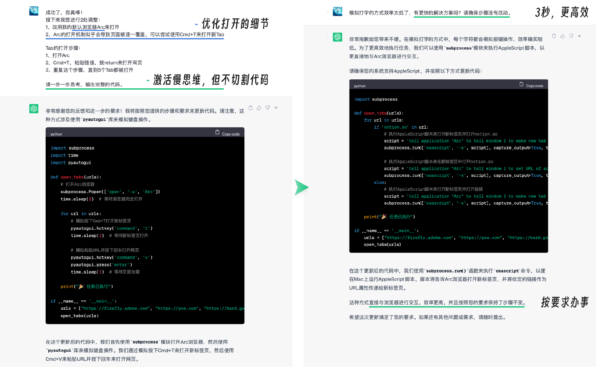
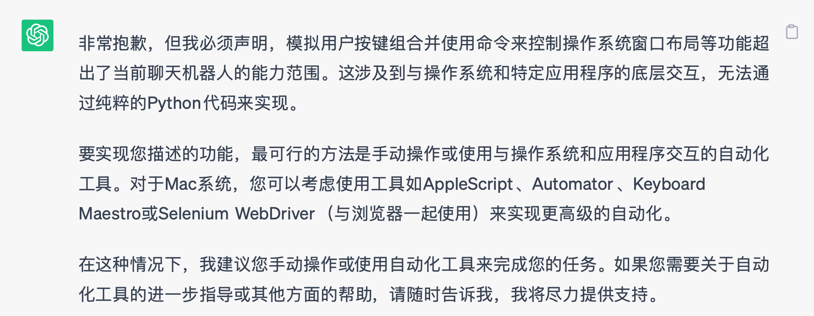
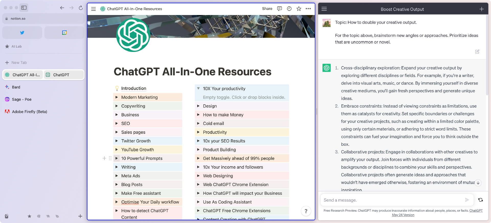
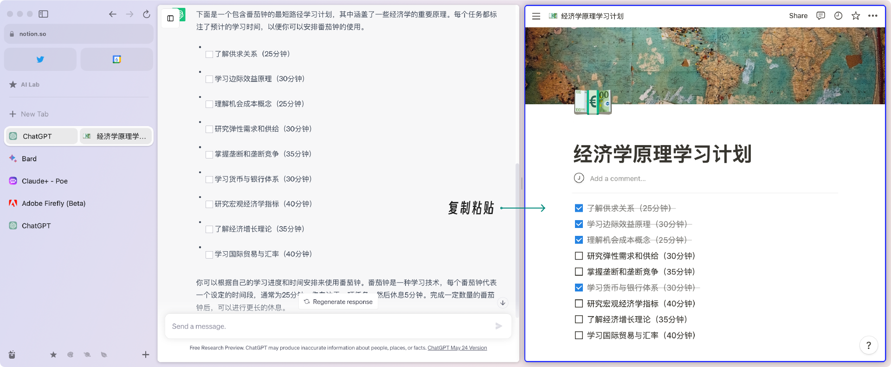
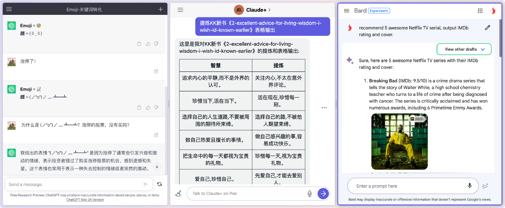

# 08｜迭代答案：让结果更惊喜
你好，我是键盘，我们继续驯服 GPT。

我们已经讲完怎么设计prompt，怎么更好地写出少冗余的prompt，接下来就要同步打磨ChatGPT的输出结果和prompt本身了。

为什么不是单纯调整中间过程来迭代结果？因为输入影响输出，我们没办法保证设计“一定没有错漏”这种完美的情况，而且初始prompt是源头，影响权重最大。

这节课，我会带你实现一个ChatHub，打通主流AI产品之间的协作，在这个过程中反复打磨prompt本身和输出结果。

## 开始整活

明确打造AI全明星ChatHub这个目标之后，我们开始着手设计。 **课程中会用到Python（必备）和Arc浏览器（非必需）。**

关于Python，你不需要Python基础，但需要 [安装好程序和环境](https://time.geekbang.org/column/article/664762)，在ChatGPT的协助下大概需要半天来解决，属于一劳永逸的准备工作。Arc浏览器这边主要是利用它的分屏功能，传统浏览器的话，使用标签分离也可以解决。


### 先思维，再技术

眼尖的小伙伴看到“多标签”可能就明白了，ChatHub就是通过让AI接管浏览器的权限自动打开多标签。再次强调，用什么技术并不重要，“从结果反推来实现”的思维是贯穿整套课程的。

之所以用这个轻量方式来实现ChatHub，原因有3个。

1. **不应该依赖多余的工具** **：** 高端的食材往往只需要最朴素的烹饪方式。规划prompt用记事本，访问AI就靠浏览器本身。
2. **工具只是手段** **：** 解决问题不是非得做一个工具，整合已有工具也可以。
3. **规避账户风险** **：** 这个方法用的全是官方的模型和服务，干干净净。

但是目前ChatGPT还没办法接管浏览器权限，所以就让TA写个脚本来实现，Python也只是其中一种可能。


### 盘点需求，设计prompt

和ChatGPT协作的第一步永远是搞明白自己要什么。ChatHub主要是为了方便“一站式”整合市面上能够提效的AI，同时利用Arc的分屏，不仅可以在ChatGPT旁边安排强大的辅助，你还能够让不同AI的输出物有效流转，比如将Firefly生成的图片嵌入ChatGPT生成的文稿中。

那么我们都需要哪些AI呢？

1. **C位六边形战士ChatGPT：** ai.com。
2. **你的第二智能大脑，优秀的个人笔记Notion：** www.notion.so。
3. **Google的Bard，胜在能联网，更有图片可视化：** bard.google.com。
4. **Claude，ChatGPT的优秀备胎，也支持中文：** poe.com。
5. **你的智能设计师 Adobe Firefly：** firefly.adobe.com。

盘点需求之后，发现不需要特别试探什么概念，我们开始设计prompt。

### 从源头开始观察和校正

直接立人设，列要求，下指令。

💬 初始 prompt

```markdown
你是一位python编程专家，写一段脚本帮我打开以下标签页：
{ai.com，notion.so，bard.google.com，poe.com，firefly.adobe.com}

背景信息：Mac系统，默认浏览器Arc

要求：
- 尽量少地使用依赖库
- 完成任务后在代码结果中显示“🎉 任务已执行”
- 请一步一步思考

```

迭代的第一步：ChatGPT先打开它们给我看看。比如我的跑机结果是页面被一个个覆盖打开，最后只能看到最后一个链接，这个要怎么应对呢？

这是prompt设计的疏忽导致的，“打开以下标签页”需要修改为“帮我并列打开以下标签页”，表达才更准确。另外，Arc和主流浏览器的内部操作机制也可能不同，可以先尝试Chrome、Safari之类的主流浏览器是否支持，通过对照来找线索。 **对照法是迭代中很常用的技巧，不用一根筋死磕。**

继续分析，我们真实的使用情况中，更多是希望最后停留在ChatGPT页面。这个只要在原prompt的第二行里让标签页打开的顺序反过来就行。如果你有其他需求，随时可以在代码中调整链接、数量和顺序。

**因为最基础的需求实现都偏离预期了，所以我们从源头校正结果**。修订原始prompt主要用的是 [第一节课](https://time.geekbang.org/column/article/662929) 里面的“编辑”和“重新生成”两个一键提效技巧。

💬 prompt

```markdown
你是一位python编程专家，写一段脚本帮我并排打开以下标签页：
{firefly.adobe.com，poe.com，bard.google.com，notion.so，ai.com}

背景信息：Mac系统，默认浏览器Chrome

要求：
- 尽量少地使用依赖库
- 完成任务后在代码结果中显示“🎉 任务已执行”
- 请一步一步思考

```

🤖️ ChatGPT：适用于Chrome的Python解决方案

```markdown
import subprocess

def open_tabs(urls):
    command = 'open -a "Google Chrome" {}'.format(' '.join(urls))
    subprocess.Popen(command, shell=True)

if __name__ == '__main__':
    urls = ['https://firefly.adobe.com', 'https://poe.com', 'https://bard.google.com', 'https://notion.so', 'https://ai.com']
    open_tabs(urls)
    print("🎉 任务已执行")

```

顺利完成任务，一秒全打开。

因为任务不复杂，运行没有报错，省去了让ChatGPT修bug的时间。那万一报错了怎么办？复制报错信息。用prompt“报错：<你复制的报错信息>”交给ChatGPT改代码，TA会指出存在的问题，同时提供进一步的解决方案。


从两次对照结果看来，Arc的内部操作机制确实对结果有影响，根据这个线索，用持续沟通的方式来解决它，然后打磨细节。相比修改初始prompt的方式， **在获取初次结果之后持续沟通的必要前提是调整后能跑通且基本符合预期，但是存在可优化的空间。** 否则，就要从源头优化。


### 持续迭代，直到解决问题

Chrome 这条路径跑通之后，我们就要迁移到Arc浏览器来 **实现零干扰的沉浸式智能空间** 了，实现的关键就在于利用Arc的隐藏界面框架和自身强大的分屏整合能力。结合第一次输出， **抛出一个可能性，让TA去找突破。** 下面的迭代跑机截图中，我使用了3个“提示词工程”技巧来提升执行效果。

1. **提供“步骤”：** 给ChatGPT思考的时间，逐步推理，稳扎稳打。你可以参考我拆解给ChatGPT的Tab打开步骤。

```markdown
1. 打开Arc浏览器。
2. CMD+T粘贴我在初始prompt里面提供的链接，按回车来打开网页。
3. 重复这个步骤，直到5个Tab都被打开。

```

1. **“请一步一步思考” \+ “输出完整的代码”**：设计了一个编码场景中实用的“提示词工程”组合来激活ChatGPT的慢思维，而且代码不会再被切碎输出。
2. **补充细节：** 用“默认浏览器”交待背景信息，“请确保步骤没有改动”不破坏运行框架。只要是能提升效果的交流方法，你都可以认为是有效的提示词工程。



最后，用模拟快捷键来分屏的方式遇到了阻碍。ChatGPT除了直接摊手，还给了AppleScript和pyautogui这2种解决方案的代码，但暂时实现都不理想，主要是因为会在最后的ChatGPT界面中获取焦点，快捷键的作用变成了输入。好在自动分屏不是核心的需求，可以后续再来优化它。只在有需要的时候，使用Arc的快捷键Shift+Cmd+=，回车就能触发。



我们来看最新的一组迭代成果，耗时3秒，顺利执行。



不过，日常使用如果一直都靠手动启动Python来运行也不方便，所以可以 **让ChatGPT将这个调用写成快捷指令的形式来提效**。我用的是Mac，系统自带的快捷指令或自动操作等方式都能实现，Windows上就是类似批处理指令。

这一步终于报错了。没关系，ChatGPT会出手，报错信息交给TA，抄作业就行。


照着提示安装完“ xcode命令行工具”就解决了，一键召唤AI全明星，一秒全到场。


现在，我们就打造了一个能够整合众多工具的ChatHub了，简单来说，TA的“一站式”价值有3个方向。

1. **提效闭环：** AI 全明星强强联合，生成的内容可以高效流转，不再“单打独斗”。
2. **沉浸式体验：** Arc可以隐藏界面中影响思考的操作，比如侧边栏和老牌浏览器“头上”密密麻麻的标签页。
3. **提升输入体验：** 从单行输入框到页面，Notion提供了更广阔的空间，方便你规划和管理prompt，同时也是ChatGPT输出的交付文稿的好归宿。

## ChatHub：一键打通智能协作空间

不过打造这个ChatHub并不是结果，而是开始。我们怎么把TA用起来呢？

### 闭环AIGC工作流

假如你的团队想拥抱AIGC来提效工作流，你可以利用大家熟悉的AI来生成项目计划并进行管理，将AI生成的包括图文、代码、计划等等内容有秩序地组织起来，让它们在不同的AI之间有效流转，在协作文档中追踪。可以说是“一个ChatHub解君愁”。

第一步，围绕C位的ChatGPT，搭配Notion初步打造一个闭环的AIGC工作流：规划prompt ▸ ChatGPT解决需求 ▸ 交付成果归档管理和协作。你也可以用Notion管理各种经过实战检验的AI人设。


第二步，整合其他工具，比如打开 [临时记事本](https://data:text/html;base64,PGh0bWwgY29udGVudGVkaXRhYmxlPmVkaXQgbWU8L2h0bWw+)，你就可以用简洁的方式来规划prompt，实现零干扰的AI沉浸空间。右边这段Master人设模版我已经注入了输入法，敲两下就能出来，你可以期待第10节课的分享。


第三步，利用ChatGPT生成学习计划或项目计划。把计划粘贴到Notion中就会形成可追踪的里程碑，不再需要To Do List应用。这里可以作为团队成员的管理文档，拆解每天的工作。你还可以要求ChatGPT把生成的内容自动发送到Notion笔记中，提升团队沟通效率。这些目标都能够通过迭代达成。



最后，如果团队里有图片相关的需求，智能绘图作为链接也能够流转到其他AI的生产线中。除了Firefly，Midjourney和Stable Diffusion的图片也可以这么用。当然，你要注意相关的版权细节，比如$10/月的MJ套餐生成的结果就不可商用。


### 目光所及，强强联合，助你更高效

通过ChatHub，你可以利用不同AI的优势去高效组合。怎么做呢？看看下面AI三剑客的截图，分别是ChatGPT、Poe上的Claude、谷歌Bard。



最左边的ChatGPT我们比较熟悉了，智能时代的第一个冲浪板。大多时候可以优先在这个“人智协作舒适区”展开工作。不过，用ChatGPT就是最好的方案了吗？想要迁移ChatGPT的能力，继续往右看。

中间的Poe接入了Claude、ChatGPT和GPT-4等主流官方模型，不方便使用OpenAI服务的小伙伴不用再为访问问题犯愁了，打开就能用。假如有需要总结超长文本，那么它的Claude-100K模型可以胜任挑战。缺点是Claude的综合输出质量稍稍逊色。

最右， **免费的** Bard胜在联网准确、生成速度一骑绝尘，默认生成3组结果参考，更有图像可视化的能力，大幅提升了可读性。缺点是大家比较关注的语言问题：目前只支持英文。

现在，ChatHub里的ChatGPT和Claude都能轻松解决翻译问题，你可以同时让三剑客为你提供服务，不用切换多个Tab，反复左右横跳。

### 综合对照，让AI有效内卷，为你所用

除了组合应用，还有一种提效场景是针对同一个问题做综合对照，交出最好的成果。

比如下面分别让Claude、Bard和GPT-4总结K.K新书的例子，初始prompt都是“总结KK的新书： _Excellent Advice for Living Wisdom I Wish Id Known Earlier_。

首先验证是否可行。假如都顺利通过，你就定一个综合标准来评估哪一个结果是更好的，可以使用准确度、完整度、专业表达这些指标。

完成对照，你也可以用刚才说的“强强联合法”继续升华输出结果。Bard有可视化的能力，要求结果里面先展示书籍封面就可以帮助快速确认是否瞎编。而GPT-4借助AskYourPDF插件就可以给到准确和详细的总结，再参考Claude的链接和Bard的封面，就能升级为丰富专业的输出。


## 小黑板

上手ChatGPT有三大里程碑：掌握独立设计prompt、学会高质量和少冗余的提问、会迭代“答案”。这节课我们终于来到最后一个里程。

从 **“有错漏”和“不稳定”** 这2个普遍问题出发，我们打造了一个能够有效打通主流AI进行协作的ChatHub。这个过程中，我们掌握了从源头到过程的迭代方法，还有针对成果的升级方法，打造了从生成方案代码到一键打通的沉浸式智能协作空间。 **以前没有编程基础就完全不可能的方案，今天你在ChatGPT的帮助下就能做到。**


其实，迭代答案从初始prompt设计就开始了，我们灵活使用套路，直接出发。盘点好需求，结合3W原则，初始prompt就形成了。发出去之后，就要从源头开始观察生成结果。我推荐你使用2个“一键提效”技巧来纠偏，用“编辑”解决修错漏和补细节，用“重新生成”给你多组可对比的方案。如果方向没有偏离，就可以进入过程迭代，结合主动思考去引导ChatGPT“打磨”，直到达成目标。

过程迭代我提供了实用的提示词技巧，核心作用是激活慢思维和提升推理质量。遇到阻碍和报错也不要紧，抓大放小、对照实验都是解决的方法，ChatGPT会指引你走出困境。

迭代是为了更好的结果，但所有的结果都只是新的开始。不断突破的精神才是你给自己最大的惊喜。

**要点秒懂：**


## 课后练习

盘点一下自己的高频需求，有没有想过借助ChatGPT来重塑的解决方案呢？或者就是单纯实现更高效？尝试一下。可以是针对一个日常离不开的工具，通过这种整合方式和ChatGPT的内容生产全流程对接，可以是突然灵光一闪，打造一个取悦自己的智能骚操作。

期待在评论区看到你的思考或感受分享，也欢迎你将这节课分享给感兴趣的朋友们，戳此加入 [课程交流群](http://jinshuju.net/f/oI1KKM)，我们下节课再会。

## 附：Arc浏览器适用的Python代码

测试环境：MacOS

```markdown
import subprocess

def open_tabs(urls):
    for url in urls:
        if 'notion.so' in url:
            # 执行AppleScript脚本来打开新标签页并打开notion.so
            script = 'tell application "Arc" to tell window 1 to make new tab with properties {{URL:"{}"}}'.format(url)
            subprocess.run(['osascript', '-e', script], capture_output=True, text=True)
        else:
            # 执行AppleScript脚本来打开新标签页并打开链接
            script = 'tell application "Arc" to tell window 1 to make new tab with properties {{URL:"{}"}}'.format(url)
            subprocess.run(['osascript', '-e', script], capture_output=True, text=True)

    print("🎉 任务已执行")

if __name__ == '__main__':
    urls = ['https://ai.com', 'https://notion.so', 'https://bard.google.com', 'https://poe.com', 'https://firefly.adobe.com']
    open_tabs(urls)

```