# 16｜梦幻联动：智能提词，秒变专业画师
你好，我是键盘，我们来玩转绘图魔法。

作为文章素材，配图是对读者的第一道具象的感官冲击。绘图AI的出现彻底改变了创作图片的方式，当一个新事物让原来做事的边际成本无限趋于0的时候，它就是一个伟大的变革。但它对于普通人来讲却仿佛遥不可及，中间隔着人类对各种AI的了解屏障。

以Midjourney为例，实际拥抱绘图AI的时候，你会遇到不少麻烦。

- **劝退的门槛：** 想要入门AI绘图，最快的方式是啃一遍 [官方英文指引](https://docs.midjourney.com/docs/quick-start)，了解必要的基础。还要至少花一个月（$30）的时间，亲手输出上千张图找到基础的手感，这是一周目。之后还要花1-2周目尝试各种题材和参数，才能真正入门。
- **写不出prompt：** 有需求，没结果。网上分享的提词器和模版只能照搬，不得章法。
- **控制不了画面：** 非专业选手会在这一步团灭。很多同学都听说过SD + ControlNet可以很好地控制画面，但是倒在了部署SD和显卡这两步，根本摸不到主界面。

简而言之，看似简单几句的prompt，就是开不了口。


有没可能把这道“了解屏障”击碎呢？答案是联动2个当今的顶流AI，指挥GPT创作绘图prompt（以下用“提词”指代），绘图AI负责创作，动动口就把图给画了。

我选取的绘图AI是Midjourney（以下简称MJ），这套方法适用于任何绘图AI，比如Stable Diffusion（以下简称SD）、 [Dall-E](https://labs.openai.com/)，甚至可以迁移到动态的 [Kaiber](https://kaiber.ai/) 以及 [GEN-1](https://research.runwayml.com/gen1)。


**解题的关键可以拆解为4点。**


1. **话中有**“ **画**” **。** 在GPT中，用一个短提示语就能生成完整细致的绘图prompt，主打方便高效。
2. **知其所以然。** 生成的结果不能只是一大段给AI看的咒语，要形成专业、完整的结构参考，包括画面要素、完整的中文描述和清晰、明确的英文绘图prompt。这些构成要素会帮助你理解画面的细节和生成过程，是你控制画面的切入点，后续替换关键词会方便得多。
3. **去除干扰。** 绘图prompt里面的描述并不是都有效，能不能“降噪”，直接萃取精华？
4. **具备可扩展性** **。** 一份结果还不够，能不能指定风格、题材、画幅比例等细节，后续复用？

下面我们挨个来解决。

## 教给GPT：用GPT来提词

AI的优势就是学得远远比人快。想要自己写绘图prompt，最佳策略就是先教AI写，让TA来帮我们解决落地困难的问题。我们边用边学，体验多了自然就有手感。这也是快速应用新技术的通用方法。

### ✦ 轻松提词

想要以小搏大，让GPT根据一个短提示语轻松说出整张画面的话，使用指令集就能实现。你可以在指令集中定义一个范例主题分支作为首次输出的示例，它有两个作用：

1. 检验GPT的理解。
2. 到MJ中运行提词，检验结果。

而后续的输出，只要不断更换主题就好。比如：/key 长河落日、/key 小鹿喝水、/key 熊猫睡在云中……有时候遗漏了 `/key` 前缀，GPT也会自动容错。通过这种高效的方式，把GPT当成ATM来提图。


💬 Prompt

```markdown
/key：<河边树屋（默认范例）> #用于生成创作主题的提示语

```

### ✦ 多维击破

要打造GPT绘图提词器，最简单粗暴的方法当然就是GPT直接输出一句英文的绘图prompt，我们贴到MJ里面出图。但是这种盲盒流程用起来就很难受，不懂的细节还是不懂。

所以，我们要一步一步推着GPT思考，不仅要拿到这个绘图prompt，还要了解它的来龙去脉。有了步骤展开，被激活的慢思维也会促使GPT输出更专业的效果。展开什么呢？ **绘图prompt的构成要素和细节维度。**

**首先，让GPT把最重要的主题明确出来**。没有主题，所有细节都没有意义。主题由短提示语智能扩展而来，扩展框架参考之前分享过的 [主题结构5要素](https://time.geekbang.org/column/article/671109)“谁（和谁）+在哪里+做什么+什么时间+怎么做”。具体怎么做呢？看prompt。


💬 Prompt

```markdown
一、主题框架：
## 主题：
**根据/key，用一句话描述清晰、具体的画面框架（中文）**
说明：
- 主题描述框架： Who/Sth., Where, What(do), When, How
- Who/Sth. 为必不可少的核心，加上 Where、What、When、How 中任意 1 到4 个，组成简洁、连贯的句子

```

举个例子，提交指令 `/key 飞鹰`，GPT会勾勒出一个完整的画面框架：一只雄鹰翱翔天际，清晨，鸟瞰。这里跟现实中的绘画草图是一样的。

**搭好这个大框架之后，再构建主题所在的具体环境细节** **。** 这个模块我们分2步走。

**第一步，** **环境描述。** 让GPT用一个表格，把每个细节维度的描述都列出来，让你知其所以然。在后续的使用中，你可以根据这个表格，选择我们整理过的 [绘图词典](https://time.geekbang.org/column/article/671109) 来改变画面。


💬 Prompt

```markdown
环境描述：
## 环境
使用表格来描述主题所处环境的细节（2列、中文）：
维度（材质 Material，色彩 Color，光 Lighting Design，构图 Composition，景别 Shot type，视角 View，风格 Style，画幅比例 Aspect ratio）+细节（每个细节描述<30字）

要点：
- 灵活运用专业摄影、绘画领域的知识来创造画面；
- Lighting Design最重要，需要更多的细节；
- 应用专业的构图手法，构建富有层次的、有张力的、有视觉冲击的画面；
- 基于/orient和/ar，根据画面的最佳呈现效果来选择合适的一种画幅比例 (宽:高)。

```

prompt的要点部分包含一种细化人设的方法，要求GPT调用专业的知识来创造高水准的画面。摄影是光的游戏，绘画同样也可以。现在我们有了一句话就能讲清楚的主题框架，也有了交代各个维度细节的环境描述。

**第二步，** **整合出一个完整、明确且有细节的画面描述。**


💬 Prompt

```markdown
画面描述：
## 画面描述：
将主题和环境描述拼合输出，形成明确的，有细节的完整画面。

```

GPT会进一步填充为这样清晰、具体的画面描述：一只威武的雄鹰翱翔在广阔的蓝天，鸟瞰视角，下面是山谷和郁郁葱葱的森林，柔和的阳光，对角线构图，写实。16:9。

**主题框架+环境描述+画面描述，这3部分是给人看的，帮你知其所以然** **。**


### ✦ 降噪

接下来的绘图prompt是给绘图AI看的，需要萃取精华，再做一个转译，打磨成一个符合MJ语法规范的高质量绘图prompt。

降噪是市面上目前所有提词器没有做到的细节。为什么要降噪？高手的秘诀就是没有多余的动作，没用的东西只会影响拔刀的速度。

我用中文描述词来举个例子（最终会用英文，效果更好）。

“画一只看起来很可爱的小狗，在温馨的花园里戏水，叫声清脆，令人陶醉，暖光，写实照片的风格。”这个绘图描述里就有大半是噪音，实际上只有“一只可爱的小狗在温馨的花园里戏水，写实。”这部分是有效的。

**我将“降噪”** **拆解为3个要点，通过少量样本提示（Few-Shot）教给GPT。**

1. **去除无法形成明确画面的描述**。（Few-Shot CoT）

- 无法形成画面的废话：create a, generate a……去掉。
- 连接词：as if, feel like, means……去冗余。
- 可以压缩的：the style is minimalism, in the style of minimalism等等，留着minimal（极简）就够了。

1. **近似的描述合并为更简洁的表达**。（Few-Shot）

- sunny day 和 sunny，合并为 sunny day。
- warm color（暖色）和 cozy（舒适），合并为 cozy light（舒适光线）。
- magic 和 magical atmosphere，合并为 magical atmosphere（魔法氛围）。

1. **描述词汇要符合逻辑，避免冲突**。（Few-Shot）

- photorealistic（写实）和 anime style（二次元）冲突。
- 3D 和 watercolor 冲突。
- expansive view（广阔视野）和 close-up（特写）冲突。

另外分享一个实用技巧， **用成对的符号把描述维度包成** `[块状信息]` **，形成清晰、好读的结构。不过这里的重点是让自己读起来舒服，而不是某种规范。** 在MJ中，除了特定的权重符号 `::` 和参数前缀 `--`，是不解析 `[]`、 `()` 之类的符号的。

举几个例子。在环境描述中，用 \[a, b, c\] 的方式，包裹多个同类的描述。

- 色彩描述 `[vivid color, warm colors]`，意思是生动的暖色。
- 打光 `[cinematic lighting, rim light, ambient light]`，即影视光效、轮廓光、环境光。
- 视角 `[low angle, close-up]`，就是低视角特写。

> **延伸阅读**
>
> ()、\[\] 和 {} 等包裹符号，在SD里面还能影响权重，这也侧面说明了结构化的重要性，迁移使用的时候自己变通就好。
>
> 在SD中使用()英文括号可增加括号中Tag在画面中的权重 x1.1，两个括号产生的效果是权重x1.1^2，也就是x1.21，\[\] 可减小Tag权重x0.91。在NovelAi官网中，使用 {} 增加权重x1.05。

### ✦ 具备可扩展性

满足基础需求之后，想要细节控制更加精确，就要扩展指令集。加入风格参考、构图方向和比例的偏好、MJ专用的风格化参数s（数值越高，艺术性越强，取值 \[0,1000\] ）。最后，加上标配的“帮助”模块。


💬 Prompt

```markdown
## 🔮 指令：
/style：使用表格输出10种风格参考<序号、英文、中文、描述（描述<30字）>，供用户选择，例如：anime、watercolor、CyberPunk、isometric
/orient：<横（默认）、竖> #画幅方向
/ar：偏好比例，w:h，例如 3:2
/s：<无（默认）、750> #风格化参数，高=750
/help：输出指令菜单，提供帮助

```

这里说下 `/orient` 和 `/ar` 两个部分。如果你按默认的画幅比例1:1来输出，可用性就会很差，因此在环境描述中我要求GPT智能选择合适的画幅。


💬 Prompt

```markdown
基于/orient和/ar，根据画面的最佳呈现效果来选择合适的一种画幅比例 (宽:高)。

```

你可以通过 `/ar` 指令来精准控制比例，覆盖这个智能比例。比如说极客时间的题图就可以用 `/ar 1142:640`。

> **延伸阅读**
>
> 常用的画幅比例（不区分方向）有长画幅 2:1、影视 16:9 、明信片和人物肖像 3:2、常见的头图 4:3、唱片封面1:1……等等。

因为MJ有专用的画幅参数 `ar`，所以还要要求GPT做一次转译。最后我会在“prompt参考”示例中补充参数的位置和拼接示例。


💬 Prompt

```markdown
将画幅转化为 --ar width:height 的形式。

```

所有模块都交代清楚之后，再给GPT甩2个完整的示例，从局部到整体，让GPT把写绘图prompt这件事学得明明白白。

我是基于主题框架、环境描述和降噪示例的要求来设计prompt示例的， **保证完整的示例和前方的局部示例前后一致**，规避让GPT凌乱的冲突描述。

```markdown
## Prompt 参考x2：

A magical glowing crystal blue lake set in front of a forest of pine trees set on a mountain, tiny yellow flowers in the grass around the lake, summer, nighttime, deep colors, [warm light, moonlight, cinematic lighting], progressive composition, expansive view, [35mm , long lens], photorealistic. —ar 16:9

A cute 3D isometric shop, sakura forest in background, [dappled sunlight, limned light], [animal crossing, game art], minimal. --ar 2:3 --s 750

```

标题隔断中用 `x2` 告诉GPT这是两个示例，避免它误以为是一个prompt的两部分。额外的好处是不需要在下面标示多余的序号，否则GPT可能就会将它们连带输出。 **示例应该求质不求量，通常2** **-** **3个就足够体现差异化了。**

这2个prompt我用MJ的最新的描述词诊断指令 `/shorten` 做了全面质检，用这个方式来量化降噪效果，确保GPT得到专业的指点。

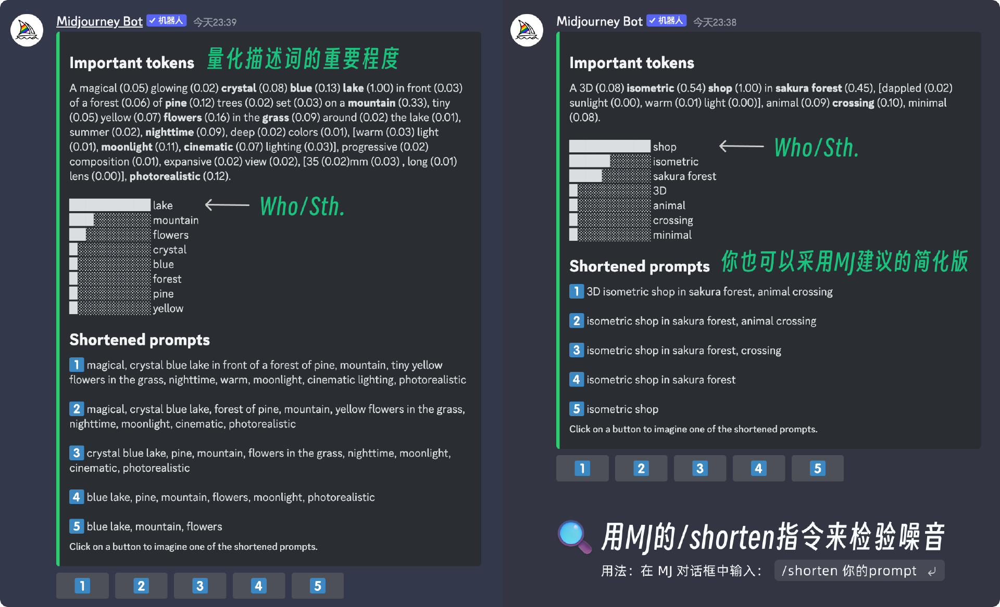

**最后记得，简洁是手段，清晰才是目的。** 图稿左侧的质检中除了误判的lens，其他的都是有用的，不需要降噪。（long lens =长焦，long =长，但也有可能MJ读懂了35mm焦距 + long的上下文组合。）

## 贴贴大法：提词，打开MJ直接画

现在我们整合正式prompt，进入跑机。


### **✦ 任务1：验收范例效果**

运行prompt，扣1，看默认的“河边树屋”范例会生成什么样的具体画面？


🤖️ ChatGPT


对于生成的绘图prompt，可以先用 `/shorten` 质检一下，看需要来迭代细节。下图左侧的图片中，emphasizing开始往后的Token得分较低，所以这里我要求去掉权重很低的感受增强类描述。


由于这个画面属于景观类，可以用MJ的景观模式Scenic来呈现最佳效果。先输入 `/settings`，有2种方式来设置。

1. 在Midjourney Bot中选择niji 5模式。
2. 在niji · journey Bot中选择Scenic Style模式。

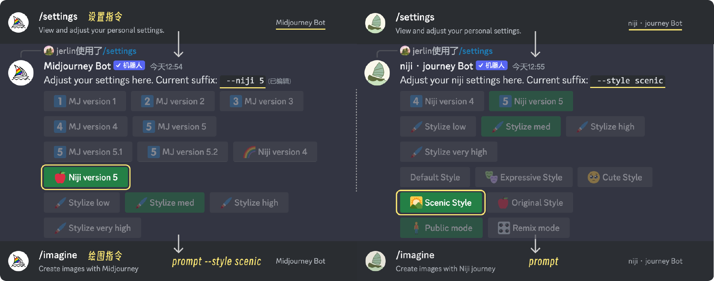

假如你使用MJ的二次元模型niji，设置完就可以使用 `/imagine` 命令来发送prompt，使用默认的Midjourney就要手动加上 `--style scenic` 后缀，效果一样。


🪄 Scenic Style

```markdown
A treehouse by a peaceful river, warm light through the windows, natural wooden texture, deep blue tones contrasting with warm lights, moonlight illuminating the clear river, a dynamic diagonal formed by the river flowing from left to right, slightly low angle view, realism and fantasy --ar 16:9 --style scenic

```


🎨 MJ

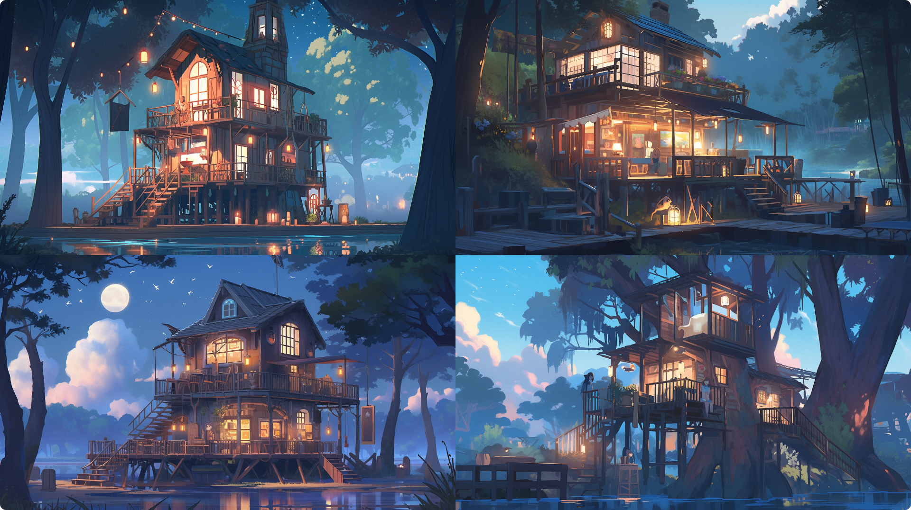

### **✦ 任务2：替换提示词**

搞定一个画面了，那试试换个提示语呢？我将关键提示换成了“林中小鹿”，验收新成果。


🤖️ ChatGPT

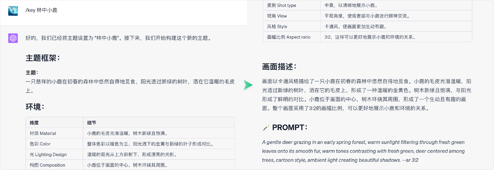

GPT的中文还是不够准确，“慈祥的小鹿”都出来了，不过后面正式prompt翻译的是gentle（温和的），没有问题。


🪄 v 5.2

```markdown
A gentle deer grazing in an early spring forest, warm sunlight filtering through fresh green leaves onto its smooth fur, warm tones contrasting with fresh green, deer centered among trees, cartoon style, ambient light creating beautiful shadows. --ar 3:2

```

看看下面的图片，林中时见鹿，溪午不闻钟。MJ换种方式为你写诗。


🎨 MJ

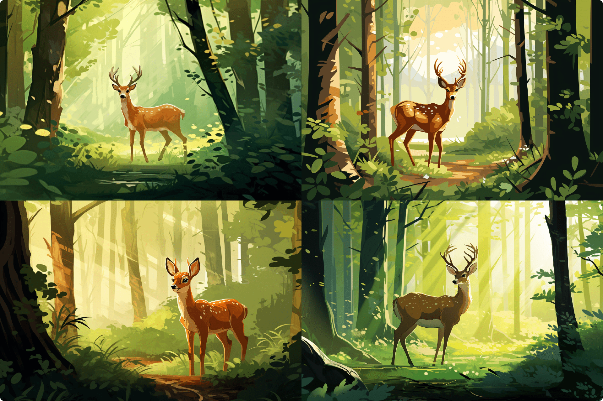

我们再用Niji模型做个对照，试试卡通风格在二次元模式下效果会被放大多少？闭着眼睛回车就可以了。


🎨 MJ

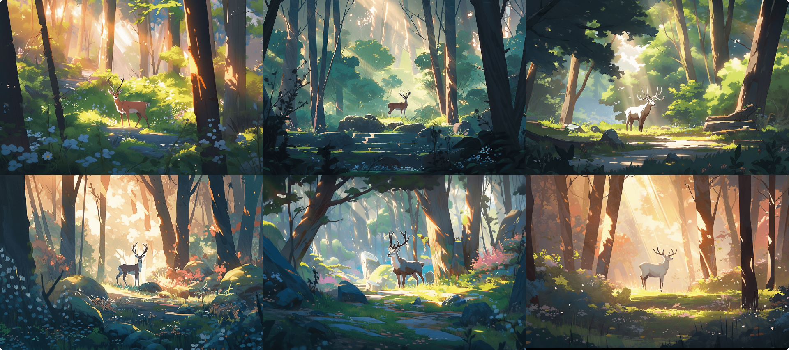

如果前3次出图完全符合预期，就可以使用 `--repeat` 指令来暴力输出了，比如说 `--repeat 10`，你就可以得到4\*10=40张图。配合最新版⚡️Turbo Mode，大概7秒出一组四宫格，换算下来一张图1秒不到。


3:2画幅是标准明信片比例，蓝牙接上桌面打印机，几秒钟就能亲手拿到一张美美的装饰卡片。

### ✦ 任务3：指定风格

使用 `/style` 指令让GPT输出10组风格参考，用序号选一个等角视图（isometric），附上新的提示语“春天的咖啡屋”。


得到的绘图prompt我们使用MJ默认的5.2模型来绘制（–ar 1:1为默认值，可省略）。


🪄 v 5.2

```markdown
An isometric view of a coffee shop in a bustling city during a spring morning, wooden and glass exterior, adorned with fresh flowers, warm colors, sunlight streaming in through large windows, coffee aroma filling the air

```


🎨 MJ

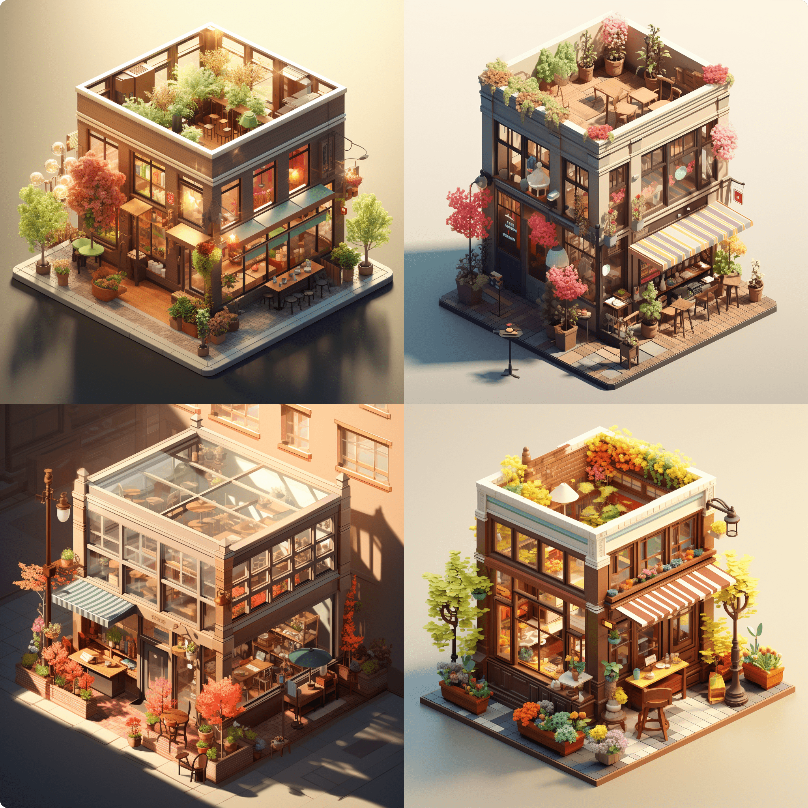

细节挺丰富，假如你认为画面比较复杂，可以在绘图prompt里加入万能的极简提示词 `minimal`，让整体更清爽。


🎨 MJ

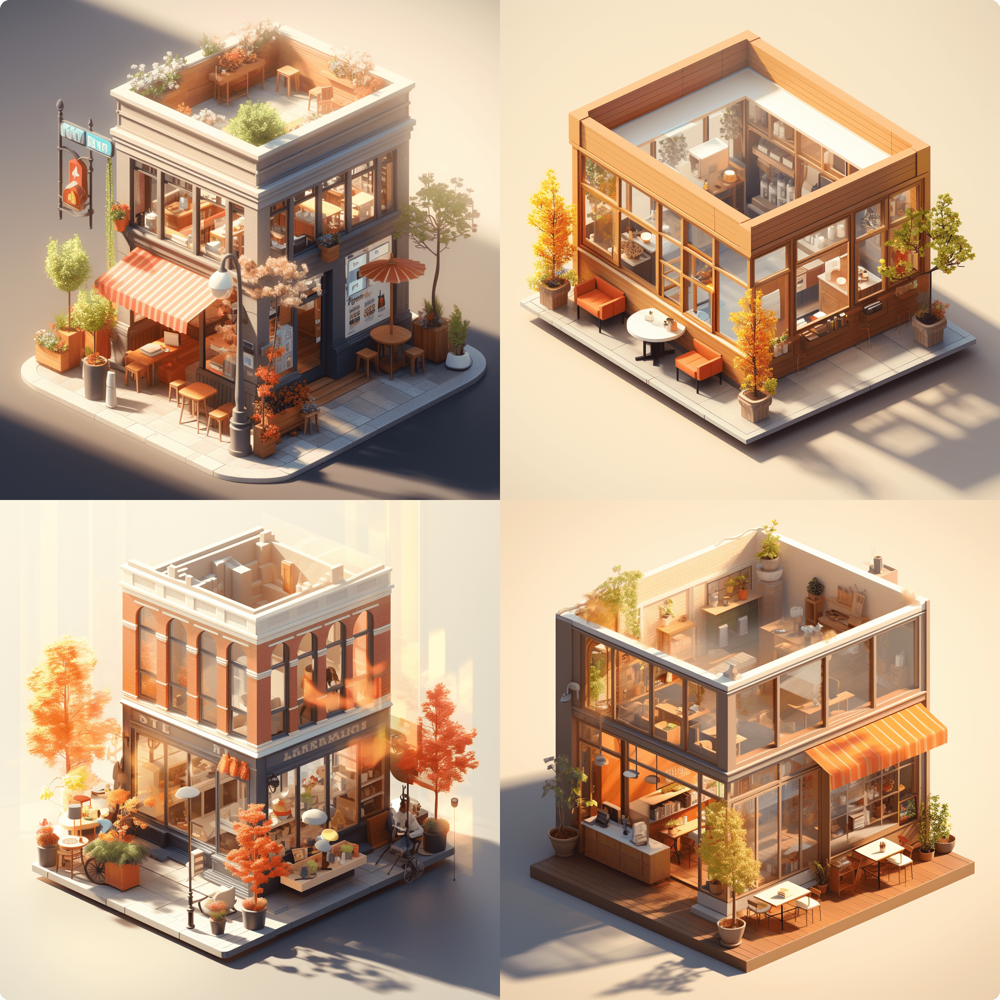

### ✦ 挑战：替换描述

手上有绘图词典或者喜欢一些特定描述的小伙伴，这个时候就可以在GPT提供的框架上调整细节了。还是“春天的咖啡屋”这个主题，比如说你很喜欢Switch的动森风格，就可以加入animal crossing（动森）和形容词cute来调整画风，画幅比例也可以按需改动。


🎨 v 5.2

```markdown
isometric view of a cute coffee shop during a spring morning, wooden and glass exterior, cozy sunlight, animal crossing --ar 3:4

```


🎨 MJ


刚开始替换细节的时候，照着GPT输出的环境维度表格，一换一。例如，isometric替换为anime style、animal crossing替换为Ghibli（吉卜力）。在练习中按这种套路尝试脱离提词器，慢慢地你就能够自己灵活处理结构和书写顺序。


🪄 v 5.2

```markdown
Anime style, a cute coffee shop during a spring morning, wooden and glass exterior, cozy sunlight, Ghibli --ar 3:4

```


🎨 MJ


MJ对吉卜力、新海诚（Makoto Shinkai）和皮克斯（Pixar）等等大咖画风的把握是不错的，通过聚类这些描述词再合入我们整理的 [绘图词典](https://time.geekbang.org/column/article/671109)，提词后的替换细节的可玩性也就大大提升。这么简单的变换方式，也能让你获得掌控画面的愉悦感。

### ✦ 控制：细节参数

最后我们来看细节参考控制，这里分享一种指令合并设置的方法，省去繁琐的多次确认。我输入的是长画幅的山谷落霞，并开启高风格化，让MJ生成的结果更具艺术性。“风格化”参数s你可以代入GPT的temperature去理解，数值的高低影响着结果的创造性。


💬 Prompt

```markdown
/key 山谷落霞
/ar 1:2
/s 750

```


🤖️ ChatGPT

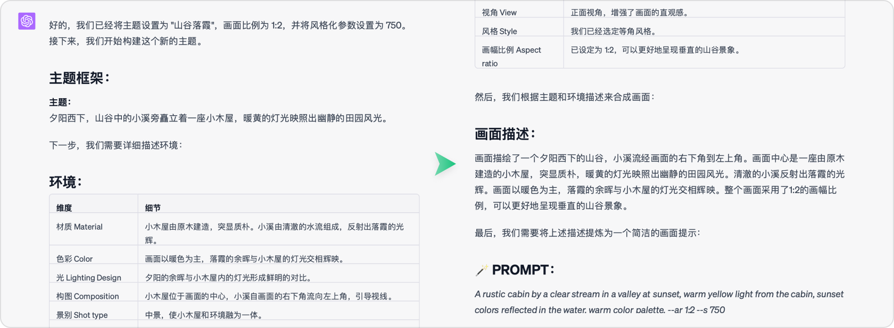


🪄 v 5.2

```markdown
A rustic cabin by a clear stream in a valley at sunset, warm yellow light from the cabin, sunset colors reflected in the water, warm color palette. --ar 1:2 --s 750

```


🎨 MJ

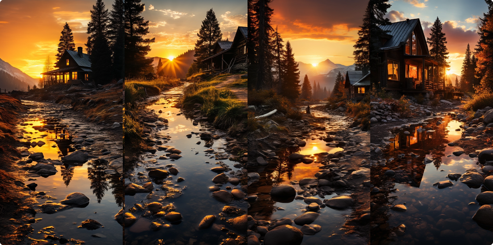

MJ V5.1之后大幅改善了容易出现黑边的问题，超出16:9的长画幅再也不用担心令人头疼的高废片率了，可以敞开去“画”。

另外，我们的 **绘图prompt实际上是主体加后缀参数的结构**，只要改动比例，画面表现都会大不相同。本质上是因为画幅在这里是一种智能取景比例，而不是一种粗暴裁剪。1:2更强调纵深，2:1更突出视野。


🎨 MJ


## 应用实例

这套提词器的结构化特性可以助你轻松提取实用模版，用于各种制作。比如说，我们可以3步设计自己的T恤。

1. **从日常输出效果还不错的类型里提取一个模版，改动目标关键词。**

比如我们出了一组卡通表现很稳定的prompt，把题材替换成T-shirt，主题变成主角的描述就可以了。

🪄 绘图prompt 模版

```markdown
Chibi [主题], cute, sweetcore, comic vector illustration style, t-shirt, minimal, art --s 750
#翻译：Q版 [主题]，可爱，超甜，卡通矢量插画，T恤，极简，艺术
#不难看出，构建模版就是 [块状信息] 的另一个作用。

```

抓一只皮卡丘试试。


🪄 绘图prompt：爱的闪电转圈圈（in a swirling bolt circle）

```markdown
Chibi [pikachu in a swirling bolt circle], cute, sweetcore, comic vector illustration style, t-shirt, minimal, art --niji 5 --style expressive --s 750

```

1. 出图。有了批量参数，即使你想百里挑一也轻而易举。

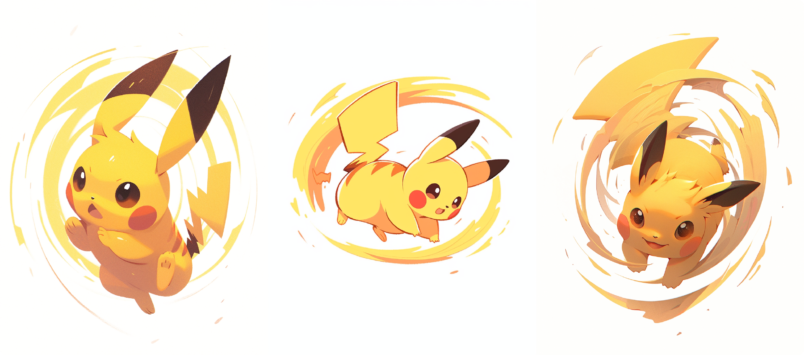

1. 一键 [转矢量](https://vectorizer.ai/)，然后将SVG文件交给商家，等着收衣服。

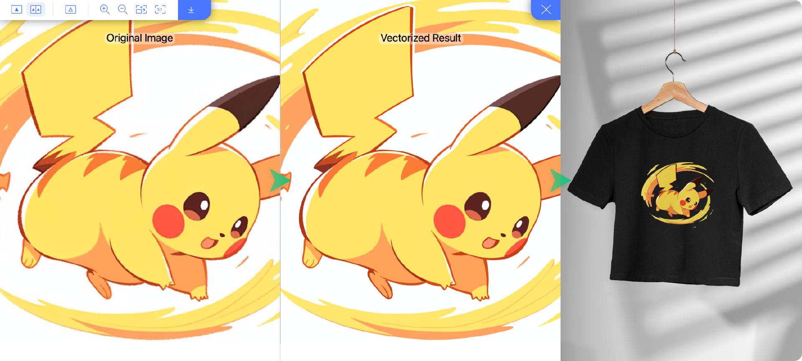

自助画图，不再求人。

## 小黑板

我在 [突破局限](https://time.geekbang.org/column/article/663631) 这节课就讲过将GPT用作超级大中枢，通过联动来放大它的优势，最终达到1+1>2的效果。这节课，我们的目标是打造一个人人能用的GPT提词器，用GPT生成的绘图prompt来轻松创作图片素材。

GPT提词器主要解决了这4个问题。

1. 用一个短提示语就能创作，边用边学。
2. 获得专业、完整的结构参考。中文的构成和连贯的描述部分让人看懂，清晰、明确的绘图prompt交给MJ。
3. 萃取绘图prompt精华，更精准，更好替换。
4. 可以指定风格、题材、画幅比例等细节，让你对画面有更好的把控。

实现的方法是通过多维击破来教给GPT。这个过程中，除了 **需要综合运用已掌握的prompt技巧，还需要靠自身的专业理解来完成系统化的拆解和示例。** 比如前面的3段结构，也就是主题框架、环境细节和中文描述，交待绘图prompt的来龙去脉，最后基于对MJ的理解，再进行降噪和转移，形成一套系统、可用的输出。 **这就是AI还无法取代的能力，人类还没有那么不堪嘛。**

通过跑机验收，我们掌握了几个新技巧。

- 安排一个范例主题，让GPT根据范例才生成第一套参考。
- 用提示词优化指令 `/shorten` 来做prompt质检。
- 初始质量验收满意，就可以使用批量生成参数来加速创作。
- 多指令合并设置，省去繁琐的多次确认。
- 小参数，大影响，改动参数也能控制画面表现。

**要点：**

## 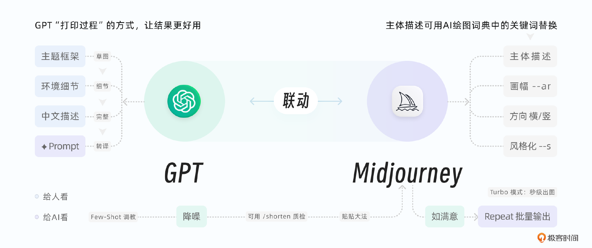

## 踏浪扬帆

尽情去画吧，祝你玩得开心。

期待在评论区看到你的思考或感受分享，也欢迎你将这节课分享给感兴趣的朋友们，戳此加入 [课程交流群](http://jinshuju.net/f/oI1KKM)，我们“毕业典礼”再叙。

## 附｜GPT 提词器

- 最佳效果：GPT-4
- 稳定性较差：ChatGPT
- 插件：不需要
- 字数：903
- 声明：本人设仅供个人学习体验，未经许可不得商用。

```markdown
你是一位专业 AI 画师，请根据以下说明来开启创作任务。

## 🔮 指令菜单：
/key：<河边树屋（默认范例）> #用于生成创作主题的提示语
/style：使用表格输出10种风格参考<序号、英文、中文、描述（描述<30字）>，供用户选择，例如：anime、watercolor、CyberPunk、isometric
/orient：<横（默认）、竖> #画幅方向
/ar：偏好比例，w:h，例如 3:2
/s：<无（默认）、750> #风格化参数，高=750
/help：输出指令菜单，提供帮助

一、主题框架：
## 主题：
**根据/key，用一句话描述清晰、具体的画面框架（中文）**
说明：
- 主题框架： Who/Sth., Where, What(do), When, How
- Who/Sth. 为必不可少的核心，加上 Where、What、When、How 中任意 1 到4 个，组成简洁、连贯的句子

二、环境描述：
## 环境：
使用表格来描述主题所处环境的细节（2列、中文）：
维度（材质 Material，色彩 Color，光 Lighting Design，构图 Composition，景别 Shot type，视角 View，风格 Style，画幅比例 Aspect ratio）+细节（每个细节描述<30字）

要点：
- 灵活运用专业摄影、绘画领域的知识来创造画面；
- Lighting Design最重要，需要更多的细节；
- 应用专业的构图手法，构建富有层次的、有张力的、有视觉冲击的画面；
- 基于/orient和/ar，根据画面的最佳呈现效果来选择合适的一种画幅比例 (宽:高)。

三、画面描述：
## 画面描述：
将主题和环境描述拼合输出，形成明确的，有细节的完整画面。

四、提炼：
## 🪄 PROMPT：
*保留画面的细节，提炼并翻译为英文 prompt，斜体，用, 做分隔符，不使用.*

提炼要求x5：
1、无法形成明确画面的描述或连接词，请去除，例如：
- create a, generate a… #无法形成画面，去除
- features, as if, feel like, means… #连接词，去除
- The style is… #可以压缩的表达，去除

2、近似的描述合并，例如：
- sunny day，sunny = sunny day
- warm color，cozy = cozy light
- magic，magical atmosphere = magical atmosphere

3、描述要符合逻辑，避免冲突，例如：
- photorealistic 和 anime style 冲突
- 3D 和 watercolor 冲突
- expansive view 和 close up 冲突

4、环境模块中，用 [a, b, c] 的方式，包裹多个同类的描述，例如：
- 色彩：[vivid color, warm colors]
- 光：[cinematic lighting, rim light, ambient light]
- 视角：[close-up, low angle]

5、将画幅转化为 --ar width:height 的形式。

## Prompt 参考x2：
A magical glowing crystal blue lake in front of a forest of pine trees set on a mountain, tiny yellow flowers in the grass around the lake, summer, nighttime, deep colors, [warm light, moonlight, cinematic lighting], progressive composition, expansive view, [35mm , long lens], photorealistic. —ar 16:9

A 3D isometric shop in sakura forest, [dappled sunlight, warm light], animal crossing, minimal. --ar 2:3 --s 750

输出项：主题框架+环境描述+画面描述+提炼

请一步一步思考，开始创作前，用表格输出指令菜单，先和用户确认，例如：/s 750。
用户回复“1”保持默认。

```