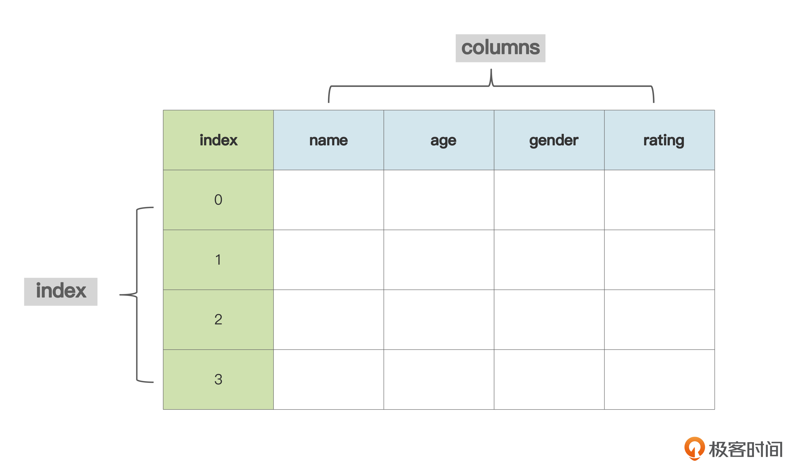
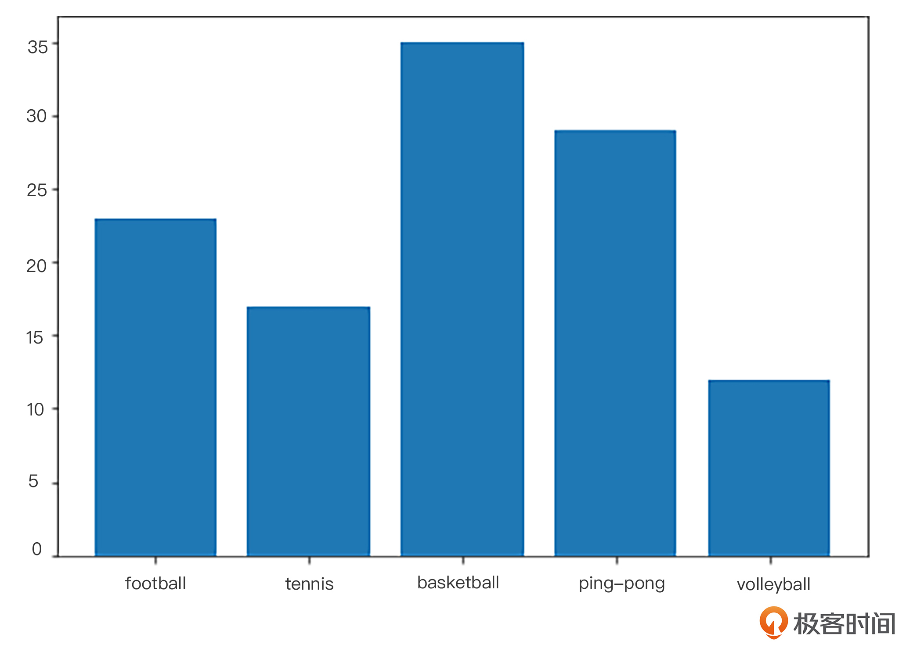
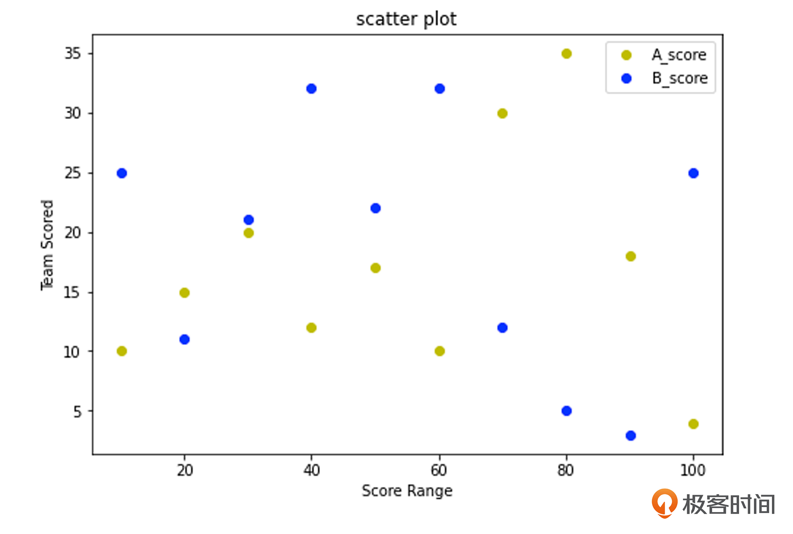

# 02｜初识Python（下）：入门Python你应该怎么做？
你好，我是Barry。

上节课，我们主要学习了Python基础的数据类型和脚本语言，通过大量的API和案例应用，相信你对Python的基础部分已经有了较全面的了解。

但是，如果我们想要进一步地应用Python，只懂得基础部分是不够的，例如，如果我们想应用Python做数据分析应该如何实现呢？要实现文化社区视频平台，又该掌握Python的哪些技术点呢？

这节课我们就一起来学习Python的高阶应用，相信你已经迫不及待了。Python的高阶应用主要包括数据分析和项目开发两部分，我们先来看数据分析。

## Python数据分析

因为 Python 是数据科学家发明的，所以用它来处理数学计算和数据分析是非常高效且方便的。它可以帮助我们优化工作效率，也能让我们更理性地做业务决策，应用场景非常多。要入门数据分析，就少不了数据的各种操作和计算，下面我们就先来学习一个可以非常高效地处理数值型运算的库—— Numpy库。

### 认识NumPy

NumPy是一个功能非常强大的Python库，它的全称是“ Numeric Python”，主要用来计算、处理一维或多维数组。NumPy库有下面几个特点。

1. Numpy底层使用C语言编写，执行效率远高于纯Python代码。
2. 它可以很方便地处理多维数组。
3. 具有实用的线性代数、数学计算功能。

下面我们通过执行时间来对比一下Numpy数组和Python列表的性能。

在案例代码中，首先我们需要引入numpy，time.time(）来获取当前时间。代码自上而下执行，这样我们就可以分别计算Python的列表执行时间和Numpy的执行时长了。通过对比差值，我们可以清晰地看到两种情况的执行时间。

```python
import numpy as np
#Numpy数组和Python列表性能对比：
#比如我们想要对一个Numpy数组和Python列表中的每个数进行求平方。那么代码如下：

# Python列表的方式
import time
time1 = time.time()
array = []
for d in range(100000):
    array.append(d**2)
time2 = time.time()
use_time = time2 - time1
print(use_time)
#结果为：0.04330182075500488

time3 = time.time()
n = np.arange(100000)**2
time4 = time.time()
print(time4-time3)
#结果为：0.0013949871063232422

```

接下来，我们使用Numpy创建多维数组。

```python
import numpy as np
array1=np.array([['a','b','c'],['d','e','f']])
print(array1)
>>>输出结果：
[['a' 'b' 'c']
['d' 'e' 'f']]

```

```python
import numpy as np
e = np.array([[1,2],[3,4],[5,6]])
print("原数组",e)
e=e.reshape(2,3) #把原矩阵转换成2行3列
print("新数组",e)
>>>输出结果：
原数组 [[1 2]
 [3 4]
 [5 6]]
新数组 [[1 2 3]
 [4 5 6]]

```

然后我们尝试创建有相同数字的数组，加强一下应用。

```python
import numpy as np
#默认数据类型为浮点数
a=np.zeros(6)     #创建1行6个都是0的数组
print(a)
b = np.zeros((3,2), dtype = int) #创建3行2列都是0类型为int的多维数组
print(b)
>>>输出结果
[0. 0. 0. 0. 0. 0.]

[[0 0]
 [0 0]
 [0 0]]

```

通过上面三个案例，我们简单认识了Numpy，也了解了Python库与原生的区别。不管是性能上，还是在数据应用方面，二者都存在一定的差别。当然Numpy还有很多其他优势，如果感兴趣，课后你可以再深入学习一下。下面我们再来学习一下Pandas。

### 认识Pandas

Pandas 库是一个免费、开源的第三方 Python 库，它是 Python 数据分析中必不可少的工具之一，被广泛用于各类行业的数据处理工作中。

Pandas 库是基于 Python NumPy 库开发而来的，因此，它可以和 Python 的科学计算库配合使用。与NumPy不同，Pandas更适合处理表格型或非纯数字数据，而 NumPy 则更适合处理数字类数组数据。

Pandas 提供了两种数据结构，分别是 Series（一维数组结构）与 DataFrame（二维数组结构），它们类似于只有一行数据的表格和有多行数据的表格。

我们先看Series。

我们可以简单地理解为，Series的index就是表格的表头，data就是表格里每一行的数据，它通常用列表或者字典表示。

我们再通过两个案例一起实践一下。第一个设定了index的索引值，这样我们就指定了索引是从"b"开始的。第二个案例我们没有设定索引值，这时索引从0开始。我们通过打印结果可以看到两组值的结果是不同的，这两个案例体现了Series中data和index的区别。

```python
import pandas as pd
import numpy as np
data = {'a' : 0., 'b' : 1., 'c' : 2.}
s = pd.Series(data,index=['b','c','d','a'])
print(s)
>>>输出结果：
b 1.0
c 2.0
d NaN
a 0.0
dtype: float64
#如果不设置index的情况，默认是从0开始的索引
data = np.array(['a','b','c','d'])
s = pd.Series(data)
print (s)
>>>输出结果：
0    a
1    b
2    c
3    d
dtype: object

```

了解了Series之后，我们再来看一下DataFrame的结构。我们可以通过下面的案例，明确二者的区别。

DataFrame是二维数组结构，像table列表一样，它的数据结构也是数组包裹数组的形式。通过data的格式，我们就能清楚地看到它的结构特点。我们通过变量df来获取 ‘Name’ 和 ‘Age’ 的值，可以看到，输出的结构为列表，这和 Series 是有明显区别的。



```python
import pandas as pd
data = [['Alex',10],['Bob',12],['Clarke',13]]
df = pd.DataFrame(data,columns=['Name','Age'])
print(df)
>>>
      Name      Age
0     Alex      10
1     Bob       12
2     Clarke    13

```

### 认识Matplotlib

如果我们现在已经有了很多数据，要直接看这些数字其实是非常不直观的，我们需要用图像把数据之间的相互关系直观地展示出来。

而Matplotlib就是一个功能强大的数据可视化的库，它有着非常丰富的图表功能。通过 Matplotlib，你仅仅需要几行代码便可以实现可视化效果，可以生成直方图、折线图、振动图、双轴图、散点图等。根据数据的特点，我们可以选取不同的展示方式，清晰地呈现数据间的关系。同时，Matplotlib支持跨平台运行，它是 Python 常用的 2D 绘图库，也提供了一部分 3D 绘图接口。

如果将前面的两个库和Matplotlib结合起来，我们就可以更方便地进行数据可视化了。当我们需要做一些数据处理或数据关系呈现时，就可以使用Matplotlib。我们这就来看看如何使用这个便捷的可视化库吧。

在使用Matplotlib之前，我们需要安装一下Matplotlib，这里我们直接执行命令。

```python
$ pip install matplotlib

```

安装成功之后，我们来看看如何使用它。我们先来绘制第一个Matplotlib图表，提供一对相同长度的数组，然后使用plot绘制曲线，示例如下。

```python
from numpy import *
from pylab import *
x = linspace(-4, 3, 20)
y = x**3
plot(x, y)
show()

```


此外，柱状图也是非常常用的一种图表。柱状图是一种用矩形柱来表示数据分类的图表，它的高度与其所表示的数值成正比关系。柱状图可以直观地展示了不同类别之间的比较关系，图表的水平轴 X 指定被比较的类别，垂直轴 Y 则表示具体类别的值。

下面我们来绘制一个柱状图，模拟一下某小学的学生对体育运动的喜爱程度。

```python
import matplotlib.pyplot as plt
#初始图形对象
fig = plt.figure()
#添加子图区域，其中的参数值含义是[left, bottom, width, height ]
#例如[0.1, 0.1, 0.8, 0.8]，表示从画布 10% 的位置开始绘制, 宽高是画布的 80%。
#我们常用的初始化值是[0,0,1,1]其代表的含义从左上角开始，宽高都是画布的100%
ax = fig.add_axes([0,0,1,1])
langs = ['football', 'tennis', 'basketball', 'ping-pong', 'volleyball']
students = [23,17,35,29,12]
#绘制柱状图
ax.bar(langs,students)
plt.show()

```



还有一种较为常见的一种可视化效果图：散点图。散点图主要用于在水平轴和垂直轴上绘制数据点，例如它可以表现因变量随自变量变化的趋势。

在散点图的应用中，我们将多组数据展示在图表内，grades\_range是设定的数值范围，与X轴的数值对应，要在图表上呈现的数据要与grades\_range的值一一对应，这样就划定了横坐标值的范围，可以清楚地看出数据间的关系。下面我们就用包含A、B两组数据的模拟数据来绘制散点图，看一下它的呈现效果。

假设在一场投篮比赛中，两组数据分别代表两个队伍每个人的得分情况，我们要将这两组的比赛情况通过散点图呈现出来。具体代码如下，我们先来梳理一下这里的重点。

- plt.figure()：这个表达式的作用是在Matplotlib创建新的图形函数。
- scatter：用于绘制散点图。

其余的部分我也都做了详细的注释，你可以仔细看一下。

```plain
import matplotlib.pyplot as plt
A_score = [10, 15, 20, 12, 17, 10, 30, 35, 18, 4]
B_score = [25, 11, 21, 32, 22, 32, 12, 5, 3, 25]
score_range = [10, 20, 30, 40, 50, 60, 70, 80, 90, 100]
fig=plt.figure()
#初始化绘图区域
ax=fig.add_axes([0,0,1,1])
ax.scatter(score_range, A_score, color='y',label="A_score")
ax.scatter(score_range, B_score, color='b',label="B_score")
ax.set_xlabel('Score Range') #设置x轴的表达含义
ax.set_ylabel('Team Scored') #设置Y轴的表达含义
ax.set_title('scatter plot') #设置标题
#设置图例
plt.legend()
plt.show()

```



刚才，我们讲解了数据分析板块常用的一些库的应用，相信你会对Python数据分析有一些新的认识。当然我们这里只举了一些非常简单的示例，课后你还需要继续深挖，继续进步。

接下来，我们再一起看一下Python的项目开发板块。

何为项目开发？它指的其实就是Python的后端开发应用，也是我们全栈课程的核心部分。那在Python的后端开发方面，我们应该重点关注哪些知识点呢？让我们一起来揭秘。

## Python项目开发与应用

说到Python的项目开发，我就不得不提到两个框架： **Django** 和 **Flask**。

我们都知道各类开发语言都有自己特有的框架，框架在优化开发效率的同时，也让项目管理更加完善。每个框架都有自己的特点，这也是在做项目开发的过程中，开发者需要重点关注的问题。下面我们一起来看一下这两个框架有什么不同之处，以及我们在开发过程中如何进行选择。


我们先来了解一下Django框架。Django 是一个由 Python 编写的 Web 应用框架。Django框架采用的是MTV模式，它是在MVC模式基础上的一种变形。

那什么是MVC模型呢？它指的是 Model（模型）+ View（视图）+ Controller（控制器）的设计模式。MVC的优势就是可以很好地管理各个模块，将视图与数据模块分离开，不仅在模块管理上非常便捷，也非常有利于后期的代码修改。MVC的架构图如下。


在后端项目开发中，如果选用Django，开发者只要写很少的代码，就可以快速完成网站大部分模块的开发。

了解了Django之后，我们再一起来看看Flask框架。Flask 是Python 编写的轻量级 Web 项目框架。它的创作者是 Armin Ronacher，他带领一个国际Python爱好者团队开发了Flask。Flask允许开发者灵活选择设计模式、数据库及工具，适用于规模较小，复杂度较低的项目。

类比一下，如果Django是精装修的房子，自带齐全的豪华家具、功能强大的家电，我们可以拎包入住；那Flask就类似于毛坯房，我们需要自己找材料，做装修，选家具。材料和家具的种类倒是非常丰富，并且都是现成免费的，我们可以直接拿过去用。


由于Flask框架简洁轻量易扩展，使用起来更灵活，更适合初学者完成渐进式的学习。所以后续的课程中我们会更全面、细致地学习Flask框架。等你学会Flask之后，再来学习Django就会发现非常轻松，可以说是一通百通的。在生产实践当中，我们可以根据项目特点合理选择框架。

## 总结

好了，我们一起来回顾一下这节课的重点。这节课我们紧跟上一节课的内容，继续Python的学习，全面了解了Python的进阶应用。

首先，我们一起认识了Python的数据分析模块。 **在这一模块，我们主要学习了NumPy和Pandas两个使用频率非常高的库。** Numpy主要用来计算、处理一维或多维数组。

而Pandas与NumPy不同，它更适合处理表格型或非纯数字数据。 **Pandas有两种数据结构，分别是 Series与 DataFrame。** 结合两个案例，我们明确了Pandas与NumPy的不同之处与适用场景。

紧接着我们一起学习了 Matplotlib。Matplotlib可以通过简单的代码实现数据可视化效果，生成一系列具备我们数据特点的视图，同时它支持跨平台运行。我们也一起实践了几个案例，相信通过这些案例，你能够了解Matplotlib的一些基础操作。

最后，我们一起学习了两个比较经典的Web开发框架Django和Flask，对比了两个框架的特点和模式。这节课我们的目的是认识和了解这些框架，在后面的课程中我们还会进一步学习Flask框架的理论和实现方法，最终将项目完整地开发出来。

这节课的重心在于Python的高阶应用，当然，要做一个完整的项目，单有后端的知识是不够的，前端同样发挥着巨大的作用。那我们又应该掌握哪些前端知识点呢？这是我们下节课的内容。

## 思考题

学完这节课，请你使用Matplotlib画一个饼状图，巩固一下对Matplotlib的认识。

欢迎你在留言区和我交流互动，也推荐你把这节课分享给更多的朋友。