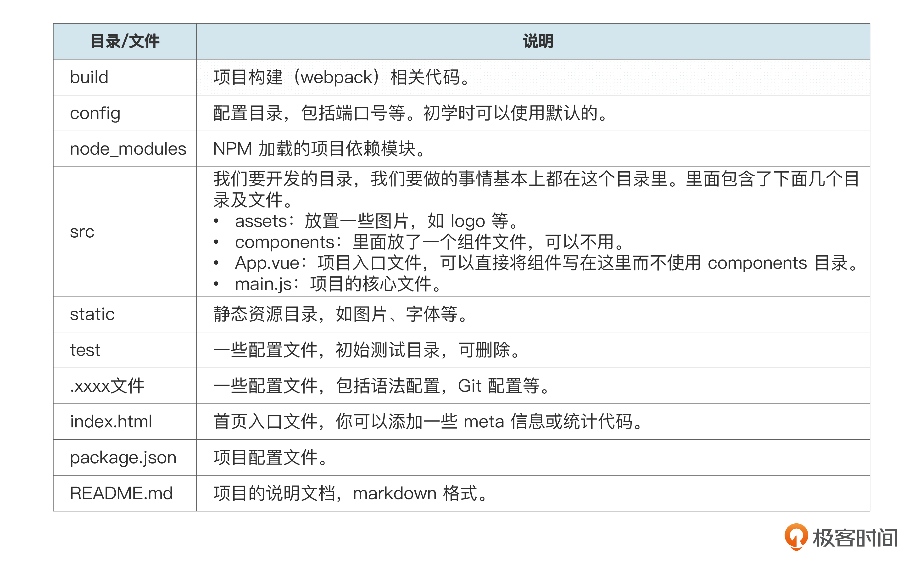
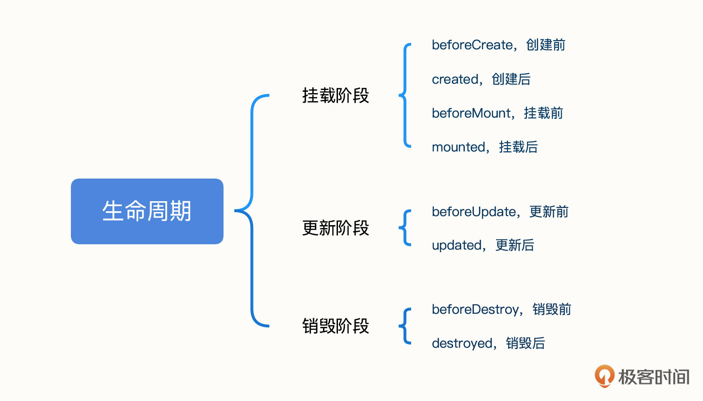
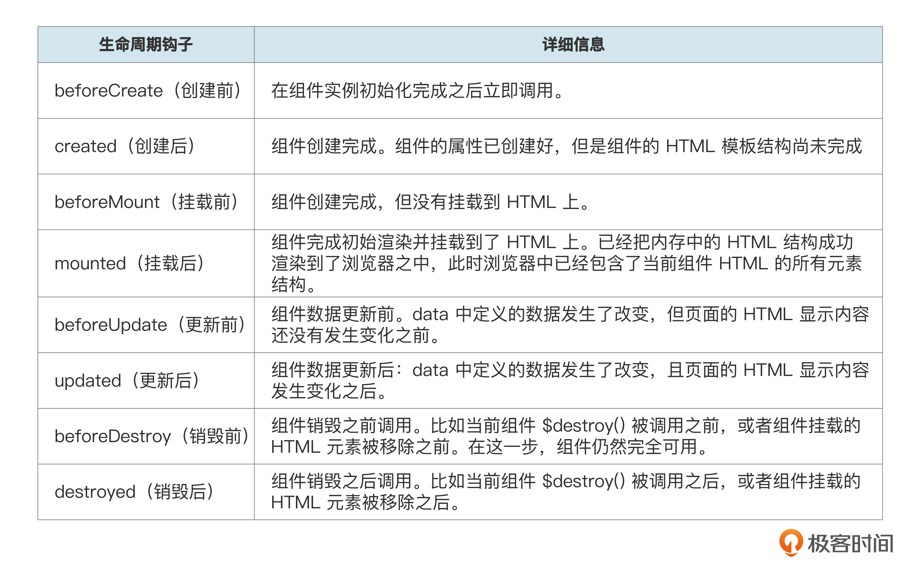
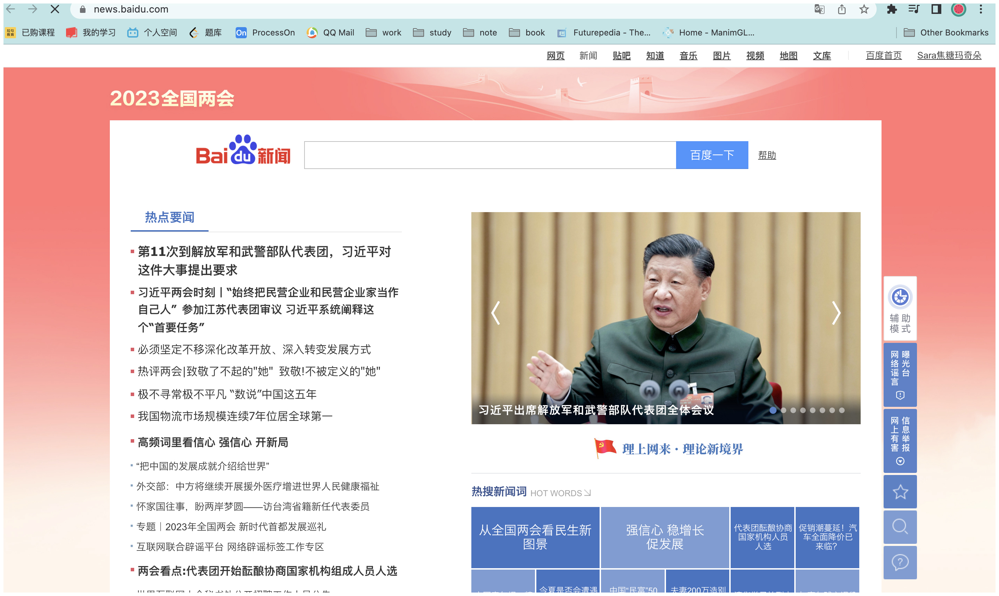
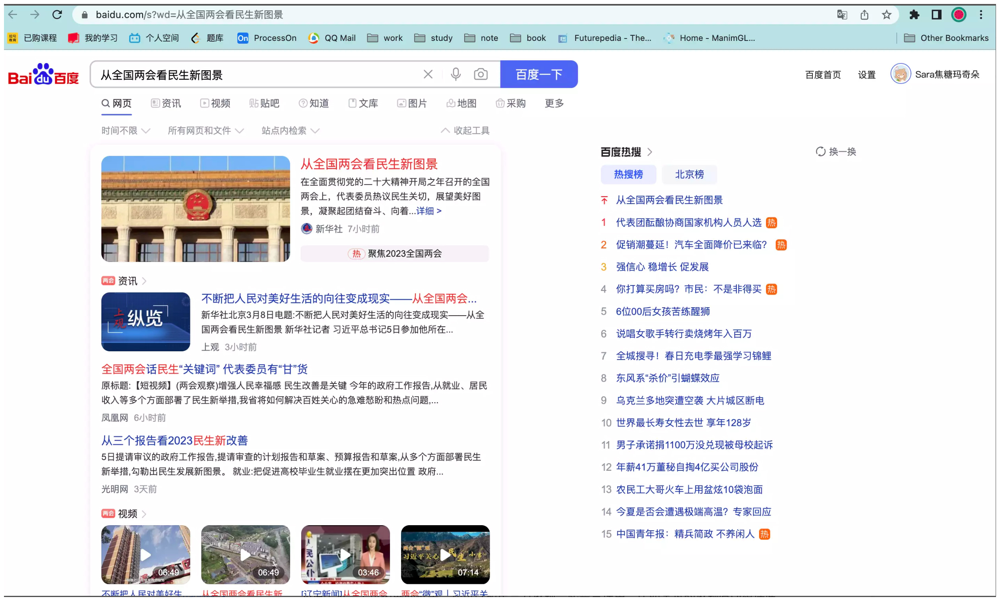

# 04｜Vue概览：Vue哪些内容是你必须要掌握的？
你好，我是Barry。

相信想要学习前端的你一定听说过Vue框架。

Vue和React都是Web前端工程师必学必会的框架，在企业中有着广泛的应用。这节课我们就来揭开Vue的神秘面纱，一起来看看Vue里必须掌握的知识点，以及怎样学习Vue才更加高效。

## 初识Vue


Vue是一款用于构建用户界面的 JavaScript 框架。它基于标准 HTML、CSS 和 JavaScript 构建，并提供了一套声明式的、组件化的编程模型。无论是简单还是复杂的界面，Vue 都可以胜任，可以说是我们高效开发用户界面的一大利器。

Vue有三个核心特性。

- 声明式渲染：Vue 基于标准 HTML 拓展了一套模板语法，方便我们以声明式描述最终输出的 HTML 和 JavaScript 状态之间的关系。
- 响应性：Vue 会自动跟踪 JavaScript 状态，并在它发生变化时响应式地更新 DOM。
- 双向数据绑定：JS数据的变化会被自动渲染到页面上，Vue还可以自动获取页面上发生变化的表单数据，并更新到JS数据中。

了解Vue的核心特性还远远不够，要真正认识Vue，我们还需要了解Vue的项目框架。

## 目录结构

我们这就来看看Vue的目录包含哪些内容，它们的用途又是什么。

下面是Vue-cli脚手架项目目录，也是我们课程开发中用的标准框架。


通过脚手架的搭建，我们可以快速地实现开发。在脚手架搭建过程中，首先保证你的本地是有配置安装Node.js的环境，Node.js 就是运行在服务端的 JavaScript。是一个基于Chrome JavaScript 运行时建立的一个平台。是一个事件驱动I/O服务端JavaScript环境，基于Google的V8引擎，V8引擎执行Javascript的速度非常快，性能非常好。下面我也给你写了安装的地址：

下载地址： [https://nodejs.org/en/download/](https://nodejs.org/en/download/)

你直接根据自己电脑的系统，直接下载LTS稳定版本就可以了。


在Node.js安装成功之后，我们还需要使用到一个工具，也就是NPM。NPM是随同NodeJS一起安装的包管理工具，能解决NodeJS代码部署上的很多问题，常见的使用场景有以下几种。

1. 允许用户从NPM服务器下载别人编写的第三方包到本地使用。

2. 允许用户从NPM服务器下载并安装别人编写的命令行程序到本地使用。

3. 允许用户将自己编写的包或命令行程序上传到NPM服务器供别人使用。


安装好Node.js之后，NPM就会自动安装好。安装好之后，打开控制台，输入npm -v命令，命令行显示npm版本，这时候就代表安装成功。

接下来，我们快看看vue-cli2.5怎样安装搭建。

第一步：自己在本地创建一个项目文件，再使用Mac在终端文件目录下执行命令，Windows在通过cmd在对应文件目录下执行命令。

```plain
# 全局安装 vue-cli
$ cnpm install --global vue-cli
# 创建一个基于 webpack 模板的新项目
$ vue init webpack my-project
# 这里需要进行一些配置，默认回车即可
This will install Vue 2.x version of the template.

#Project name：项目名称，此处你可以选择更改，直接按下回车键，自动默认为初始输入的项目名称test-project
#Project description：项目描述，自己输入
#Author：项目开发人员
#Vue build:项目构建模式，默认即可，按下回车
#Install vue-router：项目是否安装vue路由，选择yes，进行安装
#Use ESLint to lint your code：是否选择ESLint开发验证功能，新手选择no
#Set up unit tests：是否开启单元测试，建议选择y，在后期开发中一定会用到的

```

完成前面的步骤之后，我们进入项目，安装并运行后面的命令。

```plain
cd my-project
cnpm install //这一步用于安装项目依赖和工具包，是必须执行的，否则项目无法启动
npm run dev //这是启动命令，在对应的项目路径下执行就可以
 DONE  Compiled successfully in 4388ms //看到这个信息就代表安装成功了

> Listening at http://localhost:8080 //在浏览器中访问这个地址

```

这样我们的脚手架就搭建成功了。下面我用表格的形式目录里梳理了每个文件的作用，供你参考。



了解了Vue的目录结构及其作用之后，我们就可以进一步学习Vue的核心技术了。

## Vue必备学习知识点

你可以先看一下Vue的知识地图，一共有六个部分。


虽然看着有点多，但不用担心，跟着我的讲解和示例代码，你很快就能理解。

### 1\. Vue实例

要使用Vue，我们首先要实例化Vue来声明一个Vue应用。具体语法格式如下。

```javascript
var vm = new Vue({
  // 选项
})

```

下面我们来看一个实例化Vue的例子。

```javascript
<div id="app">
    <p>{{message}}</p>
</div>
<script type="text/javascript">
    var vm = new Vue({
        el: '#app',
        data: {
            message: "我的第一个Vue应用"
        },
        methods: {
            printMessage: function() {
                console.log(this.message)
            }
        }
    })
</script>

```

可以看到，在 Vue 构造器中有一个 el 参数，它是要挂载的 HTML 元素的 id。上面实例的 id 为 app。

接下来的 **data** 用于初始化数据， **methods** 用于定义函数方法，Vue通过使用{{}} 将js定义的数据显示在了 HTML 中。

### 2\. Vue组件

每个Vue应用又由很多个Vue组件组成。一般来说，每个页面都是应用的一个组件，页面中需要被重复用的的部分也会单独拆分成一个组件。

#### 模版语言

我们一般会将 Vue 组件定义在一个单独的 .vue 文件中，叫做单文件组件。

Vue的单文件组件分为三块：template标签中是模版，用来写HTML；script标签中写的是js，负责定义数据和方法；style标签中写的是CSS，负责给模版中的HTML添加样式。

```javascript
<template>
<div id="MyComponent">
  <h1>{{title}}</h1>
  <p>我有{{count}}个苹果</p>
</div>
</template>
<script>
export default {
    name: 'MyComponent',
    data(){
    //这里定义数据
      return{
        title:"啦啦啦啦啦"
        count: 1
      }
  },
  methods:{
    //这里定义方法
    printHello(){
      console.log("hello")
    }
  }
}
</script>
<style lang="css" scoped>
p{
  font-size:12px;
}
</style>

```

组件之间可以进行嵌套，比如组件A要引用组件B，可以把组件B的文件引进来，并在组件A的components中加入组件B。

举个实际的例子，一个项目中很多地方都需要用到日历选择组件。为了提升开发效率，日历选择这个功能就要单独定义成一个组件。比如预约下单页里需要用到日历选择组件，具体的代码实现如下。

```javascript
<template>
  <h1>Here is a child component!</h1>
  <DatePicker />
</template>
<script>
import DatePicker from './DatePicker.vue'
export default {
  components: {
    DatePicker
  }
}
</script>

```

#### 组件通信

引用其他组件时，如果两个组件之间的数据需要被对方知道，我们就需要组件之间的通信了。比如当前页面是A组件，它引用了B组件。A组件需要知道B组件中定义的数据，那么它们就需要通信。

我们沿用前面日历的例子，当前页面是订单预约组件，里面用到了日历选择组件，用户在日历选择器中选择了哪一天是日历选择组件中定义的数据。现在订单预约页面需要下单完成预约，这时它就要知道用户到底选择了哪一天，通信需求就产生了。

#### 生命周期

除了组件的模板语言和通信，我们还要了解Vue组件完整的生命周期，它指的是创建组件、初始化数据、编译模板、挂载DOM、渲染、更新、再次渲染、卸载等一系列过程。在这些过程的前后我们都要执行相应的方法，这些方法就叫做钩子函数。

如下图所示，Vue组件的生命周期中有8个常用的钩子函数（音频里我对每个函数做了更详细的讲解，你可以仔细听一下）。





为了让你进一步理解这些函数，我为你准备了相关代码。运行之后，你就能看到生命周期钩子函数的执行先后顺序。

```javascript
export default {
  beforeCreate() {
    console.log(`the vue is beforeCreate.`)
  },
  created() {
    console.log(`the vue is created.`)
  },
  beforeMount() {
    console.log(`the vue is beforeMount.`)
  },
  mounted() {
    console.log(`the vue is mounted.`)
  },
  beforeUpdate() {
    console.log(`the vue is beforeUpdate.`)
  },
  updated() {
    console.log(`the vue is updated.`)
  },
  beforeDestroy() {
    console.log(`the vue is beforeDestroy.`)
  },
  destroyed() {
    console.log(`the vue is destroyed.`)
  }
}

```

### 3\. 指令

在我们的日常开发过程中，使用Vue指令的频次还是非常高的，它是我们应用Vue必不可少的模块。Vue的指令可以帮助我们巧妙地完成一些需求，同时也可以优化代码。那指令到底是什么？有什么功能呢？

指令是 Vue 为开发者提供的模板语法，它可以辅助开发者渲染页面的基本结构，完成相关数据的处理工作。Vue官网是这样定义的。

> 一个指令的本质是模板中出现的特殊标记，让处理模板的库知道需要对这里的 DOM 元素进行一些对应的处理。

指令的前缀是默认的 `v-`，Vue中常见的指令包括后面几种。

- v-if
- v-show
- v-for
- v-bind
- v-on
- v-model

#### v-if

如果我们想对是否存在HTML元素进行条件判断，就可以使用 v-if 指令。如果条件是true则元素存在，若条件是false则移除这个元素。我们经常把它用在组件的隐藏和显示上。

v-if 指令具体又包括 v-if ，v-else-if , v-else。我们通过一个简单的案例来学习应用一下它。

```javascript
<div id="app">
    <div v-if="type === 'A'">
      A
    </div>
    <div v-else-if="type === 'B'">
      B
    </div>
    <div v-else-if="type === 'C'">
      C
    </div>
    <div v-else>
      Not A/B/C
    </div>
</div>

<script>
new Vue({
  el: '#app',
  data: {
    type: 'C'
  }
})
</script>

```

程序中的 “type” 值，是在data中定义的值，初始化为 “C”，在上面这段程序中，我们通过v-if来判断type的值，以此控制最终显示在界面上的div是哪一个。

第一个div的意思就是：“如果type的值等于A，就展示对应的内容A”。第二个同理：“如果type等于B，就展示内容B”，第三个div也是如此。最后一个 v-else 代表的含义是：“如果以上三种情况都不满足，那么就展示内容Not A/B/C”。

#### v-show

与v-if较为相似的就是v-show。当我们需要根据条件来控制是否展示某元素时，经常会使用 v-show 指令。它初始化的值就是true或false，如果为true，则表示展示元素，如果为false，就直接不展示元素。后面的案例就体现了这种思想。

```javascript
<div id="app">
    <div v-show="show">
      lalalalala
    </div>
</div>

<script>
new Vue({
  el: '#app',
  data: {
    show: true
  }
})
</script>

```

#### v-for

在元素需要循环展示的时候，我们会选择使用v-for指令。v-for的核心思想就是用for循环遍历元素。在后面这个案例中，students数组中包含三个name，那我们在元素展示的时候，就不需要一个一个地去写了，直接通过v-for就可以遍历students中的所有元素，同时内容也会全部呈现在页面上。

```javascript
<div id="app">
  <ol>
    <li v-for="s in students">
      {{ s.name }}
    </li>
  </ol>
</div>

<script>
new Vue({
  el: '#app',
  data: {
    students: [
      { name: 'zhangsan' },
      { name: 'lisi' },
      { name: 'wangwu' }
    ]
  }
})
</script>

```

#### v-bind

当页面上HTML标签的属性需要用到data里定义的数据时，我们就需要用v-bind指令将数据的值拼接到属性里了。示例如下。这时候的class是一个动态值，我们需要判断isActive的值来决定最终class是active还是default，从而控制呈现样式。

```javascript
<div id="app">
  div v-bind:class="{ isActive?'active':'default' }"></div>
</div>

<script>
new Vue({
  el: '#app',
  data: {
    isActive: true
  }
})
</script>

```

v-bind也可以省略，我们可以直接用冒号 “:” 代表“v-bind:”。

#### v-on

v-on的指令呢，主要用于给元素绑定事件监听器。最常见的应用场景就是与button相结合，绑定它的click事件，只有这样我们点击时才会触发相应的方法。

下面这个案例主要是做了一个小的测试，我们每次点击都会让counter的值加1。当然，你也可以直接给click绑定一个方法，然后在点击按钮的时候触发它，从而实现相关操作。

```javascript
<div id="app">
  <button v-on:click="counter += 1">增加 1</button>
  <p>这个按钮被点击了 {{ counter }} 次。</p>
</div>

<script>
new Vue({
  el: '#app',
  data: {
    counter: 0
  }
})
</script>

```

v-on还可以更简略地用@来表示，这样我们不需要写全v-on也能绑定和触发点击事件。

```javascript
<div id="app">
  <button @click="counter += 1">增加 1</button>
  <p>这个按钮被点击了 {{ counter }} 次。</p>
</div>

```

#### v-model

v-model 指令可以在表单控件元素上创建双向数据绑定。

这里的意思是，对于一些可输入或可选择的表单控件，当用户在页面上操作时，data属性的值会跟着变化；当data属性的值发生变化时，页面上显示的内容也会同时变化。

```javascript
<div id="app">
  <p>input 元素：</p>
  <input v-model="message" placeholder="编辑我……">
  <p>消息是: {{ message }}</p>

  <p>textarea 元素：</p>
  <p style="white-space: pre">{{ message2 }}</p>
  <textarea v-model="message2" placeholder="多行文本输入……"></textarea>
</div>

<script>
new Vue({
  el: '#app',
  data: {
    message: '输入框的内容',
    message2: '多行文本框的内容'
  }
})
</script>

```

### 4\. 计算、监听属性

此外，我们还必须要了解计算和监听属性。我们会在很多场景使用计算和监听，例如系统中的消息提示，需要在检测到值的变化时就通知用户。我们一起来看看计算和监听属性的具体应用。

#### compute 计算属性

当我们通过对已在data里定义好的值进行计算监听的时候，就可以通过compute计算出我们想要得到的新的值的结果。这里要注意的就是，最终得到的值不可以在data中初始化定义。

这么说有点抽象，我们结合案例来理解。我们依然通过click事件来触发count加1的操作。这里我们对doubleCount进行计算，它是count的2倍。可以看到，通过compute的监听计算，当count的值发生变化时，doubleCount自动变为了count的2倍。

```javascript
<template>
<div id="app">
  <button @click="count += 1">增加 1</button>
  <p>这个按钮被点击了 {{ count }} 次。</p>
  <!-->使用由compute计算得出的变量：doubleCount<-->
  <p>count的2倍是{{doubleCount}}</p>
</div>
</template>
<script>
export default {
  data() {
    return {
      count:1
    }
  },
  computed: {
    // 每当 count 改变时，这个函数就会执行
    doubleCount() {
      return count*2
    }
  }
}
</script>

```

执行结果如下。


#### watch 监听属性

watch用于值的监听，它与compute的不同之处在于，它监听的值必须要在data中进行初始化，才能通过 watch 来响应 data 数据的变化。

下面这个案例监听的是count的变化。当count的值大于10时，会在控制台打印“count超过10了”。在watch监听方法内，newValue代表count最新的值，oldValue表示的是最初始的值，这样就能够及时监听值的变化，执行后续操作了。

```javascript
<template>
<div id="app">
  <button @click="count += 1">增加 1</button>
  <p>这个按钮被点击了 {{ count }} 次。</p>
</div>
</template>
<script>
export default {
  data() {
    return {
      count:1
    }
  },
  watch: {
    // 每当 count 改变时，这个函数就会执行
    count(newValue, oldValue) {
      if (newValue>10) {
        console.log("count超过10了")
      }
    }
  }
}
</script>

```

### 5\. 路由配置

要想全面使用Vue，路由配置也是必须要掌握的。

为了让你明确路由是什么，我举个例子。当我们打开一个网站，经常会跳转到其他的页面。“路由”的作用就是控制页面的地址和显示页面的关系。比如百度新闻 [news.baidu.com](https://news.baidu.com) 是一个网站，页面中会有很多可以点击的新闻。



比方说，点击热搜新闻词下的“从全国两会看民生新图景”就会来到一个新的页面，地址是 [https://www.baidu.com/s?wd=从全国两会看民生新图景](https://www.baidu.com/s?wd=%E4%BB%8E%E5%85%A8%E5%9B%BD%E4%B8%A4%E4%BC%9A%E7%9C%8B%E6%B0%91%E7%94%9F%E6%96%B0%E5%9B%BE%E6%99%AF)。



点击其他词条也是一样的效果，都会跳转到一个新的页面。

这些网址和要显示的网页之间的一一对应关系，就是由前端开发人员配置的，而这个操作就叫做路由配置。简单概括一下路由配置的流程：先定义一个网址，然后再配置这个网址对应的网页。那么用户只要打开这个网址，就会看到我们配置好的网页了。

### 6.Vue整合其他依赖

Vue作为一个可拓展的框架，还可以和第三方依赖一起整合使用。比如常见的依赖有UI组件库element-UI；发送HTTP请求的依赖Axios等等。它具有非常强大的整合能力，给我们的开发工作提供了极大的便利，让我们可以用优质的代码开发更全面的项目。

具体如何引入第三方依赖，之后我们在项目实践环节展开。这里你先了解结合项目开发，在恰当的时候使用第三方依赖，能够提高开发效率就可以了。

## Vue 学习指南

学到这里，我相信你已经对Vue有了更为深入的认识。如果在学完这个专栏之后，你还想学习更多Vue相关的知识，应该从哪里入手呢？我给你推荐一些学习方法。

- 要学习一个新框架，最权威的肯定是 [官方文档](https://cn.vuejs.org/)，我们可以直接在官网上学习，先按照步骤照着示例代码写个最简单的demo。
- 但是有时官方文档不够详细，或者我们不能完全看懂某些知识点，这时就需要借助其他书籍和课程来学习和补充了。我推荐你看看《Vue.js设计与实现》这本书。
- 最后，我们还可以尝试开发一个自己的项目，或者打开 [GitHub](https://github.com/)，搜一些相关项目，对照着自己实现一下。一个复杂的多页面项目会应用到前面所讲的所有核心知识点。这个过程会加深你对知识的理解，帮助你具备能从0到1去做项目的能力。

当然，在我们后面的课程中，我也会带着你更详细地学习Vue的核心知识，掌握在真实的项目中使用Vue的方法。

## 总结

我们来回顾一下这节课的重点。这节课我们初步了解了Vue，学习了Vue的核心特点和设计理念。Vue是一款用于构建用户界面的 JavaScript 框架，它可以帮助我们高效地开发一些平台，整体的学习成本也比较低。我们重点关注了Vue的三大核心特性：声明式渲染、响应性、双向数据绑定。

学习Vue，我们可以从Vue项目的目录结构入手，这是我们必须要掌握的模块。只有牢记各个文件目录，在实战环节我们才能更加熟练地应用Vue，更高效地搭建项目工程。

Vue必备的知识点包括Vue实例、组件、指令、计算与监听、路由配置、整合其他依赖这几个核心模块。

其中组件是开发工程中使用最多的；生命周期能够控制整个页面执行的“节奏”，这样针对不同的业务需求，可以分逻辑执行；指令在整个开发过程中起着非常巧妙的作用，不管是DOM的操作还是数据处理，指令都能巧妙地解决功能需求。

计算监听属性也是开发过程中的一把“利器”，不管是实现单个组件监控，还是多组件数据联动，都可以通过计算属性来解决问题，它在我们后续的项目实战中也会有很多应用，到时我们再深入探讨。此外，这节课提到的路由模块，之后前端实战篇我还会专门带你掌握它的应用，敬请期待。

虽然这节课把Vue实战时最核心的部分都覆盖到了，但如果你想进一步扩展自己的知识版图，不妨参考我分享的学习方法课后继续深挖。

## 思考题

Vue采用了MVVM架构思想的框架，你知道什么是MVVM吗？

欢迎你在留言区和我交流互动，也推荐你把这节课分享给更多朋友。