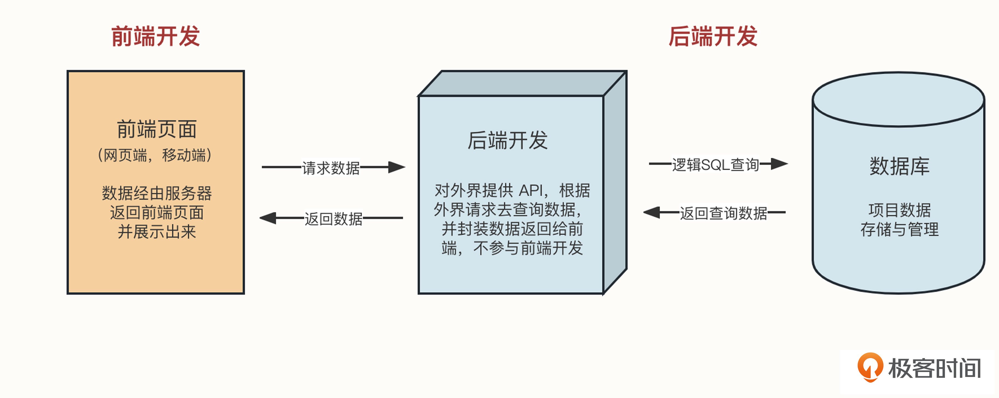
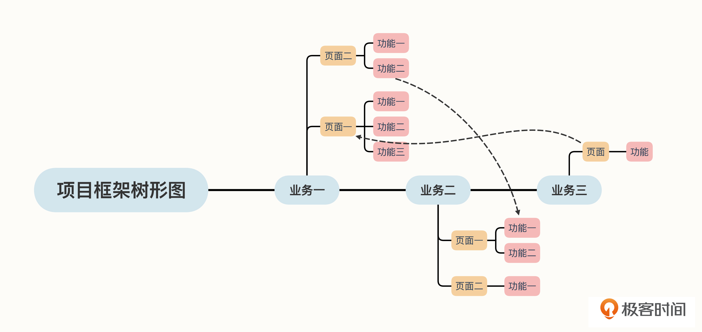
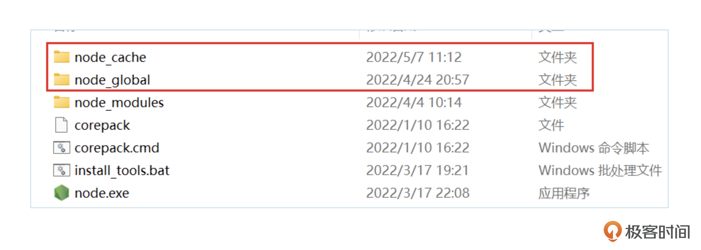
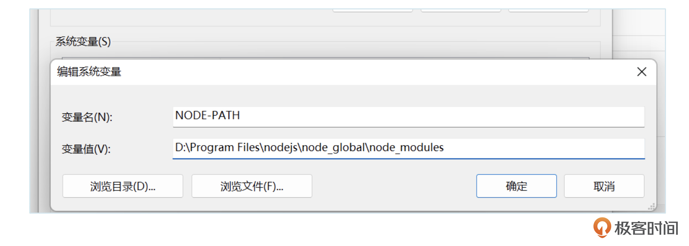
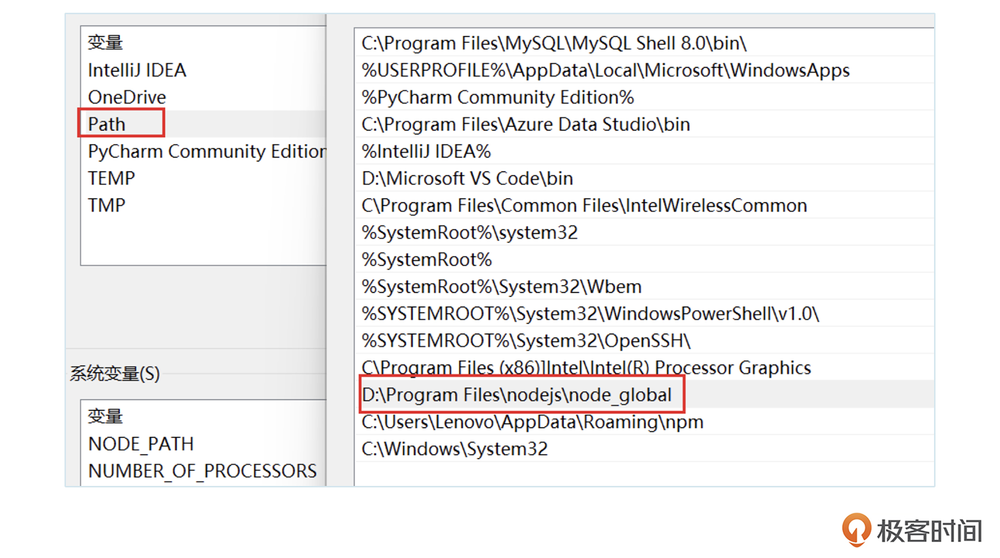
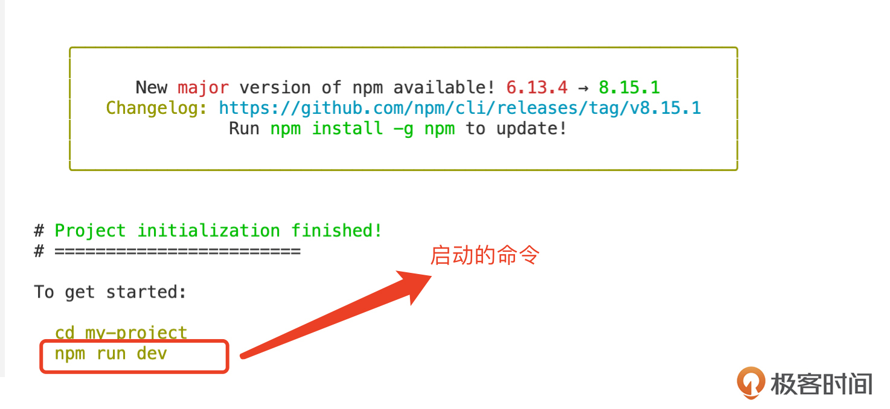
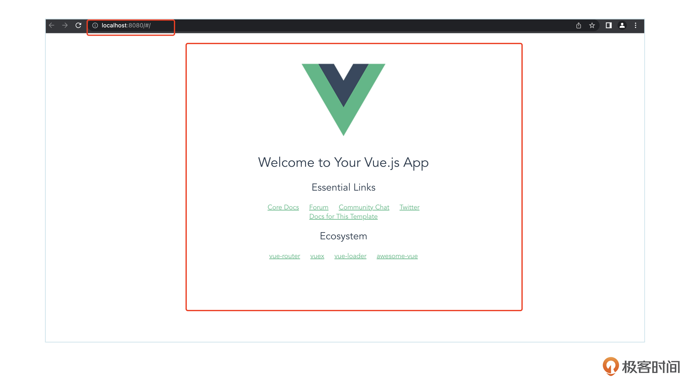
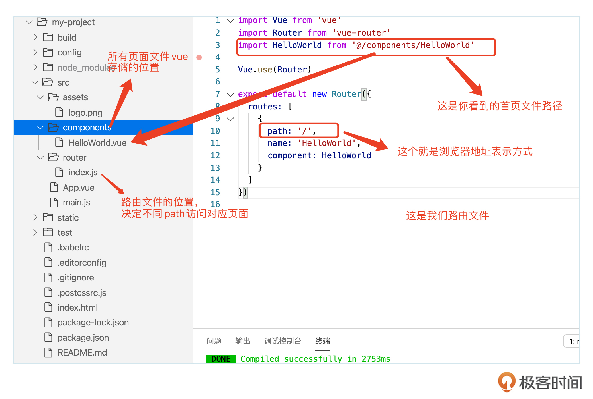
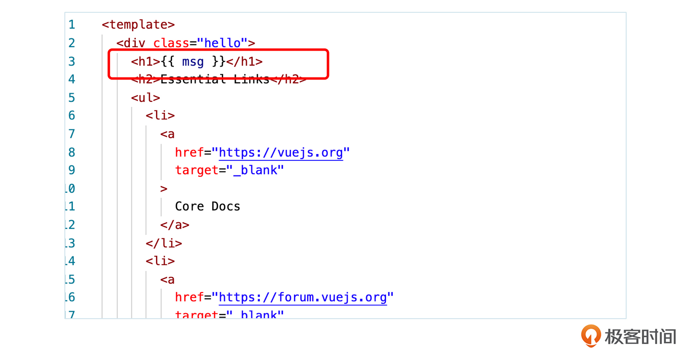
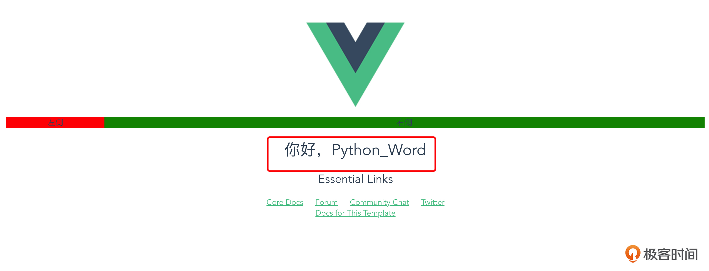

# 06｜框架搭建：如何用vue-cli搭建一个前端框架？
你好，我是Barry。

上节课我们全面分析了平台功能模块和整体技术选型，我们最终会把项目做什么样子，想必你已经了然于胸了。

从今天开始，我们就要正式写代码了。我们先从前端开始，按现在前端项目的套路，第一步自然要先把平台的框架搭建起来，之后再进行各个功能页面的编写。

这节课我就结合一个HelloWorld的小案例，带你一起实操搭建。相信通过这节课的学习，你可以掌握从0搭建前端框架的能力，之后就能举一反三，利用框架搭建各类平台前端了。

话不多说，让我们一起来探索这有趣的搭建过程吧。

## 为什么我们要选择前后端分离？

动手搭建框架之前，我们得先来聊聊这个项目的开发模式。Python做全栈开发，其实有两种实现方式。一种就是前后端不分离的模式，通过Flask的模版语法来实现。但是这样做对前端的支持并不全面，另外大多数企业目前也摆脱了这样的模式。

另一种就是前后端分离的模式，这是现在企业项目里经常采用的开发方式。为什么现在后者更常用呢，我们还得从项目开发的进化过程说起。

在最初的项目开发过程中，公司没有明确的岗位划分。这意味着一个工程师既要实现后端代码，同时也要完成前端效果呈现的代码编写，具体关系你可以参考我画的这张示意图。



随着前端技术栈的迭代，Ajax 技术诞生之后，大大推动了Web2.0的快速发展，前端不再是后端的模板，可以独立得到各种数据。前端的页面也越来越动态化，它追求更多交互，同时也需要处理大量的数据，对前端工程师的技术要求也越来越高，前后端的工作也就越来越明晰化，前后端分离模式也就此盛行起来。

那前后端分离的结构模式是什么样子呢？你可以通过下面这张图来辅助理解。


## 前后端分离有什么优势？

前后端的分离模式，只是缓解了原先“前端后端全包揽”的工程师们的痛苦吗？显然不止如此，接下来我们就来分析一下，这种模式在开发协作和工程优化方面的优势。

**从开发协作的角度看，** 前后端分离带来了两方面好处。首先，工程师的职能划分更加清晰。对于项目中出现的问题，因为分工明确，就可以快速找出问题方，定位问题和解决问题的效率都得到了提升；其次是提升开发效率。此时已经实现了前后端并行开发，前后端不再像以前具有强依赖关系了。前后端各司其职，这既提升了项目的开发效率，同时也让开发人员变得更加精专，不断推进技术的发展。

而从 **工程优化** 的角度思考 **，** 前后端分离的优势也很明显，优点主要有下面四个。

1.减轻后端服务器的开发和负载压力，让后端更“专注”地发挥自身优势。

2.前端与后端分别部署在不同服务器上，不会出现一个服务器宕机，前后端都无法访问的情况。即便在数据响应上形成阻断，但是前端界面依旧可以访问，这样大大优化了用户体验。

3.接口多复用。从上面的关系图中，我们不难发现后端开发侧重产出接口，单个接口可服务多端，同时满足需要该功能的PC网页、APP、小程序、移动端H5等不同终端，真正实现高效开发。

4.前后端分离之后，对于前端页面是异步加载，前端可以承担更多内容的呈现，页面可以保证速度更加流畅、兼容性、用户体验等。

通过上面的综合分析，我们不难发现这种模式的种种优点。所以，我们在课程项目中也选择了前后端分离的开发模式，让你在熟练使用Python之外，也熟悉一下企业项目前端技术栈开发的实现思路与大致流程。

接下来，我们就来看看怎么搭建起一个前端框架。

## 框架搭建准备工作

框架的选择自然要匹配项目需求。我们想要实现是一个文化社区交流视频平台，它的核心并不在于数据的管理和操作，而是在于视频内容的呈现、互动、直播等功能，平台包括多个业务模块，而且模块之间往往存在业务逻辑关系，这样才能让平台功能“流动”起来。

你可以把整个平台想象成一棵树，每个业务功能都是一个树枝，且树枝之间还能联动起来。比如说，在平台的用户视频管理操作界面中，我们可以发起上传视频的操作，也可以回到首屏，你会发现平台各模块都会有相应的关联。



前端框架有很多，比方说iView admin和vue-cli，它们都是基于 Vue.js实现的。不过前者更适合搭配使用iView UI 组件库，实现后台管理系统，不太匹配我们的项目要求。

而使用 vue-cli 可以快速搭建 Vue 开发环境以及对应的 Webpack 配置，它是Vue的命令行工具，同时也是一个完整的Vue项目核心构成，适用于各类开发平台前端框架的搭建。有了vue-cli脚手架，就能帮你告别冗杂的自我搭建过程。我们只需要根据业务需求，直接在项目框架中进行页面模块和路由的编写和配置，就可以非常便捷地实现项目的功能需求。

### Node与NPM搭建

了解了vue-cli脚手架之后，我们就操练起来。“工欲善其事，必先利其器”，对于框架的搭建来说，什么是它的“器”呢？那就是你的本机环境，它类似于一个培养皿，环境配置好了，就可以直接利用命令来实现脚手架的搭建了。

前面我们已经说过，vue-cli是Vue的命令行工具，整个安装过程我们要在应用NPM包管理工具进行操作，所以我们需要先安装Node.js。Node.js安装成功之后，我们就可以使用NPM进行搭建了。

那我们已经在 [第四节课](https://time.geekbang.org/column/article/653986) Vue概览中详细讲了安装的过程，在这节课我补充一些内容，方便你更好地应用。


选好版本以后，我们把安装包下载到本地，双击按操作步骤安装即可。这里要注意一下Windows和macOS系统的差异。

对于 **Windows系统**，你需要单独进行一个环境的配置，在你的Node目录文件下，创建两个文件夹，分别为node\_cache和node\_global。



之后在你的系统配置中，配置环境变量，新建系统变量，按下图进行配置。



接下来就是编辑系统变量path。让我们新建两个变量，一个是Node的位置路径，另一个是设置的NODE\_PATH，参考下图进行编辑即可。


然后，我们还需要设置用户变量path，值就是node\_global的路径，如下图所示。



完成上述步骤以后，你可以直接在cmd中执行后面的命令。

- node -v：查看Node版本号
- npm -v：查看NPM版本号

执行命令后，如果你看到了版本号，就说明我们的配置成功了。如果你根据我演示的顺序来操作，安装环节还是很好实现的。

## vue-cli搭建

此时你的环境已经准备好了，接下来就是激动人心的实操搭建环节。

### 第一步 全局安装vue-cli

第一步，先在你电脑工作空间中创建一个放置项目的文件夹，所有命令操作一定要保证在该文件路径下。建议你在自己熟悉的开发工具中打开项目文件夹，我这里是直接用的VSCode。

我们在VSCode中打开一个新的终端，此时路径已经在目标文件下了，全局安装vue-cli。

```plain
  执行命令：npm install --global vue-cli

```

命令执行完成之后，此时你可以在终端中直接运行vue -V，看到版本号之后，就代表已经安装成功了。

### 第二步：使用Webpack构建项目

接下来是第二步，我们要创建一个基于 Webpack 模板的新项目。为什么使用Webpack呢？Webpack是一个模块打包器，我们可以利用Webpack打包各个子项目，然后对项目进行部署，最终实现前端项目工程化。

在整个构建过程中会有很多的选择操作，为了助力你成功搭建，我给你把这些选项的含义，以及如何选择全部都罗列出来了，方便你按图配置。


恭喜你！功夫不负有心人，此时你已经完成了vue-cli框架的搭建。 **这时控制台会给你提供两个操作命令，代表框架的枝干已经生成了。**



### 第三步：运行项目

完成上述步骤之后，框架的搭建我们就搞定了。在执行启动命令之前，我们还需要运行npm install命令。这一步操作是必须的，因为在启动之前，我们需要加载Node的第三方的依赖模块，其中加载依赖主要来自项目文件下的package.json文件内的依赖。

在依赖加载完成之后，你可以在项目路径下执行 **npm run dev**，这是项目在本地启动的命令。

此时你的控制台会出现下面这样的内容。


你可以直接在浏览器中输入：localhost:8080，然后就可以看到框架的样子了。



框架搭建的整个过程就是这样，是不是有所收获？我们再接再厉，继续折腾。

## 第一个HelloWorld.vue实践

俗话说万物都可 “HelloWorld”。接着我们来实现对页面的编辑，这一次实践跑下来，相信你很快就可以自己写页面了。

首先，你要对文件的目录作用有个清晰的认识。我特意给你准备了下面这张结构图，帮你梳理一下关键的信息。



我们来一个模拟过程，分析一下当浏览器访问页面之后，它是如何找到对应的页面，并将内容呈现出来的。顺藤摸瓜，你就能知道如何创建一个新的页面，并且在浏览器中访问特定页面了

当浏览器访问http://localhost:8080/#/时，你要重点关注#号后面的内容，此时#号后面是“/”，那么在路由文件中 “/”对应的是组件HelloWorld，它的路径就是 **/components/HelloWorld**，此时页面呈现的内容就是HelloWord.vue中的内容，我们就可以更改内容，让页面变成自己期望的样子了。

我这里给你放了一个小的案例供你测试，我们来看看效果。需要修改的代码截图如下。



我们定位到图片的红框这里的代码，改变{{msg}}的值为“ **你好，Python\_Word**”。


完成修改，直接在我们的浏览器内观察页面变化，你能看到页面内容已经更换了，效果如下。



如法炮制，你想再单独做几个页面是不是也很容易呢？课程结束之后就赶快操练起来吧！

## 小结

好了，到这里我们就快速搭建完了vue-cli框架，并且还做了"HelloWord"级别的页面修改实践。这节课也接近尾声了，相信整个过程你一定有所收获，让我们一起来回顾其中几个重点知识。

我们先探讨了企业项目开发为什么采取“前后端分离”的模式。这种模式不管在项目管理上，还是开发管理上都具备大量的优势，所以我们的Python全栈课程要告别“前后端不分离”模式，采用“前后端分离”模式，让前端与后端代码“各司其职”。由此我们必须要掌握前端框架的快速搭建能力。

在vue-cli脚手架搭建之前，我们还需要安装配置Node环境，这里你一定要注意自己的操作系统类型。“培养皿”准备完成后，我们应用NPM（包管理工具）进行命令搭建，你要重点关注用Webpack进行项目搭建时的那几个选项。

跟着我演示的步骤，把工具安装配置好还是挺容易的。完成构建之后，先别着急去启动项目，因为这时我们还没有安装依赖，所以别忘了先在项目目录下执行npm install命令。完成这些步骤后，再运行npm run dev，就可以在你的浏览器中看到项目视图了。

我们在课程的最后一起梳理了路由、页面组件、HelloWord等更改实践，我们必须要清晰各个层级的关系，通过简单的HelloWord.vue最基础的结构，相信你一定可以举一反三，顺便检测和巩固我们先导课程中学到的Vue基础知识。

当然，这节课我们将“骨架”搭建起来，其中还有很多的细节需要进行填充。“不积硅步，无以至千里”，后面课程里我们再继续探索。

## 思考题

最后我们来留一道思考题，想想看，如果在我们平台中有一些公共的展示的内容，例如平台的Icon，在每一个页面都可以看到它，并且点击可以跳回首页，你有什么好的想法呢？

欢迎你在留言区记录你的收获或疑问。如果这节课对你有启发，也欢迎分享给你的同事、朋友。

好，我是Barry，我们下节课见！