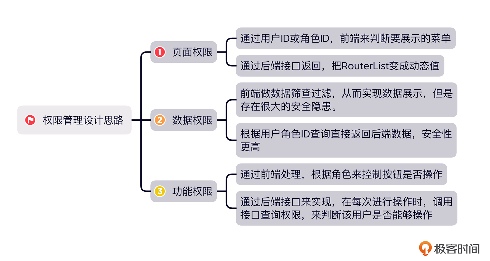
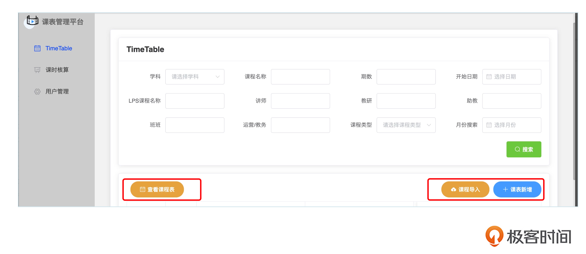
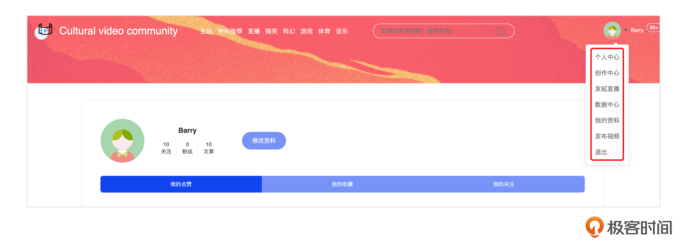
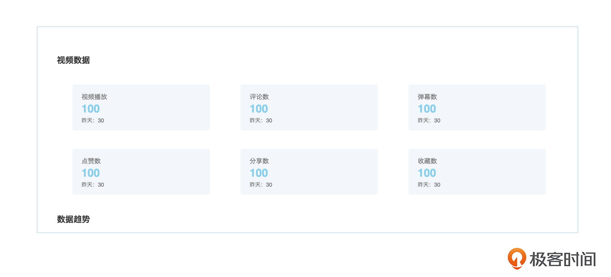
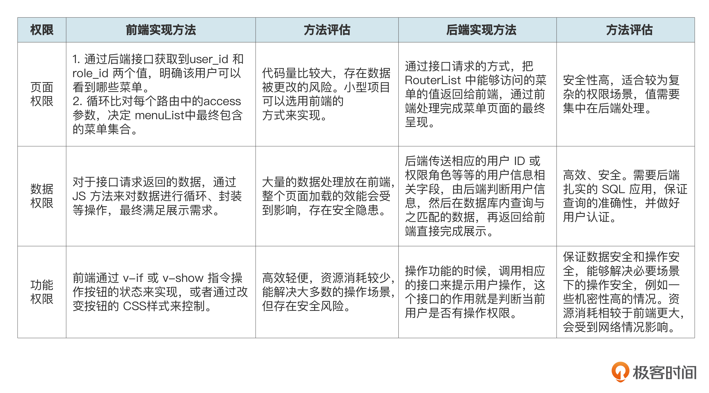

# 08｜个人中心与权限：如何玩转各类系统的权限管理？
你好，我是Barry。

前面我们学习了路由设计，这是我们整个系统非常核心的模块。不过，有一些页面或数据，我们可能需要分情况讨论，才能决定是否要开放给全部的用户。

那么除了路由，还有什么更好的方式来管理页面和数据呢？这就是我们今天要学习的个人中心与权限控制。

在企业级的项目开发里，权限管理是非常重要的一环。掌握了今天的内容，项目开发里基本的权限管理问题就都难不住你了。

## 什么场景下需要权限控制

在我们常见的管理后台中，通常会有很多的功能区。这些功能区通过菜单来区分，每个菜单对应每个业务不同，它的使用人群也不同。我们结合后面这个教学管理后台，一起来剖析一下。


可以看到，后台分别有课程表管理、课时核算和用户管理三个模块，那么对应这三个模块，从企业的角度考虑，一定不会一下开发三个平台去实现这些管理，毕竟这样人力物力投入会很大。那么我们如何满足在一个平台里完成这些功能，同时满足管理员、老师、教务三个群体同时来使用呢？

我们先来具体分析一下平台的功能需求。课时核算这一模块的主要用户群体是老师，他只需要看到自己的课时情况，并不需要关注其他老师的课时。所以我们要针对不同的老师对应展示相应的课时数据。

课程表管理模块主要面向教务人员，满足他们对课程的排期和教学规划的需求。

用户管理模块的用户群体是平台管理者，他负责管理平台的用户组成，通过不同角色区分他们在系统内可操作的权限。

通过这个简单的案例，我们梳理一下权限控制的几个场景。

1.页面权限：不同用户群体可以看到的页面不同。例如教务看不到课时管理的页面，而老师就能看到。

2.功能权限：对于多群体用户同时可访问的界面，不同的角色可以操作的功能是有限的。我们需要通过功能按键操作，实现功能权限控制。比如一个普通用户只有查看页面数据的权限，无法做出添加、删除以及修改数据这样的操作。

3.数据权限：针对不同的角色，我们要控制其可查阅的数据，划分好数据界限。

通过以上三点，相信你已经明白了权限控制的重要性，应对不同的项目需求，你就可以快速地输出解决方案。

## 权限控制怎么来实现

刚才我们将权限控制细化成三个方向，分别是页面权限、功能权限和数据权限，那么针对不同方向的权限控制，我们应该怎样实现呢？

为了帮助你理解，我用思维导图的方式总体梳理了不同权限管理的实现思路。后面我们再结合这张图详细分析。



### 页面权限管理

首先我们要回归Vue框架的原理实现来考虑。在用户初次登录平台时，项目整体的路由都会初始化并重新加载，所以页面权限管理通过路由控制是最高效的方法。路由控制具体还包括前端和后端实现两种方式，我们分别来看看。

#### 通过前端控制实现

在Vue的Router中，我们可以直接加入自定义的参数。让我们结合后面的代码来理解。

```plain
{
        path: '/course',
        icon: 'funnel',
        title: '课程管理',
        name: 'course',
        header: 0,
        access: 1, //权限参数
        component: Main,
        children: [
            {
                path: 'course',
                icon: 'battery-charging',
                name: 'course',
                title: '课程列表',
                component: resolve => { require(['@/views/myView/course/courselist.vue'], resolve); }
            }
        ]
    }

```

对照代码可以看到，这是一个课程管理菜单目录，整体分为两级。

在父级中的access参数就是我们的权限参数。我们在初次登录之后，可以通过后端接口获取到user\_id和role\_id两个值。我们通过这两个值就确定了当前用户的权限，以及该用户可以看到哪些菜单。

接下来，通过循环比对每个路由中的access参数，就能确定menuList中最终包含的菜单集合，代码示例如下。

```plain
appRouter.forEach((item, index) => {
    if (this.userrole === 1) { //角色信息
      if (item.header === 0) { //对应router子项的header值
        if (item.children.length === 1) {
            menuList.push(item);
        } else {
            let len = menuList.push(item);
            let childrenArr = [];
            childrenArr = item.children.filter(child => {
                if (child.access !== undefined) {
                    if (child.access === accessCode) {
                        return child;
                    }
                } else {
                    return child;
                }
            });
            menuList[len - 1].children = childrenArr; //总的菜单集合
        }
    }

```

#### 通过后端控制实现

通过后端实现页面控制的方式更加便捷，相当于我们通过接口请求的方式，把RouterList中能够访问的菜单的值返回给前端，通过前端处理完成菜单页面的最终呈现。

想要实现这个功能，我们只需要在main.js中的Created钩子函数中，写好对应的方法就可以了。在Vue框架中，main.js文件是程序的主入口，这代表用户登录之后就一定会执行main.js中的生命周期钩子函数，所以放在main.js中去执行该方法再合适不过了。

因为每个用户登录，RouterList的值都会改变，所以，通过VueX来管理值的动态变化，对于开发来说会更加方便。

### 功能权限管理

功能权限主要解决的问题是在一个页面中，如何支持多种角色用户同时访问和使用。因为不同角色的用户，他们的操作功能各不相同，所以我们需要控制约束页面中的功能。

大部分页面功能的操作都会用按钮来实现，我在后面放了一张截图作为案例，红框圈出来的地方都属于按钮。可以看到，我们通过对按钮状态的管理即可控制权限。



整体的实现依然分成通过前端或后端实现这两种方案，我们分别来看看。

#### 通过前端控制实现

所谓前端实现，就是在前端通过v-if或v-show指令操作按钮的状态来实现。另外一个方法是改变按钮的CSS样式，把按钮的样式设置为disabled，从而实现对操作按钮的控制。

disabled方式的代码是后面这样。

```plain
 <Col span="1">
  <Button :disabled="status" title="用户添加" icon="arrow-swap" @click="changeb1" >用户添加</Button>
</Col>

```

通过这段代码我们能看到，如果给disabled写成动态值，我们就可以根据status值为true或flase，来控制按钮是否能操作。


#### 通过后端控制实现

通过后端实现，主要是当我们点击按钮的时候，我们会调用相应的接口来提示用户操作，这个接口的作用就是判断当前用户是否有操作权限。

不过这种方式需要我们写很多的控制方法，实现的过程比前端实现的方式更重。当然，如果我们平台的需求是某些操作功能需要短信身份验证或者人脸验证才能操作，这时候就必须通过后端接口查询的方式来实现。因此，我们结合实际的需求去选择相应的实现方式就可以。

### 数据权限管理

数据权限管理一样可以分成前端和后端两种处理方式。

第一种方法就是通过前端控制，来处理对后端返回数据，然后再呈现在页面上。不过我们都知道，大量的数据处理放在前端，整个页面加载的效能会受到影响，安全性也不好。

所以更推荐第二种方法，通过数据后端管理实现数据权限控制，也就是请求时向后端传送相应的用户ID或权限角色等等的用户信息相关字段，由后端判断用户信息，然后在数据库内查询与之匹配的数据，返回给前端，直接展示即可。

## 在项目中需要设置那些权限

接下来，我们结合在线视频直播平台这个项目梳理一下需要设置哪些权限。

首先，作为一个C端的产品就需要满足用户需求。在未登录的情况下，就可以浏览我们的首页，引导用户去更多地使用我们的平台。

然后就到了用户点击视频播放这个场景，此时我们有多种选择。

1.用户在不登录的情况下依然可以查看视频内容，当发起点赞、评论、收藏动作时，我们要提示用户登录之后才可操作。

2.当用户点开视频浏览观看时我们就提示，他需要登录之后才可以观看视频。

这两种方式要结合我们产品的用户运营思路去做，即便这点看起来很细微，但我还是想提醒你加以考虑。因为两种方式的不同，会对用户是否留存在平台产生一定的影响。

接下来我们再分析一下平台的个人中心要设置哪些权限。个人中心主要的作用是以当前登录系统用户为维度，方便用户管理自己的信息、进行个性化的展示。

另外，作为一个视频直播平台，生产模式是UGC的。也就是说，每个用户都可以发布自己的内容，并看到已发布内容的数据。所以，除了个人中心，我们还划分出了用户的创作中心、数据中心、发布视频这些独立的功能模块。



这些功能模块的权限管理，重点在于做好数据权限控制，根据用户角色的不同返回和他相关的信息。我们只需要满足隔离不同用户的数据的需求就足够了，不涉及页面权限和按钮操作权限。

## 项目实践

接下来我们就操练起来，实现课程项目中平台首页和个人中心的权限管理。

### 平台首页的权限实现

前面我们分析过，在平台首页，用户观看视频时我们可以选择提醒用户先登录，再提供视频观看功能。也可以等用户发起收藏、关注、点赞等操作时再提示用户登录。

不过无论是哪种选择，都需要先判断用户是否登录了，所以，我们可以写一个公共的方法来判断这一点，之后再对应的功能模块调用这个方法即可。

首先我们梳理一下实现的方法。对于公共的方法我们应该写在哪个文件里面呢？写在main.js还是首页中呢？

我们来思考一下，什么时候才需要触发 **登录验证**。用户进入首页的时候，其实我们并不需要关注他是否已经登录。直到用户有了点击视频查看详情的动作，准备从首页跳转到具体视频页面的时候，才需要我们 **验证** 其登录状态。

前面的课程我们知道了，从A页面跳转到B页面通常通过 **跳转路由** 来实现。所以不难发现，我们只需要在路由跳转时，增加一个 **登录状态判断** 就可以控制视频的 **操作权限** 了。

具体判断逻辑是这样的：如果用户已登录，就直接调用router的 **beforeEach 钩子函数** 的 **next** 方法继续执行；否则就 **重定向路由**，依旧停留在当前页面（登录提示以弹窗方式呈现）。

代码是后面这样。

```plain
//文件为router/index.js
//这里我们主要通过router的beforeEach钩子函数来实现跳转前的管理即可
//三个参数的意义
//from: 即将离开的路由
//to: 即将要跳转的路由
//next: 跳转方法。
router.beforeEach((to, from, next) => {
  //requiredAuth参数作用是设置该路由是否需要登录验证，
  //当我们使用全局拦截时，可以通过requiredAuth判断路由的跳转，该属性包含在meta属性中
  //根据路由中的参数可以明确有哪些模块登录后才能访问，下面我放了示例
  if (to.matched.some(route => route.meta.requiredAuth)) { // 判断是否需要登录权限
    //我们在登录之后就将用户信息存在了sessionStorage中，如果有值那证明已完成登录
    if (sessionStorage.getItem('user')) { // 判断是否登录
      console.log('登录了')
      next()
    } else { // 没登录则跳转到登录界面
      console.log('不存在用户信息')
      console.log(to)
      next({
        path: '/login',
        query: {
          //路由重定向
          //fullPath用于快速获取当前路径
          redirect: to.fullPath
        }
      })
    }
  } else {
    next()
  }
})

```

通过上面的代码，我们实现了用户在首页操作视频时权限的控制，用户必须完成登录之后才能进入视频详情页。

至于另一种情况，用户进入视频详情页点击收藏、关注、点赞的时候，再发起登录验证，我们只需要通过sessionStorage中的user信息去判断当前用户是否存在，即可判断是否已登录。

你可以重点关注一下前面代码从第7行开始到结束的部分，这是我利用router的beforeEach写好的公共方法，如法炮制，我们就可以判断用户是否能够进行相应的操作。

### 个人中心权限管理

我们在上面已经分析过，所有平台用户都具备一样的操作功能。那么，核心的权限控制应该在什么地方呢？没错，答案就是数据权限。

我们梳理一下要实现的效果。第一，每个用户只能够查看并更改自己的用户信息。

第二，针对数据中心模块，只需要给用户展示和用户相关维度的数据即可。

既然数据是单维度的，而且比较清晰，代码量也比较小，所以我们只需要考虑通过后端接口请求的方式，返回当前用户相应的数据，即可实现对数据的控制。视频数据包含视频的播放量、评论数、弹幕数、点赞数等等，我们只需要根据当前用户信息返回对应数据即可实现对个人中心的权限管理。

下图我也给你放置了数据中心包含的一些指标，这些指标都和用户发布的视频内容息息相关，用户可以通过这些指标数据来判断自己内容的优劣，从而不断对自己创作的内容进行优化，我这里列举的是最为核心的几个指标供参考，你也可以灵活选择自己想展示的其他数据指标。



## 总结

这节课的核心是如何完善各类系统的权限管理。我们总结一下重点内容。

在实现权限管理功能之前，我们需要先做权限需求分析，以此确定要从哪些维度来控制权限。结合课程管理平台的案例，我们把权限管理划分成了三类——页面权限、数据权限和功能权限。

无论哪种权限控制，都要有前端和后端两种实现方式。这里我总结了一个权限控制决策表，供你参考。



之后，我们一起完成了平台首页权限的实现，你应该也体会到了，明确了实现思路以后，代码实现环节就会水到渠成。希望你在课后多加练习，根据课程里讲到的个人中心权限管理的实现思路，继续完善我们的项目。

相信学完今天的内容，你对权限设置已经有了一个全新的认识，并且掌握了灵活多样的处理思路，这也是这节课的重点。以后如果你要应对其他类型平台的权限管理功能，也可以参考这节课的思路，选择最适合的方案去解决。

## 思考题

我们在处理菜单权限控制的时候，选择的方法是根据access权限参数来控制对应的展示内容。如果想应对更复杂的角色情况，还有什么更好的解决方法呢？

欢迎你在留言区和我交流互动。如果这节课对你有帮助，也推荐你把这节课的内容分享给更多朋友。