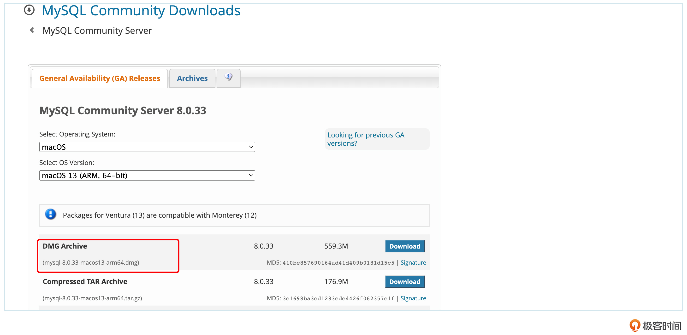
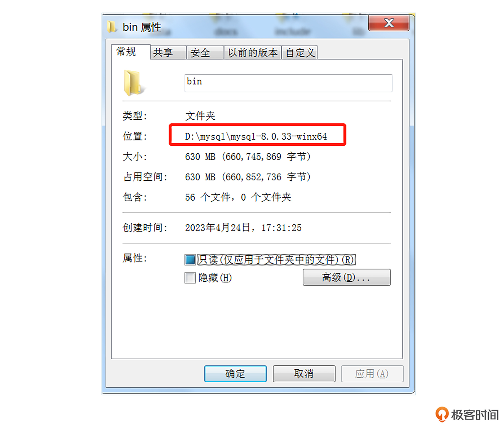
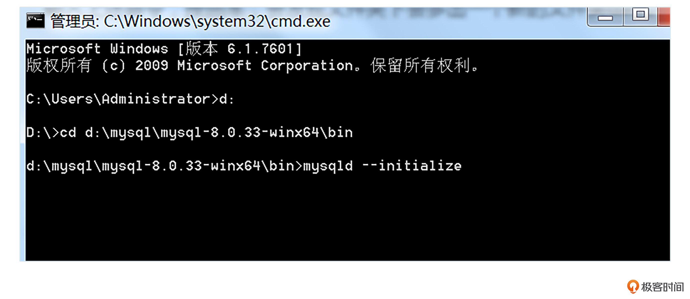
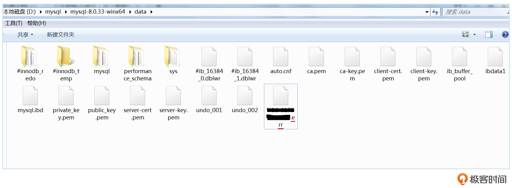
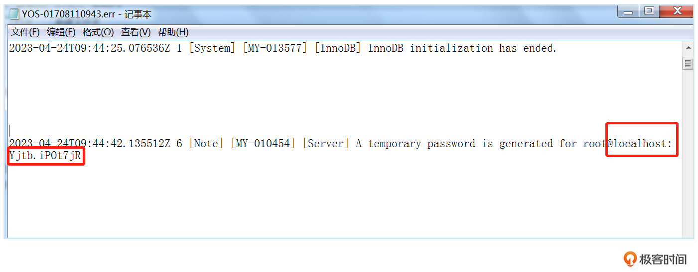
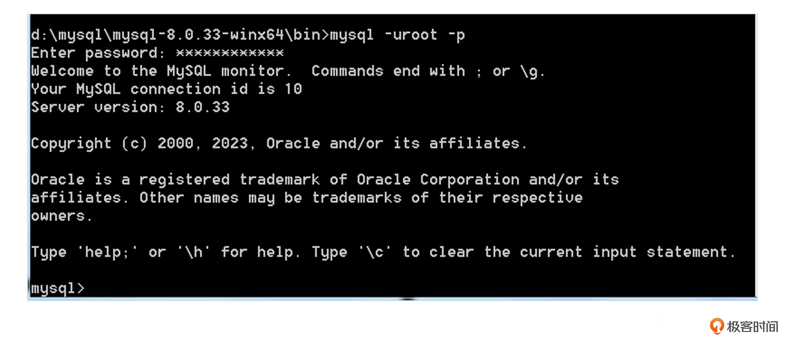
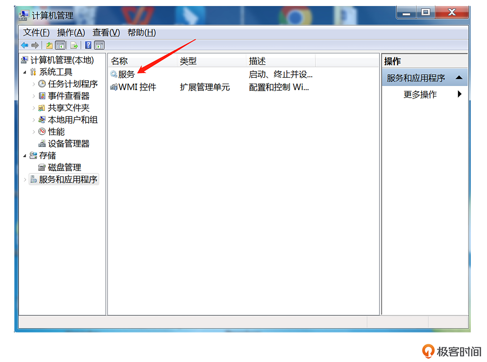
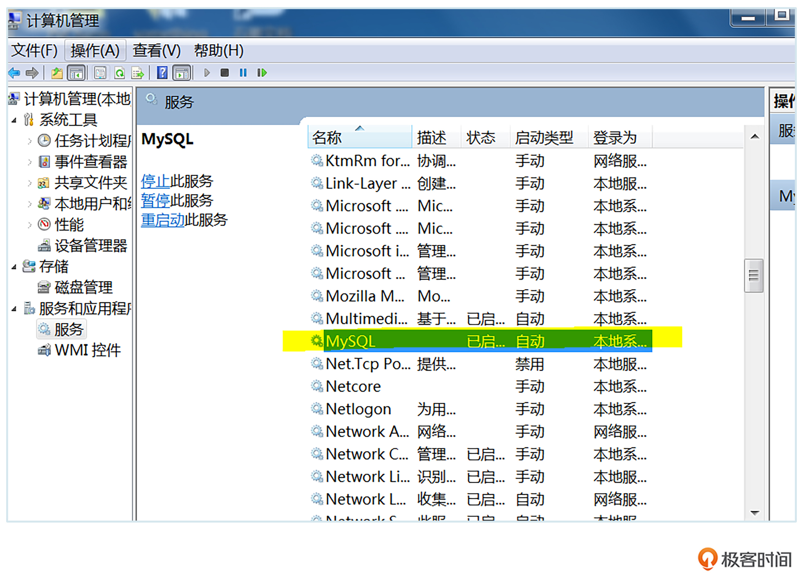
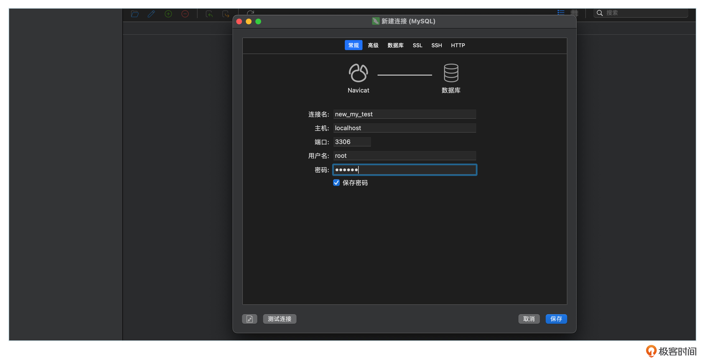
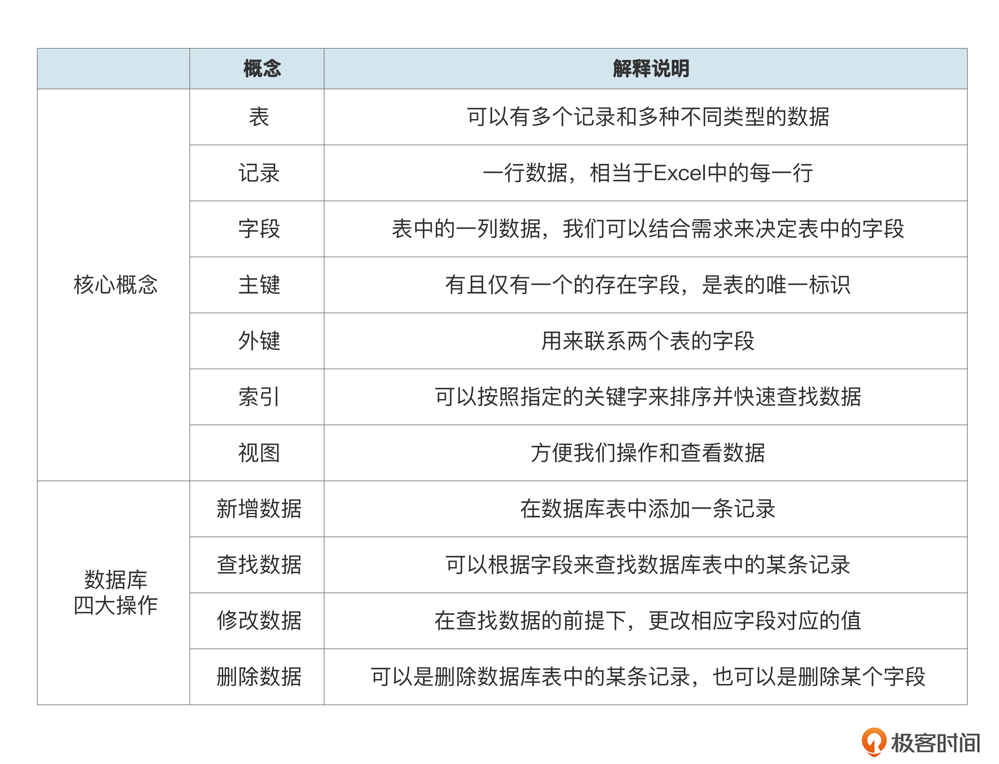

# 21｜数据库ORM对象关系映射（一）：数据库连接与必备操作
你好，我是Barry。

数据库作为项目的基石，十分重要。因为它是存储用户信息、订单记录、交易记录和产品信息等核心数据的地方。数据库还支持高效的数据查询和处理，能让项目更快地响应用户请求。最重要的是它还有安全功能，比如加密、用户认证和权限控制等等，确保数据不会被盗用或篡改。

这节课，我们一起来学习在线视频平台的数据管理基石——数据库。

## 数据库类型

数据库相当于一个大型的文件柜，里面存储了各种各样的数据。通过数据库，我们就能更方便地查找、添加、修改或删除项目中的数据。

数据库里的大量数据集合是通过数据结构（比如说顺序表、链表、栈、队列、二叉树、堆、哈希表等等）来进行组织、存储和管理的，能更高效地实现数据的增删改查。

那常用的数据库有哪些呢？我们项目中用到的MySQL就是其中一种，此外还有SQLServer、Oracle等数据库。我们先来了解一下SQLServer和Oracle。

SQLServer比较适合大型的企业级应用，很多学校也会使用。SQLServer还提供了多种聚合函数，如SUM、AVG、COUNT、MIN、MAX等，用来统计和计算数据。

而Oracle数据库管理系统（Oracle Database）是甲骨文公司的一款关系数据库管理系统。它是在数据库领域一直处于领先地位的产品。它是一种高效率的、可靠性好的、适应高吞吐量的数据库方案。

那为什么我们在项目中选择了MySQL，而不用Oracle呢？MySQL是一种轻量级数据库，免费且开源，使用方便。它通常适用于互联网项目，特别是Web开发项目，因为它支持大量的并发用户。由于它的开源性质，你可以很容易地找到社区支持和资源。

而Oracle则需要收费，它的支撑体系完善、强大，安全性高。Oracle适用于一些大型企业或传统行业的数据化业务，特别是银行、金融、保险等行业，因为这些行业通常对数据的可用性、安全性和实时性要求非常高。

了解了数据库的类型和优缺点之后，结合项目需求以及我们整体的学习规划，选用MySQL更为合适。接下来，我们就详细了解一下MySQL。

### 数据库的基本概念

数据库有几个核心概念需要我们熟练掌握，包括表、记录、字段、主键、外键、索引和视图。我们不妨和Excel做个比对，这能让你更好地掌握它们的用途。

表就是存储数据的“盒子”，每个表中可以有多个记录和多种不同类型的数据。

记录就是表中的一行数据，对应Excel中的每一行。

字段，就是表中的一列数据，和Excel中的某个列一样，比如姓名、年龄等，这个贴合我们的需求来决定有哪些字段。

主键是用来唯一标识每个记录的，就像身份证号码一样。我们需要注意的是， **在一个数据表里，主键有且仅有一个**。外键我们也会经常用到的，它可以用来联系两个表的关系，查找和比较数据等时候比较方便。

说到查找数据，我们就不得不提到索引，它就像一本字典，按照指定的关键字来排序并快速去查找数据，相当于Excel表格中的筛选功能。

最后要说到的概念就是视图，它是由查询语句生成的虚拟表格，方便我们操作和查看数据，让我们的操作和管理更直观。

不难发现，我们前面说的这些基本概念主要用于组织和管理数据，不过它们都属于单维度的表概念。接下来，我再带你梳理一下表之间的几种关系，这也是我们在应用工程中必不可少的。

表之间有三种关系：一对一、一对多和多对多。一对一关系就像一个人的身份证号码只与其户籍信息相关联。一对多关系就好比一个公司可以拥有多个部门，而一个部门只属于一个公司。多对多关系就像学生可以选择多门课程，而一门课程也可以被多个学生选择。

只有熟悉了表相关的这些基本概念，才能结合需求梳理出对应的表关系。

### 数据库的操作概念

接下来我们更进一步，来熟悉一下数据库的操作。项目中应用数据库的重点就是对数据库的操作，所以我们对数据库的操作概念一定要有所了解。

数据库的四大操作分别为新增（INSERT）、查询（SELECT）、修改（UPDATE）和删除（DELETE）。

- 新增数据就是在数据库表中添加一条记录。像用户注册这类操作，就相当于在数据库中新增一条数据。
- 查找数据是指可以根据字段来查找数据库表中的某条记录。我们项目里最常用搜索功能，就是根据某个字段去数据库中查找。
- 修改数据一般是在查找数据的前提下，更改相应字段对应的值。像我们之前讲到的视频信息修改、用户个人修改，都属于对原有信息的修改操作。
- 删除数据可以是删除数据库表中的某条记录，也可以是删除某个字段，但是删除字段很可能改变表结构。所以通常情况下我们删除操作的对象都是记录。

虽然数据库的操作概念相对简单，但我们还是有必要掌握，这样后续应用时才能知其所以然。下面我们就进入实操环节，一起来完成数据库工具的安装与实践，为项目开发做好准备。

## 数据库工具的安装和实践

我们在使用数据库之前，一定要保证本地有相应的安装程序，其中包括MySQL数据库的安装和可视化工具的安装。

### MySQL数据库安装

对于MySQL数据库，我们可以在官网下载应用程序。为了提升安装成功率建议使用离线安装包的方式。安装包的 [官网地址](https://dev.mysql.com/downloads/mysql/5.5.html#downloads) 我也给你放在这里，你直接点击即可下载。

考虑到电脑系统的不同，我们先来看一下Windows和macOS环境下的版本选择，如果你的系统是Windows，参考下面的图片选择就可以。


macOS的选择可以参考后面截图里的选项。



下面我以Windows系统为案例，演示一下整个安装的过程，让你对安装的过程有一个大致的了解。

下载好前面提到的安装包之后，为了后续操作方便，我们统一把MySQL安装在D:\\mysql 这个文件夹下，这个安装路径你也可以自己选择。初始文件的内容截图我也贴在了后面，可以看一下。


下载完成之后我们直接解压文件即可。然后，在解压文件中找到 **bin文件**，复制该文件的路径，我们需要这个文件路径完成环境配置，这样才能支持后续使用。这里你同样可以参考后面的截图。



在环境配置这一步，你应该比较熟悉了，像之前的Python应用你也需要安装并配置，它们是一样的过程，同样要在控制面板中的高级系统设置里设置。然后我们需要在系统属性的级选项中，点击环境变量。

下一步就是在系统变量中找到path，点击编辑，在path的变量值后面加上我们之前复制的bin文件路径。这里需要注意的是， **添加bin文件路径之前，记得先给上一个路径加上英文格式的分号“；”。**


配置好环境变量后，下一步就是创建一个新的my.ini文件，该文件的用途是初始化MySQL数据库。my.ini文件中代码是后面这样，你可以参考一下。相信对照里面的详细注释，你很容易就能明白每个属性的作用。

```plain
[mysql]
# 设置mysql客户端默认字符集
default-character-set=utf8
[mysqld]
# 设置3306端口
port = 3306
# 设置mysql的安装目录
basedir = D:\\mysql\\mysql-8.0.33-winx64
# 设置mysql数据库的数据的存放目录
datadir = D:\\mysql\\mysql-8.0.33-winx64\\data
# 允许最大连接数
max_connections=20
# 服务端使用的字符集默认为8比特编码的latin1字符集
character-set-server=utf8
# 创建新表时将使用的默认存储引擎
default-storage-engine=INNODB
# 创建模式
sql_mode = NO_ENGINE_SUBSTITUTION,STRICT_TRANS_TABLES

```

创建好文件以后，就进入到了初始化的环节。我们需要进入cmd命令行，通过命令进入bin文件路径下。然后输入命令 mysqld --initialize来完成数据库的初始化。具体的执行效果如下图所示。



初始化完成后，你会发现多出了一个data文件夹。data文件中有一个后缀为 .err的文件，里面存放的是初始化登录mysql的密码。



我们用记事本方式打开 .err文件，就能找到其中存储的用户名和密码。我们需要这个账户和密码去启动MySQL的服务。



再之后就是启动MySQL服务。我们需要在bin目录下输入后面的命令。

```python
net start mysql

```

对应的启动效果图我也放在了下面，你可以看一下。


服务启动以后，我们就能登录MySQL了，登录数据库的具体执行命令是后面这样，你可以直接使用。

```plain
mysql -uroot -p

```

我再来给你讲讲前面这条命令的具体含义。

-u 后面跟着用户名，指定要登录的 MySQL 用户名，这里是 root，表示以 root 用户身份登录；-p 后面跟着密码，指定要登录的 MySQL 密码，这里需要输入 root 用户的密码。该命令的作用就是以 root 用户身份登录到 MySQL 数据库，并授权其他用户访问操作数据库。

按回车执行后，就会显示Enter password的字样，我们在这段文字后面输入 .err文件中给出的密码即可。如果输入以后显示后面截图里的字样，就代表登录成功了。



登录成功后，我们可以修改自己的root账户的密码，具体的执行代码如下。

```plain
alter user 'root'@'localhost' identified with mysql_native_password by 'flask_project';

```

最后，我们还需要设置MySQL服务。这个操作同样要在我的电脑的管理选项中，选择服务与应用程序，点击进入之后选择 **“服务”**。



然后，我们要在列表中找到 **“MySQL”**。之前我们已经使用语句 net start mysql 启动服务了，所以这里我们可以把启动类型设置为“自动”。



到这里我们就成功实现了MySQL的安装和服务启动。

### Navicat的安装

刚刚安装好的MySQL还没有可视化界面，用起来不够方便。所以我们还要安装Navicat，通过它来实现数据库的可视化。Navicat是一个数据库管理工具，可以连接到SQL Server、Oracle以及我们项目里选择的MySQL。

官网的版本只有14天的免费使用版本和收费版，我给你提供了Windows和Mac的破解版，你可以按需取用。

- Windows版本网盘链接: [https://pan.baidu.com/s/173dybxZJF\_69gZ3tJaCuYg?pwd=tk7u](https://pan.baidu.com/s/173dybxZJF_69gZ3tJaCuYg?pwd=tk7u) 提取码: tk7u
- macOS版本网盘链接: [https://pan.baidu.com/s/1MC1o5OfbPyw41DUyQAEgPQ?pwd=z4fn](https://pan.baidu.com/s/1MC1o5OfbPyw41DUyQAEgPQ?pwd=z4fn) 提取码: z4fn

解压安装的过程比较简单，你自己根据它的操作提示就能完成安装。下面我们重点来看一下如何实现链接，成功链接是我们后面顺利使用MySQL的前提。

下载安装成功之后，我们打开对应的界面，直接点击“连接”选择MySQL，对应的界面效果如下图所示。


在“连接设置”页面中，我们需要输入连接名称、主机名、端口、用户名和密码。这一块的配置我们前面都已经设置好了，这时候只需要填入即可。具体的效果图如下。



完成信息输入之后，你就可以点击“测试连接”按钮。如果连接成功，将会弹出一个“成功连接到服务器”的提示框；如果连接失败，则会弹出一个错误提示框，你就需要检查输入的连接信息是否正确。

到这里，我们完成了数据库的安装和应用的所有内容，为后续数据库应用做好了准备。

## 总结

今天的内容告一段落，我们一起来回顾总结一下这节课的重点内容。

数据库很重要，它是我们整个平台的基石，整个项目开发中都离不开它。几个常用数据库各有特点，经过对比我们选择了MySQL数据库，因为它更符合我们的项目需求和学习规划。

之后我们数据库的四大操作分别为新增（INSERT）、查询（SELECT）、修改（UPDATE）和删除（DELETE）。

这里我为你梳理了一张表，整理了MySQL数据库的核心概念和数据库的四大操作，供你复习参考。



学习了核心概念和四大操作之后，我们还完成了MySQL的安装与服务启动，只要你耐心跟着我的步骤操作一定可以搞定。另外，我也给你讲解了可视化工具navicat premium的安装和应用。这些安装配置都非常好上手，希望你在课后一定要自己实践一下，这样才能更加熟练地掌握数据库的应用。

## 思考题

在课程中我们讲到了数据库表有多对多的关系，你知道在实际项目中有哪些功能的表关系是多对多设计的吗？

欢迎你在留言区和我交流互动。如果这节课对你有帮助，也推荐你分享给身边更多朋友。