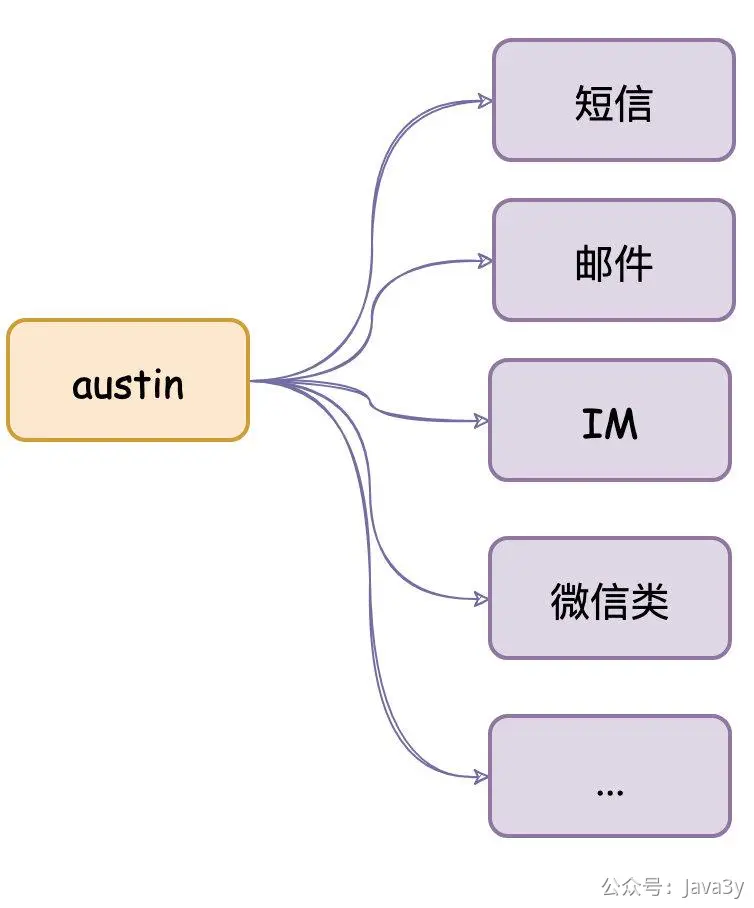
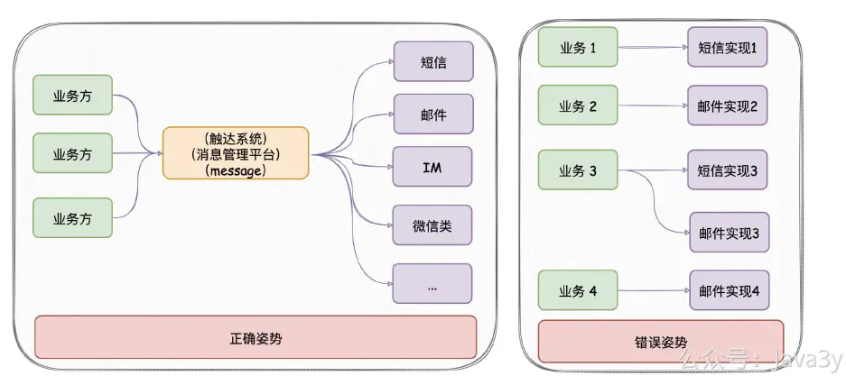
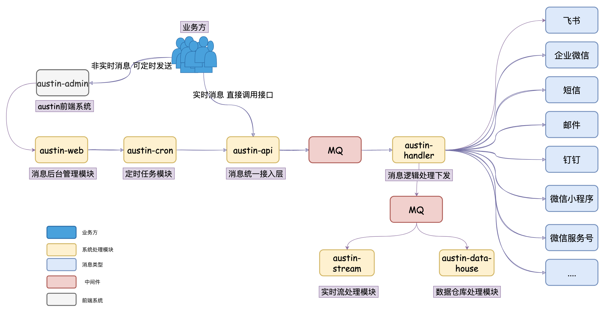

# 1.1 austin项目简介

**注：austin项目的介绍视频在本文末尾。**
**01、核心功能**

austin项目是消息推送平台的实现，它的**核心功能**：统一的接口发送各种类型消息，对消息生命周期全链路追踪

**项目出现意义**：只要公司内有发送消息的需求，都应该要有类似austin的项目，对各类消息进行统一发送处理。这有利于对功能的收拢，以及提高业务需求开发的效率

**02、系统项目架构**

| 工程模块

 | 作用

 |
| --- | --- |
| austin-common

 | 项目公共包：存储着项目公共常量/枚举/Bean

 |
| austin-support

 | 项目工具包：对接中间件/组件

 |
| austin-cron

 | 定时任务模块：对xxl-job封装和项目定时任务逻辑

 |
| austin-web

 | 后台管理模块：提供接口给前端调用

 |
| austin-service-api

 | 消息接入层接口定义模块：只有接口和必要的入参依赖

 |
| austin-service-api-impl

 | 消息接入层具体实现模块：真实处理请求

 |
| austin-handler

 | 消息处理逻辑层：消费MQ下发消息

 |
| austin-stream

 | 实时处理模块：利用flink实时处理下发链路数据

 |
| austin-data-house

 | 数据仓库模块：消费MQ数据写入hive

 |

视频介绍讲解：

[附件: #01 消息管理平台项目背景.mp4](./attachments/Qo_P06GxENgIg1_B/#01 消息管理平台项目背景.mp4)

> 原文: <https://www.yuque.com/u37247843/dg9569/mkegzy4enierk97v>