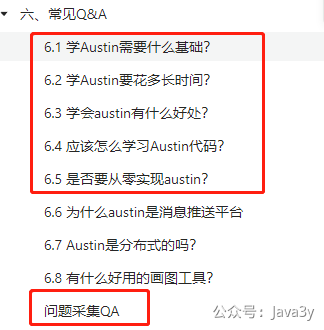
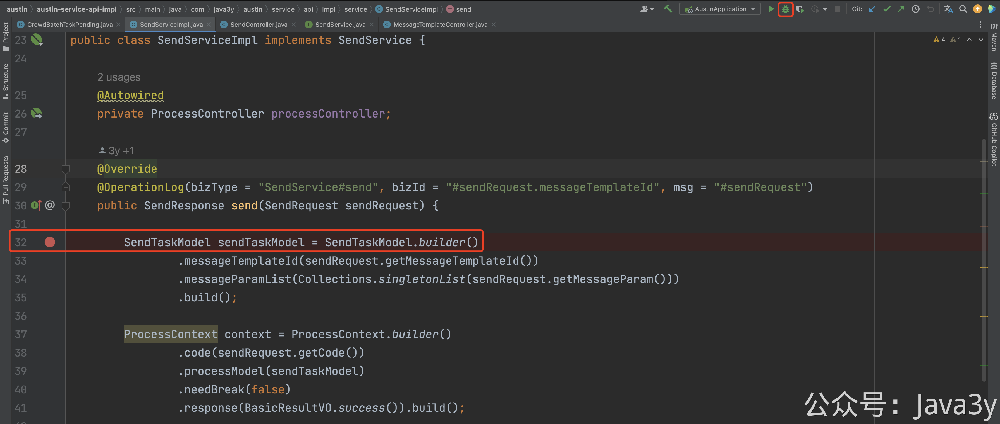
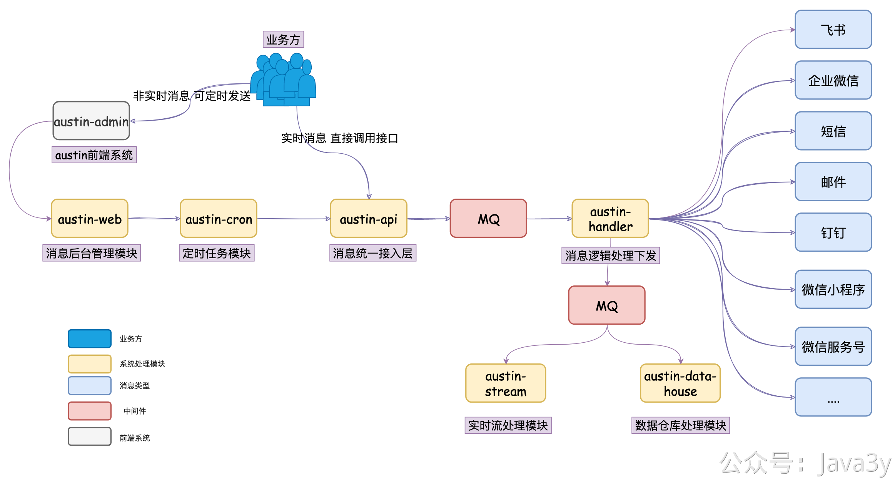
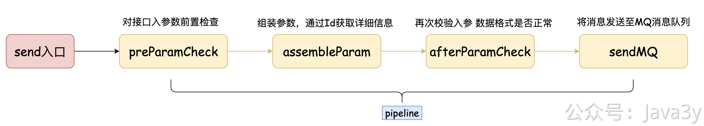
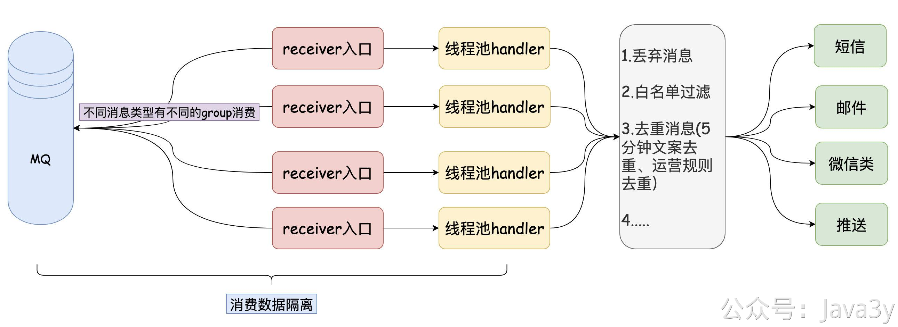

# 1.2 如何学习austin

**总览指引**：学习路线**按语雀文档顺序**往下读，期间**代码/业务/架构**有问题可先到**《问题采集QA》**看看有无已有问题记录。**经过思考问题还是搞不掂**，可到vip群或者直接私聊我提问（**提问前先到 《常见Q&A》 学习下提问的正确姿势**）。

1、按照**第二章节（2.1~2.3）**的文档将austin后端和前端分别**在本地启动起来**，通过前端**测试按钮**成功接收到自己的邮件。

2、看**第三章节**（**3.1~3.20**）的文档，并对着代码进行初步的了解，期间**一定要配合代码**来看。

接入层从`com.java3y.austin.service.api.service.SendService#send` 入口开始**DEBUG**

消费端从`com.java3y.austin.handler.receiver.service.impl.ConsumeServiceImpl#consume2Send` 入口开始**DEBUG**

3、再回看系统架构图，**思考**为什么我是这样设计的架构；

4、针对**某些功能细节实现**（接入层和消费逻辑层的处理，whatever，你感兴趣的就行。），思考为什么我要这样写的代码；

**SendAfterCheckAction->SendAssembleAction->SendAfterCheckAction->SendMqAction**

5、在这过程中继续刷一遍的**第三章节**的文档，看是否能了解我当时写代码的思路。探索已实现的功能：**全链路追踪**、**消费数据隔离、动态定时发送消息任务等等等**

6、**多思考**什么功能是消息管理平台目前所缺的，有什么设计不足，**跟我交流沟通**

> 原文: <https://www.yuque.com/u37247843/dg9569/gy6lgysh2yo15e35>