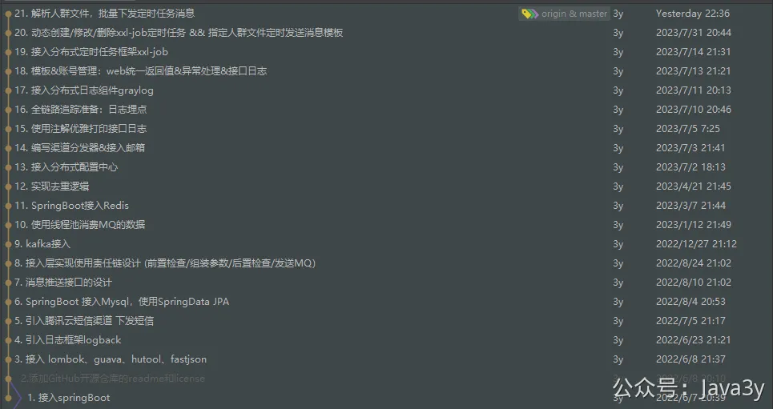
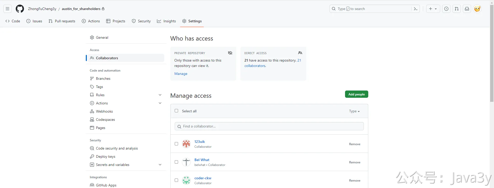

# 1.3 项目清爽干练 commit

我这边专门另外建了一个仓库去重新构建austin，每个**commit**都会关联视频的，方便股东们看到整一个搭建的过程。

项目是在GitHub，走**邀请制**。如果你想看到这个项目的commit，把自己的**GitHub邮箱或昵称**发到我的邮箱，我添加权限

我的邮箱：**403686131@qq.com**

**邮件格式：**
标题：申请加入austin股东Git仓库
内容：我的语雀昵称是：#{yuQueNickName} ，GitHub邮箱是：#{xxxx}，GitHub昵称是#{nickName}

 

> 原文: <https://www.yuque.com/u37247843/dg9569/vyn9aex27m2524lc>