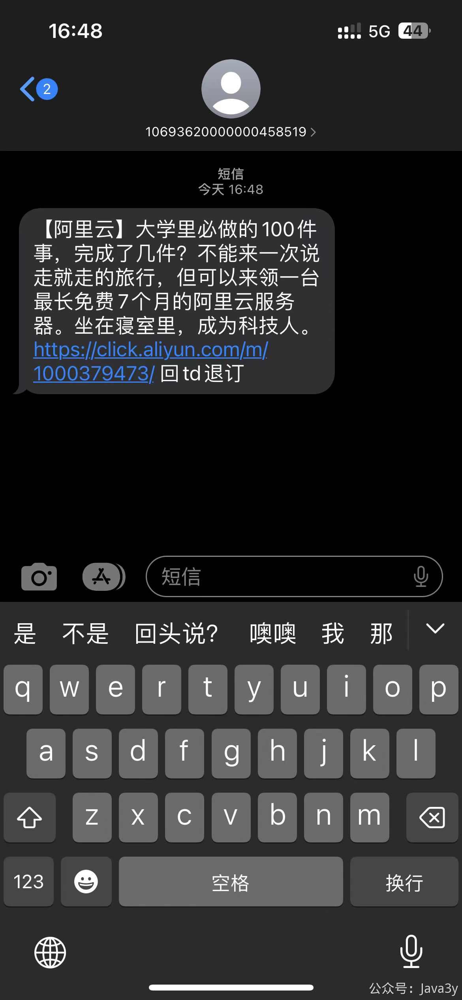

# 7.10 短信回复了TD是真有效吗

  本文于股东群记录 @极 
这种营销短信回复TD 是发给**代理商**了，可以理解为用户和运营商中间有一层代理，叫短信服务商公司，需要有sp电信运营资格证才能开这种公司。

代理商那边的平台上对接运营商，下对接客户，以http的方式，用户回复的td，代理商平台收到了以后，会对用户号码做屏蔽

正确的屏蔽方式，是只对用户屏蔽退订的短信签名。但是**很多代理商做的不好**，做了**全平台屏蔽**。所以就会出现这种情况，比如用户td了A签名的短信，但是代理商的平台上有多条短信通道，N多签名，只要是对接到这个代理商的平台下发的短信，td的这个用户的手机号会全部收不到。

运营商是不会对td做处理的，处理td的是代理商。因为代理商每条短信通道每个季度的投诉量有上限，超出了以后这条通道会暂时封禁。代理商收到td以后在自己的平台上屏蔽掉该用户，**避免用户失去耐心通过工信部或者12123之类的渠道投诉。**

不过大多数平台，在屏蔽用户的时候，都会做出选项，1.屏蔽营销 2.屏蔽行业通知(通知类短信或者验证码)，如果做的**不够精细**，就可能验证码也收不到。

> 原文: <https://www.yuque.com/u37247843/dg9569/onprgv87lfz4syhy>