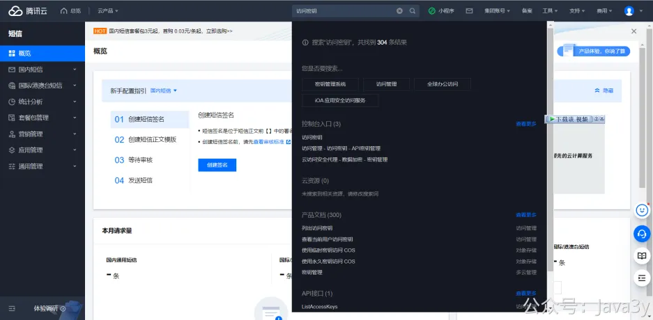
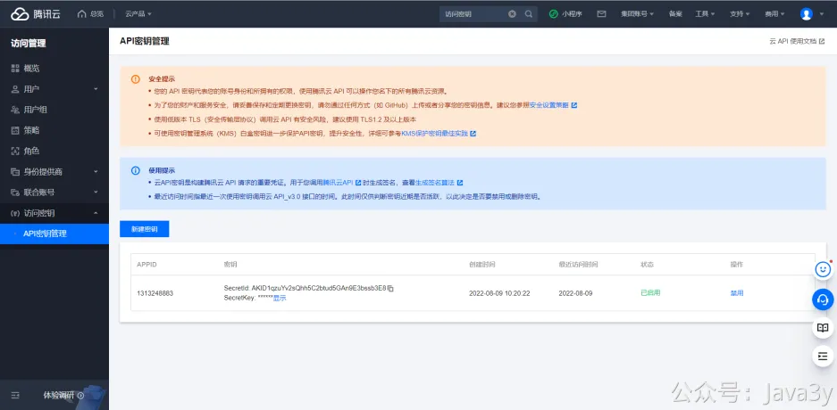
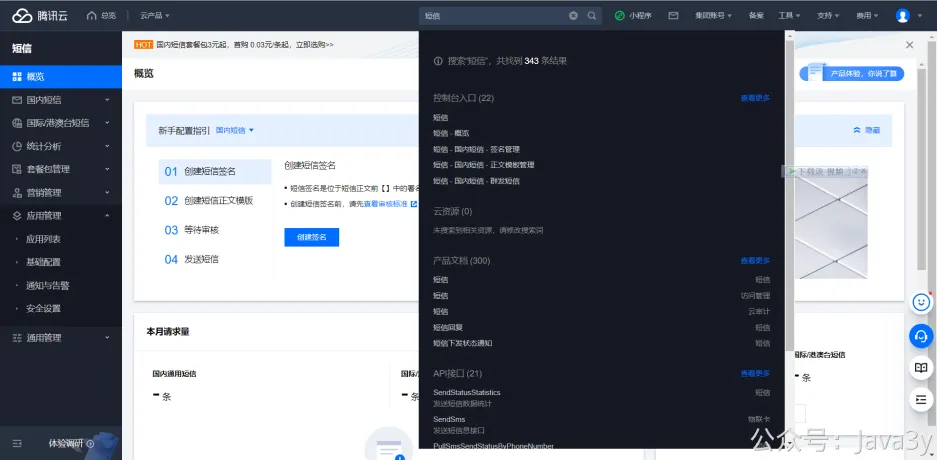
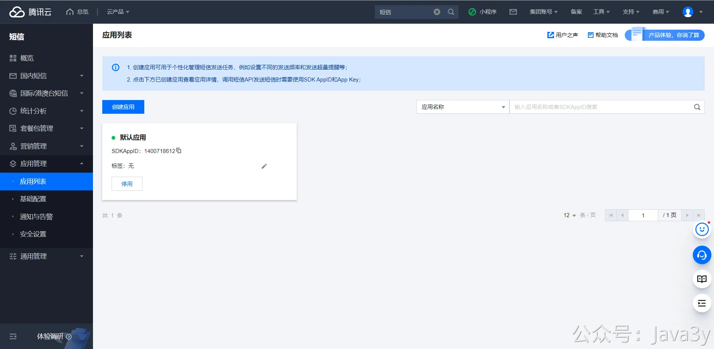
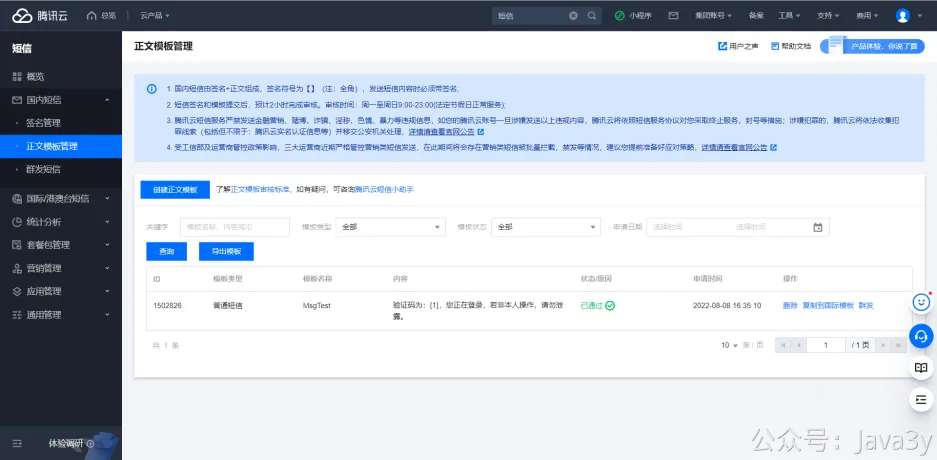
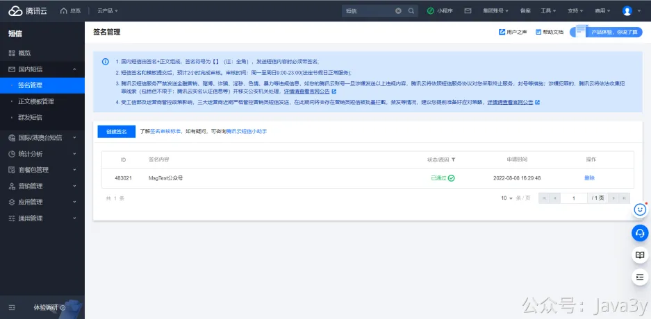

# 7.4 腾讯云 账号配置参数

**账号样例配置**

按照如下教程修改五个参数即可

**secretId和secretKey**

腾讯云网站搜索访问密钥

点击新建密钥即可获得自己的**secretId**和**secretKey**

**smsSdkAppId**

应用管理里的应用列表SDKAppID就是**smsSdkAppId**

**templateId**

申请的模板ID就是**templateId**

**signName**
你的签名内容就是你的**signName**

若有收获，就点个赞吧

 

> 原文: <https://www.yuque.com/u37247843/dg9569/iwm9a3n23e6gpne1>