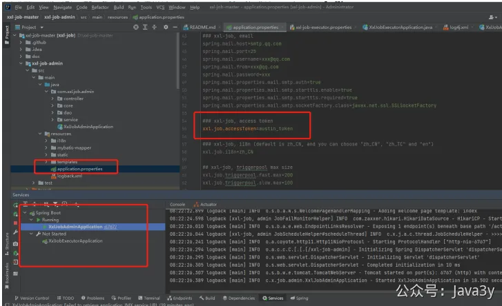
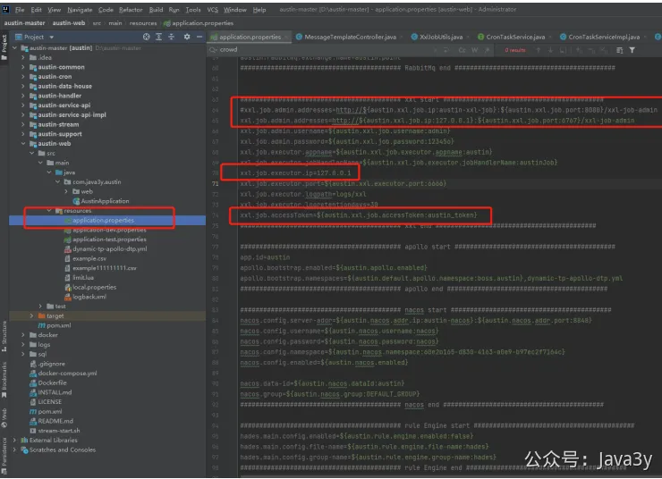
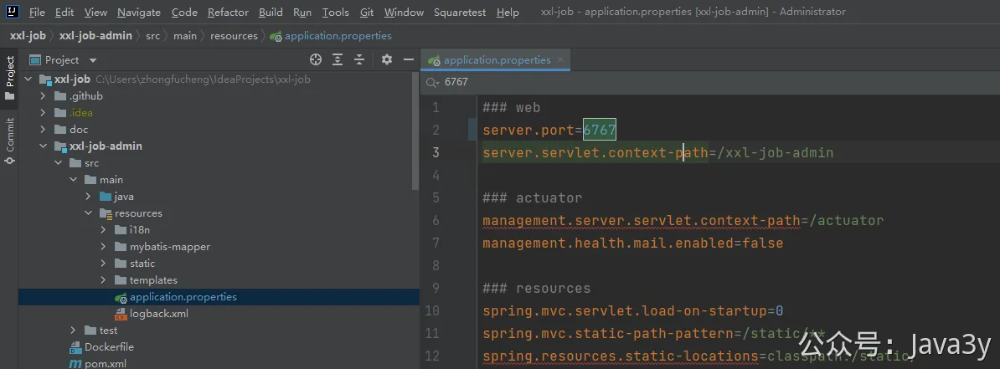

# 7.8 xxl-job部署token的问题

在上文操作的基础上，先配置application.properties中的xxl.job.accessToken为austin_token, austin_token可以改为任何字符串，**只要统一都可**。下边的xxlJobExecutorApplication执行器不要启动，因为我们austin里已经有执行器了，启动以后冲突了。所以**只用启动调度器**即可。

Austin项目中需要改三个地方，特别注意端口号因为调度器改为**6767**，相应这里也需要修改才可以注册成功

若有收获，就点个赞吧

 

> 原文: <https://www.yuque.com/u37247843/dg9569/kpc3vncxgzr31k44>