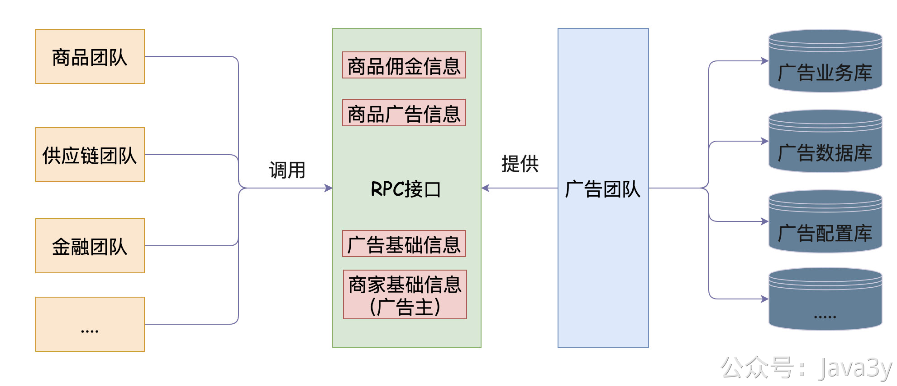
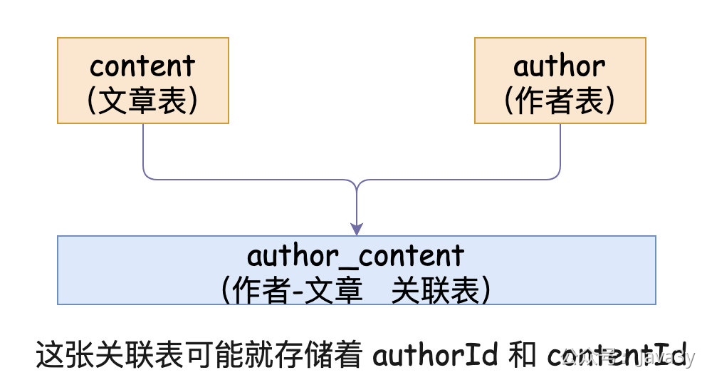
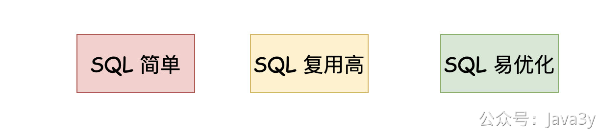
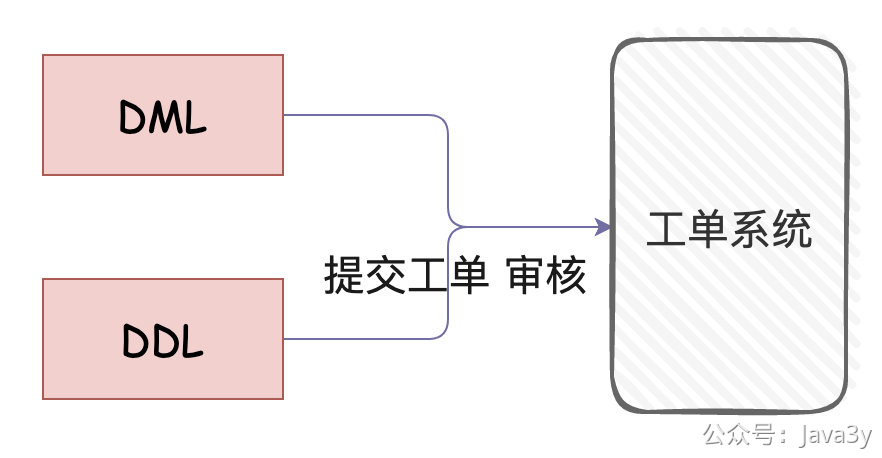

# 3.11 我在互联网使用数据库的经验

这两年我是呆在互联网公司上班的，我就来聊下我个人所接触到的东西，分享下我的看法。

一般来说，每个业务团队维护着自己的数据库（一个业务团队可能就有好几个库），当我们需要某一个团队的相关数据时，团队会提供对应的RPC接口给公司内部业务使用。

这意味着**数据逻辑对调用业务方而言，是透明的**（调用业务方不需要关注其他团队数据库的任何信息，无论是数据库表设计还是具体的字段）。

这个好处是显然地：要某团队的业务数据，只要找到他们提供的接口就完事了。作为需求方，只需要调个接口就能拿到自己想要的数据。

回到数据库内部存储本身，我们会尽可能将表结构设计得更简单：在很多情况下，都会**放弃数据库三大范式**来设计表。

举个很简单又可能不太恰当的场景：一个作者可能会写多篇文章（意味着多篇文章会属于同一个作者） author:content(1:N)
那在初学的时候，可能有的教程会这样设计：author表、content表、autor_content_mapping表

但是，我们在实际中生产环境中**很有可能**是不设计这种关联表，而是直接把相关字段**冗余**在一张表里。这样在查询的时候，就能直接通过一张表查到对应的信息了，不用进行**多层关联**

如果按上面的结构进行查询：比如我要查到某一篇文章的作者基本信息，那我此时的动作是：

1. 关联author_content表查到文章的authorId
2. 通过authorId去author表查到作者的基本信息

如果我把authorId直接存到content表中，那就意味着少了去author_content表查询了。

**注**：这里我不是说让你们把所有的信息都存在一张表里，一张表里有上百个字段，千万不要误会我的意思！

说起关联，又有一个能聊的话题：是否join（这个话题我曾经在我的交流群中聊过，不过也是各抒所见吧）。我在以前公司接触到的项目，在mapper.xml中都看不到join的身影，我写join只在hive写统计脚本的时候用到。

> 【强制】超过三个表禁止 join。需要 join 的字段，数据类型必须绝对一致；多表关联查询时，保证被关联的字段需要有索引。
> 说明：即使双表 join 也要注意表索引、SQL 性能。

喜欢用join的会告诉你：我写join会让代码变得更简单。查数据太麻烦了，要查的数据会存到多张表里，直接在用join的**开发效率**是最快的！

而我，我是支持**在代码里写业务逻辑**的。所有都是单表查询，在程序代码中对数据进行关联（数据库的JOIN能干到的事，在程序上一定能干得到）。这样的好处就在于：**SQL简单，SQL易复用，SQL易优化**

在绝大数情况下，我们的**接口瓶颈都是来源于「数据库」**，而非应用服务器。多JOIN且复杂的SQL是不好优化的，而简单的SQL是比较好优化的，并且我认为**程序逻辑往往都要比SQL更容易维护**。

在我这两年在互联网公司中，关系型数据库在我的认知里，它就是作为一个**支持事务**的存储。如果我们存储的数据对事务没有要求的，可能压根就不需要存储至关系型数据库中。

现在数据源**可选择的太多了**，我们可以把数据存储到Redis(内存数据库)、Elasticsearch（搜索引擎）、HBase（分布式、可伸缩的大数据存储）、HDFS（分布式文件系统）、clickhouse（OLAP存储系统）等等等

基于上面这些背景下，我的查询SQL就不会复杂，**那么Spring Data JPA不就很适合我了么**？

去到有一定规模的公司，都会有数据库相关的基础建设，下面提下常见的基础建设吧

**一、DDL和DML都需要走工单**

生产环境的数据库理论都不能通过自己编写接口在程序中修改（高危动作），需要修数据或者建表都需要经过工单系统审核（一般是数据库负责人+DBA）

比如你提交建表申请，DBA会看你的表设计是否合理（是否有加索引等等）

**二、DQL查询线上数据需要权限**

我们要查询线上的数据，一般都得申请库的权限，有了权限之后在公司内网特定的页面进行数据查询（我们一般只需要查团队内的数据，所以其实也还好，其他团队的数据库权限是不开放的，要数据一般只能通过接口获取）

**三、程序上一般不直连数据库（会有代理层）**

一般只有线下数据库可以通过ip直连，线上数据库都会经过代理层（代理层可以做很多东西，包括监控鉴权分库分表等等）

**四、完备的监控告警**

数据库作为一个很重要的存储之一（如果挂了是真的影响很大），会有完备的监控和告警。比如说执行SQL失败的告警、执行慢SQL的告警等等，对数据库的各种指标进行实时监控

.....

> 原文: <https://www.yuque.com/u37247843/dg9569/ug0f1ic6e2utwd6u>