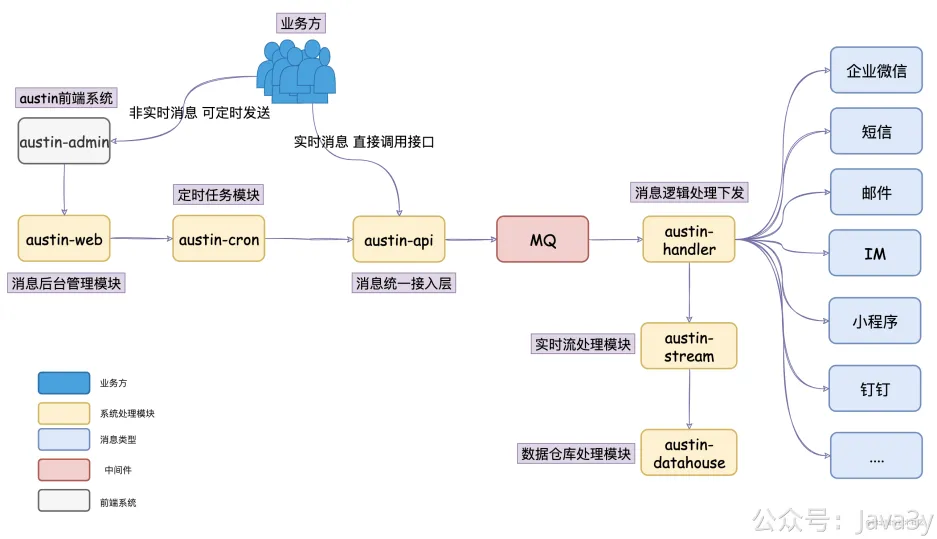
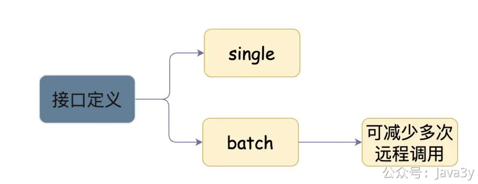
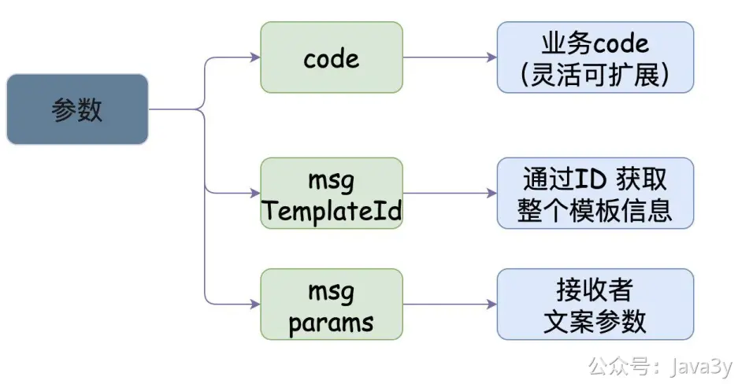

# 3.12 消息推送接口设计

**视频介绍讲解**：
[](https://www.yuque.com/u37247843/dg9569/wk4l14597nmqqqfg?_lake_card=%7B%22status%22%3A%22done%22%2C%22name%22%3A%22%E5%A6%82%E4%BD%95%E8%AE%BE%E8%AE%A1%E6%B6%88%E6%81%AF%E6%8E%A8%E9%80%81%E6%8E%A5%E5%8F%A3%EF%BC%9F.mp4%22%2C%22size%22%3A127240761%2C%22taskId%22%3A%22u693ccb02-35e7-4455-85c7-083dfe10ea3%22%2C%22taskType%22%3A%22upload%22%2C%22url%22%3Anull%2C%22cover%22%3Anull%2C%22videoId%22%3A%22inputs%2Fprod%2Fyuque%2F2023%2F1285871%2Fmp4%2F1687266383464-b0e72b96-5adb-4999-a2c7-996b0bd6a8f7.mp4%22%2C%22download%22%3Afalse%2C%22__spacing%22%3A%22both%22%2C%22id%22%3A%22h5ewr%22%2C%22margin%22%3A%7B%22top%22%3Atrue%2C%22bottom%22%3Atrue%7D%2C%22card%22%3A%22video%22%7D#h5ewr)
瞄下系统的架构图，方便理解



在austini-api模块下定义发送消息的接口，在austin-api-impl下实现具体的逻辑。我的接口实现定义：
```
public interface SendService {
    /**
     * 单模板单文案发送接口
     * @param sendRequest
     * @return
     */
    SendResponse send(SendRequest sendRequest);
    /**
 * 单模板多文案发送接口
 * @param batchSendRequest
 * @return
 */
SendResponse batchSend(BatchSendRequest batchSendRequest);
```
}
对外提供的接口，除了需要提供Single接口，**最好还提供个Batch接口**。

因为很有可能业务方是需要一次批量执行的（如果只有Single接口，那就需要多次远程调用，这样对业务而言就不太合适了）


我所定义的接口参数如下：

```
/**
● 发送/撤回接口的参数
● 
● @author 3y
 */
@Data
@Accessors(chain = true)
@AllArgsConstructor
@NoArgsConstructor
@Builder
public class SendRequest {

 /**
  ○ 执行业务类型
  ○ 
  ○ @see com.java3y.austin.service.api.enums.BusinessCode
  ○ send:发送消息
  ○ recall:撤回消息
  */
 private String code;
 /**
  ○ 消息模板Id
  ○ 【必填】
  */
 private Long messageTemplateId;
 /**
  ○ 消息相关的参数
  ○ 当业务类型为"send"，必传
  */
 private MessageParam messageParam;
 /**
  ○ 需要撤回的消息messageIds (可根据发送接口返回的消息messageId进行撤回)
  ○ 【可选】
  */
 private List recallMessageIds;
}
```
通过messageTemplateId可以去数据库查出整个模板的信息，而MessageParam则是业务自行传入的参数（**重要的是接收者以及文案的参数信息**），而code则代表着当前请求要执行什么业务类型的（可基于该code扩展，比如说会有撤回的消息）



接口代码入口：**com.java3y.austin.service.api.service.SendService**


> 原文: <https://www.yuque.com/u37247843/dg9569/wk4l14597nmqqqfg>