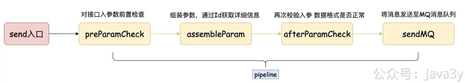

# 3.13 接入层我是这样实现的

**视频介绍讲解**：
[](https://www.yuque.com/u37247843/dg9569/gu9vbe6fk8lo34bm?_lake_card=%7B%22status%22%3A%22done%22%2C%22name%22%3A%22%2314%20%E6%8E%A5%E5%85%A5%E5%B1%82%E4%BD%BF%E7%94%A8%E8%B4%A3%E4%BB%BB%E9%93%BE%E8%AE%BE%E8%AE%A1%E6%A8%A1%E5%BC%8F.mp4%22%2C%22size%22%3A801192844%2C%22taskId%22%3A%22uc7d917a5-3f2a-44fc-be9a-92e0113a320%22%2C%22taskType%22%3A%22upload%22%2C%22url%22%3Anull%2C%22cover%22%3Anull%2C%22videoId%22%3A%22inputs%2Fprod%2Fyuque%2F2023%2F1285871%2Fmp4%2F1687266683851-b0f4c93a-9c36-4a46-aca1-a7dafb25991c.mp4%22%2C%22download%22%3Afalse%2C%22__spacing%22%3A%22both%22%2C%22id%22%3A%22hwegM%22%2C%22margin%22%3A%7B%22top%22%3Atrue%2C%22bottom%22%3Atrue%7D%2C%22card%22%3A%22video%22%7D#hwegM)[](https://www.yuque.com/u37247843/dg9569/gu9vbe6fk8lo34bm?_lake_card=%7B%22status%22%3A%22done%22%2C%22name%22%3A%22%2315%20%E6%8E%A5%E6%94%B6%E5%88%B0%E6%B6%88%E6%81%AF%E5%85%B7%E4%BD%93%E5%81%9A%E4%BA%86%E4%BB%80%E4%B9%88.mp4%22%2C%22size%22%3A973317813%2C%22taskId%22%3A%22u18cb086b-1adc-4214-b3ec-4889dad0918%22%2C%22taskType%22%3A%22upload%22%2C%22url%22%3Anull%2C%22cover%22%3Anull%2C%22videoId%22%3A%22inputs%2Fprod%2Fyuque%2F2023%2F1285871%2Fmp4%2F1687266692353-e5c0b20d-84f4-4d69-abcc-07c015188572.mp4%22%2C%22download%22%3Afalse%2C%22__spacing%22%3A%22both%22%2C%22id%22%3A%22QMTVu%22%2C%22margin%22%3A%7B%22top%22%3Atrue%2C%22bottom%22%3Atrue%7D%2C%22card%22%3A%22video%22%7D#QMTVu)
austin-api接收到请求之后，是会把消息发到MQ的

这样做有什么好处呢？假设某消息的服务超时，austin-api如果是直接调用下发接口服务，那可能会存在**超时**风险，拖垮整个接口性能。MQ在这是为了做异步和解耦，并且在一定程度上抗住业务流量。

对于**绝大多数**发送的消息而言，业务方也不太关心是不是能**在接口调用时**就知道发送结果，并且**某些渠道在发送的时候**也不知道发送的结果（**最后的结果是异步告知的，比如短信和PUSH推送**）

基于以上的原因，引入MQ来承载接口的流量以及做异步，是非常合理的事。

前两天我在博客平台上发了一篇文章《[面试官：系统需求多变时如何设计？](https://mp.weixin.qq.com/s/Js0D8vyJE3AVCbnybH9E2A) 》，有网友在博文下评论了一把：

面试官：我懂了，回去等通知吧。 …… 
leader：小王，咱们那个可变系统的重构计划写的怎么样了？ 
小王：没问题了，**首先按找咱们的业务区分出责任链，然后在每个具体的步骤中部署脚本，上层再增加一个服务编排的接口统一管理**……
leader：听起来有点意思，今天的候选人怎么样？ 
小王：别提了，嘴上说5年经验有大型系统设计，连redis都没用过。这不是快招聘季了吗，招两个实习生工具人进来给我打打下手就够了。
 leader：好，把时间节点和里程碑划分一下，confluence上立项开干吧。
 小王：好嘞。

在这次实现中，我也是用了**责任链模式**。

很多同学拉完代码发现看不懂了，大家可以按照下面的图去梳理下责任链的各个角色。

推荐两篇我写过责任链的**原创**文章：[这就是责任链？](https://mp.weixin.qq.com/s?__biz=MzI4Njg5MDA5NA==&mid=2247486593&idx=1&sn=c6f1ed857d1f60fec8575f19b3e46e6c&chksm=ebd74d80dca0c49616226259e7678a6544a3cbdc5dc5b27f94490640162c953a76886bd09d98&token=2140209384&lang=zh_CN#rd) 和 [责任链的通用代码](https://mp.weixin.qq.com/s?__biz=MzI4Njg5MDA5NA==&mid=2247490601&idx=1&sn=741664a26e8c8d4d3255d19864249bff&chksm=ebd75d28dca0d43e62be820313971e139c24a7fa92b9beb1e91b79a1e3a73b4274acf8a8eec4&token=1936697047&lang=zh_CN#rd)

回到代码实现上，这次我实现的业务的图如下：

代码可看**com.java3y.austin.service.api.impl.config.PipelineConfig**

加这种逻辑**我再也不用在同一个类上写各种if else啦**，只要在某个节点处添加一个Action就完事了。

**可能初看的时候会觉得绕，但理解了之后你会发现这种代码是真的好维护，可扩展性也是杠杠的！**

先来说**前置检查**吧，主要就判断模板ID是否有传入，消息参数是否有传入（对参数的常规检查，如果有问题，直接break掉链路，返回告诉调用方有问题）

接着来看**参数拼装**，这块主要就是通过**模板ID去查整个模板的内容**，然后根据**业务入参**拼装出自己的TaskInfo（任务消息）
可能有同学会有疑问❓：**为什么不能直接用模板的POJO呢？反而需要拼装成TaskInfo？**

其实还是比较好理解的，模板是作为给用户去配置该消息的信息，这是最最原始的信息。但是我们发送的时候是需要做处理的。比如，我要在用户写好的URL链接上拼接参数，我要对**占位符**进行替换真实的值，我要在模板的基础上增加业务ID进而追踪数据 等等等。

说白了：**TaskInfo是基于模板的，在模板的基础上添加了某些平台性的字段（businessId），解析出用户设置的模板而想要发送的真实内容等等**。

在这里，值得要说明的是msgContent该字段的说明。在模板中，该字段我在数据库注释所下的定义是（这个字段存入数据库一定是**JSON**格式的）：
不同的渠道的JSON结构还不一样：
●短信：{"content":"","url":""}
●邮件：{"content":"","subTitle":""}
●Push：{"content":"","subTitle":"","phoneImgUrl":""}
●小程序：{"content":"","pagePath":"" .......}

第一反应，我是想把所有渠道可能用到的字段都定义在TaskInfo下。后来感觉这样不太好看，于是我就定义了各种Model（不同的发送渠道拥有着自己的内容模型）

于是，我在组装TaskInfo的时候利用反射来进行映射，替换占位符则借助的是PropertyPlaceholderHelper

而发送则很简单了，我是直接把TaskInfo序列化为JSON，然后读取的时候再反序列化就好了。

值得注意的是，**因为TaskInfo用的是ContentModel来存储着内容模型，所以我们在序列化JSON的时候需要把"类信息"写进去，不然在反序列的时候是拿不到子类的数据的**。

再回过头看，其实在austin-api层接收到请求之后，在发送消息至MQ之前，在这里的操作都是非常简单。其实是可以把**通用业务**做在这（比如说通用去重/丢弃的功能），但经我考虑之后，还是不太合适。

austin-api算是一个接入层，到目前为止它只是通过id去数据库读取配置，就没有耗时的操作（这意味着他**能承载的并发是极大的**）。

假设通过ID去数据库读取将来存在瓶颈，我们还可以考虑将配置从Redis甚至本地内存里取。这是由**业务**可以决定的：**一个消息模板的变更往往并不多，即便缓存存在强一致性的问题，但就那点点时间是完全可接受的**。

若有收获，就点个赞吧

 

> 原文: <https://www.yuque.com/u37247843/dg9569/gu9vbe6fk8lo34bm>