# 3.14 为什么我要用Kafka

**视频介绍讲解**：
[](https://www.yuque.com/u37247843/dg9569/ztqe4upote5wgf2k?_lake_card=%7B%22status%22%3A%22done%22%2C%22name%22%3A%22%2316%20%E4%BA%86%E8%A7%A3Kafka%E7%9A%84%E5%9F%BA%E7%A1%80.mp4%22%2C%22size%22%3A595960572%2C%22taskId%22%3A%22u5cc911ad-9e78-4a95-a47a-7fa8d12705c%22%2C%22taskType%22%3A%22upload%22%2C%22url%22%3Anull%2C%22cover%22%3Anull%2C%22videoId%22%3A%22inputs%2Fprod%2Fyuque%2F2023%2F1285871%2Fmp4%2F1687267913435-76cc3712-4455-4ad1-9a2e-50ad44a84d79.mp4%22%2C%22download%22%3Afalse%2C%22__spacing%22%3A%22both%22%2C%22id%22%3A%22RGU80%22%2C%22margin%22%3A%7B%22top%22%3Atrue%2C%22bottom%22%3Atrue%7D%2C%22card%22%3A%22video%22%7D#RGU80)

为什么用Kafka的原因其实还是蛮简单的

**1、**我对Kafka比较了解
**2、**它也是个社区活跃，已经比较成熟且资料多
**3、**市面上公司用得非常多的消息队列中间件

## 01、Kafka基础

**（不了解Kafka的同学可以看看，了解的自行跳过吧）**

众所周知，Kafka是一个消息队列，把消息放到队列里边的叫**生产者**，从队列里边消费的叫**消费者**。
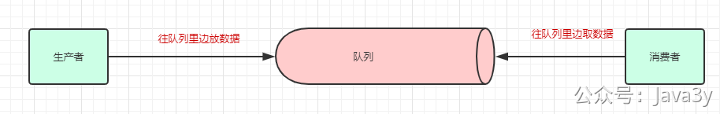
生产者和消费者
一个消息中间件，队列不单单只有一个，我们往往会有多个队列，而我们生产者和消费者就得知道：把数据丢给哪个队列，从哪个队列消息。我们需要给队列取名字，叫做**topic**(相当于数据库里边**表**的概念)
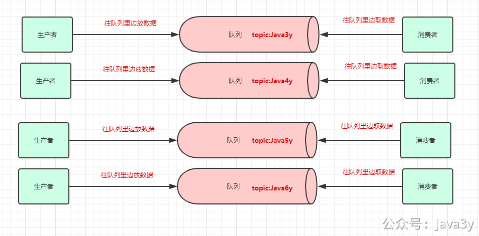
给队列取名字，专业名词叫topic
现在我们给队列取了名字以后，生产者就知道往哪个队列丢数据了，消费者也知道往哪个队列拿数据了。我们可以有多个生产者**往同一个队列(topic)**丢数据，多个消费者**往同一个队列(topic)**拿数据
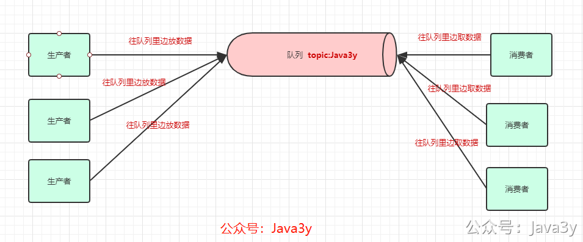
为了提高一个队列(topic)的**吞吐量**，Kafka会把topic进行分区(**Partition**)
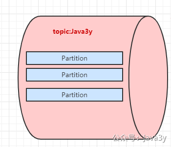
Kafka分区
所以，生产者实际上是往一个topic名为Java3y中的分区(**Partition**)丢数据，消费者实际上是往一个topic名为Java3y的分区(**Partition**)取数据
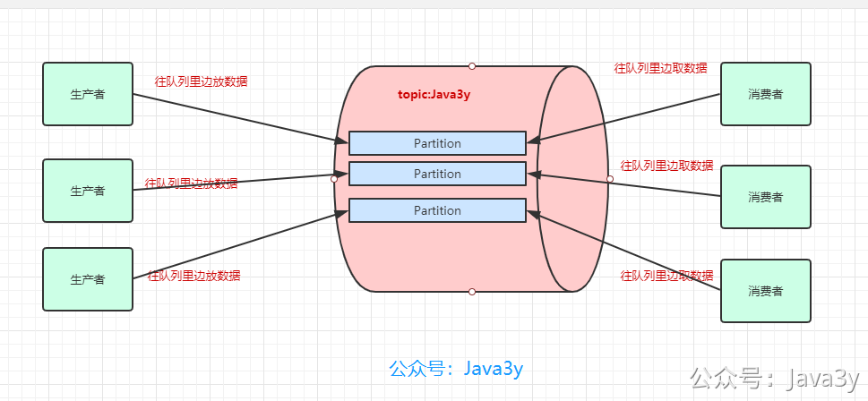
生产者和消费者实际上操作的是分区
一台Kafka服务器叫做**Broker**，Kafka集群就是多台Kafka服务器：
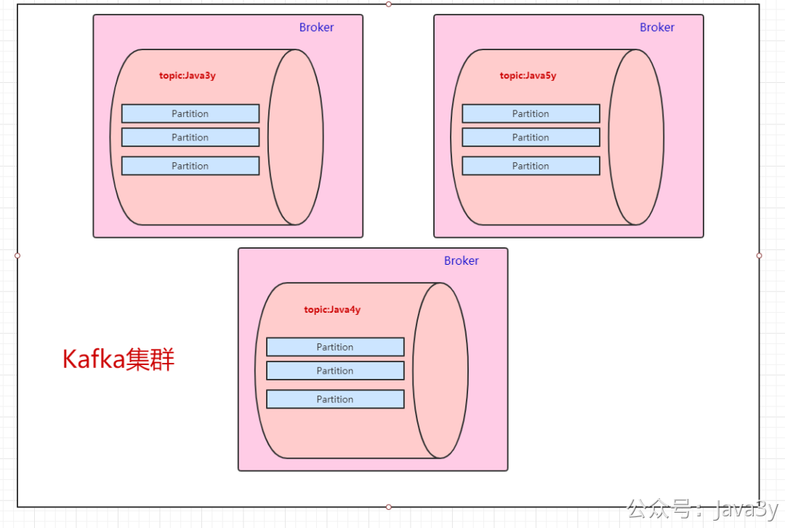
Kafka集群
一个topic会分为多个partition，实际上partition会**分布**在不同的broker中，举个例子：
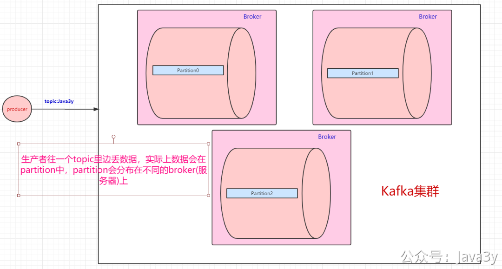
一个生产者丢数据给topic
由此得知：**Kafka是天然分布式的**。

上面balabala地都是讲生产者把数据丢进topic是怎么样的，下面来讲讲消费者是怎么消费的。既然数据是保存在partition中的，那么**消费者实际上也是从partition中取**数据。
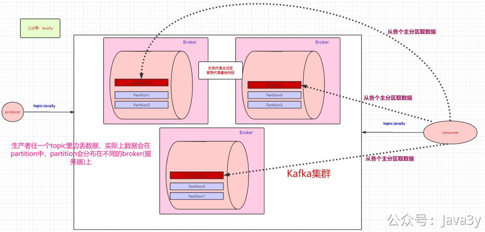
从各个主分区取数据
生产者可以有多个，消费者也可以有多个。像上面图的情况，是一个消费者消费三个分区的数据。多个消费者可以组成一个**消费者组**。
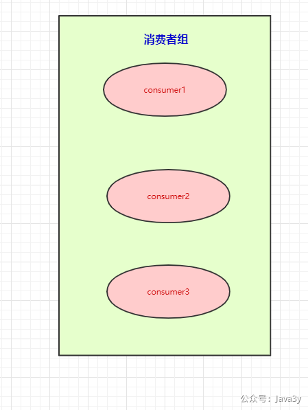
消费者组
本来是一个消费者消费三个分区的，现在我们有消费者组，就可以**每个消费者去消费一个分区**（也是为了提高吞吐量）
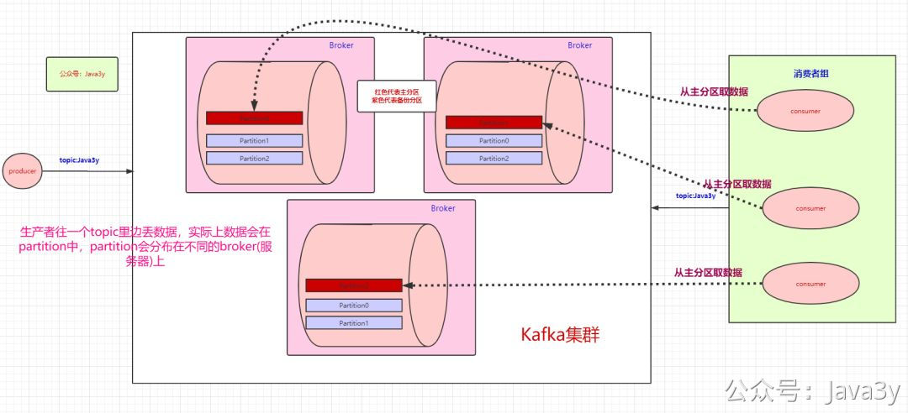
消费者组的每个消费者会去对应partition拿数据

按图上所示的情况，这里想要说明的是：

- 如果消费者组中的某个消费者挂了，那么其中一个消费者可能就要消费两个partition了
- 如果只有三个partition，而消费者组有4个消费者，那么一个消费者会空闲
- 如果多加入一个**消费者组**，无论是新增的消费者组还是原本的消费者组，都能消费topic的全部数据。（消费者组之间从逻辑上它们是**独立**的）

前面讲解到了生产者往topic里丢数据是存在partition上的，而partition持久化到磁盘是IO顺序访问的，并且是先写缓存，隔一段时间或者数据量足够大的时候才批量写入磁盘的。

消费者在读的时候也很有讲究：正常的读磁盘数据是需要将内核态数据拷贝到用户态的，而Kafka 通过调用sendfile()直接从内核空间（DMA的）到内核空间（Socket的），**少做了一步拷贝**的操作。

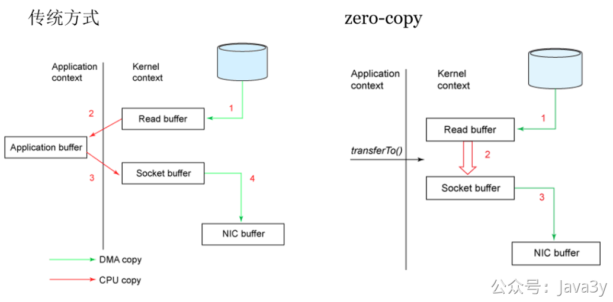
Kafka 读数据 巧妙
有的同学可能会产生疑问：消费者是怎么知道自己消费到哪里的呀？Kafka不是支持**回溯**吗？那是怎么做的呀？

- 比如上面也提到：如果一个消费者组中的某个消费者挂了，那挂掉的消费者所消费的分区可能就由存活的消费者消费。那**存活的消费者是需要知道挂掉的消费者消费到哪了**，不然怎么玩。

这里要引出offset了，Kafka就是用offset来表示消费者的消费进度到哪了，每个消费者会都有自己的offset。说白了offset就是表示消费者的**消费进度**。

在以前版本的Kafka，这个offset是由Zookeeper来管理的，后来Kafka开发者认为Zookeeper不合适大量的删改操作，于是把offset在broker以内部topic(__consumer_offsets)的方式来保存起来。

每次消费者消费的时候，都会提交这个offset，Kafka可以让你选择是自动提交还是手动提交。

既然提到了Zookeeper，那就多说一句。Zookeeper虽然在新版的Kafka中没有用作于保存客户端的offset，但是Zookeeper是Kafka一个重要的依赖。

- 探测broker和consumer的添加或移除。
- 负责维护所有partition的领导者/从属者关系（主分区和备份分区），如果主分区挂了，需要选举出备份分区作为主分区。
- 维护topic、partition等元配置信息
- ….

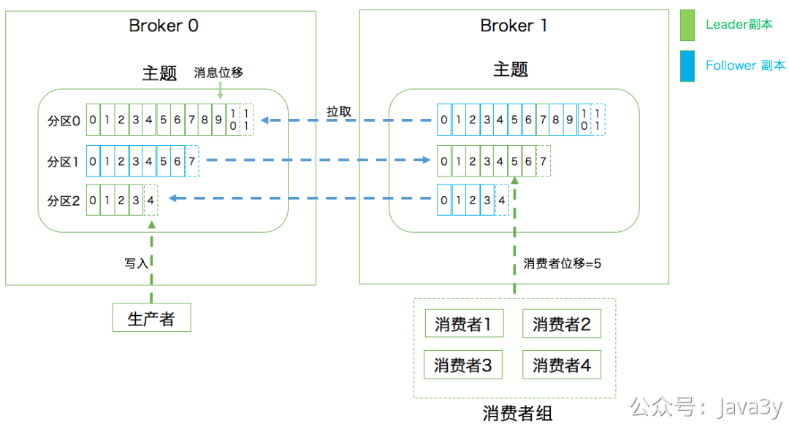
这张图来源胡夕老师的《Kafka核心技术与实战》

**Q：使用消息队列不可能是单机的（必然是分布式or集群）**
**A：**Kafka天然是分布式的，往一个topic丢数据，实际上就是往多个broker的partition存储数据

---

**Q：数据写到消息队列，可能会存在数据丢失问题，数据在消息队列需要持久化(磁盘？数据库？Redis？分布式文件系统？)**
**A**：Kafka会将partition以消息日志的方式(落磁盘)存储起来，通过 顺序访问IO和缓存(等到一定的量或时间)才真正把数据写到磁盘上，来提高速度。

---

**Q：想要保证消息（数据）是有序的，怎么做？**
**A：**Kafka会将数据写到partition，单个partition的写入是有顺序的。如果要保证全局有序，那只能写入一个partition中。如果要消费也有序，消费者也只能有一个。

---

**Q：为什么在消息队列中重复消费了数据**
**A：**凡是分布式就无法避免网络抖动/机器宕机等问题的发生，很有可能消费者A读取了数据，还没来得及消费，就挂掉了。Zookeeper发现消费者A挂了，让消费者B去消费原本消费者A的分区，等消费者A重连的时候，发现已经重复消费同一条数据了。(各种各样的情况，消费者超时等等都有可能…)
如果业务上不允许重复消费的问题，最好消费者那端做业务上的校验（如果已经消费过了，就不消费了）

---

最后自荐**原创**两篇Kafka相关的面试文章：

- [【对线面试官】Kafka基础](https://mp.weixin.qq.com/s/BD_nYDs037kE58Z6SOn0Pw)
- [【对线面试官】使用Kafka会考虑什么问题？](https://mp.weixin.qq.com/s/5L4mODPQZrfwz94qcFNYuQ)

> 原文: <https://www.yuque.com/u37247843/dg9569/ztqe4upote5wgf2k>