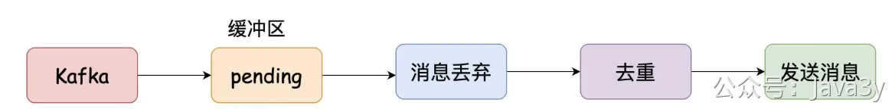

# 3.15 数据隔离（消费层设计）

**视频介绍讲解**：
[](https://www.yuque.com/u37247843/dg9569/tq38f4ptvlecwvly?_lake_card=%7B%22status%22%3A%22done%22%2C%22name%22%3A%22%2317%20SpringBoot%E6%8E%A5%E5%85%A5Kafka.mp4%22%2C%22size%22%3A939941819%2C%22taskId%22%3A%22u38afb945-5670-4b5c-b612-b8b4a238fba%22%2C%22taskType%22%3A%22upload%22%2C%22url%22%3Anull%2C%22cover%22%3Anull%2C%22videoId%22%3A%22inputs%2Fprod%2Fyuque%2F2023%2F1285871%2Fmp4%2F1687268010371-dcc40734-11a3-443d-9277-4e83726aab9c.mp4%22%2C%22download%22%3Afalse%2C%22__spacing%22%3A%22both%22%2C%22id%22%3A%22S5AVU%22%2C%22margin%22%3A%7B%22top%22%3Atrue%2C%22bottom%22%3Atrue%7D%2C%22card%22%3A%22video%22%7D#S5AVU)[](https://www.yuque.com/u37247843/dg9569/tq38f4ptvlecwvly?_lake_card=%7B%22status%22%3A%22done%22%2C%22name%22%3A%22%2318%20%E4%BD%BF%E7%94%A8%E7%BA%BF%E7%A8%8B%E6%B1%A0%E6%B6%88%E8%B4%B9MQ.mp4%22%2C%22size%22%3A340197913%2C%22taskId%22%3A%22uc596f62a-80b2-4480-b39b-48b2d3be7b1%22%2C%22taskType%22%3A%22upload%22%2C%22url%22%3Anull%2C%22cover%22%3Anull%2C%22videoId%22%3A%22inputs%2Fprod%2Fyuque%2F2023%2F1285871%2Fmp4%2F1687268394787-21b512cd-9cf5-48b2-a12f-26ff348d2923.mp4%22%2C%22download%22%3Afalse%2C%22__spacing%22%3A%22both%22%2C%22id%22%3A%22VPggc%22%2C%22margin%22%3A%7B%22top%22%3Atrue%2C%22bottom%22%3Atrue%7D%2C%22card%22%3A%22video%22%7D#VPggc)
今天要聊的是austi-handler模块的**消费数据隔离**，先看下**最初版**的实现方案：

austin-api接收到了请求之后，将请求发往Kafka，topicName为austin。而在austin-handler起了一个groupName名为**austinGroup**监听austin这个topic的数据，进而实现消息发送。

从系统功能性来说，austin项目是可以发送多种类型消息的：短信、微信小程序、邮件等等等

那如果是单个topic单个group的话，有没有想过一个问题：**如果某个发送渠道接口存在异常，超时了，此时会怎么样**？

没错，**消息都会堵住**，因为它们消费同一个topic，用的是同一个消费者。

要破局？很简单。**多topic多group就行啦**。

上面这种能解决所有问题吗？**并不**。即便是同一个渠道，但不同类型的消息发送特性是不一样的。比如我要发push**营销**消息，有可能在某个时刻就要推送4000W的人群。

那这4000W人在短时间内完全发送出去，不太现实。这很可能意味着会影响到**通知类**的push消息

还要破局？很简单。 毕竟我们在设计**消息模板**的时候就已经考虑到这点了。消息模板有msgType字段来标识当前的模板属于哪种类型，**那我们可以根据不同的消息类型再划分对应的group**。

从理论上来说，我们可以为**每种渠道的每种消息类型单独区分一个topic和group**。因为topic间的数据是隔离的，不同的group间消费也是隔离的，那我们消费时肯定是数据隔离的。

不过，我目前的做法是：**单topic多group**。

**消费是隔离的，但生产的topic是共享的**，我认为这样代码会更加清晰和易懂些，**后期如果存在瓶颈了我们可以继续改**。

已经定了通过单topic多group来实现数据隔离。比如，我目前定义了**6个渠道**(im/push/邮件/短信/小程序/微信服务号)和3种消息类型(通知/营销/验证码)，那相当于起了**18**个消费者。

从kafka获取得到消息以后，我**暂定**规划是走几个步骤：**消息丢弃->夜间屏蔽**->**去重**->**真正发送**

从本质上看**去重**和**发送消息**都是**网络IO密集型**。于是，为了**提高吞吐量**，我这边决定消费Kafka后存入缓存，**做一层缓冲区**。

做一层缓冲区可提高吞吐量，但同样会带来别的问题。如：当应用重启时，缓冲区的数据还没消费完，那是不是就会丢失？

缓冲区给我的第一反应是实现**生产者消费者模式**

要实现这种模式，我初想了下挺简单的：消费Kafka的消息作为生产者，然后把数据扔进阻塞队列上，开多个线程去消费阻塞队列的数据就完事了。

后来又想了下，**直接线程池不就完事了吗？线程池不就是生产者和消费者的实现吗**。

于是乎，架构就变成了下图：

 

> 原文: <https://www.yuque.com/u37247843/dg9569/tq38f4ptvlecwvly>