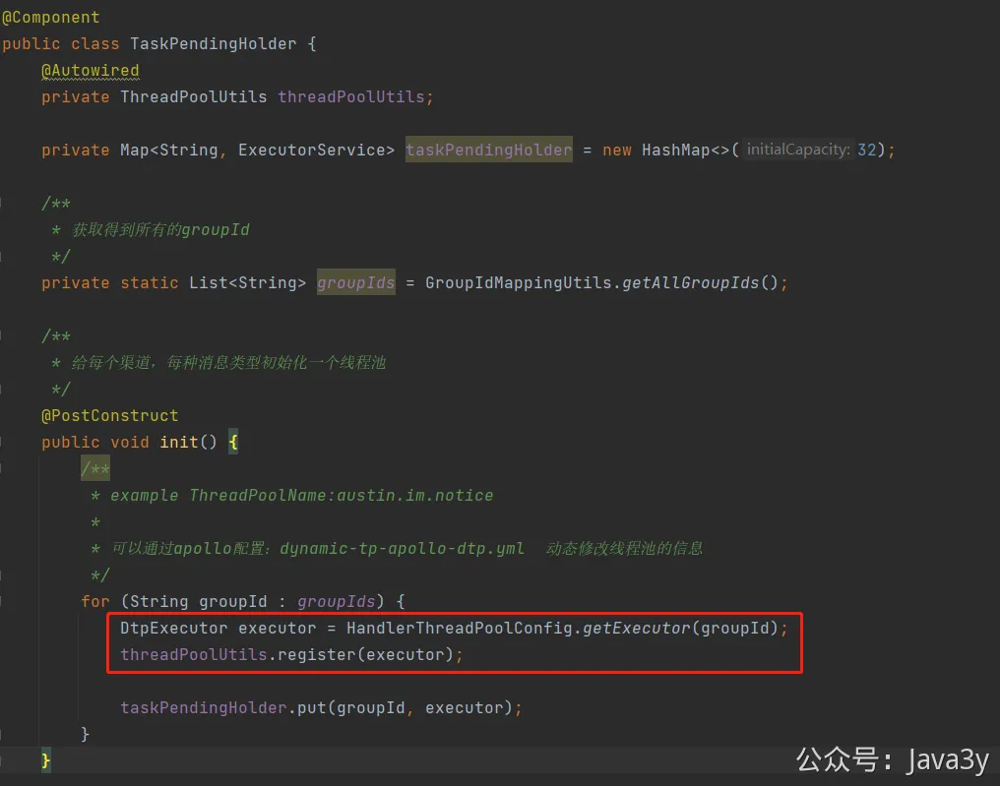

# 3.16 数据隔离（代码实现）

**视频介绍讲解**：
[](https://www.yuque.com/u37247843/dg9569/osgcgu2k2fz3qlz7?_lake_card=%7B%22status%22%3A%22done%22%2C%22name%22%3A%22%2317%20SpringBoot%E6%8E%A5%E5%85%A5Kafka.mp4%22%2C%22size%22%3A939941819%2C%22taskId%22%3A%22u38afb945-5670-4b5c-b612-b8b4a238fba%22%2C%22taskType%22%3A%22upload%22%2C%22url%22%3Anull%2C%22cover%22%3Anull%2C%22videoId%22%3A%22inputs%2Fprod%2Fyuque%2F2023%2F1285871%2Fmp4%2F1687268010371-dcc40734-11a3-443d-9277-4e83726aab9c.mp4%22%2C%22download%22%3Afalse%2C%22__spacing%22%3A%22both%22%2C%22id%22%3A%22S5AVU%22%2C%22margin%22%3A%7B%22top%22%3Atrue%2C%22bottom%22%3Atrue%7D%2C%22card%22%3A%22video%22%7D#S5AVU)[](https://www.yuque.com/u37247843/dg9569/osgcgu2k2fz3qlz7?_lake_card=%7B%22status%22%3A%22done%22%2C%22name%22%3A%22%2318%20%E4%BD%BF%E7%94%A8%E7%BA%BF%E7%A8%8B%E6%B1%A0%E6%B6%88%E8%B4%B9MQ.mp4%22%2C%22size%22%3A340197913%2C%22taskId%22%3A%22uc596f62a-80b2-4480-b39b-48b2d3be7b1%22%2C%22taskType%22%3A%22upload%22%2C%22url%22%3Anull%2C%22cover%22%3Anull%2C%22videoId%22%3A%22inputs%2Fprod%2Fyuque%2F2023%2F1285871%2Fmp4%2F1687268394787-21b512cd-9cf5-48b2-a12f-26ff348d2923.mp4%22%2C%22download%22%3Afalse%2C%22__spacing%22%3A%22both%22%2C%22id%22%3A%22VPggc%22%2C%22margin%22%3A%7B%22top%22%3Atrue%2C%22bottom%22%3Atrue%7D%2C%22card%22%3A%22video%22%7D#VPggc)

在消费端首先看Receiver的代码，该类看起来看简单，就只有一个@KafkaListener注解修饰方法，从Kafka消费出来随后交给pending做处理

我用的是@KafkaListener注解从Kafka拉取消息，而没有用低级的Kafka api，原因无他：**在项目前期无需做到完美，等有瓶颈的时候再想办法就好了**。虽说如此，但我写的时候还是给我带来了不少的麻烦。

**第一个问题**：@KafkaListener是一个注解，从源码注释看它的传值只能够用Spring EL表达式和读取某个配置。但要知道的是，我的目的是想有**多个group消费同一个topic**。而我不可能说给每个group都定义一个消费的方法吧？（**写这种破代码，我都睡不着觉**）

翻了一个晚上技术博客我都没找到方案，甚至还发了个朋友圈吐槽下有没有人遇到过。第二天我仔细翻了下Spring的官方文档，终于给我找到了方案。

[https://docs.spring.io/spring-kafka/reference/kafka/receiving-messages/kafkalistener-attrs.html](https://docs.spring.io/spring-kafka/reference/kafka/receiving-messages/kafkalistener-attrs.html)

**还是官方文档实在**！

有了解决办法了以后，那事情就好办了。既然我是每种消息渠道的每种消息类型都要隔离，那我把这给枚举出来就完事啦！

我的**Receiver**是多例的，那么只要我遍历这个List就好了（初始化消费者在**ReceiverStart**类上）

ReceiverStart的init方法会初始化Receiver消费者（有多少个groupId就会初始化多少个消费者）。而groupIdEnhancer实际上就是**每一个**Receiver初始化的时候做了**动态的切面，**拿到对应的**@KafkaListener注解**，修改其groupId。

解决问题就是：我们的消费者逻辑是一样的，但需要有多个独立的消费者，**通过切面这种方式能让我们不用手动地创建，然后手动指定groupId**。

解决了用@KafkaListener注解动态传入groupId 进而创建多个消费者了之后。

**我又遇到了第二个问题**：Spring有@Aysnc注解来**优雅**实现线程池的方法调用。我之前是没用过@Aysnc注解的，但我看了下原理和使用姿势。我感觉这样挺优雅的（**优雅永不过时**）。

但是用@Aysnc是肯定要**自己创建线程池**，并且我要给每个消费者都创建自己**独有**的线程池。而我不可能说给每个group都定义一个创建线程池的方法吧？（**写这种破代码，我都睡不着觉**）

这次翻了官网和各种技术博客，都没能解决掉我的问题：**在Spring环境下@Async**注解上动态传入线程池实例，以及创建线程池实例时可支持根据条件传参。

最后只能放弃掉@Aysnc注解了，以编程的方式去实现：

下面是TaskPendingHolder的实现（无非就是给每个消费者创建对应的线程池），目前已经做成是**动态线程池**了**《第三章 如何优雅调整线程池参数》**？：

而Task实现又是一个责任链，本来是把操作都列举出来，后来想可能后面还会增加，那就会不断膨胀，于是就改造成责任链了。责任链配置类：**com.java3y.austin.handler.config.TaskPipelineConfig**

由于**资源共用，**股东们是能直接用我的远程服务的：Kafka的Topic是共享的，Group消费者也是共享的，在不修改的前提下，直接使用会带来一个问题。

当同时有两个或以上的股东在本地启动了Austin，那就会争抢消费这个Topic（相当于一个消费者组里起了多个消费者），导致在测试下发的时候可能收不到自己调试的消息（被别的股东抢去了）。

要解决这个问题我第一时间的想法很简单：不同的股东使用不同的group（**相当于每个股东都会有独立的消费者组**），那不就完事了嘛？正好我的groupId生成是依赖渠道的code，改掉code就完事咯。

但这还是有问题的：每个股东有独立的消费者组，意味着每个股东能消费整个topic的所有消息，这又意味着股东会接受到其他股东的测试消息（明明只想要自己测试的消息，却来了一条其他人发的）。

要解决这个问题，除了给每个股东一个独立的topic，那就是**根据tag过滤**啦。

在Kafka实现这种效果，挺简单的：**在发送的时候，把tag写进Kafka的头部，在消费前把非自身tag的消息过滤掉就完事了**。

若有收获，就点个赞吧

 

> 原文: <https://www.yuque.com/u37247843/dg9569/osgcgu2k2fz3qlz7>