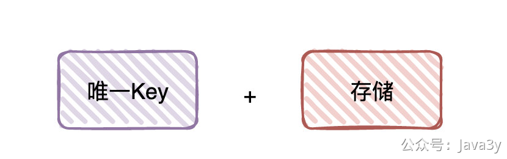

# 3.17 如何实现去重和幂等？

**视频讲解：**
[](https://www.yuque.com/u37247843/dg9569/np0aek0qr4b3ah84?_lake_card=%7B%22status%22%3A%22done%22%2C%22name%22%3A%22%2319%20%E6%8E%A5%E5%85%A5Redis.mp4%22%2C%22size%22%3A298963984%2C%22taskId%22%3A%22u09426896-465e-4a3a-81ee-6658086231d%22%2C%22taskType%22%3A%22upload%22%2C%22url%22%3Anull%2C%22cover%22%3Anull%2C%22videoId%22%3A%22inputs%2Fprod%2Fyuque%2F2023%2F1285871%2Fmp4%2F1687268475665-47f8c5aa-aff2-4dd8-a6db-1ac5499331e7.mp4%22%2C%22download%22%3Afalse%2C%22__spacing%22%3A%22both%22%2C%22id%22%3A%22MxZFC%22%2C%22margin%22%3A%7B%22top%22%3Atrue%2C%22bottom%22%3Atrue%7D%2C%22card%22%3A%22video%22%7D#MxZFC)这个话题我之前在《对线面试官》系列就已经分享过了，这块面试也会经常问到，可以再跟大家一起复习下。戳：[如何实现去重和幂等](https://mp.weixin.qq.com/s/E-pykbZRH5DP2DLvlrbhFQ)

**「幂等」和「去重」的本质：「唯一Key」+「存储」**

唯一Key如何构建以及选择用什么存储，都是业务决定的。「本地缓存」如果业务合适，可以作为「**前置**」筛选出一部分，把其他存储作为「**后置**」，用这种模式来提高性能。

在austin用的是**Redis**，它拥有着**高性能读写**，前置筛选和后置判断均可。

> 原文: <https://www.yuque.com/u37247843/dg9569/np0aek0qr4b3ah84>