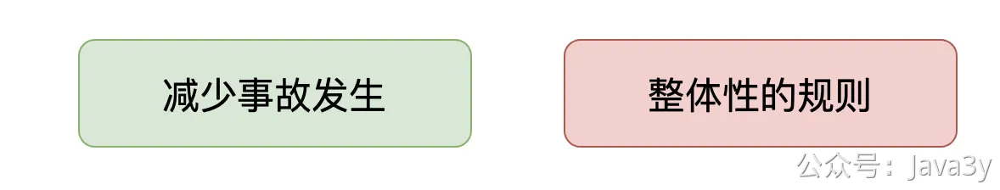
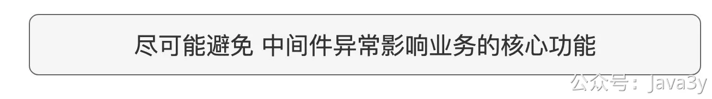

# 3.18 为什么消息推送要去重？

**视频讲解：**
[](https://www.yuque.com/u37247843/dg9569/vxyie135gpllk5xo?_lake_card=%7B%22status%22%3A%22done%22%2C%22name%22%3A%22%2319%20%E6%8E%A5%E5%85%A5Redis.mp4%22%2C%22size%22%3A298963984%2C%22taskId%22%3A%22u09426896-465e-4a3a-81ee-6658086231d%22%2C%22taskType%22%3A%22upload%22%2C%22url%22%3Anull%2C%22cover%22%3Anull%2C%22videoId%22%3A%22inputs%2Fprod%2Fyuque%2F2023%2F1285871%2Fmp4%2F1687268475665-47f8c5aa-aff2-4dd8-a6db-1ac5499331e7.mp4%22%2C%22download%22%3Afalse%2C%22__spacing%22%3A%22both%22%2C%22id%22%3A%22MxZFC%22%2C%22margin%22%3A%7B%22top%22%3Atrue%2C%22bottom%22%3Atrue%7D%2C%22card%22%3A%22video%22%7D#MxZFC)
任何的功能代码实现都离不开业务场景，在聊代码实现之前，先聊业务！平时在做需求的时候，我也一直信奉着：**先搞懂业务要做什么，再实现功能**。

去重该功能在austin项目里我是把它定位是：**平台性功能**。要理解这点很重要！不要想着把业务的各种的去重逻辑都在平台上做，这是不合理的。

这里只能是把**共性**的去重功能给做掉，跟**业务强挂钩**应由业务方自行实现。所以，我目前在这里实现的是：
●5分钟内相同用户如果收到相同的内容，则应该被过滤掉。
○**实现理由**：很有可能由于**MQ重复消费**又或是**业务方不谨慎调用**，导致相同的消息在**短时间内**被austin消费，进而发送给用户。有了该去重，我们可以**在一定程度下**减少事故的发生。
●一天内相同的用户如果已经收到某渠道内容5次，则应该被过滤掉。
○**实现理由**：在运营或者业务推送下，有可能某些用户在一天内会多次收到推送消息。**避免对用户带来过多的打扰**，从总体定下规则一天内用户只能收到N条消息。

不排除随着业务的发展，还有些需要我们去做的去重功能，但还是要记住，我们这里不跟业务**强挂钩**。

当我们的核心功能依赖其他中间件的时候，我们尽可能**避免由于中间件的异常导致我们核心的功能无法正常使用**。比如，redis如果挂了，也不应该影响我们正常消息的下发，它只能影响到去重的功能。

若有收获，就点个赞吧

 

> 原文: <https://www.yuque.com/u37247843/dg9569/vxyie135gpllk5xo>