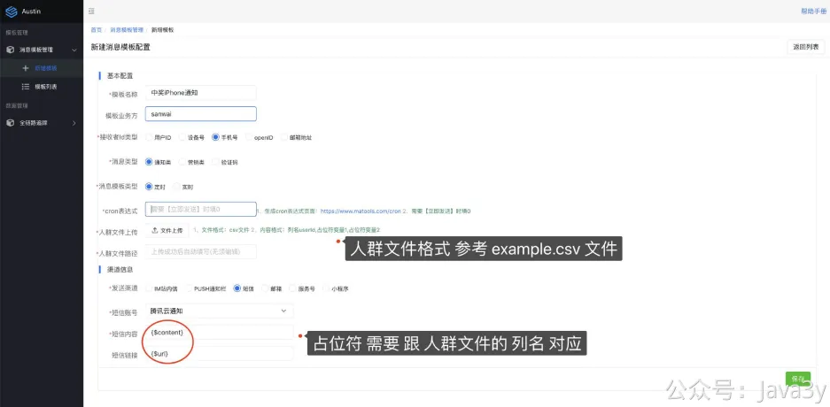
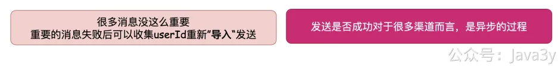

# 3.20 你的去重功能貌似有问题吧

**视频讲解：**
[](https://www.yuque.com/u37247843/dg9569/zpdg3rzhml700m13?_lake_card=%7B%22status%22%3A%22done%22%2C%22name%22%3A%22%2320%20%E5%8E%BB%E9%87%8D%E6%98%AF%E5%A6%82%E4%BD%95%E5%AE%9E%E7%8E%B0%E7%9A%84.mp4%22%2C%22size%22%3A499563975%2C%22taskId%22%3A%22u14d2c09e-2a27-4d43-ac0e-51ffa454df3%22%2C%22taskType%22%3A%22upload%22%2C%22url%22%3Anull%2C%22cover%22%3Anull%2C%22videoId%22%3A%22inputs%2Fprod%2Fyuque%2F2023%2F1285871%2Fmp4%2F1687268636517-bfedaf65-2805-447f-a197-dbd927a937c3.mp4%22%2C%22download%22%3Afalse%2C%22__spacing%22%3A%22both%22%2C%22id%22%3A%22OZANx%22%2C%22margin%22%3A%7B%22top%22%3Atrue%2C%22bottom%22%3Atrue%7D%2C%22card%22%3A%22video%22%7D#OZANx)不知道看完上面的代码你们有没有看出问题，**专心在看的**就很直接看出两个问题：

**●你的去重功能为什么是在发送消息之前就做了？万一你发送消息失败了怎么办？**
**●你的去重功能存在并发的问题吧？假设我有两条一样的消息，消费的线程有多个，然后该两个线程同时查询Redis，发现都不在Redis内，那这不就有并发的问题吗（对于一天内同一个用户频次去重场景）**

没错，上面这两个问题都是存在的。**但是，我这边目前都不会去解决**。

先来看第一个问题：

对于这个问题，我能扯出的理由有两个：

**1**、假设我发送消息失败了，在该系统也不会通过回溯MQ的方式去重新发送消息（**回溯MQ重新消费影响太大了**）。我们完全可以把发送失败的userId给记录下来（**全链路追踪现有的功能，后面会提到**），有了userId以后，我们**手动批量重新发**就好了。这里手动也不需要业务方调用接口，直接通过类似excel的方式导入就好了。

**2**、在业务上，很多发送消息的场景**即便真的丢了几条数据，都不会被发现**。有的消息很重要，但有更多的消息并没那么重要，并且我们**即便在调用接口才把数据写入Redis，但很多渠道的消息其实在调用接口后，也不知道是否真正发送到用户上了**。

再来看第二个问题：

如果我们要仅靠Redis来实现去重的功能，去重的实现需要依赖两个操作：**查询和插入**。查询后如果没有，则需要添加，那查询和插入需要保持**原子性**才能避免并发的问题（**我们的去重功能还要考虑过期时间**）

**如果不上lua脚本**，简单分析下可能用于去重的redis方案：

**1、**Redis **setNx命令 **可以原子性设置值，但是该命令**没有过期时间**的，但我们的去重场景是有时间限制的。

**2、**Redis **incr命令** ，同样没有过期时间，且不能用pipeline批量操作

（这两个命令好像都不太行）

重新把视角拉回到我们**为什么要实现去重功能**：

当存在事故的时候，我们去重能一定保障到**绝大多数**的消息不会重复下发。**对于整体性的规则，并发消息发送而导致规则被破坏的概率是非常的低**。

技术是离不开业务的，有可能我们设计或实现的代码对于**强一致性**是有疏漏的，但如果系统的整体是更简单和高效，且业务可接受的时候，这不是不可以的。

这是一种trade-off**权衡**，要保证数据不丢失和不重复一般情况是需要**编写更多的代码**和**损耗系统性能**等才能换来的。我可以在消费消息的时候实现at least once语义，保证数据不丢失。我可以在消费消息的时候，**实现真正的幂等**，下游调用的时候不会重复。

但这些都是**有条件**的，要实现at least once语义，需要手动ack。要实现幂等，需要用**redis lua**或者把记录写入MySQL构建唯一key并把该key设置唯一索引。在订单类的场景是必须的，**但在一个核心发消息的系统里，可能并没那么重要**。

**No Bug，All Feature!**

若有收获，就点个赞吧

 

> 原文: <https://www.yuque.com/u37247843/dg9569/zpdg3rzhml700m13>