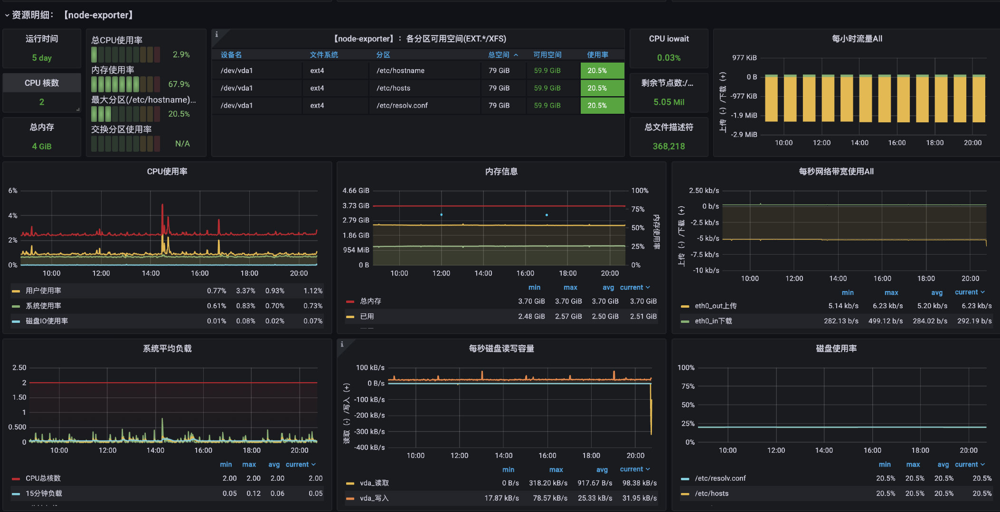
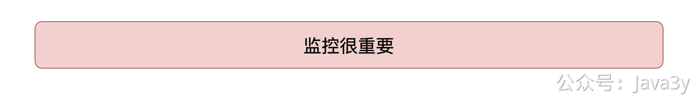
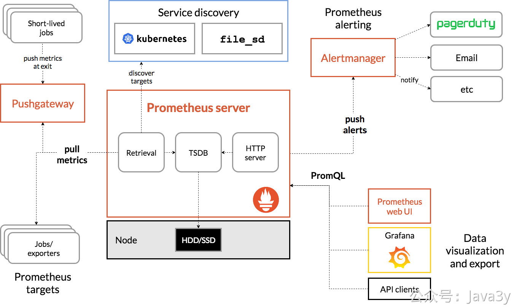
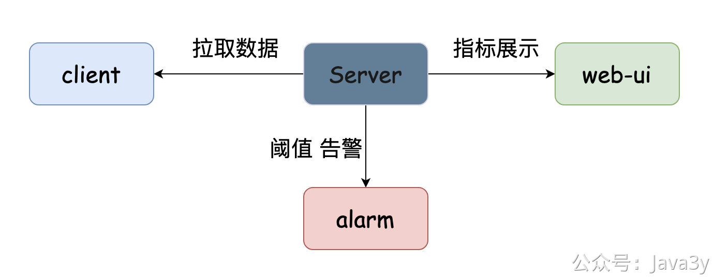
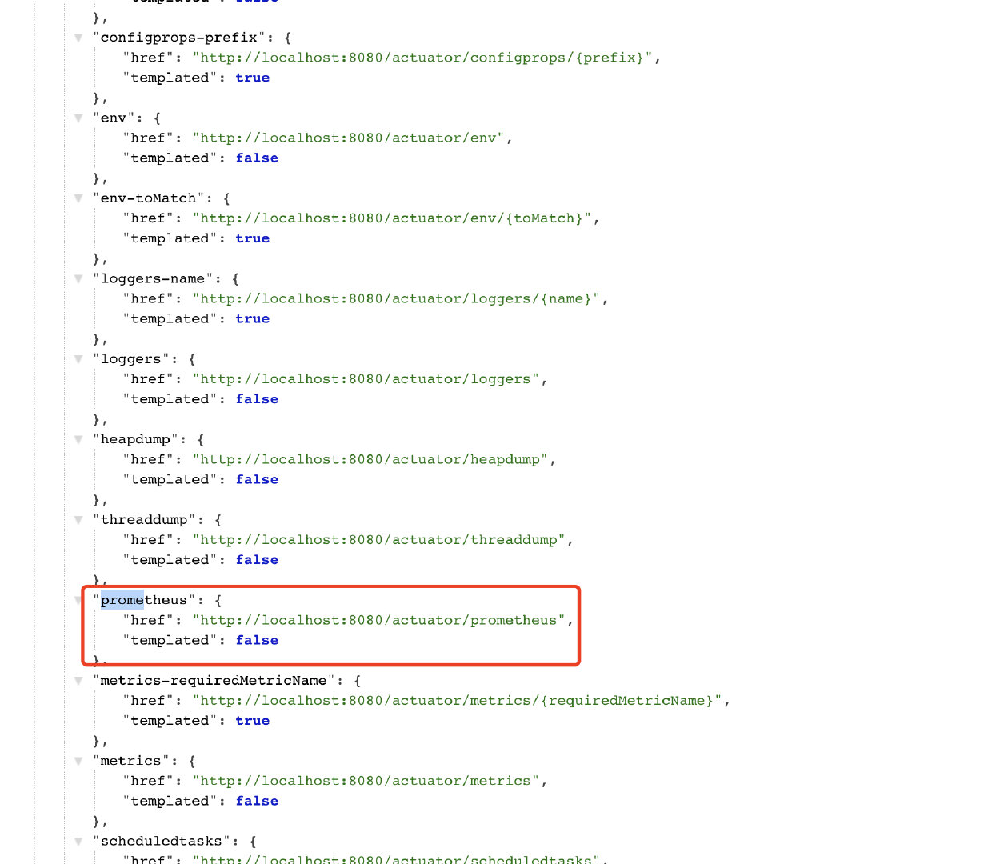
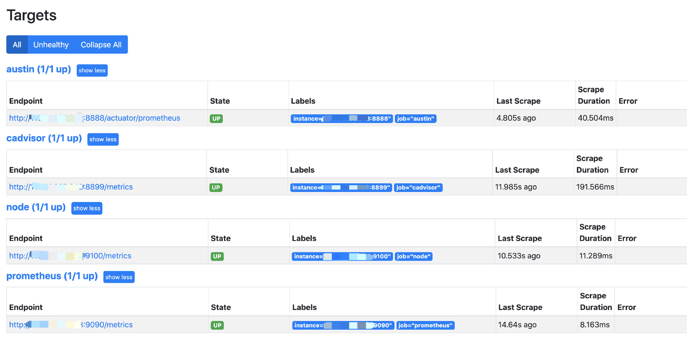
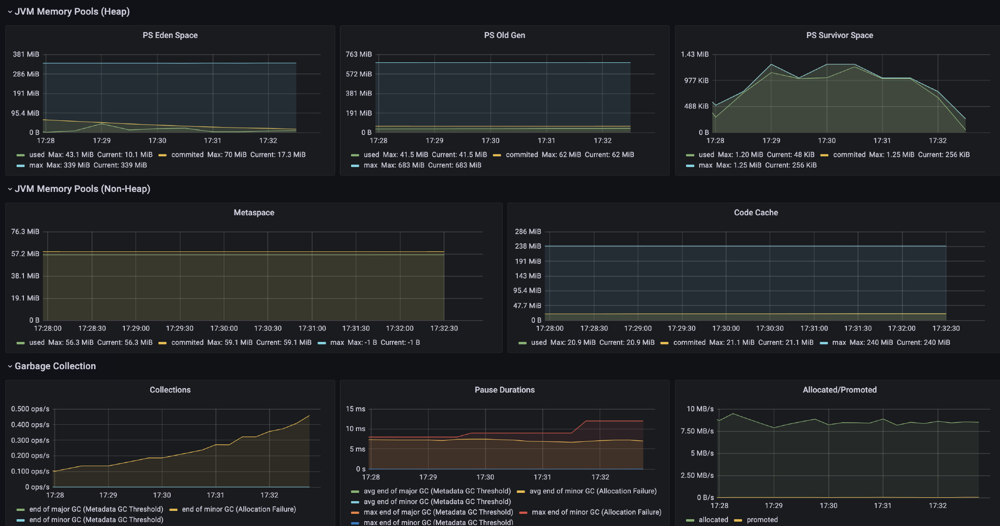
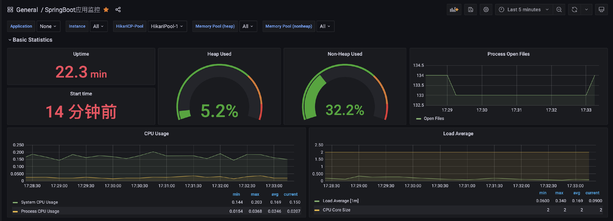
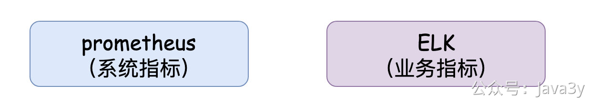

# 3.21 黑炫酷的监控，是用了什么开源工具？

每当同事一瞄你的电脑，发现都是图形化的、黑色的看起来就比较高端的界面：“**嗯，这逼又在找Bug了吧**”

没错，要聊的话题就是**监控**



过去在面试的时候，我记得曾经被问过：“**线上出了问题，你们是怎么排查的？排查的思路是怎么样的？**”
我以前的部门老大很看重**稳定性**，经常让我们梳理系统的上下链路和接口信息。

我想：想要提高系统的稳定性就需要有**完备的监控和及时告警**。


有了监控，出了问题可以快速定位（而不是出了问题还在那里打印日志查找，很多问题都可以通过监控的数据就直接看出来了）。有了监控，我们可以把指标都配置在监控内，无论是技术上的还是业务上的（只不过业务的数据叫做看板，而系统的数据叫做监控）。有了监控我们看待系统的角度都会不一样（全方位理解系统的性能指标和业务指标）

如果你线上的系统还没有监控，**那着实是不太行的了**

监控告警这种想都不用想，直接依赖开源组件就完事了，应该只有大公司才有人力去自研监控告警的组件了。

我选择的是**Prometheus**（普罗米修斯），这个在业内还是很出名的，有很多公司都是用它来做监控和告警。

从prometheus的官网我们可以从文档中找到一张架构图：

我把上面图以我的理解“**不适当地**”简化下

简化完了之后，发现：**还是他娘的人家的图画得好看**

总体而言，prometheus的核心是在于**Server**，我们要接入prometheus的话，实际上就是**开放接口**给prometheus拉取数据，然后在**web-ui**下配置图形化界面进而实现监控的功能。

Prometheus/Grafana/node-exporter/cadvisor的搭建的相关教程看[**搭建项目所需要的服务**](https://www.yuque.com/u1047901/qpbueg/qtlg0q)，这里不再赘述

没想到，通过上面短短的内容已经配置好了**服务器**和**Docker服务**的监控，但还是缺了什么对吧？我们写Java程序的，JVM相关的监控都没搞起来？这怎么能行啊。

**所以，得支棱起来**

配置Java的监控也特别简单，只要我们在项目中多引入两个pom依赖（SpringBoot自带的监控组件**actuator**）

```xml
<!--监控-->
<dependency>
  <groupId>org.springframework.boot</groupId>
  <artifactId>spring-boot-starter-actuator</artifactId>
</dependency>
<!--适配prometheus-->
<dependency>
  <groupId>io.micrometer</groupId>
  <artifactId>micrometer-registry-prometheus</artifactId>
</dependency>
```

然后在配置文件上加上对应的配置（开启监控并可以让prometheus拉取配置）

```yaml
# 监控配置  TODO
management:
  endpoint:
    health:
      show-details: always
    metrics:
      enabled: true
    prometheus:
      enabled: true
  endpoints:
    web:
      exposure:
        include: '*'
  metrics:
    export:
      prometheus:
        enabled: true
```

当我们启动服务后，访问`/actuator`路径就能看到一大堆输出的指标了，包括prometheus的



能看到这些指标被打印了，说明我们程序接入已经完成了，剩下的就是通过prometheus来采集应用的指标了。

要让prometheus采集到Java应用的数据，其实就是改下对应的配置文件就完事了。在前面写好的的`prometheus.yml`文件下添加相关的配置信息：

```yaml
  - job_name: 'austin'
    metrics_path: '/actuator/prometheus' # 采集的路径
    static_configs:
    - targets: ['ip:port'] # todo 这里的ip和端口写自己的应用下的
```

我们访问：`ip:9090/targets`这个路径下，能看到现在prometheus能采集到的端点有哪些，看到都是自己所配置的状态为`up`，那就说明正常了。



那我们继续在Grafana配置对应的监控就好啦。这里我选用了`4701`模板的JVM监控和`12900`SpringBoot监控，可以简单看下他们的效果：





## 
在我个人的理解下：prometheus是每隔N秒（可配置）去拉取暴露的数据，而在界面上配置的可视化也是按N秒（可配置）去执行一次Query。基于这种架构下，我们是很难得出某一时刻（秒）对应的数值。

所以在prometheus体系下，它只能看到一个**时间段内**的值，这对于QPS和RT这些指标并不太友好。

从上面我配置了docker的监控、服务器的监控、SpringBoot应用程序的监控。但可以发现的是，这大多数都是**系统的指标**监控。有的小伙伴可能就会问了："**呀？你不是说有业务监控吗？咋不见你弄？**"

我们也是可以实现**自定义指标**监控给到prometheus进行采集的，但如果系统本身如果接入了类**ELK**的系统，那我们更偏向于把**业务指标**数据在ELK上做掉。毕竟ELK面向的是**日志数据**，只要我们记录下了日志就可以把日志数据清洗出来做业务指标面板监控。



> 原文: <https://www.yuque.com/u37247843/dg9569/suh0wk7d3y98a1mk>