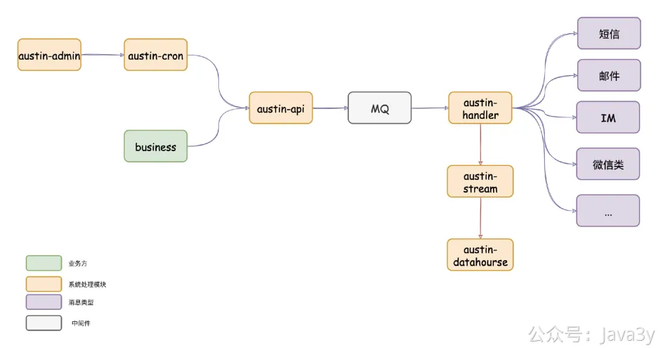
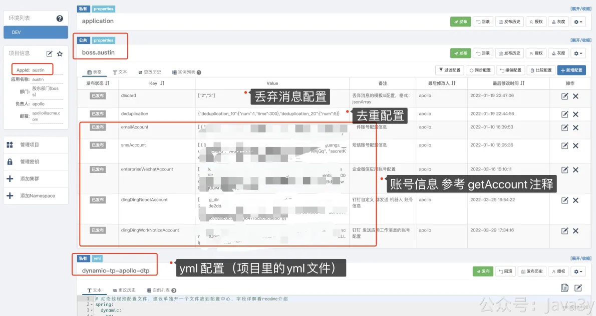
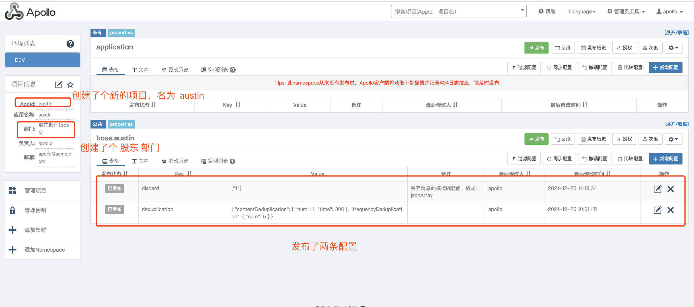
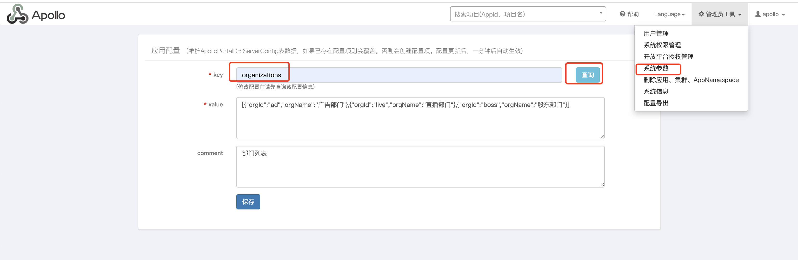
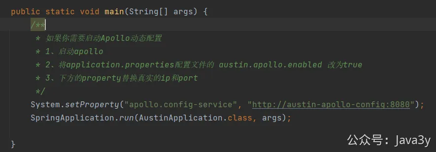
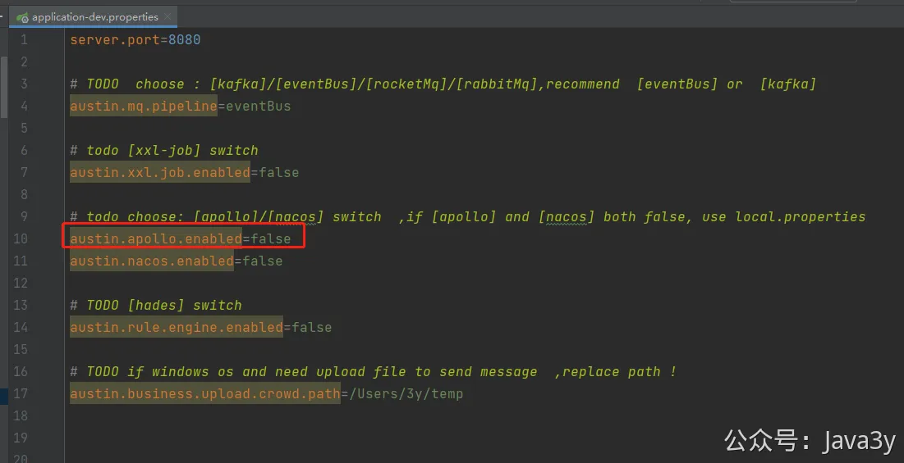

# 3.22 什么是分布式配置中心

**视频讲解：**
[](https://www.yuque.com/u37247843/dg9569/ndkgfr7ldb8wmdtt?_lake_card=%7B%22status%22%3A%22done%22%2C%22name%22%3A%22%2321%20%E5%88%86%E5%B8%83%E5%BC%8F%E9%85%8D%E7%BD%AE%E4%B8%AD%E5%BF%83.mp4%22%2C%22size%22%3A476548712%2C%22taskId%22%3A%22u0c6c2921-bdbf-4c4d-8201-d586a639634%22%2C%22taskType%22%3A%22upload%22%2C%22url%22%3Anull%2C%22cover%22%3Anull%2C%22videoId%22%3A%22inputs%2Fprod%2Fyuque%2F2023%2F1285871%2Fmp4%2F1690931702189-28bab769-3574-4ed1-afb5-c1881d5fb800.mp4%22%2C%22download%22%3Afalse%2C%22__spacing%22%3A%22both%22%2C%22id%22%3A%22N80RX%22%2C%22margin%22%3A%7B%22top%22%3Atrue%2C%22bottom%22%3Atrue%7D%2C%22card%22%3A%22video%22%7D#N80RX)
## 01、什么是分布式配置中心
在之前我就很早已经提及过：分布式配置中心这种组件在后端就是**标配**的。

要理解分布式配置中心很简单：其实就是把一些配置的信息**分离**于自身的系统，而这些信息又能被应用**实时**获取得到。

要做到上面的**核心功能**并不难，但是作为中间件会需要更多的**配套**服务，包括但不限于
●1、有后台界面供我们修改配置
●2、配置服务如果挂了有相关的容灾逻辑
●3、支持不同环境下的配置信息（我们线上的配置一般是分不同的环境配置不同的值）
●4、相关权限管理（只有负责人才能对配置进行update）
●5、简单易用（有对应的SDK支持或api支持）
●...

有的公司会自研一套这种分布式配置中心的组件，实现了上面我提到的功能。作为个人或者小公司，直接上**开源**的就完事了。**别老想着自研多么美妙，维护成本极大的**。

**02、为什么分布式配置中心**

我们可以把常变动的**配置**信息存放在分布式配置中心上，比如：请求的ip地址、限流值、系统的配置值、各种业务开关等等。

甚至，我老东家的**规则引擎**也是在分布式配置中心的基础上干的，分布式配置中心用到的场景是在是太多了...

就以我们austin项目为例就好了，这期我们要实现**丢弃消息**。没错，你没看错。我们项目的**核心是发消息**，但需要在系统中实现丢弃消息的功能。

austin作为推送平台，它的定位是面向整个公司的所有类型的消息推送。有了这个定位以后，我们很难去保证用这个系统的都是些什么人（自然在这里面就会有**粗心**的）。

从austin的实现架构，我们可以发现的是：**如果瞬间有大批量消息需要被下发时，数据会堵在MQ上等待消费**

我们是在austin-api层实现了判断**模板是否被删除**的校验，但很有可能的是：请求已经全部被austin-api处理完毕了，消息已经积压在MQ了。

是可以在austini-handler再判断一遍模板是否被删除，但很多时候**消息模板的拥有者**并不是想把模板删掉（删掉意味着他们在控制台就看不到该模板的配置消息了），可能他们就只是发错了而已，希望还没下发的消息不再发送而已。

除此之外，我们还得在austin项目实现**白名单**拦截的功能，这功能作用于dev和pre环境。

对于austin项目而言，dev和pre环境跟线上环境其实没有什么本质上的区别。因为最终是下发消息，只要环境能把消息下发到用户手上，那就可以把他当做线上环境在用。

一般业务在正式下发消息之前，都会在dev和pre环境走一遍流程。但我们是很难保证它们的测试一定是正常的，万一业务方就出Bug导致dev/pre环境大批量推送了呢？

所以，我们会在dev/pre环境设置白名单，只有在白名单的内的用户才能收到消息。而白名单的列表我们又可以维护在分布式配置中心上

**PS** :相信大家多多少少都见过很多**推送的事故**（各大厂貌似都有过类似的新闻和经历）。在很大原因上，就是环境混用了。本来想用dev或者pre环境去测试消息下发，不料使用了生产环境。（这种问题一般就需要通过权限和审批的干预了）

像之前的实现的**去重功能**，我最开始是**硬编码**写了具体的**num**和**seconds**值，后来都抽到分布式配置中心上。

....
**03、分布式配置中心 选择**

从我第一天把Apollo写入到austin可能要引入的中间件，就有很多人问我：**为什么选择Apollo**。我还挺纳闷的，怎么就这个中间件问我的特别多呢？分布式配置中心可选择的项目也是蛮多的：

在网上也有很多相关的对比，比如：

| **功能特性**

 | **重要性**

 | **spring-cloud-config**

 | **Apollo**

 | **disconf**

 | **Nacos**

 |
| --- | --- | --- | --- | --- | --- |
| 静态配置管理

 | 高

 | 基于file

 | 支持

 | 支持

 | 支持

 |
| 动态配置管理

 | 高

 | 支持

 | 支持

 | 支持

 | 支持

 |
| 统一管理

 | 高

 | 无，需要github

 | 支持

 | 支持

 | 支持

 |
| 多环境

 | 中

 | 无，需要github

 | 支持

 | 支持

 | 支持

 |
| 本地配置缓存

 | 高

 | 无

 | 支持

 | 支持

 | 支持

 |
| 配置锁

 | 中

 | 支持

 | 不支持

 | 不支持

 | 不支持

 |
| 配置校验

 | 中

 | 无

 | 无

 | 无

 | 无

 |
| 配置生效时间

 | 高

 | 重启生效，或手动refresh生效

 | 实时

 | 实时

 | 实时

 |
| 配置更新推送

 | 高

 | 需要手工触发

 | 支持

 | 支持

 | 支持

 |
| 配置定时拉取

 | 高

 | 无

 | 支持

 | 配置更新目前依赖事件驱动， client重启或者server端推送操

 | 支持

 |
| 用户权限管理

 | 中

 | 无，需要github

 | 支持

 | 支持

 | 支持

 |
| 授权、审核、审计

 | 中

 | 无，需要github

 | 支持

 | 无

 | 支持

 |
| 配置版本管理

 | 高

 | Git做版本管理

 | 界面上直接提供发布历史和回滚按钮

 | 操作记录有落数据库，但无查询接口

 | 界面操作，支持回滚

 |
| 配置合规检测

 | 高

 | 不支持

 | 支持（但还需完善）

 |  | 支持

 |
| 实例配置监控

 | 高

 | 需要结合spring admin

 | 支持

 | 支持，可以查看每个配置在哪些机器上加载

 | 支持

 |
| 灰度发布

 | 中

 | 不支持

 | 支持

 | 不支持部分更新

 | 支持

 |
| 告警通知

 | 中

 | 不支持

 | 支持，邮件方式告警

 | 支持，邮件方式告警

 | 支持

 |

总体来说：Apollo支持的功能齐全、**社区活跃**、中文文档丰富。所以，我就选择了Apollo。**社区活跃太重要了**，当你使用某个框架时出现问题，然后网上一搜，发现都没人有过类似的踩坑记录，这时候头都大了。

之前我就提到过：**技术选型并往往不跟技术挂钩**。如果是**个人项目**，选个社区活跃的，并且该中间件已经被踩了很多坑的，学习它的思想和原理就能**举一反三**。等以后知识面上去了，觉得自己当时脑子进了屎选了个破玩意，切换成本一般也不会有多大。

如果是在公司，如果本身就有类似的中间件，该用什么就用什么，在这基础上修修补补就好了。如果本身没有类似的中间件，那就多点花时间调研，但最后还是离不开**中间件的成熟度和社区活跃度**（也有可能大老板按照以往的习惯一拍板。哎，这就选好了，不伤脑筋）

不过，感兴趣的还是可以多看看对比对比，这类文章在网上很多。

**04、分布式配置中心原理**

我以前的公司是自研的分布式配置中心，我曾经就看过其原理思想。那时候看到公司自研的技术实现是利用**长连接**使配置能实时被客户端监听到。这次引用了Apollo，我也去看了下设计文档，也是通过**长轮询**的方式实现客户端实时感知

推荐大家去读一读，如果对分布式配置中心不太熟悉或者不了解它是什么东西的话。

1、[携程Apollo配置中心架构剖析演进](https://mp.weixin.qq.com/s/-hUaQPzfsl9Lm3IqQW3VDQ)

2、[https://www.apolloconfig.com/#/zh/design/apollo-design](https://www.apolloconfig.com/#/zh/design/apollo-design)

对于这块，我感觉我没什么可讲的，我平白无事也不会去捞源码看（除非特别对某个技术实现感兴趣，想看看人家是怎么实现的）。而Apollo文档这块做得是相当不错了。

我针对性从头读到尾，感觉挺流畅的，貌似不太需要我补充什么内容。

**05、SpringBoot 使用apollo**

搭建Apollo的教程看**《第二章 搭建项目所需要的服务》**节，这里不再赘述

写到这的时候，发现我是真的没啥好写的，我无非也是跟着官方文档弄弄。唯一的好处是我有**现成**的代码，跟着做的同学可以直接复制粘贴就完了。

**1**、引入maven的依赖

**2**、在配置文件上加入apollo的配置信息：

配置的信息是在apollo的后台上新增的（这块大家只要能打开后台，问题就不大了，操作都挺简单的，感觉也没必要看啥文档）

部门的创建其实也是一份"配置"，输入organizations就能把现有的部门给改掉，我新增了boss股东部门，大家都是我的股东。

**3**、在Spring中直接使用ApolloConfig就完了（使用ConfigService简单封装了一层）

还值得一提的是，我们是在云服务器上使用docker部署的apollo的。一般获取姿势配置都是在**内网上**暴露对应的服务地址的，但我们这先体验的，所以可以直接跳过meta server

为了方便使用，直接在启动的时候设置下参数就好了（跟着做的同学可以换下**自己的ip和端口**）

在配置里也需要把apollo的配置打开，设置为true

我在这简单介绍了什么是分布式配置中心，以及分布式配置中心能用来干什么，介绍了如何入门Apollo，使用SpringBoot环境下使用Apollo。

我强烈建议如果不了解分布式配置中心的同学可以从Apollo入手，根据上面给出的链接阅读下他的**架构由来**以及它的**设计理念**。作为一个markdown程序员而言，我觉得写得很不错的了。

对这感兴趣的，也可以深入阅读下源码，看看关键的功能是怎么实现的（这不又是一条学习路径？）

如果公司还没有用到分布式配置中心的，看完文章看看自己的项目有没有相关的场景，可以专研下来接入下（一整个Q的KPI/OKR就有了，不用愁了）

1 人点赞

- 

1

 

> 原文: <https://www.yuque.com/u37247843/dg9569/ndkgfr7ldb8wmdtt>