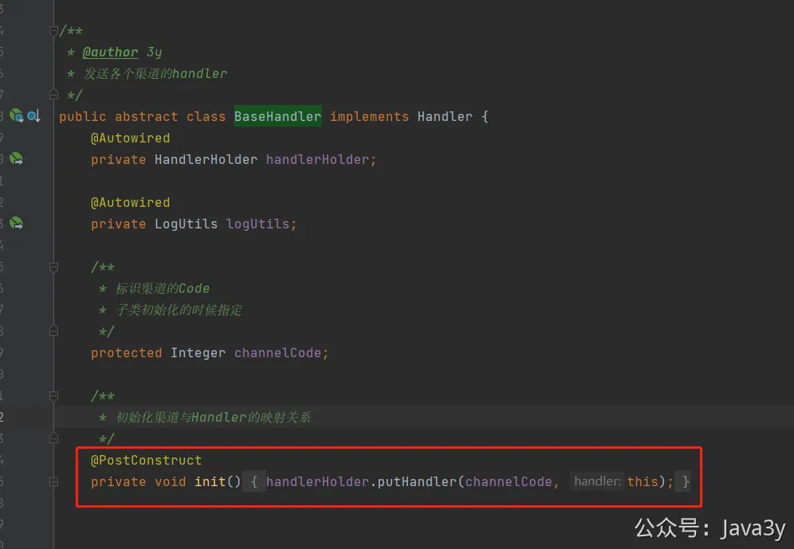
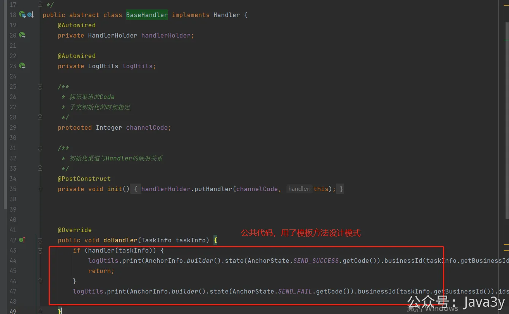

# 3.23 渠道分发器&接入邮件

**视频讲解：**
[](https://www.yuque.com/u37247843/dg9569/tya6m4gobzy7r8ks?_lake_card=%7B%22status%22%3A%22done%22%2C%22name%22%3A%22%2322%20%E6%B8%A0%E9%81%93%E5%88%86%E5%8F%91%E5%99%A8&%E6%8E%A5%E5%85%A5%E7%9F%AD%E4%BF%A1.mp4%22%2C%22size%22%3A282954453%2C%22taskId%22%3A%22ue743d3c2-120a-49ac-9e0e-5be7147329d%22%2C%22taskType%22%3A%22upload%22%2C%22url%22%3Anull%2C%22cover%22%3Anull%2C%22videoId%22%3A%22inputs%2Fprod%2Fyuque%2F2023%2F1285871%2Fmp4%2F1690900708613-82446190-f996-48d5-a62b-2527bb152f1c.mp4%22%2C%22download%22%3Afalse%2C%22__spacing%22%3A%22both%22%2C%22id%22%3A%22J27lo%22%2C%22margin%22%3A%7B%22top%22%3Atrue%2C%22bottom%22%3Atrue%7D%2C%22card%22%3A%22video%22%7D=#J27lo)
关键代码入口：**com.java3y.austin.handler.pending.Task#run**
com.java3y.austin.handler.handler.**BaseHandler** 用了模板方法模式，每一个渠道都要继承**BaseHandler**，渠道实例在初始化的时候，会把自身的Code上传到Map里

BaseHandler会把共性的代码抽取，渠道的具体代码由子类实现（**模板方法设计模式**）

若有收获，就点个赞吧
**
 **

> 原文: <https://www.yuque.com/u37247843/dg9569/tya6m4gobzy7r8ks>