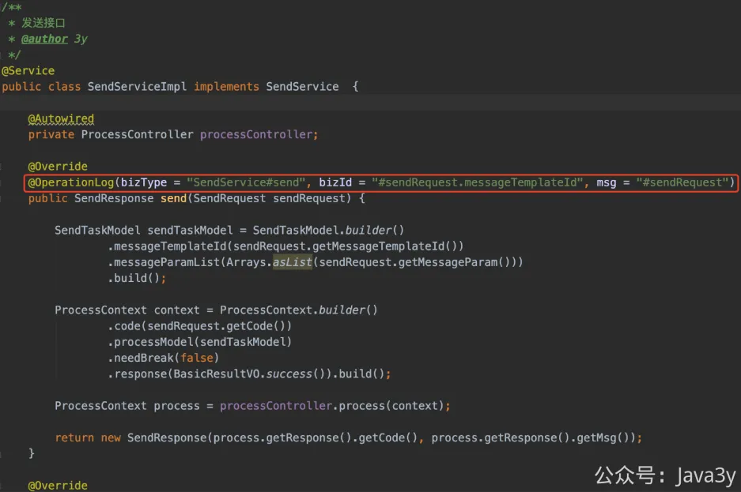
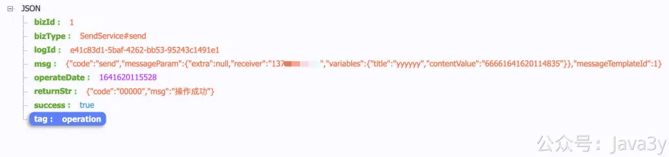
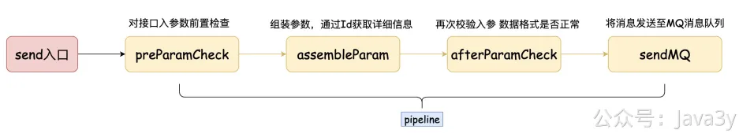

# 3.24 如何让日志打印更加优雅？

**视频讲解：**
[](https://www.yuque.com/u37247843/dg9569/it45gdxosycxq8hr?_lake_card=%7B%22status%22%3A%22done%22%2C%22name%22%3A%228%E6%9C%8823%E6%97%A5.mp4%22%2C%22size%22%3A334558910%2C%22taskId%22%3A%22ub07acdfa-1bda-4815-abd2-e810042aec0%22%2C%22taskType%22%3A%22upload%22%2C%22url%22%3Anull%2C%22cover%22%3Anull%2C%22videoId%22%3A%22inputs%2Fprod%2Fyuque%2F2023%2F1285871%2Fmp4%2F1693750333988-18976039-8496-4811-8f64-629abe127919.mp4%22%2C%22download%22%3Afalse%2C%22__spacing%22%3A%22both%22%2C%22id%22%3A%22H2NIt%22%2C%22margin%22%3A%7B%22top%22%3Atrue%2C%22bottom%22%3Atrue%7D%2C%22card%22%3A%22video%22%7D#H2NIt)日志我在**前面章节**已经聊过了，在之前一直在等我的基友**@蛮三刀酱**他的日志组件库上传到Maven库，好让我使用使用下。在最近，他已经更新了两个版本，已经传到了Maven库了，所以我就来接入了

他写的日志组件库参考了美团的文章进行实现：[如何优雅地记录操作日志？](https://mp.weixin.qq.com/s/JC51S_bI02npm4CE5NEEow) 强烈建议先阅读阅读，会对你有帮助的

这个组件库做的事情就是使用**注解**的方式来打印日志信息，并支持**SpEL解析**、**自定义上下文**以及**自定义函数**。它支持的东西听起来很牛逼，但说白了就是**让记录日志的方式做得更装逼**。

我们写个破代码还能装逼，这谁受得了！这谁顶得住！

现在我已经把注解在方法上定义了，当该方法被调用时，它打印了以下的日志：

看起来很好用，对不对？通过一个注解，我就能把**方法的入参**信息打印出来，有bizType和bizId给我们自定义，那就可以很方便地**定位**出打印日志的地方了，并且他还**贴心**把response返回值也输出到日志上。

至少在这个接口上，这非常符合我这个场景的需求，我们再通过一张图稍微重温下这个send接口到底做了什么事：

在**接口层面**打印入参信息以及返回值就能定位到很多问题（**懂的都懂**），使用注解还**不用干扰**到我们正常的业务代码就能打印出这么好的日志信息了（**这个逼是装上了**）

它的实现原理并不复杂，感兴趣的小伙伴可以拉代码自己看看，先看readmd再看代码！！

GitHub：[https://github.com/qqxx6661/logRecord](https://github.com/qqxx6661/logRecord)

总的来说，他通过**SpEL表达式**来读取到#sendRequest入参对象的信息，而注解解析则用的是Spring AOP。至于**自定义上下文**以及**自定义函数**我在这是没用到的，至少在austin项目场景下，我感觉都没什么用。哦，对了，它还能将日志输出到别的管道（MQ）。可惜的是，我这场景也用不到。

在目前的实现下，我**就只有这个接口**能用到该组件，我承认他在某些场景是很好用。

但它是**有局限性**的：打印的日志信息跟**方法参数强相关**：如果要打印**方法参数以外的变量**那需要用到上下文Context 或者自定义函数 。自定义函数的使用姿势是有局限性的，我们并不能把日志所涉及的变量都抽取到某函数上。如果用上下文Context的话，还是得**嵌入业务代码**里，那为啥不直接拼装好日志打呢？

我一度怀疑是不是我的使用姿势不对，跟基友探讨了下，我的应用场景下**还得自己抽取LogUtils**进行日志打印。

若有收获，就点个赞吧

 

> 原文: <https://www.yuque.com/u37247843/dg9569/it45gdxosycxq8hr>