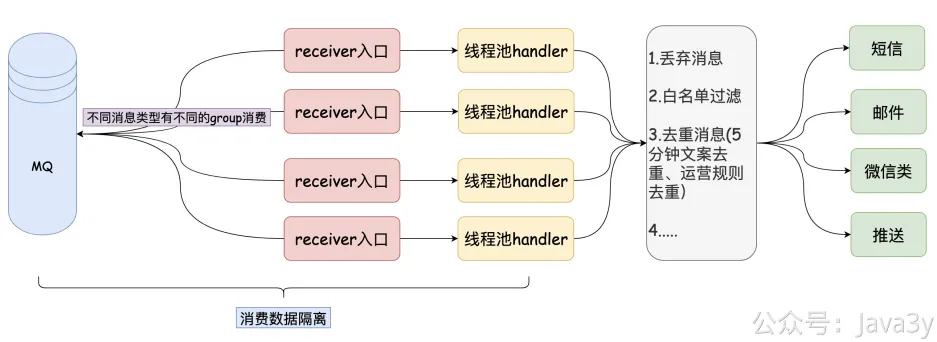
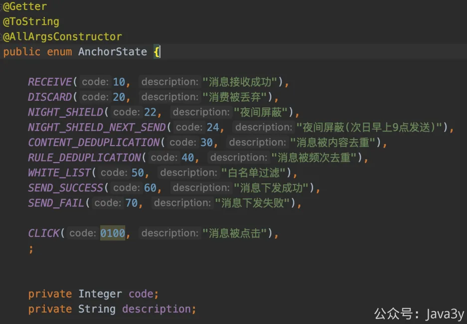
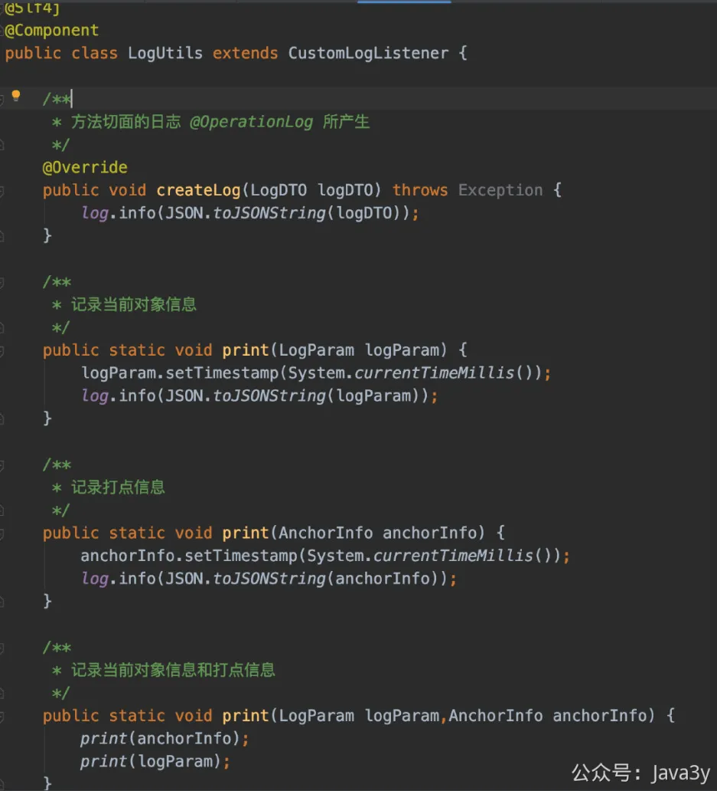
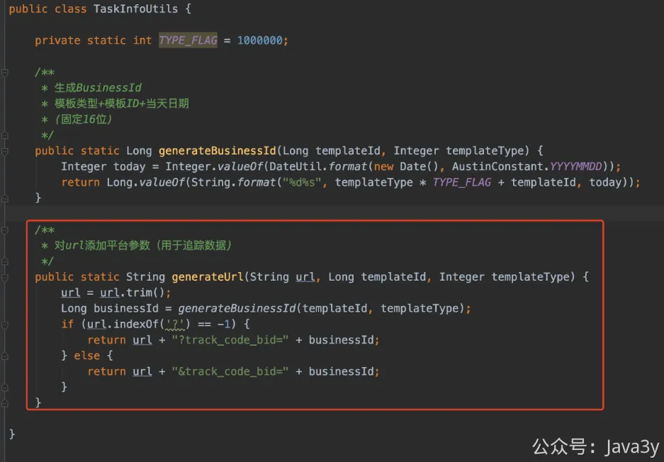

# 3.25 实现数据链路追踪要做什么准备？

**视频讲解：**
[](https://www.yuque.com/u37247843/dg9569/lkzeu6b4tqpe6rh1?_lake_card=%7B%22status%22%3A%22done%22%2C%22name%22%3A%22%2324%20%E5%85%A8%E9%93%BE%E8%B7%AF%E8%BF%BD%E8%B8%AA%E5%9F%BA%E7%A1%80%EF%BC%88%E5%9F%8B%E7%82%B9%EF%BC%89.mp4%22%2C%22size%22%3A408876705%2C%22taskId%22%3A%22u9af9db82-8cbe-46f9-b8bd-bf74ff3181d%22%2C%22taskType%22%3A%22upload%22%2C%22url%22%3Anull%2C%22cover%22%3Anull%2C%22videoId%22%3A%22inputs%2Fprod%2Fyuque%2F2023%2F1285871%2Fmp4%2F1693750344532-0ec1f4a0-e9cb-4b20-8f66-1fecd6d38d81.mp4%22%2C%22download%22%3Afalse%2C%22__spacing%22%3A%22both%22%2C%22id%22%3A%22lGTZ5%22%2C%22margin%22%3A%7B%22top%22%3Atrue%2C%22bottom%22%3Atrue%7D%2C%22card%22%3A%22video%22%7D#lGTZ5)从之前打印的日志以及能很快地排查出**接入层**的问题了，其实重头戏其实是在**处理层**上，回顾下处理层目前做的事情：

在处理层上会有不少的**平台过滤规则**，这些过滤规则大多都不是针对于消息模板的，而是针对于userId(接收者)的。在这个处理过程中，记录下**每个消息模板中的每个用户的执行情况**就尤其重要了。

**1**、定位和排查问题。如果客户反馈用户收不到短信，一般情况下都在这个处理的过程中导致的（可能是被去重，可能是调用接口出问题）

**2**、对模板执行的整体链路数据分析。一个消息模板一天发送的量级，中途被**每个规则**过滤的量级，成功下发的量级以及消息最后被点击的量级。**除了点击数据，其他的数据都来源处理层**

基于上面的背景，我设计了一套埋点的规则，在处理**关键链路上**打上对应的点位📝

目前点位的信息还是不全的，随着系统的完善和接入各个渠道，这里的点位信息还会继续增加，只要我们认为有哪些地方是需要记录下来的，就可以增加。

可能看到这里你会觉得有些抽象，我请求一次接口打印下日志就容易懂啦：

我打印日志的核心逻辑是：
●在**入口侧**（这里包括接口的入口以及刚消费Kafka的入口）需要打印出原始的信息。原始信息有了，才好对问题进行定位和排查，至少帮助我们复现
●在处理过程中使用**某个标识**来标明处理的过程（10代表成功消费Kafka，20代表该消息已经被丢弃...)，并且**日志的格式是统一**的这样后续我们可以统一清洗该日志信息

至于打日志的过程就很简单了，只要抽取一个LogUtils类就好咯：

那对于点击是怎么追踪的呢？其实也好办，在**下发的链接**上拼接businessId就好了。只要我们能拿到点击的数据，在链接上就可以判断是否存在track_code_bid字符，进而找到是哪个用户点击了哪个模板消息。

无论是打点日志还是原始日志，businessId会跟随着消息的生命周期始终。而businessId的构成只是通过**消息模板内容+时间**而成

现在已经打印出对应的数据链路信息了，但这是不够的，这只是将数据链路信息写到了服务器的本地上，还需要考虑以下的情况：

**1**、运行应用的服务器一般是集群，日志数据会记录到不同的机器上，排查和定位问题只能登录各个服务器查看

**2**、链路的数据需要**实时**，通过提供Web后台的界面功能快速让**业务方自助**查看整个流程

**3**、链路的数据需要离线保存用于对数据的分析以及留备份（本地日志往往存放不超过30天）

这些在后面的文章都会有，代码都已经实现了，继续往下看吧

若有收获，就点个赞吧

 

> 原文: <https://www.yuque.com/u37247843/dg9569/lkzeu6b4tqpe6rh1>