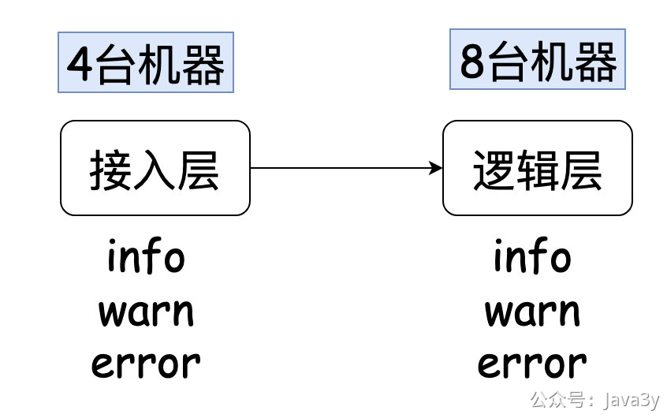
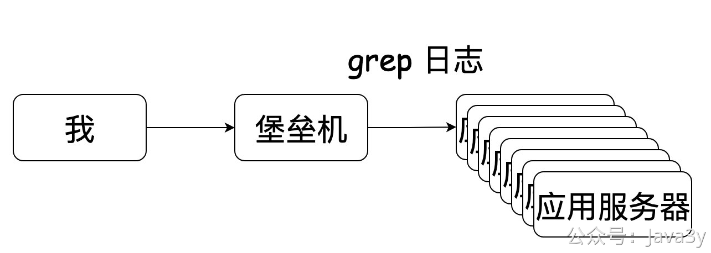
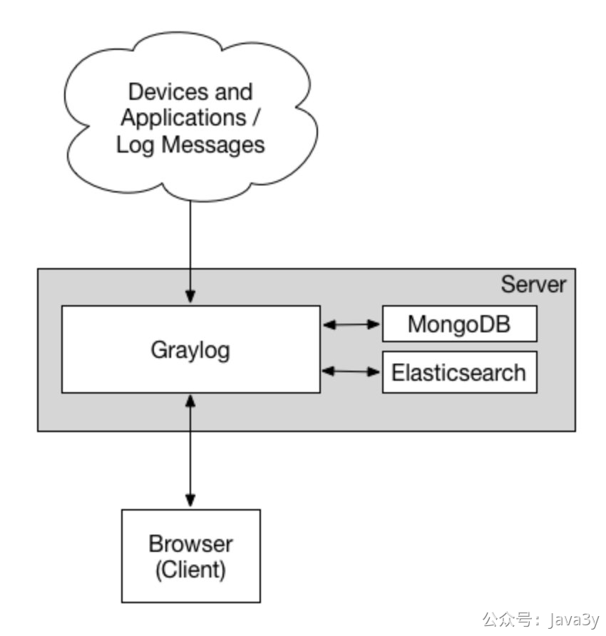
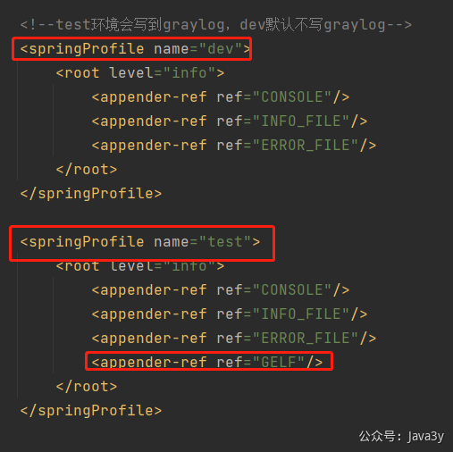
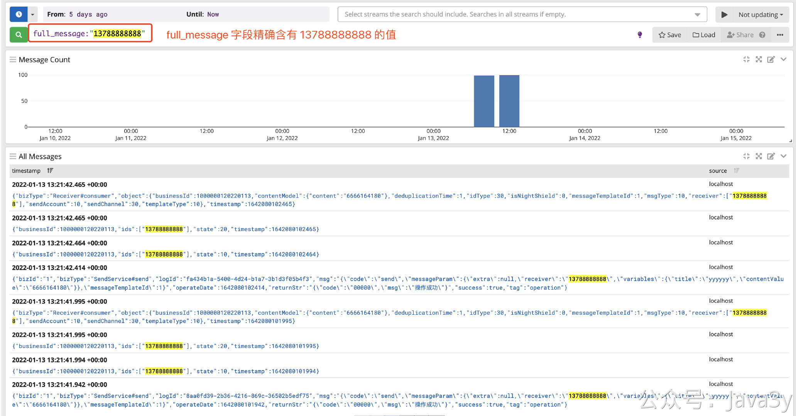
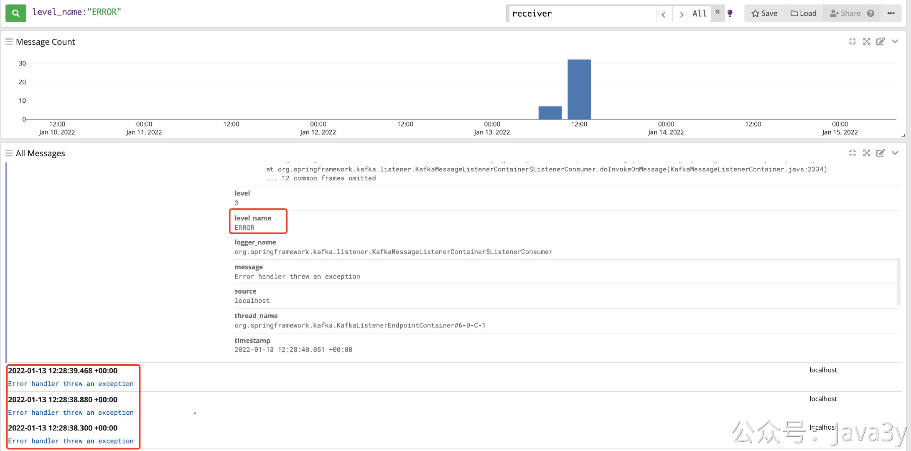
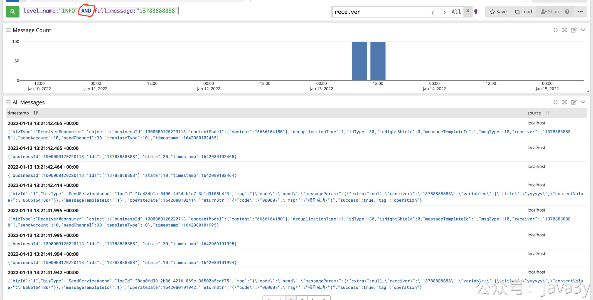

# 3.26 什么是分布式日志组件？

在上一节，末尾遗留了TODO：**运行应用的服务器一般是集群，日志数据会记录到不同的机器上，排查和定位问题只能登录各个服务器查看。**

我分享下我以前负责过的一个系统，它的架构如下：

每次当我查问题的时候，我可能能把问题初步定位在**逻辑层**，但为了能给业务方交代，我需要**给证据**业务方看（日志信息就是铁证）。

一个请求肯定是被这8台机器内的某一台处理，但具体是哪一台，我不知道。所以，我需要上每台机器上grep一把日志，然后才能找出对应的日志证明我的分析。


有的时候，可能**接入层**也需要一起参与进去，就排查一个问题，人都傻了了（翻看日志的时间占用了太久了）。

后来啊，看了同事的骚操作（在item2 编写脚本：**快速登录堡垒机**（免去输入账号和密码信息），根据应用服务器数量来切割窗口并且切换到对应的日志目录）。说白了就是**一键登录**多台应用服务器。嗯，这查日志的速度比起以前又快了好多。


再后来，公司运维侧又主力推在**Web页面**上登录应用服务器（**自动登录堡垒机**），这能省去编写脚本（**支持批量操作**）。但从当时的体验上，没有用item2访问得流畅（总感觉卡卡的）。

不过还有问题，因为我们在很多时候是不知道在info/warn/error哪个文件下。很多时候只能一个一个文件去查，虽然说可以直接**通配符**一把查，如果日志过大，带来停顿时间也挺烦的。

系统一旦被问到业务问题，查日志的频率实在是太高了。于是我在某个Q规划的时候是想自己把日志信息写入到**搜索引擎**，顺便学习下搜索引擎的知识。然后这个规划被组内的某个大佬看到了，在底下评论：**要不来试试Graylog**？

原来组内本身就在维护了一个**日志框架**，只是我不知道...于是我接入了**Graylog日志**，工作效率杠杠提高了，**凭借这个事情吹了一个Q**。


自从接入了之后，我就没登录过应用服务器了，有次差点连grep都不会写了。


说起**ELK**，即便没用过肯定也听说过这玩意了，在后端是真的流行。这次austin接入一个比较轻量级的ELK框架：**Graylog**

这个框架我感觉蛮好用的，作为**使用方**接入起来**异常简单**（我估摸运维应该也挺简单的，很多用Graylog是直接发UDP到Server，不用在机器上装agent收集日志）

**一图胜十言**：

官方文档：[https://docs.graylog.org/docs](https://docs.graylog.org/docs)

据我了解，有相当多的企业使用它来**查看日志和业务监控告警**

还记得我们austin项目使用的日志框架吗？没错，就是logback。我们要把日志数据写入Graylog很简单，只需要两步：

**1**、引入依赖：
```xml
<dependency>
  <groupId>de.siegmar</groupId>
  <artifactId>logback-gelf</artifactId>
  <version>3.0.0</version>
</dependency>
```
**2**、在logback.xml配置graylog相关的信息：
```xml
<appender name="GELF" class="de.siegmar.logbackgelf.GelfUdpAppender">
  <!-- Graylog服务的地址 -->
  <graylogHost>ip</graylogHost>
  <!-- UDP Input端口 -->
  <graylogPort>12201</graylogPort>
  <!-- 最大GELF数据块大小（单位：字节），508为建议最小值，最大值为65467 -->
  <maxChunkSize>508</maxChunkSize>
  <!-- 是否使用压缩 -->
  <useCompression>true</useCompression>
  <encoder class="de.siegmar.logbackgelf.GelfEncoder">
    <!-- 是否发送原生的日志信息 -->
    <includeRawMessage>false</includeRawMessage>
    <includeMarker>true</includeMarker>
    <includeMdcData>true</includeMdcData>
    <includeCallerData>false</includeCallerData>
    <includeRootCauseData>false</includeRootCauseData>
    <!-- 是否发送日志级别的名称，否则默认以数字代表日志级别 -->
    <includeLevelName>true</includeLevelName>
    <shortPatternLayout class="ch.qos.logback.classic.PatternLayout">
      <pattern>%m%nopex</pattern>
    </shortPatternLayout>
    <fullPatternLayout class="ch.qos.logback.classic.PatternLayout">
      <pattern>%d - [%thread] %-5level %logger{35} - %msg%n</pattern>
    </fullPatternLayout>

    <!-- 配置应用名称（服务名称），通过staticField标签可以自定义一些固定的日志字段 -->
    <staticField>app_name:austin</staticField>
  </encoder>
</appender>
```
在这个配置信息里，唯一要改的也只是**ip**的地址，到这里接入就完毕了，我们再打开控制台，就能看到日志的信息啦。

目前austin配置的test环境才会把日志发送到graylog，想要试试效果的，可以在dev环境加上配置；


懂点GrayLog查询语法：这块我日常来来去去其实就用几个，我来展示下我平时用的吧。如果觉得不够，再去官网文档捞一把就完事了：[https://docs.graylog.org/docs/query-language](https://docs.graylog.org/docs/query-language)

**1**、根据字段精确查询：full_message:"13788888888"

**2**、查询错误日志信息：level_name:"ERROR"

**3**、组合多字段查询：level_name:"INFO" AND full_message:"13788888888"

在接入的时候，仔细的小伙伴可能会发现我这边在Input的时候选择的是GELF，然后在引入Maven依赖的时候也有GELF的字样。那GELF是啥意思呢？

这块在官网也有给出对应的解释：**The Graylog Extended Log Format (GELF) is a log format that avoids the shortcomings of classic plain syslog**
详细资料：[https://docs.graylog.org/docs/gelf](https://docs.graylog.org/docs/gelf)

GELF是一种日志格式，能避免传统意义上的 syslogs的一些问题，**而我们引入的Maven依赖则是把日志格式化成GELF格式然后append到GrayLog上**。


## 
之前我好像是在知乎看到过**类似**的一段话：**一个工具或框架使用优秀，就取决于它的入门的难易。如果一个框架要花很长时间才能弄懂，那可能它做得并没那么好**。

我其实不会经常去研究各种使用的框架它的**细节**原理，也不会蒙头就去看源码，没什么必要，**毕竟它没出问题啊**。

像GrayLog这种工具类的框架，如果在公司不是主要的维护者，其实不必太过于纠结他的实现细节，可以从**总体上**把握他的设计思想。

换我建议，真要学习，还得是看它的具体存储（比如Elasticsearch的原理）
**学习就要带有利益点**（学了能提高效率，学了能以后在面试的时候吹


> 原文: <https://www.yuque.com/u37247843/dg9569/wvn0546s5xaeccvl>