# 3.27 纯后端我是如何搭建前端页面？

## 1、我的前端技术

老读者可能知道我是上了大学以后，才了解什么是编程。在这之前，我对编程一无所知，甚至报考了计算机专业之后也未曾了解过它是做什么的。

在大一的第一个学期，我印象中只开了一门C++的编程课（其他的全是数学）。嗯，理所当然，我是听不懂的，也不知道用来干什么。
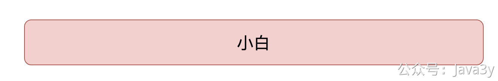

刚进大学的时候，我对一切充满了未知，在那时候顺其自然地就想要进几个社团玩玩。但在众多社团里都找不到我擅长的领域，等快到截止时间了。我又不想大学期间什么社团都没有参加，最后报了两个：乒乓球社团和**计算机协会**。

这个计算机协会绝大多数的人员都来自于计算机专业，再后来才发现这个协会的主要工作就是给人「**重装系统**」，不过这是后话啦。

当时加入计算机协会还需要满足一定的条件：师兄给了一个「**网站**」我们这群人，让我们上去学习，等到国庆回来后看下我们的学习进度再来决定是否有资格加入。

那个网站其实就是对HTML/CSS/JavaScript的**入门教程**，是一个国外的网站，具体的地址我肯定是忘了。不过那时候，我国庆闲着也没事干，于是就开始学起来了。我当时的进度应该是学到CSS，能简单的页面布局和展示图片啥的

刚开始的时候，觉得蛮有趣的：**我改下这个代码，字体的颜色就变了，图片就能展示出来了。原来我平时上网的网站是这样弄出来的啊！**（比什么C++有趣多了）

国庆后回来发现：考核啥的并不重要，只要报名了就都通过了。

有了基本的认知后，我对这个也并不太上心，没有持续地学下去。

再后来，我实在是太无聊，就开始想以后毕业找工作的事了，自己也得在大学充实下自己，于是我开始在知乎搜各种答案「**如何入门编程**」。

在知乎搜了各种路线并浪费了大量时间以后，我终于开始看视频入门。我熬完了JavaSE基础之后，我记得我是看方立勋老师入门的JavaWeb，到前端的课程以后，我觉得前端HTML/CSS/JavaScript啥的都要补补，于是又去找资源学习（**那时候信奉着技多不压身**）。

印象中是看韩顺平老师的HTML/CSS/JavaScript，那时候还手打代码的阶段，把我看得一愣一愣的（IDE都不需要的）。随着学习，发现好像还得学AJAX/jQuery，于是我又去找资源了，不过我已经忘了看哪个老师的AJAX和jQuery课程。

在这个学习的过程中，我曾经用纯HTML/CSS/JavaScript跟着视频仿照过某某网站，在jQuery的学习时候做过各种的轮播图动画。还理解了margin和padding的区别。临近毕业的时候，也会点BootStrap来写个简单的页面（丑就完事了）

等我进公司了以后，技术架构前后端是分离的，虽然我拉了前端的代码，但我看不懂，期间我也没学。以至于我两年多是没碰过前端的，我对前端充满着敬畏（**刚毕业那段时间，前端在飞速发展**）

## 2、AUSTIN前端选型

从我筹划要写austin项目的时候，我就知道我肯定要写一个「**后台管理页面**」，但我迟迟没下手。一方面是我认为「后端」才是我的赛道，另一方面我「前端」确实菜，不想动手。

我有想过要不找个小伙伴帮我写，但是很快就被我自己否定了：**还得给小伙伴提需求，算了**。

当我要面临前端的时，我第一时间就想到：**肯定是有什么框架能够快速搭建出一个管理页面的**。我自己不知道，但是，我的朋友圈肯定是有人知道的啊。于是，我果断求助：

我被安利了很多框架，简单列举下出场率比较高的。

> **注**：大多数我只是粗略看了下，没有仔细研究。若有错误可以在评论区留言，轻喷

### 2.1 renren-fast

官网文档：[https://www.renren.io/guide#getdoc](https://www.renren.io/guide#getdoc)
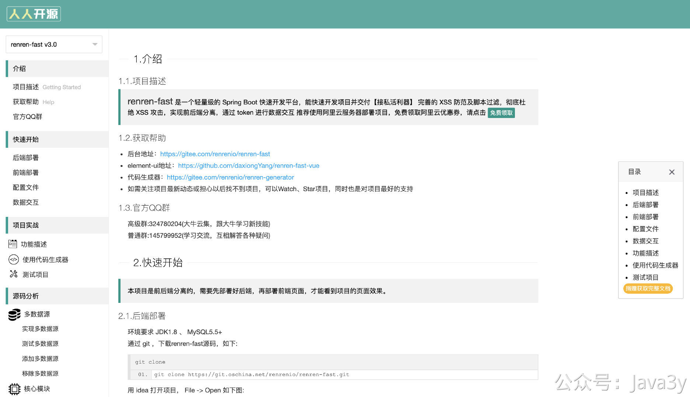
它这个框架是前后端分离的，后端还可以**生成**对应的CRUD代码，前端基于vue和element-ui开发。
当时其实我有点想选它的，但考虑到我要再部署个后端，还得学点vue，我就搁置了

### 2.2 RuoYi

官方文档：[http://doc.ruoyi.vip/ruoyi/](http://doc.ruoyi.vip/ruoyi/)
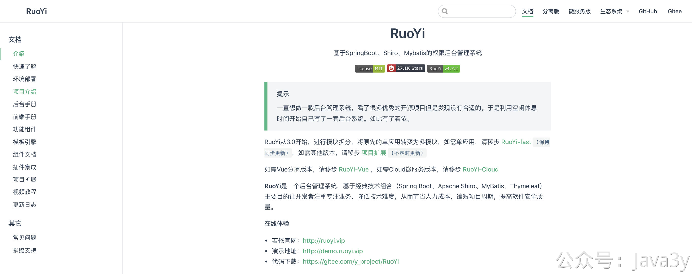
RuoYi给我安利的也很多，这个貌似最近非常火？感觉我被推荐了以后，到处都能看到它的身影。
我简单刷了下文档，感觉他做的事比renren-fast要多，文档也很齐全，但是没找到我想要的东西：我打开一个文档，我希望能看到它的系统架构，系统之间的交互或者架构层面上的东西，但我没快速找到。
项目齐全和复杂对我来说**或许**并不是一件好事，**很可能**意味着我的学习成本可能会更大。于是，我也搁置着。

### 2.3 Vue相关

**vue-element-admin**
官方文档：[https://panjiachen.github.io/vue-element-admin-site/zh/guide/](https://panjiachen.github.io/vue-element-admin-site/zh/guide/)
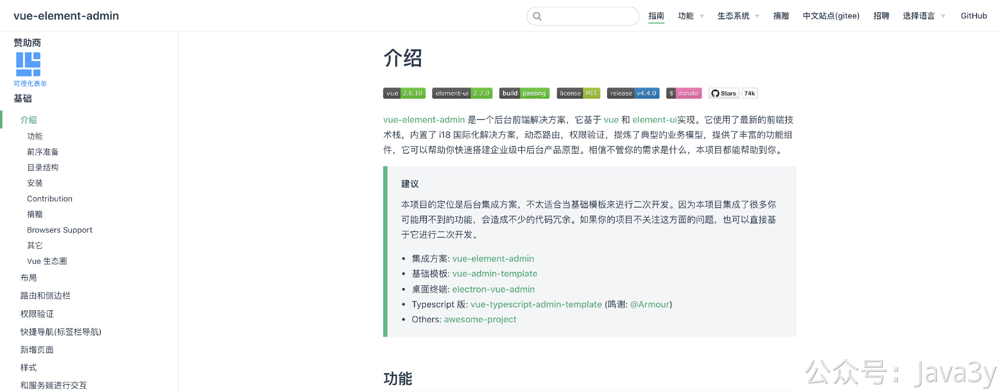
**Vue Antd Admin**
官方文档：[https://iczer.gitee.io/vue-antd-admin-docs/start/use.html#%E5%87%86%E5%A4%87](https://iczer.gitee.io/vue-antd-admin-docs/start/use.html#%E5%87%86%E5%A4%87)
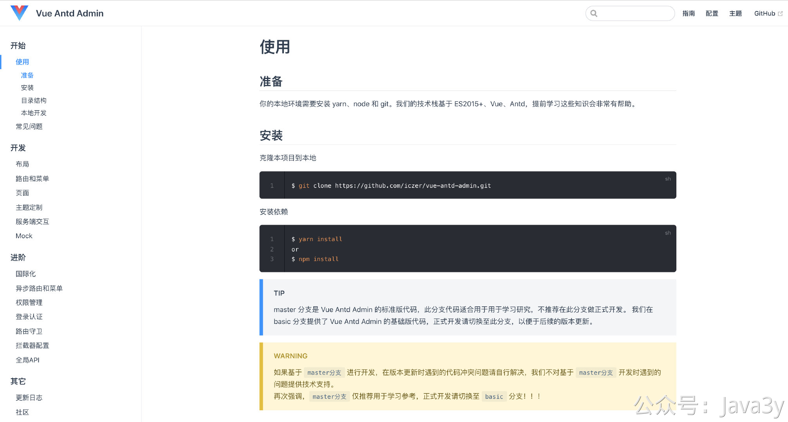
**Ant Design Pro**
官方文档：[https://pro.antdv.com/docs/getting-started](https://pro.antdv.com/docs/getting-started)
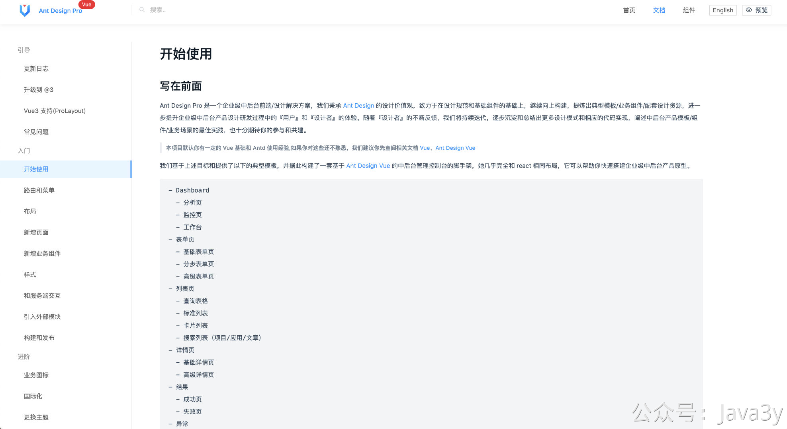
这几个项目被推荐率也是极高的，从第一行介绍我基本就知道需要去学Vue的语法，奈何我太懒了，搁置着。

### 2.4 layui

有好几小伙伴们听说我会jQuery，于是给我推荐了layui。我以前印象中好像听过这个框架，但一直没了解过他。但是，当我搜到它的时候，它已经不维护了
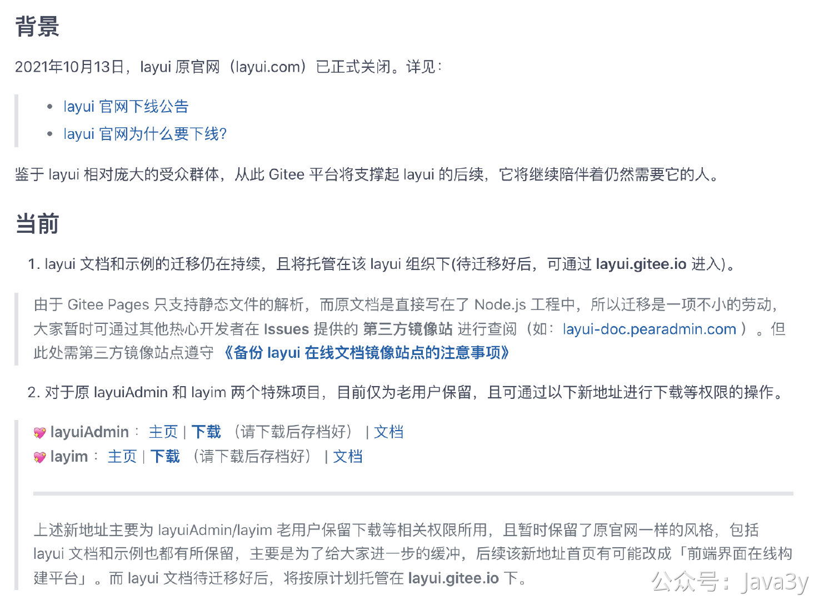
GitHub地址：[https://github.com/sentsin/layui](https://github.com/sentsin/layui)

我简单浏览下文档，其实它也有对应的一套”语法“，需要一定的学习成本，但不高。
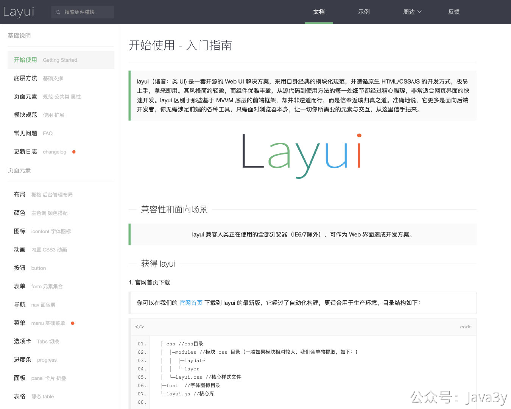
第一感觉有点类似我以前写过的BootStrap，我对这不太感冒，感觉如果要接入可能还是需要自己写比较多的代码。

### 2.5 其他

还有些小伙伴推荐或者我看到的文章推荐：x-admin/D2admin/smartchart/JEECG-BOOT/Dcat-admin/iview-admin等等等，在这里面还有些依赖着PHP/Python

总的来说，我还是觉得这些框架有一定的学习成本（我真的是懒出天际了）。可能需要我去部署后端，也可能需要我学习前端的框架语法，也可能让我学Vue

看到这里，可能你们很好奇我最后选了什么作为austin的前端，都已经被我筛了这么多了。在公布之前，我想说的是：如果想要**页面好看**和**灵活性高**还是得学习**Vue**。从上面我被推荐的框架中，好多都是在Vue的基础上改动的，并且我敢肯定：还有很多基于Vue且好用的后台是我不知道的。

**注**：我这里指代跟我一样不懂前端的（如果本身就已经懂前端，你说啥都对）

## 3、AMIS框架

我最后选择了amis作为austin的前端。这个框架在我朋友圈**只有一个小伙伴推荐**，我第一次打开文档的时候，确实**惊艳**到我了

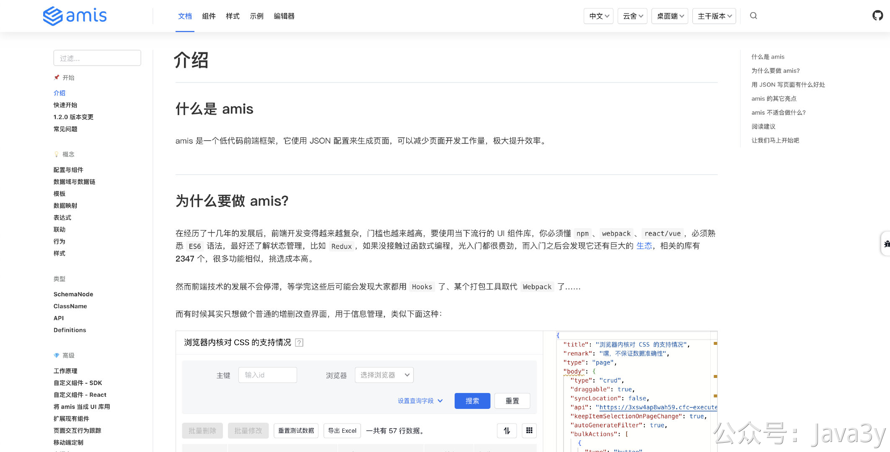

文档地址：[https://baidu.gitee.io/amis/zh-CN/docs/index](https://baidu.gitee.io/amis/zh-CN/docs/index)

它是一个**低代码**前端框架：amis 的渲染过程是将 json 转成对应的 React 组件
我花了半天粗略地刷了下文档，大概知道了JSON的结构（说实话，他这个文档写得挺可以的），然后我去GitHub找了一份模板，就直接开始动手了，readme十分简短。
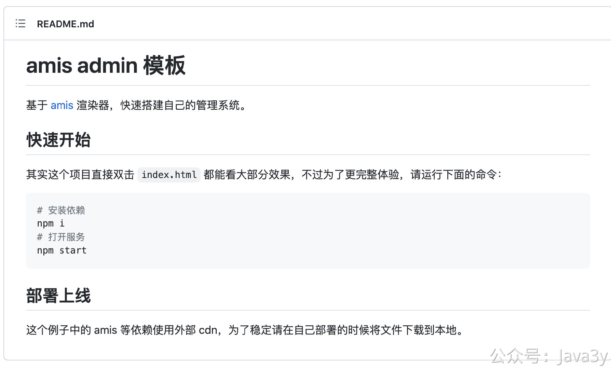
GitHub：[https://github.com/aisuda/amis-admin](https://github.com/aisuda/amis-admin)

这个前端低代码工具还有个好处就是可以通过**可视化编辑器**拖拉生成JSON代码，将生成好的代码直接往自己本地一贴，就完事了，确实挺方便的。
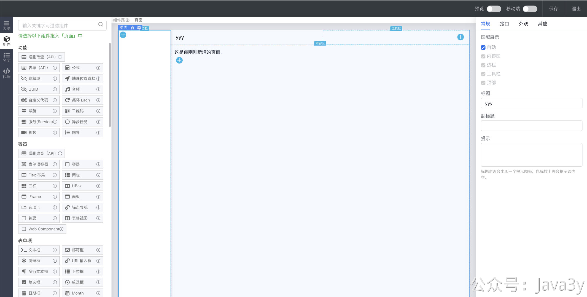

可视化编辑器的地址：[https://aisuda.github.io/amis-editor-demo/](https://aisuda.github.io/amis-editor-demo/)

## 4、使用感受

其实没什么好讲的，无非就是在页面上拖拉得到一个页面，然后调用**API**的时候看下文档的姿势。

在这个过程中我也去看了下这个框架的评价，发现百度内部很多系统就用的这个框架来搭建页面的，也看到Bigo也有在线上使用这个框架来搭建后台。有一线/二线公司都在线上使用该框架了，我就认为问题不大了。

总的来说，我这次搭建austin后台实际编码时间没多少，都在改JSON配置和查文档。我周六下午2点到的图书馆，新建了GitHub仓库，在6点闭馆前就已经搭出个大概页面了，然后在周日空闲时间里再完善了几下，感觉可以用了

在搭建的过程中，amis低代码框架还是有地方可吐槽的，就是它的**灵活性太低**。我们的接口返回值需要迎合它的主体结构，当我们如果有**嵌套JSON**这种就变得异常难处理，表单无法用**表达式**进行回显等等。
它并不完美，很可能需要我用些奇怪的姿势**妥协**，不要问我接口返回的时候为啥转了一层Map
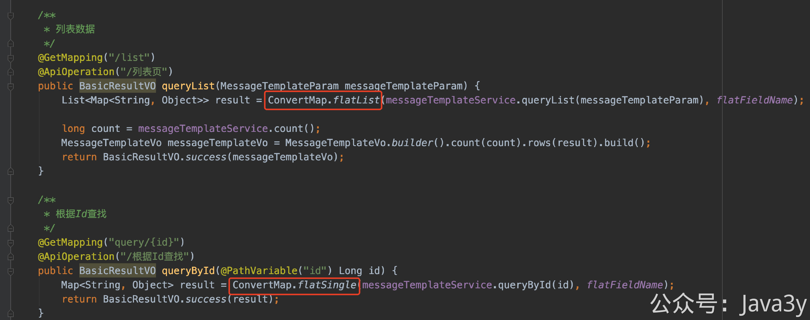

不管怎么说，这不妨碍我花了**极短**的时间就能搭出一个能看的后台管理页面(**CRUD已齐全**)

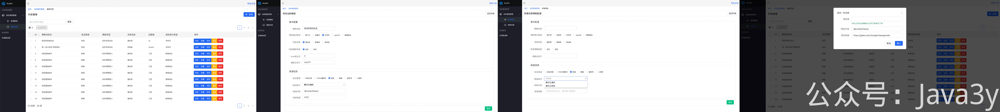

## 5、总结

我后面有链路追踪的功能，肯定要在后台这把清洗后的数据提供给后台进行查询，**但也不会花比较长的篇幅再来聊前端这事了**。

我一直定位是在后端的代码上，至于前端我能学，但我又不想学。怎么说呢，**利益最大化吧**。我把学前端的时间花在学后端上，或许可能对我有更大的受益。现在基本前后端分离了，在公司我也没什么机会写前端。

> 原文: <https://www.yuque.com/u37247843/dg9569/bc71tzfptsvqlvb3>