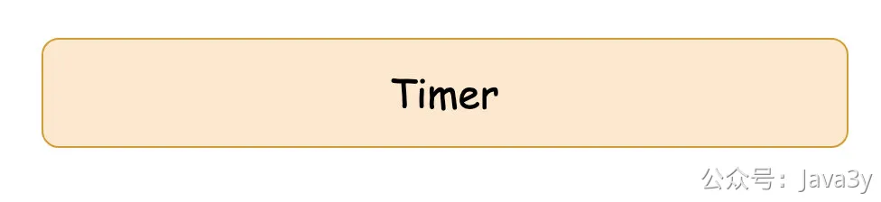
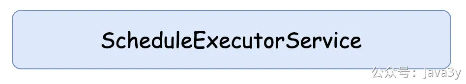

# 3.28 如何实现定时功能？

我是看视频入门Java的，那时候学Java基础API的时候，看的视频也带有讲定时功能（JDK原生就支持），我记得视频讲师写了Timer来讲解定时任务。

当时并不知道定时任务有什么实际作用，所以在初学阶段的我，从来没使用过Timer来实现定时的功能。
再后来，我学到**并发**了。那时候的讲师提到了ScheduledExecutorService这个接口，它比Timer更加强大，一般我们在JDK里可以用它来实现定时的功能

强就强在于ScheduledExecutorService内部是线程池，Timer是单线程，它能更合理的利用资源。
我学并发的时候，我也并不太关注它（它并不是并发的重点），所以我也没用过ScheduledExecutorService来实现定时的功能。

后来吧，要到学习做项目了，那时候视频有个Quartz课程。我记得理解了很久，最后我才反应过来了，原来**写了这么多的代码**就是用它来实现定时的功能。

至于比ScheduledExecutorService和Timer好在哪里呢，最直观的是：**它支持cron表达式**。

为啥我会理解很久呢，因为Quartz的api太复杂了（它也有着自己的专业术语和概念性的东西）。不过这种跟着做项目的，我是一步一步跟着敲代码的。

而Quartz相关的API我是记不住了，但那时候我理解了：原来我们写代码可以靠「组件包」来完成想要的功能，原来这就是cron表达式。

等到我大三的时候，我想用自己学过的知识点来写个小项目，也算是梳理一遍自己到底学了什么东西。于是，我想起了Quartz。

那时候我已经学到了Spring/SpringBoot了。所以当我在网上搜Spring与Quartz整合的时候，了解到了SpringTask，再后来发现了@Schedule注解。

只需要一个简单的注解，就能实现定时任务的功能，并且支持cron表达式。

**那那那那，还要个锤子的Quartz啊？**

若有收获，就点个赞吧

 

> 原文: <https://www.yuque.com/u37247843/dg9569/sv8givt2pi7nnch6>