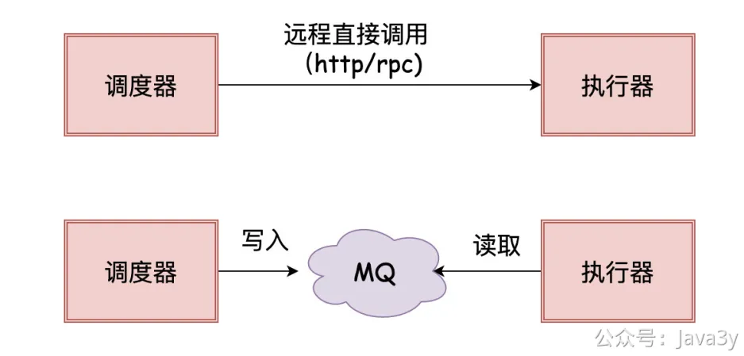
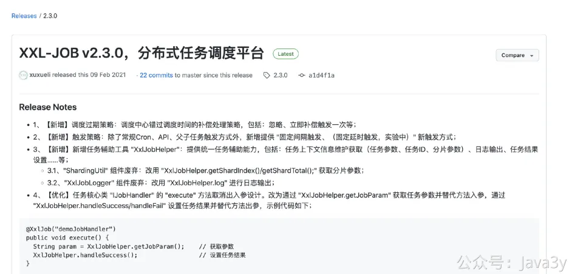

# 3.30 什么是分布式定时任务

**01、为什么分布式定时任务**

在前面提到Timer/ScheduledExecutorService/SpringTask(@Schedule)都是单机的，但我们一旦上了生产环境，应用部署**往往**都是集群模式的。

在集群下，我们一般是希望**某个定时任务**只在某台机器上执行，那这时候，单机实现的定时任务就不太好处理了。

Quartz是有**集群部署**方案的，所以有的人会利用**数据库行锁**或者使用**Redis分布式锁**来自己实现定时任务跑在某一台**应用机器**上；做肯定是能做的，包括有些挺出名的分布式定时任务框架也是这样做的，能解决问题。

但我们遇到的问题不单单只有这些，比如我想要支持**容错**功能（失败重试）、**分片**功能、**手动触发**一次任务、有一个比较好的管理定时任务的**后台界面**、**路由**负载均衡等等。这些功能，就是作为「**分布式定时任务框架**」所具备的。

既然现在已经有这么多的轮子了，那我们作为**使用方/需求方**就没必要自己重新实现一套了，用现有的就好了，我们可以学习现有轮子的实现设计思想。

**02、分布式定时任务基础**

Quartz是优秀的开源组件，它将定时任务抽象了三个角色：**调度器**、**执行器**和**任务**，以至于市面上的分布式定时任务框架都有类似角色划分。

对于我们使用方而言，一般是引入一个client包，然后根据它的规则（可能是使用注解标识，又或是实现某个接口），随后自定义我们自己的定时任务逻辑。

看着上面的执行图对应的角色抽象以及一般使用姿势，应该还是比较容易理解这个过程的。我们又可以再稍微思考两个问题：

**1**、 任务信息以及调度的信息是需要**存储**的，存储在哪？调度器是需要「**通知**」执行器去执行的，那「**通知**」是以什么方式去做？
**2**、调度器是怎么找到即将需要执行的任务的呢？

针对第一个问题，分布式定时任务框架又可以分成了**两个流派**：中心化和去中心化
●所谓的「中心化」指的是：调度器和执行器**分离**，调度器统一进行调度，通知执行器去执行定时任务
●所谓的「去中心化」指的是：调度器和执行器**耦合**，自己调度自己执行

对于「中心化」流派来说，存储相关的信息很可能是在**数据库**（DataBase），而我们引入的client包实际上就是**执行器**相关的代码。调度器**实现了任务调度**的逻辑，**远程调用**执行器触发对应的逻辑。

调度器「通知」执行器去执行任务时，可以是通过「RPC」调用，也可以是把任务信息写入消息队列给执行器消费来达到目的。

对于「去中心化」流派来说存储相关的信息很可能是在**注册中心**（Zookeeper），而我们引入的client包实际上就是**执行器+调度器**相关的代码。

依赖注册中心来完成**任务的分配**，「中心化」流派在调度的时候是需要保证一个任务只被一台机器消费，这就需要在代码里写分布式锁相关逻辑进行保证，而「去中心化」依赖注册中心就免去了这个环节。

针对第二个问题，调度器是怎么找到即将需要执行的任务的呢？现在一般较新的分布式定时任务框架都用了「**时间轮**」。

**1**、如果我们日常要找到准备要执行的任务，可能会把这些任务放在一个List里然后进行判断，那此时查询的时间复杂度为O(n)

**2**、稍微改进下，我们可能把这些任务放在一个最小堆里（对时间进行排序），那此时的增删改时间复杂度为O(logn)，而查询是O(1)

**3**、再改进下，我们把这些任务放在一个**环形数组**里，那这时候的增删改查时间复杂度都是O(1)。但此时的环形数组大小决定着我们能存放任务的大小，超出环形数组的任务就需要用另外的数组结构存放。

**4**、最后再改进下，我们可以有**多层**环形数组，不同层次的环形数组的**精度**是不一样的，使用多层环形数组能大大提高我们的精度。

**03、分布式定时任务框架选型**

分布式定时任务框架现在可选择的还是挺多的，比较出名的有：XXL-JOB/Elastic-Job/LTS/SchedulerX/Saturn/PowerJob等等等。

有条件的公司可能会基于Quartz进行拓展，自研一套符合自己的公司内的分布式定时任务框架。

我并不是做这块出身的，对于我而言，我的austin项目技术选型主要会关注两块（其实跟选择apollo作为分布式配置中心的理由是一样的）：**成熟、稳定、社区是否活跃**。

这一次我**选择了xxl-job作为austin的分布式任务调度框架**。xxl-job已经有很多公司都已经接入了（说明他的**开箱即用**还是很到位的）。不过最新的一个版本在2021-02，近一年没有比较大的更新了。

若有收获，就点个赞吧

 

> 原文: <https://www.yuque.com/u37247843/dg9569/hy6mfmnn55xqugtd>