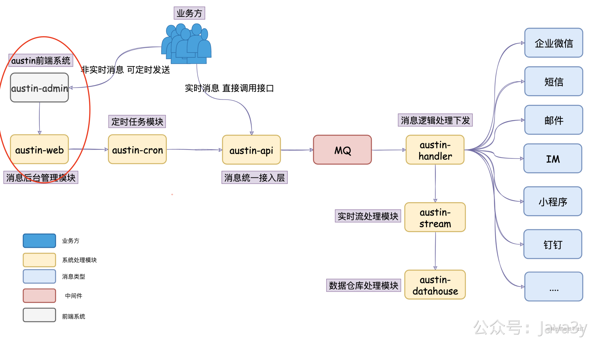
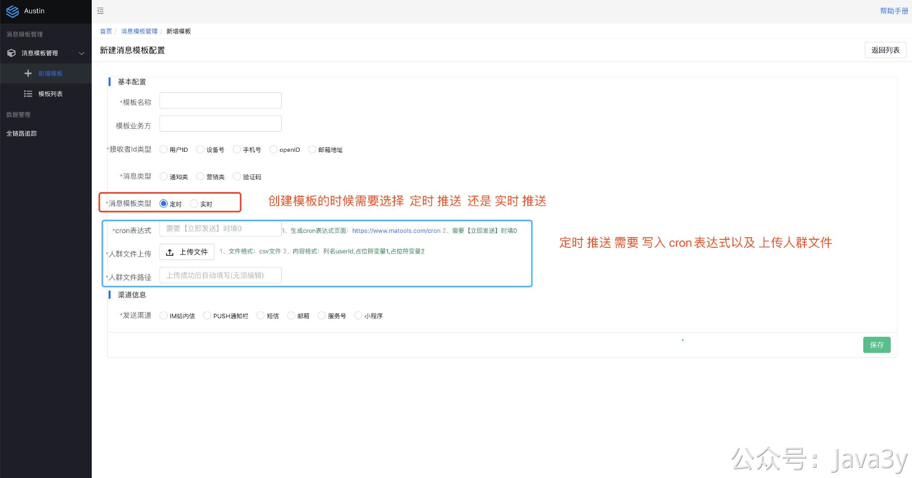
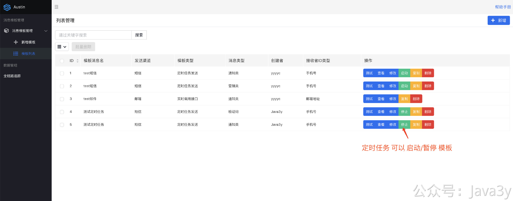
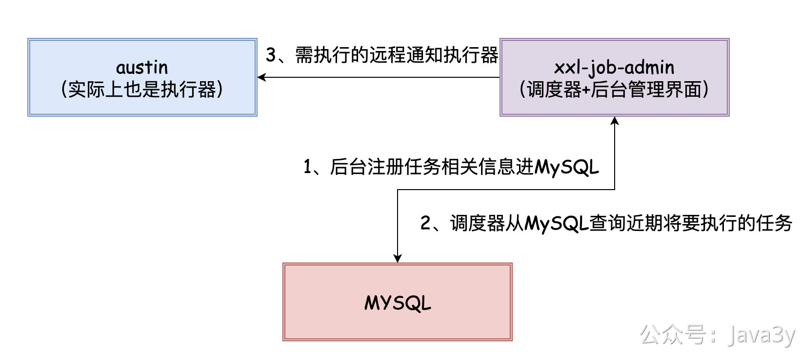
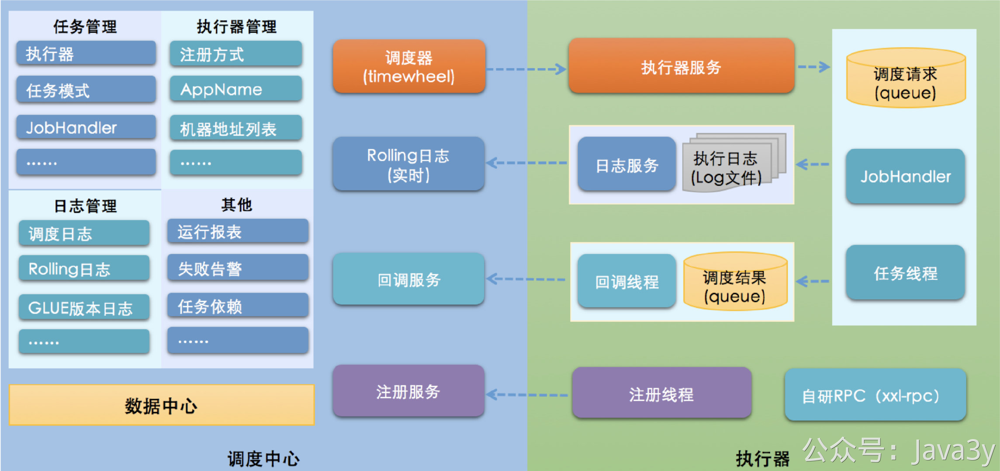
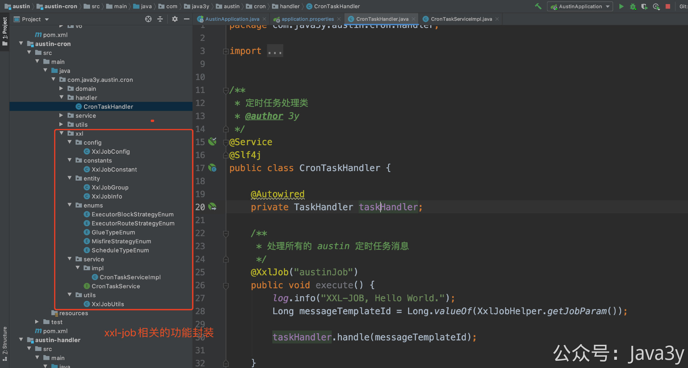
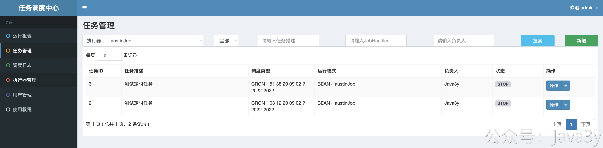

# 3.30 项目是怎么用分布式定时任务的？

## 01、为什么AUSTIN需要分布式定时任务框架

回到austin的系统架构上，austin-admin后台管理页面已经被我造出来了，这个后台管理系统会提供「消息模板」的管理功能。

那发送一条消息不单单是「技术侧」调用接口进行发送的，还有很多是「运营侧」通过设置定时进而推送。

而这个功能，就需要用到分布式定时任务框架作为中间件支撑我的业务，并且很重要的一点：分布式定时任务框架需要支持**动态**创建定时任务的功能。

当在页面点击「**启动**」的时候，就需要创建一个定时任务，当在页面点击「**暂停**」的时候，就需要停止定时任务，当在页面点击「**删除**」模板的时候，如果曾经有过定时任务，就需要把它给一起删掉。当在页面点击「编辑」并保存的时候，也需要把停止定时任务。

嗯，所需要的流程就这些了。

除此之外，我还会用定时任务做**夜间屏蔽次日发送、刷新AccessToken**等等的功能

## 02、AUSTIN接入XXL-JOB
接入xxl-job分布式定时任务框架的步骤还是蛮简单的（看下文档基本就会了），我简单说下吧。接入具体的代码大家可以拉ausitn的下来看看，我会重点讲讲我接入时的感受。

官网链接：
[https://www.xuxueli.com/xxl-job/#%E4%BA%8C%E3%80%81%E5%BF%AB%E9%80%9F%E5%85%A5%E9%97%A8](https://www.xuxueli.com/xxl-job/#%E4%BA%8C%E3%80%81%E5%BF%AB%E9%80%9F%E5%85%A5%E9%97%A8)

**1**、自己项目上引入xxl-job-core的maven依赖

**2**、在MySQL中执行/xxl-job/doc/db/tables_xxl_job.sql的SQL脚本

**3**、从Gitee或GitHub下载xxl-job的源码，修改xxl-job-admin调度中心的**数据库**配置，启动xxl-job-admin项目。

**4**、在自己项目上添加xxl-job相关的配置信息

**5**、使用@XxlJob注解修饰方法编写定时任务的相关逻辑

从接入或者已经看过文档的小伙伴应该就很容易发现，xxl-job它是属于「中心化」流派的分布式定时任务框架，调度器和执行器是分离的。

在前面我提到了austin需要**动态**增删改定时任务，而xxl-job是支持的，**但我觉得没封装得足够好，只在调度器上给出了http接口**。而调用http接口是相对麻烦的，很多相关的JavaBean都没有在core包定义，只能我自己再写一次。

所以，我花了挺长的时间和挺多的代码去完成**动态**增删改定时任务这个工作。

调度器和执行器是分开部署的，意味着，**调度器和执行器的网络是必须可通的**：原本我在本地是没有装任何的环境的，包括MySQL我都是连接云服务器的，但是现在我要调试就必须在网络可通的环境内，所以我不得不在本地启动xxl-job-admin调度中心来调试。

在启动执行器的时候，会开一个新的端口给xxl-job-admin调度中心调用而不是复用SpringBoot默认端口也是挺奇怪的？

## 03、总结

这几章节主要讲了什么是定时任务、为什么要用定时任务、在Java领域中如果有定时任务相关的需求可以用什么来实现、分布式定时任务的基础知识以及如何接入XXL-JOB

相信大家对分布式定时任务框架有了个基本的了解，如果感兴趣可以挑个开源框架去学学。

主要的代码就在`austin-cron`的`xxl`包下，而分布式应用的代码主要在`austin-web`的`MessageTemplateController`跟模板的增删改查耦合在一起了。

> 原文: <https://www.yuque.com/u37247843/dg9569/yzx5g80f3kg8ksx6>