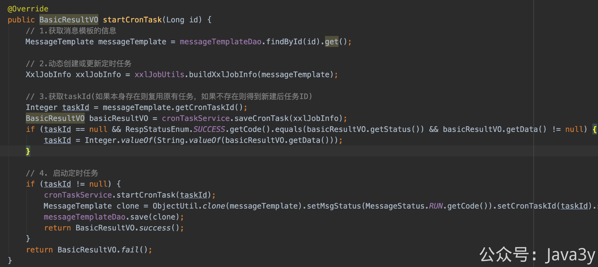

# 3.31 发送千万级的文件消息，如何设计？

在前面我们已经接入了xxl-job作为分布式定时任务的框架实现了，今天就来实现austin依赖定时任务最主要的场景

## 01、使用定时任务推送消息

对于austin消息推送平台而言，发送消息不单单是「**技术侧**」调用接口进行发送的，还有很多场景是「**运营侧**」通过设置**定时**进而推送。

所以，作为使用消息推送平台的角色可以简单分为：「技术同学」、「运营同学」


当运营或客服她们想发送消息给用户，她们使用消息推送的后台，步骤可简单分为：

**1**、确定发送时间

**2**、确定发送的人群（人群内可以是1~N的用户）

**3**、确定发送文案


对于发送时间则使用cron表达式，发送人群我们是让运营上传.csv文件，发送文案则配置在模板上（同样也可以使用**占位符**）

这里值得讲述的是，为什么是上传.csv文件而不是excel，其最根本的原因：excel的行数是有大小限制的，而.csv的行数是没有大小限制的。

我们限定.csv文件的格式为如下：第一列填写**接收者Id**、剩余的列如果使用了占位符，则需要填写占位符变量名


注：CSV文件的样例在项目的example文件夹下有

保存了消息模板之后，等我们点击「**启动**」按钮，就根据模板的信息进行消息推送。

（在线上环境上，在启动之前肯定会有**审核**的环节，并且一般会先点击「**测试**」按钮看文案是否正常才进行推送）


点击启动按钮了之后，会发生什么？我们看日志就懂了（我在执行的过程中把关键的日志信息都打印出来了）

```java
//1. 消息模板ID的消息 定时任务被触发（入口）
2022-02-17 21:14:55.016 [Thread-61] INFO  com.java3y.austin.cron.handler.CronTaskHandler - CronTaskHandler#execute messageTemplateId:7 cron exec!

//2. api-service接口接收到的参数信息以及接口返回值   
2022-02-17 21:14:56.095 [pool-27-thread-1] INFO  com.java3y.austin.support.utils.LogUtils - {"bizId":"7","bizType":"SendService#batchSend","executionTime":72,"logId":"9fd2cdd1-79fa-4c5c-932b-da08aa3b247d","msg":"{\"code\":\"send\",\"messageParamList\":[{\"extra\":null,\"receiver\":\"13719383334,13719383336,13719383338,13719383340,13719383342,13719383344\",\"variables\":{\"content\":\"xixi\",\"url\":\"hehe.com\"}},{\"extra\":null,\"receiver\":\"13719383333,13719383335,13719383337,13719383339,13719383341,13719383343,13719383345\",\"variables\":{\"content\":\"hhaha\",\"url\":\"baidu.com\"}}],\"messageTemplateId\":7}","operateDate":1645103696095,"returnStr":"{\"code\":\"0\",\"msg\":\"操作成功\"}","success":true,"tag":"operation"}

//3. receiver消息队列接收到的原始值
2022-02-17 21:14:56.252 [org.springframework.kafka.KafkaListenerEndpointContainer#6-0-C-1] INFO  com.java3y.austin.support.utils.LogUtils - {"bizType":"Receiver#consumer","object":{"businessId":1000000720220217,"contentModel":{"content":"xixi","url":"hehe.com?track_code_bid=1000000720220217"},"idType":30,"messageTemplateId":7,"msgType":10,"receiver":["13719383340","13719383336","13719383338","13719383342","13719383344","13719383334"],"sendAccount":10,"sendChannel":30,"templateType":10},"timestamp":1645103696252}
2022-02-17 21:14:56.254 [org.springframework.kafka.KafkaListenerEndpointContainer#6-0-C-1] INFO  com.java3y.austin.support.utils.LogUtils - {"bizType":"Receiver#consumer","object":{"businessId":1000000720220217,"contentModel":{"content":"hhaha","url":"baidu.com?track_code_bid=1000000720220217"},"idType":30,"messageTemplateId":7,"msgType":10,"receiver":["13719383341","13719383339","13719383335","13719383337","13719383343","13719383333","13719383345"],"sendAccount":10,"sendChannel":30,"templateType":10},"timestamp":1645103696253}

//4.1 关键位置打印的日志(state=10)代表消息队列接收成功
2022-02-17 21:14:56.172 [org.springframework.kafka.KafkaListenerEndpointContainer#6-0-C-1] INFO  com.java3y.austin.support.utils.LogUtils - {"businessId":1000000720220217,"ids":["13719383340","13719383336","13719383338","13719383342","13719383344","13719383334"],"state":10,"timestamp":1645103696172}
2022-02-17 21:14:56.253 [org.springframework.kafka.KafkaListenerEndpointContainer#6-0-C-1] INFO  com.java3y.austin.support.utils.LogUtils - {"businessId":1000000720220217,"ids":["13719383341","13719383339","13719383335","13719383337","13719383343","13719383333","13719383345"],"state":10,"timestamp":1645103696253}

//4.2 关键位置打印的日志(state=60)代表消息调用接口发送失败
2022-02-17 21:14:56.799 [pool-8-thread-3] INFO  com.java3y.austin.support.utils.LogUtils - {"businessId":1000000720220217,"ids":["13719383340","13719383336","13719383338","13719383342","13719383344","13719383334"],"state":60,"timestamp":1645103696799}
```

  因为这次发送的渠道是短信，我们是有将短信的发送记录入库的，所以可以看看数据库的记录（刚好是**13**条，数据是没问题的。至于发失败，主要是该短信模板的参数不符合）


我们整体的流程是没有问题的


## 02、代码结构设计

从消息推送后台层面上，当点击了「启动」按钮时，其实是「创建&&启动」或者「启动」了个定时任务（调用xxl-job的api，将定时任务存入到xxl-job的数据库表中）


等我们定时任务到时间点了，xxl-job的调度中心就找到我们的执行器，进行调用。


在创建定时任务的时候，我把消息模板ID写入到了xxl-job任务信息里，所以当任务被调度的时候，我又从xxl-job把参数信息取出来。在这，打印出了一条日志，表示当前模板ID被调度执行了。

随后，我使用「**线程池**」对定时任务做处理。


因为我这里认为「读取文件以及远程调用发送接口」是一件比较耗时的工作，所以我这里直接就用线程池做了层**异步**，**及时**返回xxl-job，避免定时任务超时。

解释完为什么用了线程池以后，接着来看看**读取.csv文件**这块。在最最最开始的时候，我是直接**一次性**读取，然后得到List列表的。显然，这是不合理的。假设运营圈选的人群可能达到2000W人，那我直接将2000W条记录直接load到内存，那是不对的。

所以，每当从文件读取一行，我就处理一行

我在拿到每一行数据的时候，封装了一个VO，又扔给了内存队列LazyPending

内存队列里会起一个线程消费队列里的数据，等到**积压**到给定的size或者timeout就会给到实际消费者进行处理

我这样设计的目的在于：我要调用**批量发送**接口，使用内存队列作为介质实现生产者和消费者模式**为了**做batch处理。具体来说：如果我每读取一行就调用一次发送接口，假设人群有2000W，我就需要调用2000W次。

在实际生产环境中，austin-cron和austin-api在**很大概率上**是分开部署的，所以每一次调用接口都是**远程调用**。为了减少这个消耗，所以我这样干了。

另外，在具体执行消费的时候，我是设计了「线程池」进行接口调用的，更能充分利用系统资源（毕竟这次接口调用更多的是损耗网络的开销）


看到了这，再回到我们的接口打印信息：
```java
2022-02-17 21:14:56.095 [pool-27-thread-1] INFO  com.java3y.austin.support.utils.LogUtils - {"bizId":"7","bizType":"SendService#batchSend","executionTime":72,"logId":"9fd2cdd1-79fa-4c5c-932b-da08aa3b247d","msg":"{\"code\":\"send\",\"messageParamList\":[{\"extra\":null,\"receiver\":\"13719383334,13719383336,13719383338,13719383340,13719383342,13719383344\",\"variables\":{\"content\":\"xixi\",\"url\":\"hehe.com\"}},{\"extra\":null,\"receiver\":\"13719383333,13719383335,13719383337,13719383339,13719383341,13719383343,13719383345\",\"variables\":{\"content\":\"hhaha\",\"url\":\"baidu.com\"}}],\"messageTemplateId\":7}","operateDate":1645103696095,"returnStr":"{\"code\":\"0\",\"msg\":\"操作成功\"}","success":true,"tag":"operation"}
```
人群数量一共是13，但我们仅用了一次接口调用。

## 03、总结

到这里，我已经把定时任务的实现核心逻辑应该就讲完了，大家看代码的时候应该就有个谱了，至少应该不会跑到群里说看不懂了。

至于实现的细节上，如果有更好的办法或者思路可以在评论区一起讨论，又或是直接提个PR。一般我认为是合理的，我都会审核通过的哟！

看完整篇文章，很有可能就会有同学有疑惑：你把数据放在内存队列里，这如果重启或系统挂了怎么办啊，数据不就丢了吗。可看下面的章节：**《应用发布重启了怎么办》**

我们在系统里要保证数据不丢失不重复需要做大量的工作，很有可能会影响到系统的性能或者支持并发的大小。如果是处理订单类的系统，那是必须的。但如果是发消息的场景，或者并没有想象中那么重要（当然了，我们也可以实现就是啦）。

但更多的是，我们可以额外通过一些**手段**来判断消息是否下发成功了：大概就是统计当前消息模板的下发人数、系统处理过程中的人数以及消息到达、点击的人数。可看下面的章节：**《入门实时流处理平台（flink）》**


> 原文: <https://www.yuque.com/u37247843/dg9569/ignfk2bup8v6tqg9>