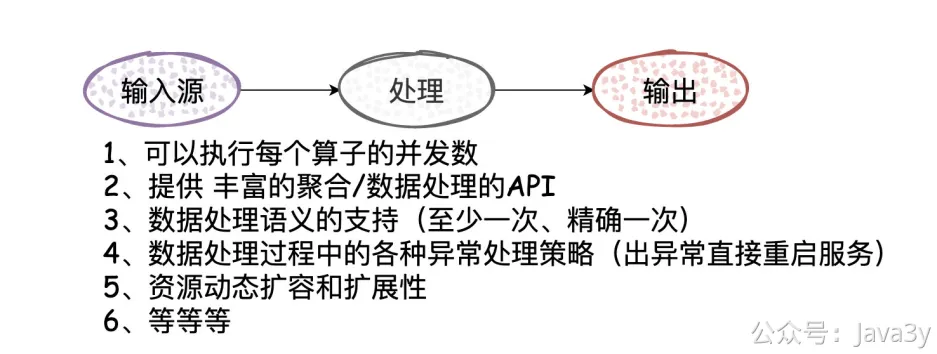

# 3.32 入门实时流处理平台（Flink）

这个模块主要是接入**流式处理平台**（flink），用于实时计算清洗数据给到业务以及系统维护者更方便去使用消息推送平台austin
**01、为什么流式处理平台**

我在老东家有过处理数据相关的经验，也看到过站内广告「效果数据」的发展历程。

所谓效果数据，说白了则是商家在平台上投放了广告，我们需要给商家看到广告带来的效果，最核心的是「曝光」「点击」「订单」，基于这几项数据再聚合些类roi的指标。

下面来聊聊这个「发展历程」，看完这个过程或许可以更好地了解**为什么**需要流式处理平台

**1**、PHP阶段：在最初时业务以及系统结构都比较简单，把「点击」和「订单」都存入数据库表，一把梭通过定时任务**全量**聚合，得到最终的效果数据，而「曝光」数据则是**次日**再写入效果数据表中。
在这个阶段里，由于数据量不大，通过定时任务全量来聚合数据也不是不可以，那时候商家都能接受该业务的延迟性

**2**、Java阶段：随着业务的发展，逐渐摒弃PHP化并且广告三层结构成型、数据量日益提升、站内中间件服务平台也发展起来。通过中间件团队提供的消费binlog框架，从架构上改变聚合模式，并这个阶段可以更快地给商家展示效果数据，大概**1min**出效果数据

**3**、流式处理平台阶段：流式处理平台是对「计算」或者说处理数据时的**抽象**，在这抽象基础上它更能充分利用系统的资源（一个大的任务被拆分多个小任务，然后分发到不同的机器上执行）

**4**、广告效果数据是先用的Storm作为流式处理平台，数据跑了几年都挺稳定的，性能吞吐量上也是满足业务使用的。后来Flink兴起，支持SQL、Exactly-Once、流批一体化等，随着公司内推广，我将广告效果数据从Strom改至Flink体系上，大概**秒级**出效果数据。（其实还可以压缩，但需要兼顾DB的性能成本，只要业务上能接受即可。**Trade-off**！）

在第三点我提出了「数据处理时的抽象」，我是这样理解的。在Storm里，定义spout为输入，bolt为中间处理或输出，而中间的数据流转为tuple，用shuffle机制来控制数据的流向

在Flink里，就有更加明确的**语义**来说明输入和输出了（程序的API也更有语义性）

这些流处理平台都会数据处理进行了抽象，让我们更加方便且高效去处理数据，比如一般会以下的功能：

**02、AUSTIN哪里用到了流式处理平台**

在前面austin系统已经设计了一部分的埋点信息了，在日志上都已经打印了下来。

但针对这一部分数据，迟迟没有做处理（不过之前有一起跟着学austin的小伙伴给我截了日志，我一眼就知道是哪里出了问题）

而接入流式处理平台就能对这一部分数据进行清洗（根据下发者维度、根据模板消息维度等等），得到清洗后的数据再给到接口去展示或者排查问题使用，能大大提高排查或者业务方的使用**效率**

**03、FLINK入门**

Flink从2018年开始流行，现在已经有很多的公司都在用Flink作为实时大数据处理的流式平台。至于我为什么会选择Flink的话，原因有以下：

**1**、我懂点儿Flink（主要是懒得学其他的了，目前还够用）

**2**、Flink发展了几年，成熟且被很多大公司用，社区活跃

**3**、Flink的官方文档挺不错的，适合学习和排查问题

首先我们安装下Flink，docker-compose.yml文件内容：
完了之后直接docker-compose up -d就可以启动flink了，我们访问在浏览器输入ip:8081端口就能看到flink的后台了

简单看了下后台，就能知道我们在本地开发完打包成jar就可以在Submit New Job提交jar包给Flink去跑了

而在写代码的时候，可以参考官方文档给出的mvn命令去构建Flink的基础环境

当然啦，现在我已经搭好了，你们可以直接拉代码下来看austin-stream模块就完事了。如果你们是自己**从零搭**的话可能还要注意的是，pom里的plugin需要改动（不然打包会失败的），可参考我的pom文件

**04、AUSTIN代码**

从目前的代码结构和逻辑上看，还是非常简单的，没有学过Flink的同学应该都能看懂：

目前主要实现了将**数据实时聚合**到Redis，分了两个维度：用户和消息模板（对应的Redis结构都已经写在了代码的注释上了）

跟着做austin项目的小伙伴，只要在kafka创建对应的topic(我这里定义的topicName是austinLog)，并且在AustinFlinkConstant中填写Kafka的Broker信息以及Redis信息后，编译打包就完了。

提交到Flink平台之后就可以跑了：

**05、前端页面功能**

今天就聊到这吧，对Flink感兴趣的同学可以看看我以往的几篇文章和官网入门下，我建议先可以把austin的代码先拉下来，部署一把自己体验体验，然后再看理论的知识。

**1**、[Flink入门](https://mp.weixin.qq.com/s?__biz=MzI4Njg5MDA5NA==&mid=2247494829&idx=1&sn=a10a38a57c760fa33322a2af2fc25c63&chksm=ebd4adacdca324ba7f860ae89ffdfd58b17d40806ed8ca6b820758e17e57ab8b7d4301424653&token=2053503009&lang=zh_CN#rd)
**2**、[Flink背压机制](https://mp.weixin.qq.com/s?__biz=MzI4Njg5MDA5NA==&mid=2247495581&idx=1&sn=f83ad7fe5d8c1d73d5d9153d3e89138d&chksm=ebd4ae9cdca3278a53b855ade2ed7fc510cddcb68d1e61893ece3d0094e81740de0c0278184d&token=2053503009&lang=zh_CN#rd)
**3**、[Flink CheckPoint机制](https://mp.weixin.qq.com/s?__biz=MzI4Njg5MDA5NA==&mid=2247495992&idx=1&sn=2560f5c9d24e259f4955570acbd9cbe1&chksm=ebd4b039dca3392ffd6fc6a9121bded70d4982ea6abbb43c3f5e70d8cc1837521edbb6f80efc&token=2053503009&lang=zh_CN#rd)

若有收获，就点个赞吧

 

> 原文: <https://www.yuque.com/u37247843/dg9569/nwcc9yuukuaxyd5r>