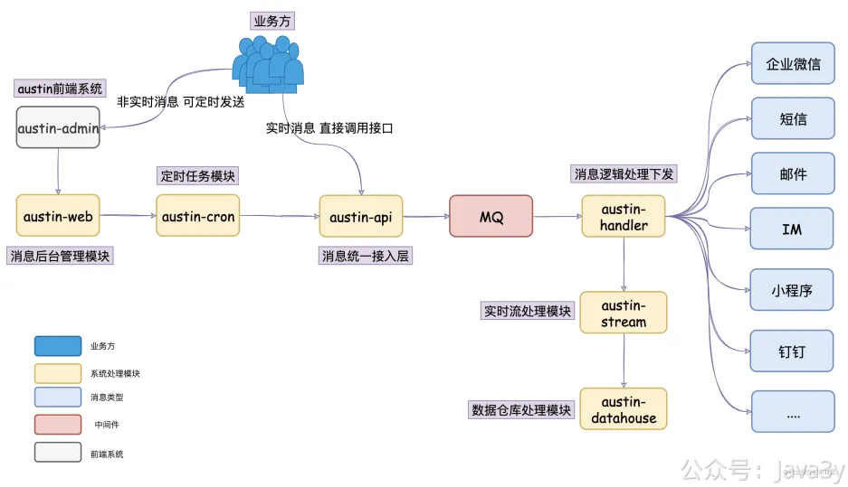

# 3.33 应用发布重启怎么办？

**01、重启会带来什么问题？**

众所周知，如果我们系统在运行的过程中，内存数据没存储起来那就会导致丢失。对于austin项目而言，就会使消息丢失，并且无法下发到用户上。

这个在我讲述完我是如何设计「发送消息消费端」以及「读取文件」时，尤其问得比较多。为了部分没有追更的读者，我再简单讲述下我这边的设计：

在austin-handler模块，每个渠道的每种消息类型我都用到了线程池进行隔离而消费：

在austin-cron模块，我读取文件是把每一条记录放至了单线程池做LazyPending，目的为了延迟消费做**批量**下发。

敏感的技术人看到内存队列或线程池（线程池也需要指定对应的内存队列）就很正常地想：内存队列可能的size为1024，而服务器在重启的时候可能内存队列的数据还没消费完，此时你怎么办？数据就丢了吗？

我们使用线程池/内存队列在很多场景下都是为了提高吞吐量，**有得就必有失**。至于重启服务器导致内存数据的丢失，就看你评估对自己的业务带来多少的影响了。

针对这种问题，austin本身就开发好了相关的功能作为「**补充**」，通过实时计算引擎flink的能力可以**实时**在后台查看消息下发的情况：

可以在离线hive找到消息下发失败的userId，输入具体的receiverId 可以查看实时下发时失败的原因

查明原因之后再通过csv文件上传的做补发。

不过，这是平台提供做**补发**的能力，从技术上的角度，还有别的思路尽量避免线程池或者内存队列的数据因重启而丢失的数据吗？有的，**优雅关闭线程池**

**02、优雅停机**

所谓「优雅停机」就是关闭的时候**先将自己需要处理的内容处理完了**，之后才关闭。如果你直接kill -9，是没有「优雅」这一说法的，神仙都救不了。

**1**、在**网络层**：TCP有四次挥手、TCP KeepAlive、HTTP KeepAlive 让连接 优雅地关闭，避免很多报错。

**2**、在**Java**里边通过Runtime.getRuntime().addShutdownHook()注册事件，当虚拟机关闭的前调用该方法的具体逻辑进行**善后**。

**3**、在**Spring**里边执行了ApplicationContext 的close之后，只要我们Bean配置了destroy策略，那Spring在关闭之前也会先执行我们的已实现好的destroy方法

**4**、在**Tomcat**容器提供了几种关闭的姿势，先暂停请求，选择等待N秒才完全关闭容器。

**5**、在**Java线程池**提供了shutdown和shutdownNow供我们关闭线程，显然shutdown是优雅关闭线程池的方法。

我们的austin项目是基于SpringBoot环境构造的，所以我们可以**重度依赖**SpringBoot进行优雅停机。

**1**、我们设置应用服务器的停机模式为graceful

server.shutdown=graceful

**2**、在austin已经引入**动态线程池**而非使用Spring管理下的ThreadPoolTaskExecutor，所以我们可以把自己创建出来的线程池在Spring关闭的时候，进行优雅shutdown（想要关闭其他的资源时，也可以类似干这种操作）

注：如果是使用Spring封装过的线程池ThreadPoolTaskExecutor，默认就会优雅关闭，因为它是实现了DisposableBean接口的

若有收获，就点个赞吧

 

> 原文: <https://www.yuque.com/u37247843/dg9569/mtfwwauy0xfqr955>