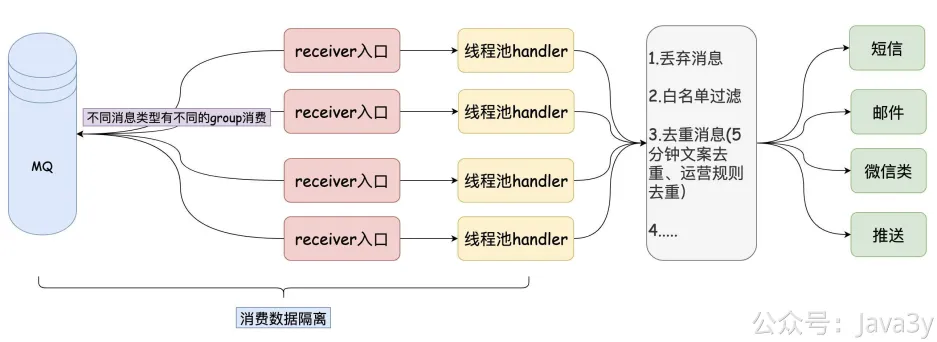
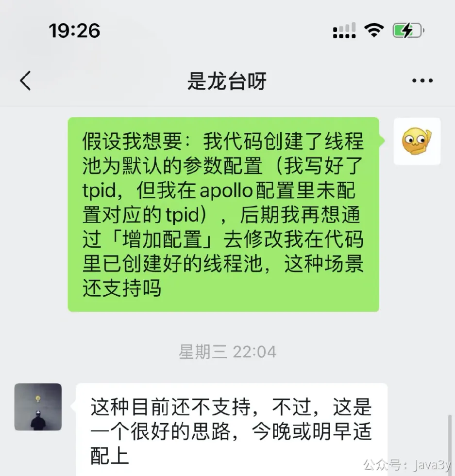
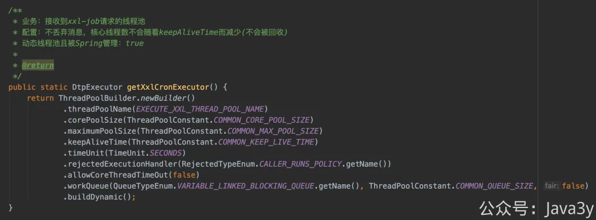
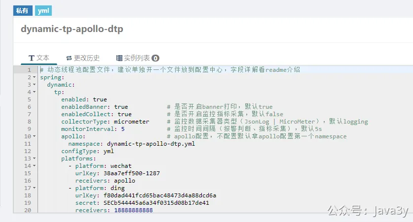
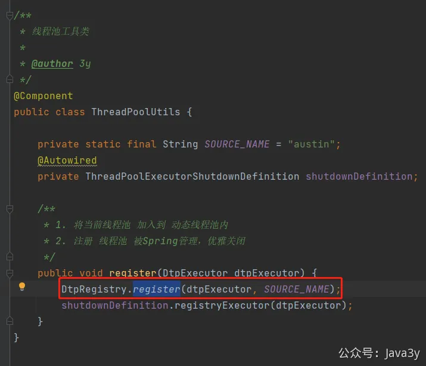

# 3.34 如何优雅调整线程池参数？

austin在整个项目里边，还是有挺多地方是用到了线程池，特别重要的是从MQ里消费所创建的线程池。

有小伙伴当时给过建议：有没有打算引入动态线程池，不用发布就调整线程池的参数从而**临时**提高消费能力。顺便在这给大家推荐美团的线程池文章：[https://tech.meituan.com/2020/04/02/java-pooling-pratice-in-meituan.html](https://tech.meituan.com/2020/04/02/java-pooling-pratice-in-meituan.html)，**如果没读过这篇文章的，建议都去读下，挺不错的**。

美团这篇文章讲述了动态线程池的思路，但应该是未官方开源，所以有很多小伙伴基于文章的思路造了好用的轮子。比如 [Hippo4J](https://github.com/acmenlt/dynamic-threadpool) 和[dynamic-tp](https://github.com/lyh200/dynamic-tp) 都是比较优秀的轮子了。

这两个仓库我都看了下源码， [Hippo4J](https://github.com/acmenlt/dynamic-threadpool) 有**无依赖中间件**实现动态线程池，也有默认实现Nacos和Apollo的版本，并有着**管理后台**，而[dynamic-tp](https://github.com/lyh200/dynamic-tp) 默认实现依赖Nacos或Apollo。大佬们的代码都写得很不错，我推荐大家都可以去学学。

我在最初的时候接的是[dynamic-tp](https://github.com/lyh200/dynamic-tp)的代码，因为我本身austin就接入了Apollo，也感觉暂时不太需要管理后台。后来 [Hippo4J](https://github.com/acmenlt/dynamic-threadpool) 作者找我聊了下，希望我能接入[Hippo4J](https://github.com/acmenlt/dynamic-threadpool)。

我按照我目前的使用场景对着代码看了一把，我是需要通过在**创建线程池后再动态调参**的场景。于是跟 [Hippo4J](https://github.com/acmenlt/dynamic-threadpool) 作者反馈了下，他果断说晚上或明天就给我实现（：**恐怖如斯，太肝了**

不过，周三我反馈完，**周四晚上我差不多就将 **[dynamic-tp](https://github.com/lyh200/dynamic-tp)** 快接入完了。我目前现在打算先跑着（毕竟切换API其实也是需要时间成本的**），后续看有没有遇到痛点或者空的时候再迁移到[Hippo4J](https://github.com/acmenlt/dynamic-threadpool)再体验体验
也不为别的，就看中龙台大佬比我还肝（自己提出的场景，开源作者能很快地反馈并实现，太强了，丝毫不担心有大坑要我自己搞）

对于austin而言，正常的重启发布我们通过**优雅停机**来尽可能减少系统的处理数据时的丢失。如果消息是真的非常重要而且需要做补发，在austin中也可以通过**上传文件**的方式再做补发，且能看到实时推送的数据链路统计和某个用户下发消息失败的原因。

我相信，这已经能覆盖线上绝大多数的场景了。

或许后续也可以针对某些场景在消费端做exactly once + 幂等 来解决kill -9的窘境，但要知道的是：想要保证数据不丢失、不重复发送给用户，一定会带来性能的损耗，这是需要做平衡的。

在项目很少使用线程池之前，一直可能认为线程池的相关面试题就是八股文。但当你项目系统真的遇到线程池优雅关闭的问题、线程池参数动态调整的问题，你就会发现之前看的内容其实是很有意义的。

原来可以设置参数让核心线程数也会回收的（之前一直都没有注意过呢）

原来都大多数框架都有提供对应的扩展接口给我们监听关闭，默认的实现都有优雅停机的机制咯，之前一直都不知道呢。
....

**1、引入maven包：**
**2、线程池配置文件在本地一份：**
**3、把配置文件的内容写到apollo里**

**4、**将创建出来的线程池加入到动态线程池的SDK管理；

若有收获，就点个赞吧

 

> 原文: <https://www.yuque.com/u37247843/dg9569/tcr0tnyuvynho4nq>