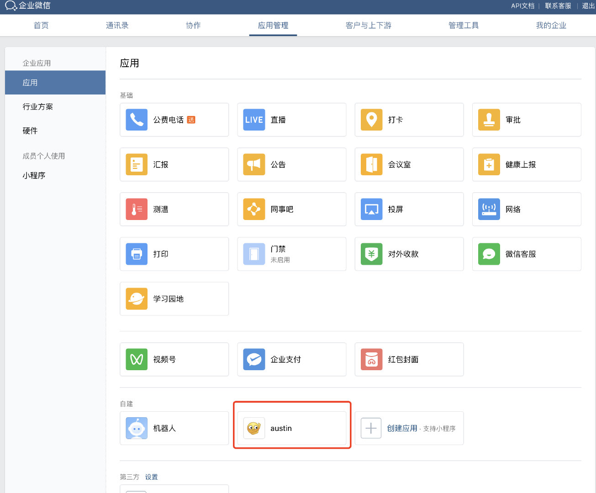
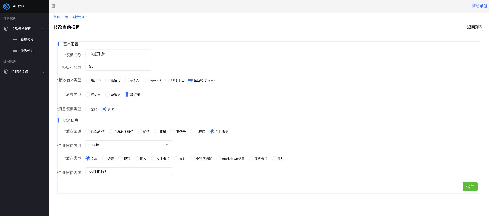
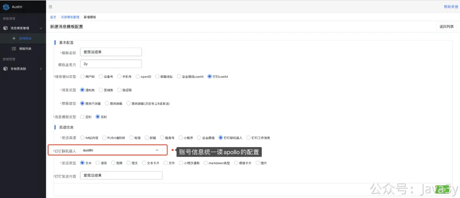
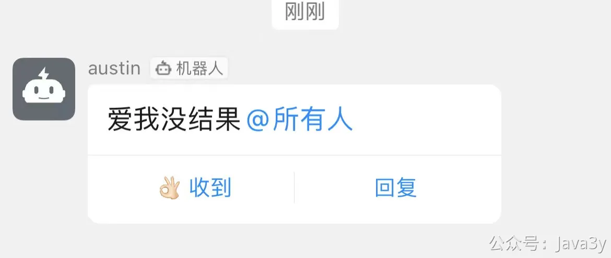
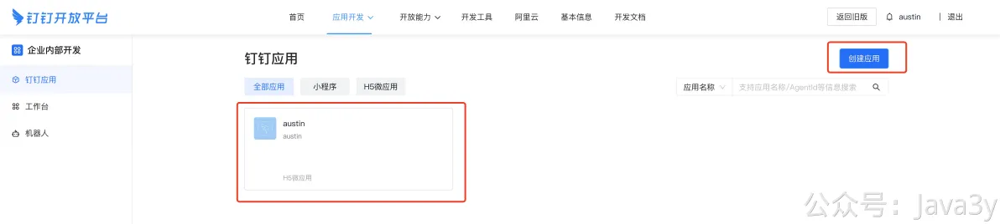
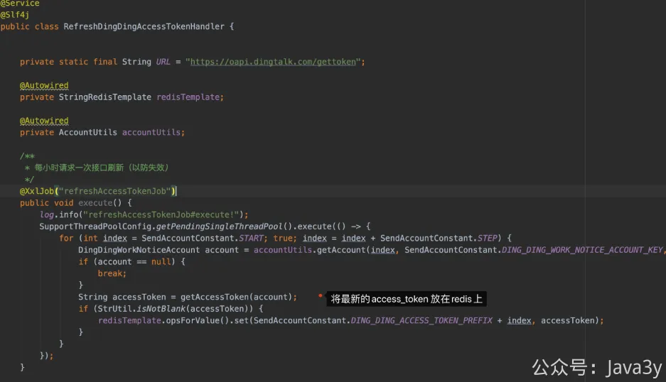
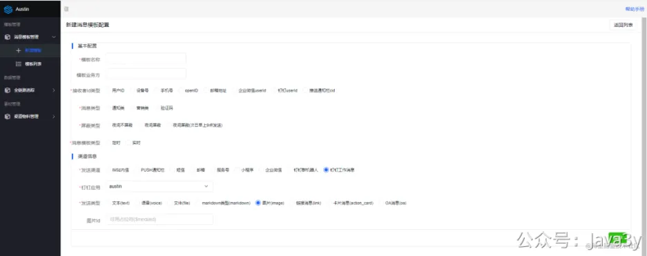
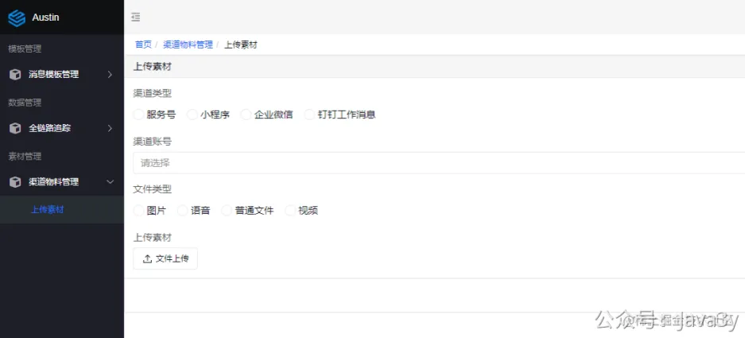
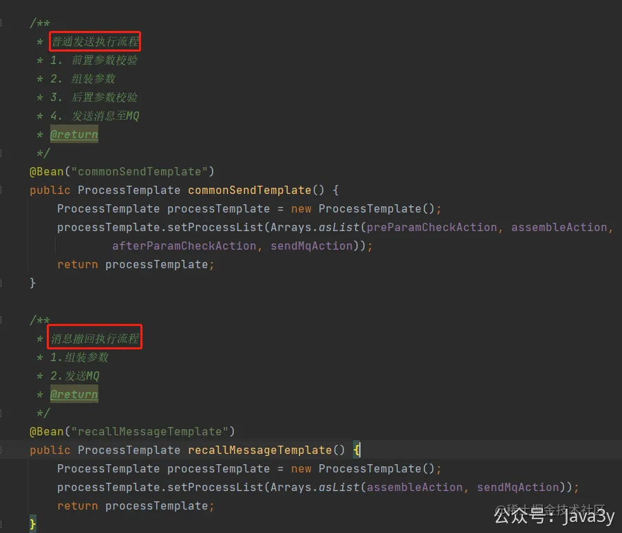
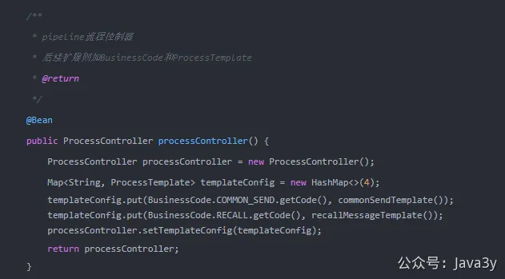

# 3.35 如何接入企业微信/钉钉 发送消息？

**01、企业微信**

**1.1 应用消息**

对于接入**企业微信推送**而言，我也没经验，我之前也没对接过。所以第一步，是找到官方文档：[https://developer.work.weixin.qq.com/document/path/91201](https://developer.work.weixin.qq.com/document/path/91201)，稍微读一读它的基本概念介绍

基本每接入一个渠道，渠道下都有自己的**专业术语**，这种我们也没办法，对着文档看就完事了。

接入企业微信当然你得有个企业微信账号嘛，所以要注册一个企业微信账号：[https://work.weixin.qq.com/wework_admin/register_wx?from=loginpage](https://work.weixin.qq.com/wework_admin/register_wx?from=loginpage)

登录进后台以后，我创建了一个应用叫做austin

前期准备完了之后，我们无非要做的就是要根据企业微信开放平台文档去调用对应的接口。说实话，调用企业微信的API要处理的事情还是蛮多的。

毕竟它有accessToken这么一个凭证，这个凭证还有对应的有效期（如果失效了需要重新获取，然后再调用发送接口）。

熟练掌握使用GitHub的我果断记得我曾经看到过一个好用的库WxJava：[https://github.com/Wechat-Group/WxJava](https://github.com/Wechat-Group/WxJava)

这个仓库封装了**微信支付、开放平台、公众号、企业微信/企业号、小程序**等微信功能模块，目前stars已经达到了25K。

**1**、接入maven依赖

**2**、按照项目架构加入一个新的渠道，步骤如下：

**2.1**、 在枚举类ChannelType增加渠道类型，枚举类IdType增加用户id类型

**2.2**、 增加Handler实现类，编写具体下发的逻辑

**2.3**、 将企业微信账号信息填至账号管理，在下发时读取具体应用账号的信息

**2.4**、 前端新增渠道相关页面

在系统整体架构搭完的情况下，接入一个新的渠道代码量其实很少的，大家可以看看我的commit就知道了。具体的代码过程我就不写了，还是比较简单的，毕竟接入了**SDK库**（大大减少了我这边对接企业微信的API工作量）

**1.2 机器人消息**

**1**、阅读官方文档：[https://open.dingtalk.com/document/group/custom-robot-access](https://open.dingtalk.com/document/group/custom-robot-access)

**2**、创建智能群助手，得到**Webhook地址**和**加密的值**

**02、钉钉**
**2.1、群机器人**

**1**、阅读官方文档：[https://open.dingtalk.com/document/group/custom-robot-access](https://open.dingtalk.com/document/group/custom-robot-access)

**2**、创建智能群助手，得到**Webhook地址**和**加密的值**

**3**、HTTP调用尝试是否发送成功

**2.2、钉钉工作消息**

**1**、在官网文档了解基础概念：[https://open.dingtalk.com/document/org/basic-concepts](https://open.dingtalk.com/document/org/basic-concepts)

**2**、进入企业管理后台： [https://open-dev.dingtalk.com/fe/app#/corp/app](https://open-dev.dingtalk.com/fe/app#/corp/app) ，随后创建应用

**3**、查看消息通知发送的文档：[https://open.dingtalk.com/document/orgapp-server/asynchronous-sending-of-enterprise-session-messages](https://open.dingtalk.com/document/orgapp-server/asynchronous-sending-of-enterprise-session-messages)

**4**、**直接引入钉钉的SDK开发**（主要是方便后续其他的操作，SDK会比HTTP方便不少）

**5**、对于拼装参数调用工作消息接口，没什么好值得说的，大家把代码拉下来就看得一清二楚了。

**6**、从文档发现调用接口需要access_token这个参数，还发现这个参数是会过期的（**2个小时**）

有了这个access_token参数之后，我们就需要考虑怎么去“维护”它，毕竟它会过期的，不能当做一个静态参数写死在代码或者配置文件上。

我当时是发这个问题到小群里，看看大伙们都是怎么“维护”的。毕竟，我们不可能每次在调用接口的时候都去远程拿到最新的（一般外部的API都会有限制调用频率的，没过期的前提下也没必要去调用外界的接口取）

分析后，依我看来，就两种思路：
●定时任务刷新，**每隔一段**时间去获取最新的access_token，将最新的token开放接口给有需要的人使用。
●调用接口的时候拿到上一次的access_token，如果发现access_token失效了再**重新获取并重试接口**。

我一想，肯定是定时任务刷新比较合适啊，反正我已经接入了xxl-job了，新增一个定时任务不就完事了？

不过也有小伙伴说他们是第二种思路，如果发现access_token失效了，再重新获取并重试接口。我让他们来聊下为什么要这么干的时候，他们也说不出个所以然。（**懂的老哥可以在评论区交流交流**）

钉钉渠道的群机器人和工作消息**官方所支持的所有消息类型**都给写了。

又因为工作消息可能会发图片/语音/文件这种消息类型，而这些的消息类型需要把素材先发到钉钉，才能进行消息下发，所以我这边也已经写了**素材上传的模块**

**03、钉钉工作消息支持撤回**

**钉钉应用工作消息撤回**这个功能上，在最开始设计接入层代码的时候，我用的是**责任链设计模式**。那时候我已经预留了可能会有某些请求走不同的责任链，所以会有**code**这个参数

而对于消息撤回而言其实就是**复用了**责任链的其中两个节点，没有普通消息下发时的参数校验逻辑；后续其他渠道的消息撤回如果变化不大，则在这些节点上扩展。

如果变化比较大，可能就要单独新增对应的责任链节点做统一的处理比较合适了。

若有收获，就点个赞吧

 

> 原文: <https://www.yuque.com/u37247843/dg9569/lwrwc392r2sg1cq2>