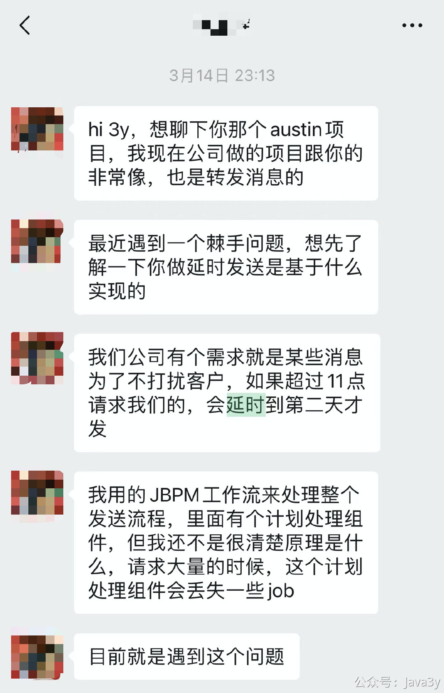
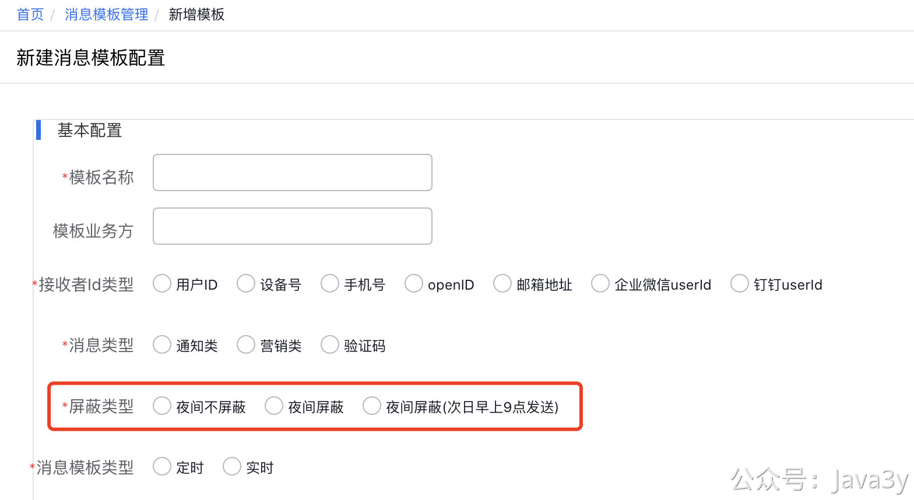
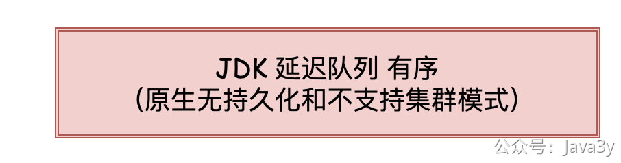
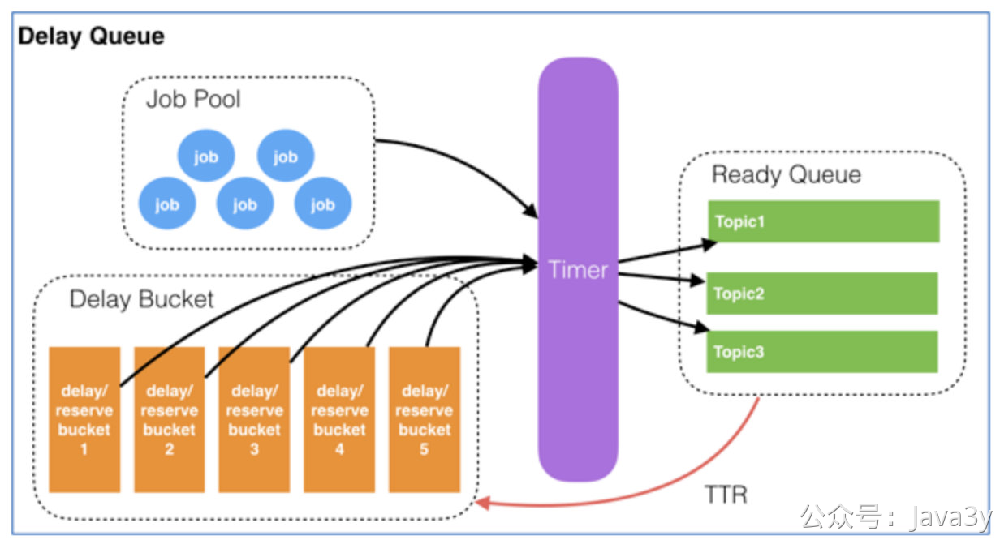
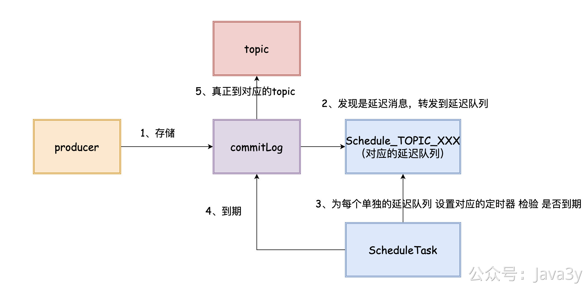
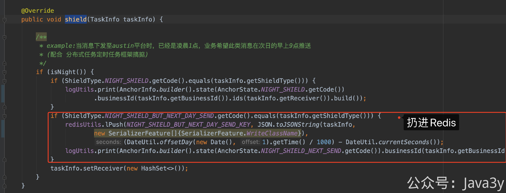
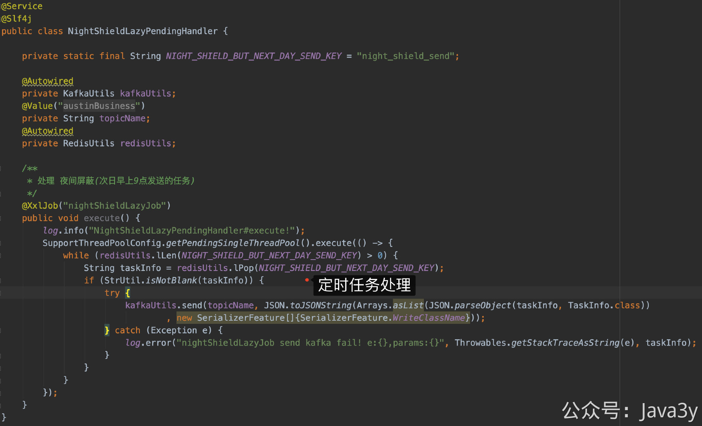

# 3.36 什么是延时队列

前阵子，有个小伙伴找到问我，如果要实现**延时发送**，那是基于什么来做的。

我看到这个问题之后，稍微思考了下，觉得确实也是austin平台所需要实现的功能。对于前端而言，只要让业务方在创建模板的时候填选屏蔽类型，**后端根据这个字段增添一点点细节，这个需求就做完了，简单**！



## 01、延迟消息如何实现？
延迟消息就是字面上的意思：当接收到消息之后，我需要**隔一段时间**进行处理（相对于立马处理，它隔了一段时间，所以他叫延迟消息）。

在原生的Java有DelayQueue供我们去使用，在使用的时候，我们add进去的队列的元素需要实现Delayed接口（同时该接口继承了Comparable接口，所以我们DelayQueue是**有序**的）

```java

public interface Delayed extends Comparable<Delayed> {
    long getDelay(TimeUnit unit);
}

```
从poll的源码上可以清晰地发现本质上就是在**取数的时候判断了下时间**

```java
long delay = first.getDelay(NANOSECONDS);
if (delay <= 0)
  return q.poll();
```
有的人就反驳到：**这不是废话吗？肯定要判断时间啊，不判断时间怎么知道我要延迟的消息什么时候执行**。

明白了这点之后，我们再来别的方案。因为在生产环境中是不太可能使用JDK原生延迟队列的，它是**没有持久化**的，重启就会导致数据丢失。



当austin项目使用内存队列去解耦处理数据已经有人提出服务器重启的时候该怎么办，我的解决思路就是通过**优雅关闭服务器**这种手段去尽量避免数据丢失，而延迟队列这种就不能这么干了，我们等不了这么久的。

稍微想想还有什么**存储**适合当队列且有持久化机制的呢？

答案显而易见：Redis和消息队列(Kafka/RocketMQ/RabbmitMQ等)

我们先来看Redis里提供了一种数据结构叫做zset，它是**可排序**的集合并且Redis原生就支持持久化。**有赞**的延迟队列就是基于通过zset进行设计和存储的。整体架构如下图：


简单理解这张图就是：将需要延迟的消息放置Redis，通过Timer轮询得到可执行的消息，将可执行的消息放置不同的Topic供业务方自行消费。

更多的设计思路可以参考有赞的技术原文，这里我不再赘述：[https://tech.youzan.com/queuing_delay/](https://tech.youzan.com/queuing_delay/)

通过timer去轮询zset查看是否有可执行的消息是一种思路，也有人通过Redis的**过期回调**的姿势也能达到延迟消息的效果（把消息执行的时间定义为key过期的时间，当key触发了过期回调，那说明该消息可执行了）。


说完Redis，我们再来看看消息队列。在austin项目上使用消息队列是Kafka，而Kafka在官方是没有提供延迟队列这种机制的。不过RabbmitMQ和RocketMQ都有对应的机制，我们可以简单看看窥探下它们的实现思路。

RabbmitMQ它的延迟队列机制本质上也是通过TTL（Time To Live 消息存活的时间）所实现的，当队列里的元素触发了过期时，会被送往到Dead Letter Exchanges（死信队列中)。我们可以将死信队列的元素再次转发，对其进行消费，从而达到延迟队列的效果。

毕竟RabbmitMQ是专门做消息队列的，所以它对消息的**可靠性**会比Redis更加高（消息投递的可靠性、至少处理一次的消费语义）


RocketMQ支持在我们投递消息的时候设置**延迟等级**
```java
Message message = new Message("TestTopic", ("Hello scheduled message " + i).getBytes());
// This message will be delivered to consumer 10 seconds later.
message.setDelayTimeLevel(3);
// Send the message
producer.send(message);
```
默认支持18个延迟等级，分别是：

`messageDelayLevel=1s 5s 10s 30s 1m 2m 3m 4m 5m 6m 7m 8m 9m 10m 20m 30m 1h 2h`

当我们设置了延迟等级的消息之后，RocketMQ不会把消息直接投递到对应的topic，而是**转发到**对应延迟等级的队列中。在Broker内部会为每个延迟队列起TimerTask来进行判断是否有消息到达了时间。
**ScheduleMessageService#start**
```java
for (Map.Entry<Integer, Long> entry : this.delayLevelTable.entrySet()) {
    this.deliverExecutorService.schedule(new DeliverDelayedMessageTimerTask(level, offset), FIRST_DELAY_TIME, TimeUnit.MILLISECONDS);
}  
```

如果到期了，则将消息重新存储到CommitLog，转发到真正目标的topic

对RocketMQ延迟队列比较感兴趣的，推荐看这篇文章：

[https://cloud.tencent.com/developer/article/1581368](https://cloud.tencent.com/developer/article/1581368)

## 02、我是怎么实现夜间屏蔽次日发送的？

在前面提到我们可以利用JDK原生的延时队列，又或是Redis的zset数据结构或者其过期时间机制、又或是RabbitMQ使用TTL+死信队列机制、又或是RocketMQ的延时等级队列机制来实现我们的**需求**（延时队列）

针对此次需求，**上面所讲的延时队列，我都没用到...**

austin项目引入的是Kafka，不太可能去为了延时队列去引入第二种消息队列（RabbitMQ在互联网应该用得相对较少，RocketMQ需要改动配置文件的延迟等级才能支持更丰富的延时需求）。

如果基于Kafka或者Redis去**二次开发**延时队列，开发成本还是有不少的，在GitHub也还没捞到我想要的轮子。

于是，我换了一种方案：**万物皆扫表**

针对这次需求（晚上发的消息，次日早上发送），就不需要上延时队列，因为austin已经接入了分布式定时任务框架了（对应的实现是xxl-job）

只要把晚上的接收到的消息扔进Redis list，然后启个定时任务（每天早上9点）轮询该list是否有数据，如果有再重新做处理就完事了。



## 03、总结
这篇文章主要讲述了**如果我们要使用延时队列，我们可以有什么方案，他们的设计是怎么样的**。在需求侧上看，这个需求就是「延时队列」的场景，但基于现状的系统架构和开发成本考虑，我们是可以用**另类**（分布式定时任务框架）的方式去把需求给实现了。

很多时候，我们看到的系统很烂，技术栈很烂，发现好多场景都没有用到**最佳实践**而感到懊恼，在**年轻的时候**都想有重构的心。但实际上每引入一个中间件都是需要付出成本的，粗糙也有粗糙的好处。

只要业务能完美支持，那就是好的方案。想要搞自己想搞的技术，那就做开源，如果有一天我觉得分布式定时任务来实现此次需求不顺眼了，我再花时间来重构才干掉，现在就这么实现吧（ **// TODO**）。


> 原文: <https://www.yuque.com/u37247843/dg9569/qkkttvqvv297fc63>