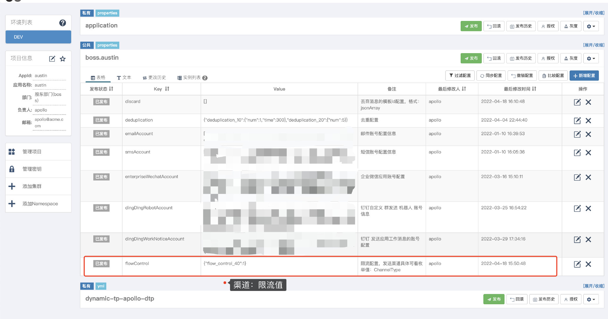

# 3.37 为什么要实现限流

**01、为什么austin项目需要限流**
服务器能处理的请求数是有限的，如果请求量特别大，我们就可能需要做限流。

限流处理的姿势：**要么就让请求等待，要么就把请求给扔了**

从系统架构来看，我们的**统一处理入口**在austin-api接入层上，austin-api接入层做完简单的参数校验以及参数拼接后，就将请求转发到**消息队列**上了

按正常来说，因为接了消息队列且接入层没有什么耗时的操作，那**对外的接口**压力不大的。

没错的，austin要接入限流也并不是在austin-api接入层上做，是在austin-handler消息处理下发层。austin-handler消息处理下发层我们是用线程池去**隔离不同的消息渠道不同的消息类型**。

在系统**本身上**其实没有性能相关的问题，但我们**下发的渠道**可能就需要我们去**控制调用的速率**。

腾讯云短信默认限制**3000次/秒**调用下发接口

钉钉渠道对应用消息和群机器人消息都有接口调用的限制

**....**

在保证下发速度的前提下，为了让业务方所下发的消息其用户能正常接收到和下游渠道的稳定性，我们需要给**某些渠道进行限流**

于是在这个背景下，我目前定义了两种限流策略：
1、按照**请求数**限流
2、按照**下发用户数**限流

**02、如何实现限流？**
想要实现限流，摆在我们面前有两个选择：
**1**、单机限流
**2**、分布式限流

咋一看，线上不可能只部署一台机器去发送整个公司的消息推送的，我们的系统应用在线上环境绝对是集群部署的，那肯定就需要上**分布式限流**了，对吧？

但实际上**分布式限流**实现并不简单，目前分布式限流的方案一般借助两个中间件
**1**、Redis
**2**、Sentinel

我们可能会用Redis的**setnx/incrby+expire命令**(从而实现计数器、令牌桶限流)/**zset数据结构**(从而实现滑动窗口限流)

Redis实现的限流想要比较准确，无论是哪种方式，都要依靠**lua**脚本，而Sentinel支持单机限流和分布式限流，Sentinel分布式限流需要**部署Token服务器**

对于分布式限流而言，不管用哪一种方案，使用的成本和技术挑战都是比较大的。

如果用单机限流的话，那就简单得多了，省事直接用Guava包下的**RateLimiter**就完了。缺点就在于：**它只能控制单机的限流，如果发生了服务器扩容和缩容，它是感知不到的**。

有的人就给出了方案：**那我用Zookeeper监听服务器的数量不就好了吗**。理论上确实是这样的：**每台机器限流值=限流总值/服务器数量**

不过这又要去依赖Zookeeper，Zookeeper集群本身也有一堆状态相关的问题。

我是怎么实现的？**单机限流一把梭**

**03、代码设计**

从上面的描述可以看到，austin的限流我是要做在具体渠道上的，根据现有的代码设计我要的就是在各个的Handler上写上限流的代码。

我本身就设计了BaseHandler抽象类作为模板方法设计模式，此次限流的设计我的是：
**1**、将flowControl定义为abstract抽象方法，子类渠道去实现限流的代码
**2**、子类在初始化的时候定义限流参数，BaseHandler父类根据限流参数统一实现限流的逻辑

我选择了第二种方式，主要是我认为对于各个渠道而言，只是限流值是不同的，限流的逻辑应该都是一样的，没必要在每个子类上实现类似的逻辑。

而限流的逻辑就比较简单了，主要就使用RateLimit提供的易用API实现

没错，限流值的大小我是配置在**apollo分布式配置中心**的。假设以后真的要扩缩容了，那到时候提前把分布式配置中心的值给改掉，也能解决一部分的问题。

很多时候，**设计简单的代码可能实现并不完美，并不智能，并不优雅，但它付出的代价往往是最小的**。

虽说如此，如果大家想要了解Redis+lua实现的同学可以fetch下austin最新的代码，就我写文章这段时间里，已经有老哥提了pull request用**Redis+lua**实现了**滑动窗口**去重的功能了，**本质上是一样的**。

若有收获，就点个赞吧

 

> 原文: <https://www.yuque.com/u37247843/dg9569/grgna3rlntwgeku9>