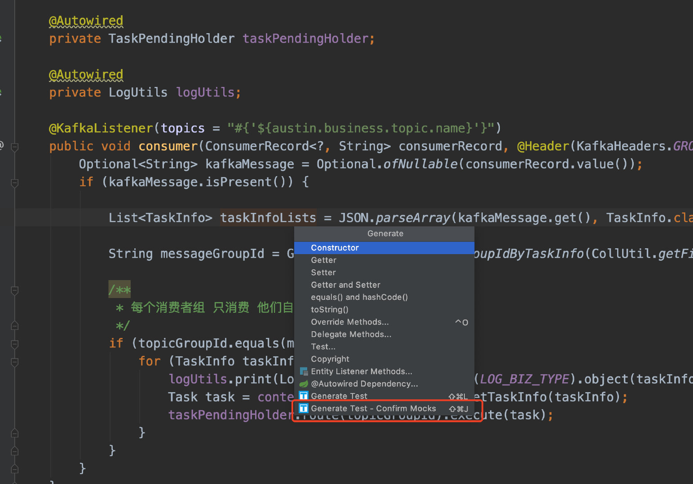
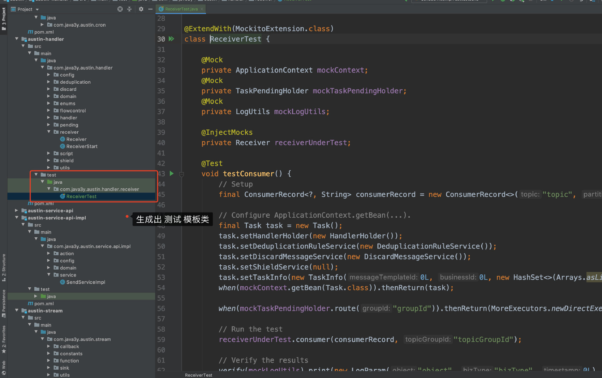
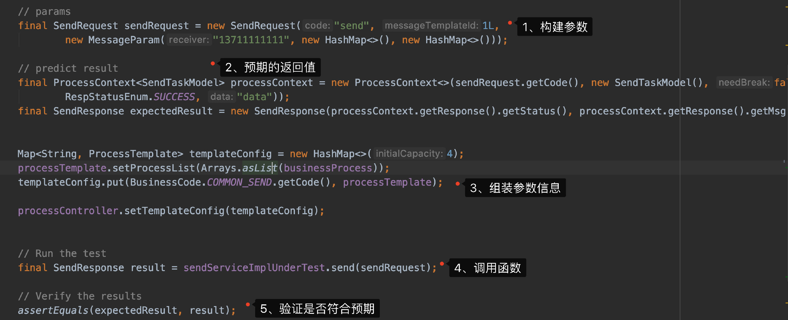
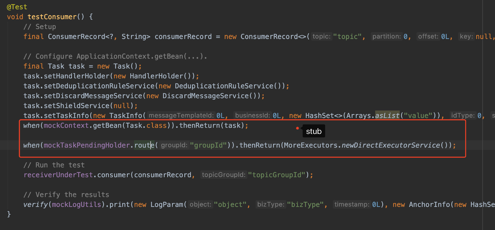
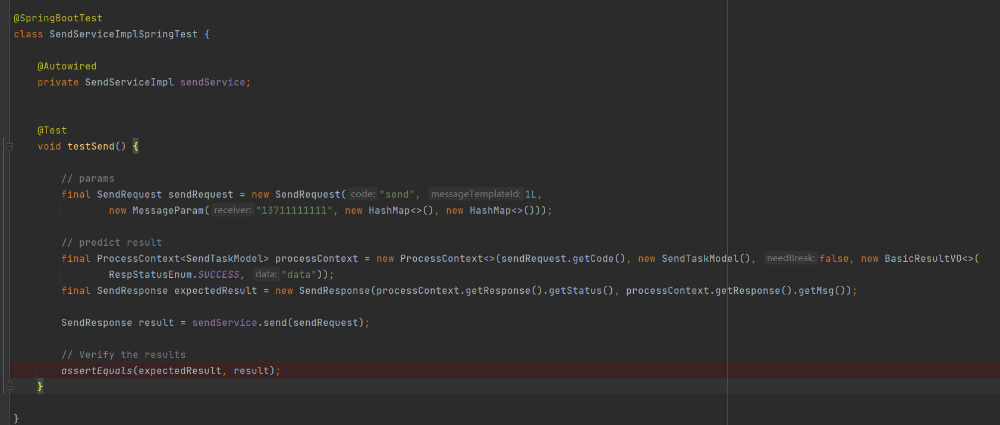

# 3.38 什么是单元测试？


## 01、单元测试（unit test）
我有个前同事进了外企，他说进了外企以后学习了很多新名词，刚进去时都不知道他们讲的是什么...

他问我：UT你知道是什么意思吗？

我说：不知道啊。

他说：UT是Unit Test，单元测试

我说：你们现在都要写单元测试吗？

他说：是啊

后来，我在群里闲聊的时候，发现有个企鹅上班的大哥也不知道UT是什么意思，那我就放心了。


## 02、测试类型有什么

测试类型对于我们**开发人员**来说，或许可以归纳分为三类：

1、单元测试：**对某个类中**的代码进行测试，查看是否正常

2、集成测试：**跨模块测试**查看代码是否正常

3、端到端测试：以用户的角度把系统作为一个**整体看功能**是否正常

所以，在我们程序员里谈单元测试的时候，可能会是纯单元测试，也可能是集成测试，毕竟这块大概率都应该是我们干的。


## 03、为什么要单元测试

对于我这种不怎么写单元测试的，也不爱写单元测试的，在我的嘴里自然就编不出要写单元测试的理由了，倒是不写单元测试的理由是一堆堆的。

说到单元测试，就不得不提起另一个词，TDD(Test-Driven Development)测试驱动开发：**在开发功能代码之前，先编写单元测试用例代码，测试代码确定需要编写什么产品代码**

测试驱动开发虽然饱受争议，不过有这种方法论的推出并有不少的同行在践行，起码能够说明**测试的重要性**。

1、当我们想测试部分代码逻辑是否正常的时候，我们可能会直接`psvm`来构造数据进而调试。那如果有一种东西能把我们`psvm`统一放到某个地方呢？

2、当我们在一个系统里边修改了很多代码时，又不确定改动是否影响在核心逻辑时。那如果有一种东西能在编译的时候，顺便**自动**跑一遍逻辑做回归呢？无论是重构还是正式提测前，都提高了自己写代码的信心。（**这个写单测最主要的理由**）

3、当我们很容易**一不小心时**就把代码写成一坨屎，那如果有一种东西能让我们在编码的时候就注重自己的代码设计呢？

4、当我们这个季度什么都没干，但是系统没发生过故障，那如果有一种东西能让我们在KPI上添上浓墨的一笔呢？

5、....欢迎补充

没错，这东西就是**单元测试**。


## 04、单元测试怎么写？

很长一段时间里，怎么写单元测试我的知识就停留在**Junit**上。后来，跟我那个进外企的小伙伴以及群里的滴滴哥交流了以后，发现他们都会用**Mockito**这个框架去写单元测试

在这个过程中， 我看了些关于Mockito单元测试的文章，但总会有专业术语给我劝退，到这里我就很明白，我要边写边看了。

**1**、SpringBoot环境下使用Mockito只需要引入`spring-boot-starter-test`就好了，默认内置了Mockito相关的依赖

```xml
<dependency>
  <groupId>org.springframework.boot</groupId>
  <artifactId>spring-boot-starter-test</artifactId>
</dependency>
```

**2**、我们单元测试是写在对应的**test目录**下的，想想都知道会有插件可以帮我们通过主类成为出对应的测试类，是不需要我们手动去建包和建测试类的。

于是，我找到了**squaretest**插件





**3**、看几篇Mockito相关的教程，了解其API和概念，推荐下这个教程：[https://www.letianbiji.com/article/101720.html](https://www.letianbiji.com/article/101720.html)

**4**、亲自动手写一个单元测试，了解其编写过程和感受体验



有的人可能看到这里就要问了：**为什么要用Mockito这种测试框架而不是纯用Junit？**在我的看来，答案就是：我们在测试时对象可能是Spring下的，我们不能直接new，又或是new出来的对象成本很大（还得解决依赖等问题）

这时候，我们就需要Mock对象出来**模拟**我们创建了这个对象，而在学习Mockito测试框架在这个过程中，其实就是对**Mock**/**Stub**/**Spy**概念的理解以及他们的使用。

**Mock**和**Spy**都是模拟创建出一个对象，区别在于**Spy**模拟创建出的对象是会**真实调用方法**的，而**Mock**模拟创建出的对象是**不会真实调用方法的**

那**Mock模拟**创建出来的对象不会调用真实方法，但我们又想验证其流程怎么办？

比如，我在写`service`层的单元测试，我认为`dao`层的代码是正常的，但是`service`是需要`dao`的对象访问数据库的，这时候我Mock出`dao`的模拟对象，去调用方法。

所以我会**假定**调用`dao`层的某方法时它的返回值是什么，这个过程就是**Stub**




## 05、集成测试怎么写

在刚刚，我们使用Mockito的时候，是没有依赖Spring环境的，对象都是Mock出来的，速度杠杠的，非常快。但我们很多时候可能是需要依赖Spring环境跨模块去调试功能是否正常。

这时候，我们就要使用[**@SpringTest **](/SpringTest )** **来修饰测试类指明我这个是需要Spring环境的。既然有了Spring环境，那[**@Autowire **](/Autowire )** **之类的注解都是可以用的。



在web模块下启动的话，你会发现它就真的**启动了应用相关的环境**，然后专门跑了这个测试方法。


## 05、为什么我不爱写单元测试

我是写完了业务代码，然后再回过头来写单元测试。单元测试是我自己写的，我Mock出来模拟对象再Stub，整个过程中我都是认为我写的代码是正确的。

写完了以后，看到绿色的条框我并不意外，毕竟我是对着我的业务代码写的单元测试。而集成测试都把Spring环境相关的依赖都整进去了，我直接在本地启动服务也能自己调呀。

（我相信看到这篇文章绝大多数人都不是TDD模式开发，应该都是对着自己写好的业务代码写单元测试）

**写单元测试的代码也是代码，也是要花时间的呀**

我也去问了腾讯/滴滴/阿里/字节的朋友，发现**他们也不爱写单测**，很多时候写单测就是为了通过编译，为了业务的覆盖率，能绕开就绕开了。

为什么没有问京东/拼多多/美团/网易等等的？别问，问就是还没太熟。


> 原文: <https://www.yuque.com/u37247843/dg9569/rp4ecfk5i54g8g10>