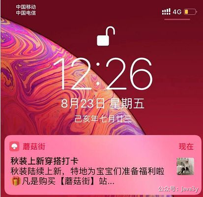
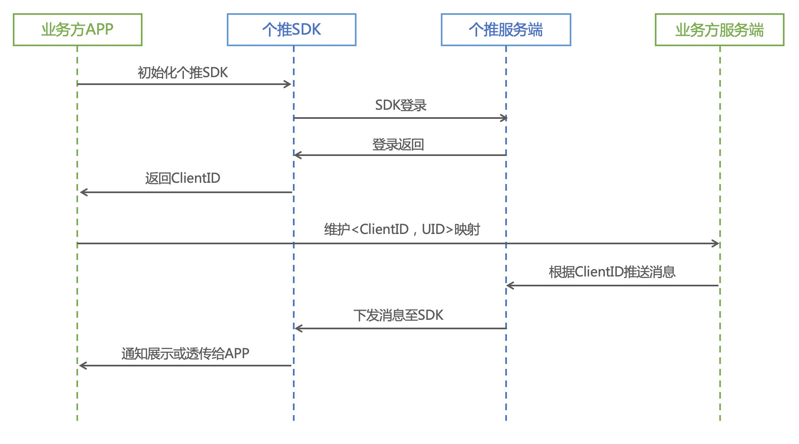
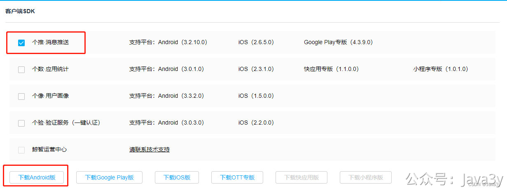
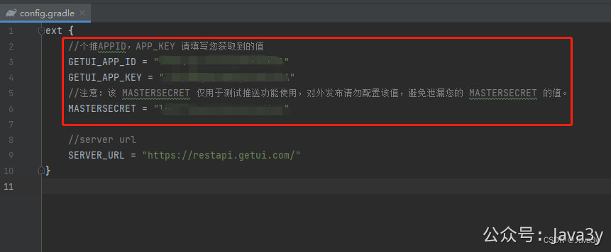
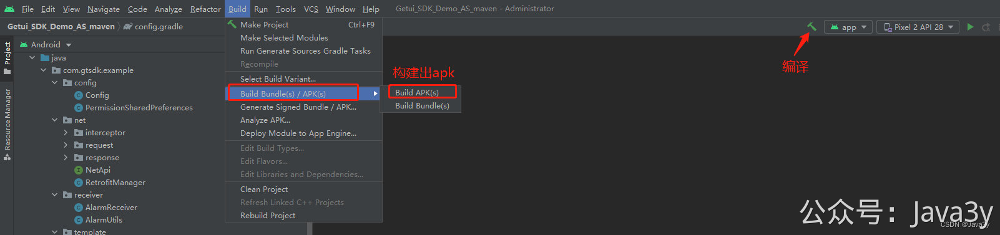

# 3.39 PUSH通知栏消息接入

Push通知栏消息是非常常见的，几乎每个APP都会做这个功能（没有消息推送的APP不是一个好的APP）

一般我们认为Push消息能做以下的事情：

1、**唤醒用户，提高用户的留存率，提高产品活跃度**。我手机下载了APP，但我似乎把它已经忘记了(好久没用了)，如果此时这个APP给我推送一条我**有兴趣**的内容。我可能会继续用这个APP，甚至从此活跃起来（购买消费)

2、告诉用户我有**新的产品上线**了(带动功能模块使用率)。本来APP是做商城的，现在做起直播来了。但好多用户好像都不咋留意到，此时我推送一条直播的消息给用户，可能用户就爱起直播了。

Push消息能够在你手机闭屏时(即便你没有打开APP)，通过**通知**来给你推送信息，是一种能够**直接触达用户**的消息推送。相对**短信**而言：成本低、样式多样(支持标题/简介/图片)、链接跳转直接到APP。

不过如果用户收到不感兴趣的推送可能会导致：用户把通知消息给关闭了甚至把APP给卸载了

## 技术上如何发送通知栏消息？

要给用户下发消息，我们得维护APP 客户端和服务端的「**长连接心跳**」。这个长连接心跳如果由我们自行来维护，难度会很大，**绝大部分的公司不会自建推送服务**。目前我们流行手机的操作系统类型分为两种：**安卓和iOS**。

1、iOS我们默认走的是官方推送的渠道**APNS**。iOS 在系统层面与苹果 APNs（Apple Push Notification service）服务器建立连接，系统收到 APNs 服务器消息后会帮我们转发到相应的APP上。iOS端我们可以直接接入APNs服务器下发推送消息

2、安卓由于Google在国内访问不稳定，在国内**暂未**统一掉推送服务（工信部牵头成立的“安卓统一推送联盟”还在期待中）。目前更多的是众多的手机厂商在其**定制**的系统中也内置了推送功能，如小米、华为等。由于接入成本的问题，也出现了大量的第三方推送服务提供商，比如个推、极光、友盟、信鸽等等。第三方推送服务提供商也会接入对应的手机厂商来实现对消息的下发

接入第三方服务商推送的流程大致下：

## 使用个推 （DEMO SDK）- 接入调试
正常发送PUSH是需要客户端开发的，Austin更多关注的是服务端推送，而非客户端的内容，所以我直接用个推提供的SDK Demo做调试。

文档如下：[https://docs.getui.com/getui/start/product/](https://docs.getui.com/getui/start/product/)

从文档里以及我的实践后发现要使用该SDK，可以分为以下步骤：

**1**、登录注册个推账号，得到appid、appkey、appsecret

**2**、下载Android版本的消息推送Demo：[https://docs.getui.com/download.html](https://docs.getui.com/download.html)

**3**、下载Android Studio来打开刚才下载的SDK：[https://developer.android.com/studio](https://developer.android.com/studio)

**4**、修改config.gradle文件的账号相关参数值：

**5**、编译成功后，直接build出对应的apk

**6**、将apk文件给安卓的手机下载，就完事了

> 原文: <https://www.yuque.com/u37247843/dg9569/hkrlnl7wbmkbgzk4>