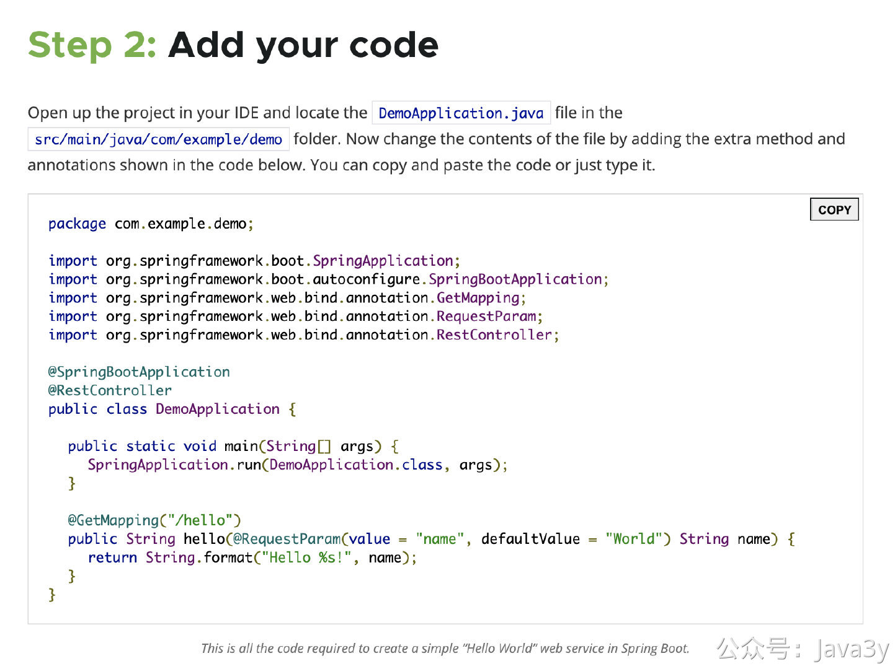

# 3.3 为什么选用SpringBoot作为技术框架
视频讲解：

**视频讲解：**
[](https://www.yuque.com/u37247843/dg9569/qov60cdx1fbs2h86?_lake_card=%7B%22status%22%3A%22done%22%2C%22name%22%3A%22%2306%20%E6%B6%88%E6%81%AF%E7%AE%A1%E7%90%86%E5%B9%B3%E5%8F%B0%E6%8E%A5%E5%85%A5SpringBoot%20%E9%87%8D%E7%BD%AE.mp4%22%2C%22size%22%3A365846727%2C%22taskId%22%3A%22u73dd0d19-0e64-4218-b095-3564b50dc3e%22%2C%22taskType%22%3A%22upload%22%2C%22url%22%3Anull%2C%22cover%22%3Anull%2C%22videoId%22%3A%22inputs%2Fprod%2Fyuque%2F2023%2F1285871%2Fmp4%2F1687265938149-83d1a8b3-496f-4da2-b86e-a435e0fc99e7.mp4%22%2C%22download%22%3Afalse%2C%22__spacing%22%3A%22both%22%2C%22id%22%3A%22oIsHr%22%2C%22margin%22%3A%7B%22top%22%3Atrue%2C%22bottom%22%3Atrue%7D%2C%22card%22%3A%22video%22%7D#oIsHr)

这次我选用SpringBoot作为项目的基础环境，至于为什么SpringBoot，我可以跟大家分享下群里的对话。

我记得有一天，有个小伙伴在群里问：“**今天我去面试了，面试官问我使用SpringBoot有什么好处**”

接着另外一个小伙伴回答：**使用SpringBoot最大的好处，就是让我这种水平的开发都入了行，做上了程序员。**

一个项目里会用好几种技术栈，不同的技术栈就需要有对应的配置（常见的Spring、SpringMVC、Mybatis）等等，然后这些技术都需要兼容对应的版本（一般我们是把这些技术整合到Spring上的）。当我们要引入新的框架，那自然就需要对齐Spring版本并且有对应的配置文件。

那真的是**配置地狱**（框架们都做得灵活，都支持我们把可能需要改动的内容写到XML配置上，但随着时间流逝，我们渐渐发现：这些XML配置我们都维护不动了...)

基于这种背景下，SpringBoot应运而生，它最明显的就是简化了我们开发的配置工作。当一项技术能减少开发时工作量都有一个特点：**约定大于配置**（开箱即用）

只要引入了SpringBoot，那**只要通过几行的代码就能快速地从零写出对应的HTTP接口**（可参考官网SpringBoot 的Quick Start）

以前我们干这种事，需要整合SpringMVC，需要配置一个Tomcat服务器，需要对齐它们的版本（是否兼容）....

我认为SpringBoot作为使用方，至少要了解以下两块内容：

**一、**当我们项目我们引入了SpringBoot的依赖(`spring-boot-starter-parent`)，点进去`parent`就会发现`spring-boot-dependencies`这个pom定义了非常多「**默认的依赖**」。这使得我们在项目中使用的时候，都不用写版本了（因为SpringBoot已经默认帮我们已经写上了），还不用担心版本冲突的问题（：

**二、**在启动SpringBoot项目的时候，还会帮我们初始化很多默认的配置。（这里也是一个面试经常考察的地方「**自动配置**」）。总的来说，`@SpringBootApplication`**等同于**下面三个注解：

- `@SpringBootConfiguration`
- `@EnableAutoConfiguration`
- `@ComponentScan`

其中`@EnableAutoConfiguration`是关键(启用自动配置)，内部实际上就去加载`META-INF/spring.factories`文件的信息，然后筛选出以`EnableAutoConfiguration`为key的数据，加载到IOC容器中，实现自动配置功能！

> 原文: <https://www.yuque.com/u37247843/dg9569/qov60cdx1fbs2h86>