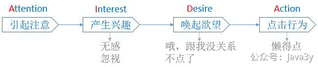
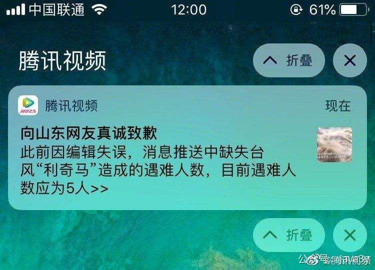
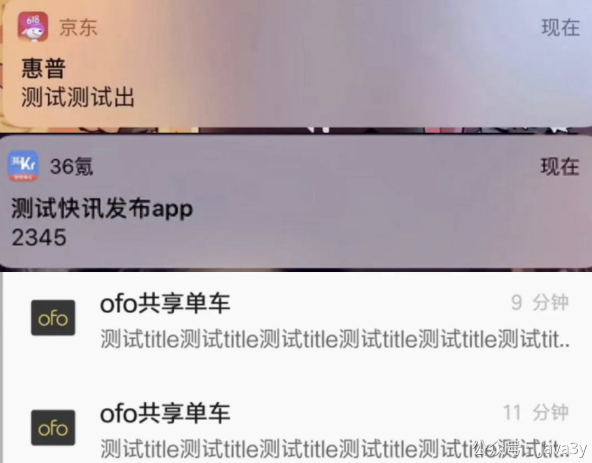
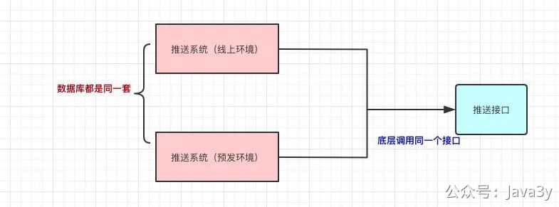
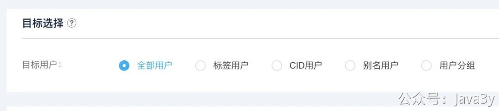
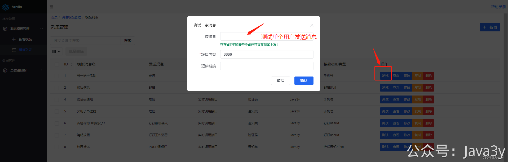

# 3.40 技术之外的PUSH消息

推送的内容又可以简单分为以下的几类：

- **系统功能类**(消息提醒)：比如快递签收通知，发货通知，关注的主播开播(上新)啦
- **营销类**（活动/优惠类）：比如某某时间开始大促，赶紧抢购
- **内容类**：比如晓明哥经典语录，穿搭风格教程
- **资讯类**：新闻、时事内容推送

针对上面所说的Push推送好处以及坏处，这就非常考验我们到底推送些什么内容给用户了
1、推的内容好：提高用户留存率、提高产品活跃度、提高用户对APP的粘度
2、推的内容差：用户对你的内容变得麻木、直接关闭通知消息、甚至卸载APP

那么一般我们会考虑些什么因素呢？有以下几个：**文案**、**推送频率**、**推送时机**、、**推送的人群**

关于**文案**，有一个叫做爱达法则（AUDA）公式：
爱达法则

相信大家都听过UC标题，如果有一个好的文案内容那吸引用户点击的概率就更高一些。目前一般的推送会用一些小技巧去提高用户的

- 在文案末尾后加上引导话术：“点我揭晓”、“→”、“>>”
- 多多利用数字：众多品牌3折起，更有10元的裤子，你还等什么？
- 增加emoji表情
- 结合热点：今天晓明哥又出新语录！
- 更强的关联性：比如除夕的时候，你微信收到N个祝福消息，但一看就是群发的，没啥意思。但此时，有个朋友给你发了条消息：“**3y** 春节快乐”。你就觉得有点温馨了，是不是！
- ....

关于**推送频率**，推送的频率要**控制**得当，假设我在一天里：

- 9-10点给你推条：关注这些，你的Java水平一定能提高！
- 12-14点给你推条：三年大佬经验总结，买了就是赚到！
- 18-19点给你推条：耗时一个月整理的英语资源！一次性全部分享给你！
- 21-22点给你推条：价值1999的大数据资源，免费送给你！

那显然，你肯定会取关我，是不是。一般来说一天用户不能收到3天以上的推送，消息多了，算是骚扰了，甚至不能每天都给用户推送（可能隔天推一次会好一些）。

关于**推送时机**，如果是资讯类的，推送的时机显然是越早越好了，不然别人家的都推送完了，用户都知道了。你才推送，那谁还点进去啊。
（同时作为是**官方推送的，还应保持准确性**）

一般推送内容，我们都是希望在大家相对空闲的时间去推送，比如：
> 上班路上及早餐时间（9-10点）、午休（12-14点）、下班路上（6-7点）、睡前（21-22点）
> 不同的用户群体，时间可会有一定的调整。所以这就得寻找**相对适宜的时间**了。

关于**推送人群**，现在互联网公司都有自己的**用户画像**系统，给同一类人推送合适的消息是较合适的。比如说：

- 有一批用户刚注册平台，给这批用户推送个优惠券，促进他的购买欲
- 有一批用户可能身高150+，给这批用户推荐些矮小的搭配风格推荐
- 有一批用户的地址位置在广州，给这批用户推荐一下：广州就该这么穿，你就是整条街最靓的仔！
- …这儿可以跟文案关联起来，这样的推送会更加精准一些，用户可能会点击的概率会更高一些。

我是一个学Java的，收到的通知消息却是：“Excel从入门到精通，只要30天！”(关键是我也没关注过Excel的内容)，那此类的推送如果多了，我很可能就把这个APP删了。

关于**推送容易产生事故**，为什么会经常出现类似下图的事故呢？我认为最主要的原因是：**预发和线上的环境是同一套**。

众所周知，我们的系统都有几套的环境（比如说本地/线下/预发/线上 环境），其中大多数公司的预发和线上环境数据库是同一套的，只是预发环境调用的是预发环境的接口，线上环境调用的是线上环境的接口而已。

推送这种系统的线上和预发环境其实没多大的区别，因为在底层是调用**外部的接口**来实现发送的，所以预发和线上环境其实调的都是**同一个接口**。

于是我们会在预发环境下配置了「**白名单**」，在白名单内的用户才能收到消息来尽可能避免环境的问题

**其次**，在大多数情况下，推送事故往往是「运营」的推送导致的。运营要推送消息给用户，首先需要**圈选一个人群**去推送。

**人群量需要管控**：我们在圈选的时候，如果运营圈定的人数大于一个阈值，我们会走邮箱让主管确认是否需要圈选这么一个大的人群去推送。这块有两个目的：
1、首先我们是认为推送的人群应该是精细化的，什么标签的人群应该收到什么的推送。不应该圈定一个庞大的人群去推送同一条文案的消息（新闻APP除外）。
2、即便出了事故，也只是一部分用户能收到，而不是全体用户。

对于很多系统其实都不需要**全体用户**推送这个功能

在运营圈定人群后，我们会有单独的测试功能去「测试**单个**用户」是否能正常下发消息，文案链接是否存在问题。这一个步骤是必须要做的，给用户发出的消息，首先要经过自己的校验。

当确认链接和文案都无问题后，则提交任务，**走工单审批**后才能发送。

如果在启动之后发现文案/链接存在问题，还可以**拦截剩余未发**甚至撤回部分的消息。

在线上环境消息应该有「**平台性去重**」的逻辑：
1、在某段时间内，过滤掉重复消息
2、运营类消息推送（圈定人群的方式去下发消息）同一个用户需要相隔一段时间才能下发一次。

虽然说，我们制定了很多的规则去尽量避免事故的发生，但不得不说推送平台还是一个**容易出现事故**的系统。

> 原文: <https://www.yuque.com/u37247843/dg9569/xm1hr669k2wdgann>