# 3.41 动态流量配置短信渠道&拉取回执

我们已经完成了对短信的下发，**下发的记录**存储在MySQL数据库里了
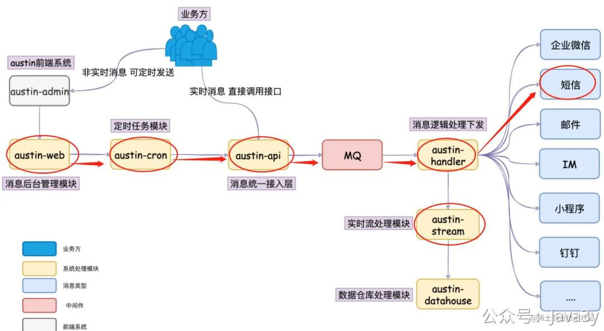
但是，数据库里只有下发的记录，**并没有用户是否真正收到短信的凭证**。所以Austin需要有接口**把短信的回执拉回来并存储**，并在推送后台管理系统**提供相关的页面给予快速查询**。
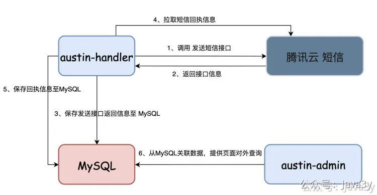

别以为我们的依赖是阿里云、腾讯云或者华为云这种大公司，他们提供的产品不是万无一失的，挂也是很正常的事。那如果我们只依赖一个短信渠道，它挂了，是不是相当于我们就挂了。

**解决方案**：短信需要**接入多个渠道商**，调用接口失败需要继续调用其他渠道商，支持**动态分配**渠道商的流量（一旦有提前预警，直接切换渠道商）
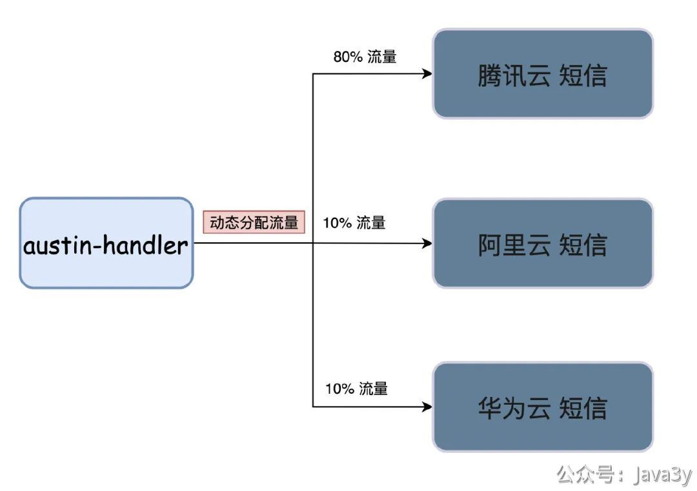
所以，我实现了这两个问题：

1、**短信渠道的回执信息拉回，在后台给到相应的页面让业务方自行查询短信下发情况**

2、多接入一个短信渠道，**通过分布式配置中心（Apollo）做动态流量配置**

### 01、动态流量配置
先看下我的入口代码吧：com.java3y.austin.handler.handler.impl.SmsHandler#handler
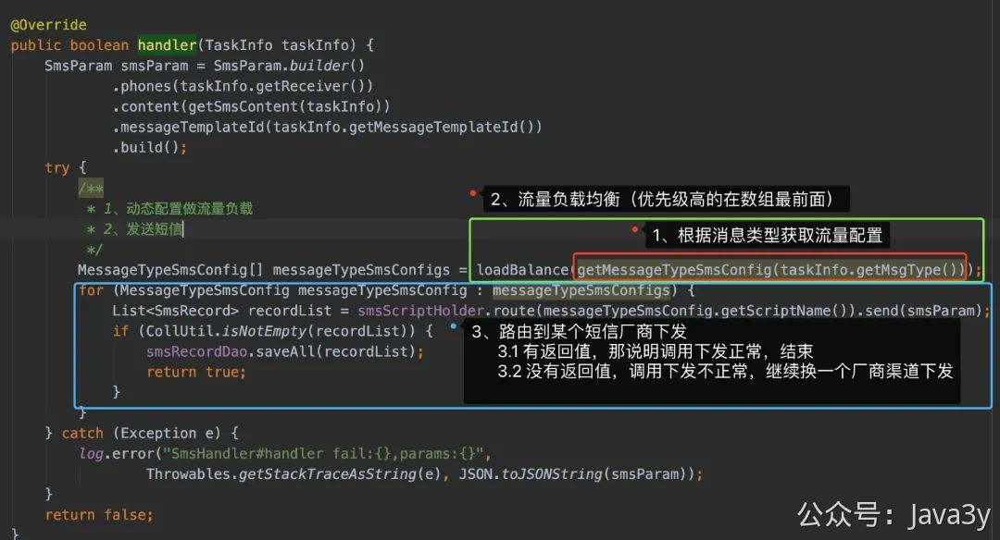
从发送短信的章节里我提到过，我们一般发送短信是经过各种厂商的"网关"，再由厂商去调用各大运营商下发的。我们拿到的回执同样也是运营商给厂商返回，然后我们再去拉取的。
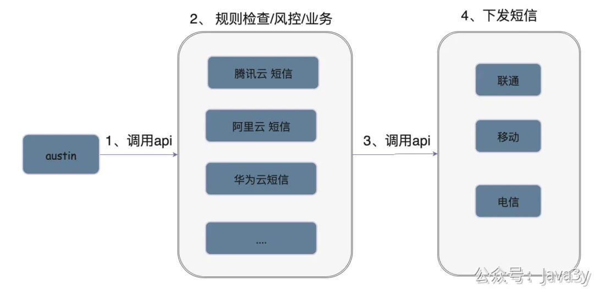
绝大多数情况下，在我们一般都是通过**回执**去排查用户为什么收不到短信（一般都有可能是用户侧拉黑了某账号、转网存在问题、发送账号存在问题等）。很少会怀疑腾讯云/阿里云/华为云等众多短信厂商提供方的接口挂了，导致下发失败了。

而这个是存在的，毕竟只要是接口就可能会出问题，所以我们在代码里是需要做容错的（有一个短信渠道**在调用时就失败了**，应该要尝试换另一个短信渠道下发）。

当我们拉取回执的时候，发现某个渠道的回执异常地多，也应该要留意是不是厂商渠道出了问题，及时切换短信的流量配置。好嘞，讲完了背景了以后，再来看看代码的细节。

之前我在项目里都没怎么写过**自定义注解**，正好遇到了比较合适的机会，来一个耍耍。我的想法是短信渠道会有很多，所以我会涉及一个短信的接口
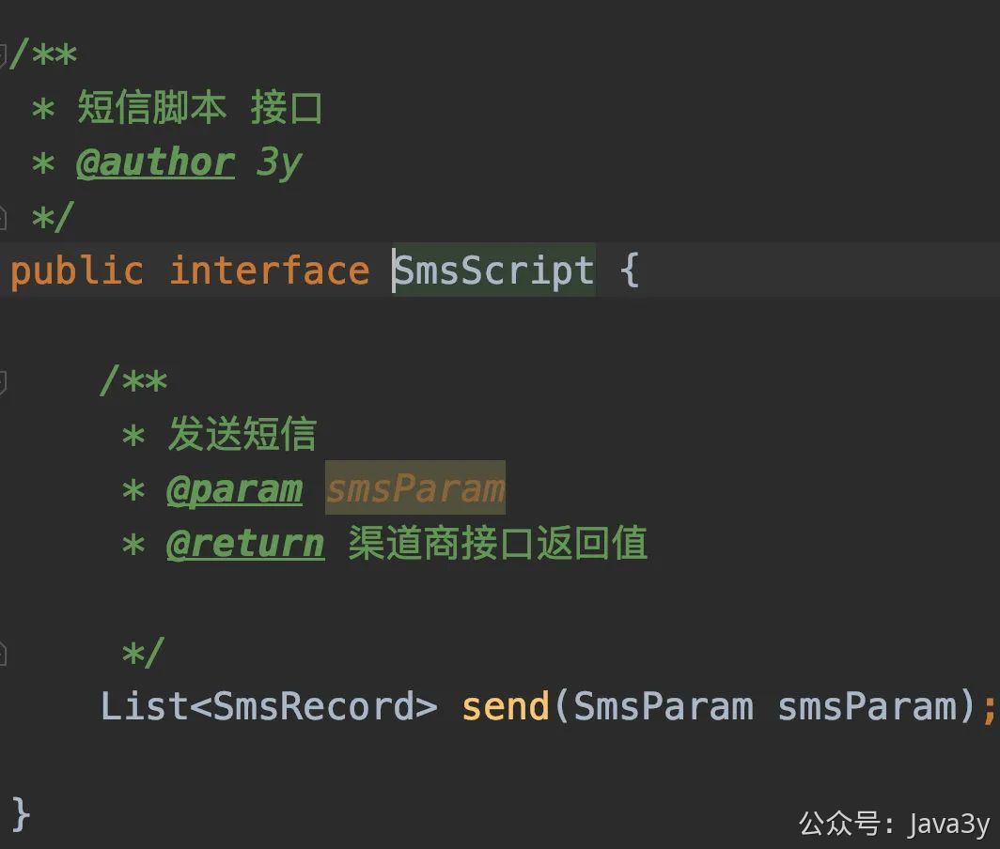
而因为我们需要做流量配置，所以需要将短信渠道管理起来，于是会有SmsScriptHolder这个角色（实际上它就是一个Map）
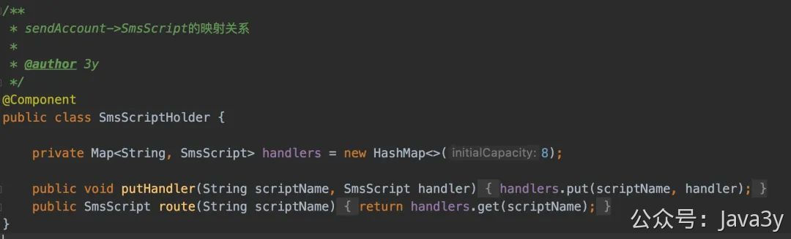
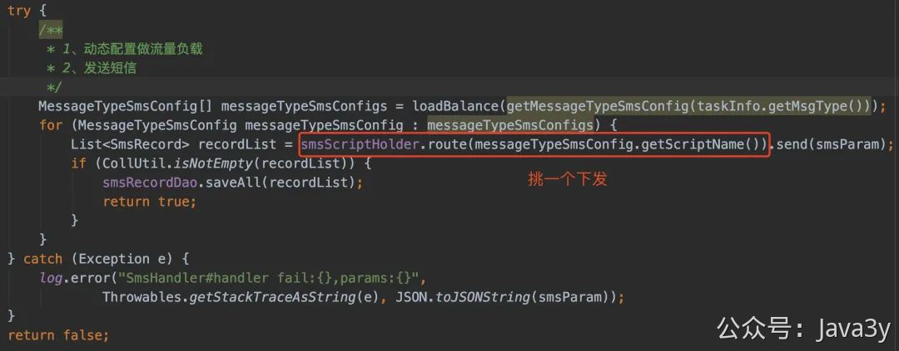
那我怎么把短信渠道塞进这个Map里边呢？搞个**自定义注解**就比较方便了。
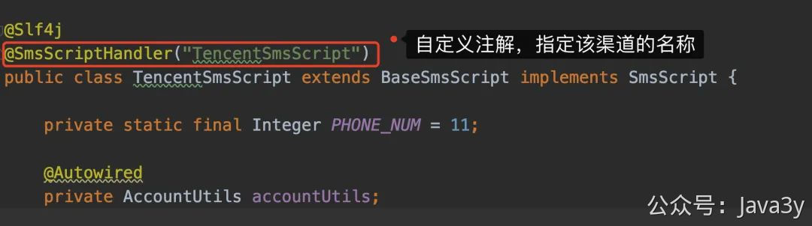
那这个注解什么时候被解析加入到SmsScriptHolder这个Map里边呢？那肯定是这个短信渠道初始化的时候嘛，所以我会有BaseSmsScript
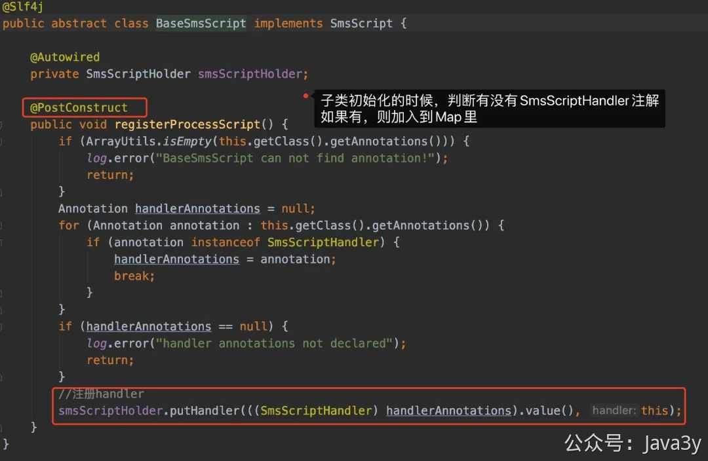
这种写法还是挺好玩的，感兴趣的可以对着这种思路看自己有没有类似的场景，改改优化优化。

### 02、回执凭证拉回，页面展示

由于这块内容比较简单，我就不过多做介绍了，我就直接给出代码入口吧

拉取回执信息的代码：**com.java3y.austin.handler.receipt.MessageReceipt**
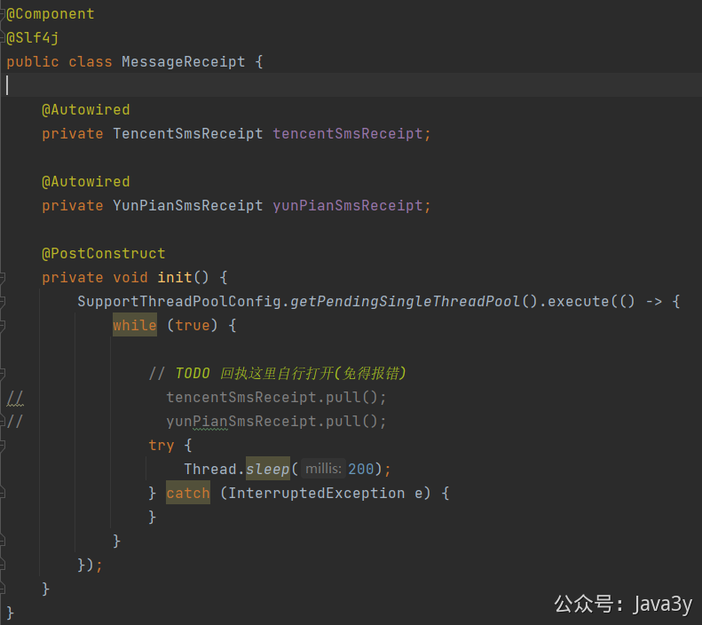
消息推送后台获取短信记录信息的接口代码：com.java3y.austin.web.service.impl.DataServiceImpl#getTraceSmsInfo
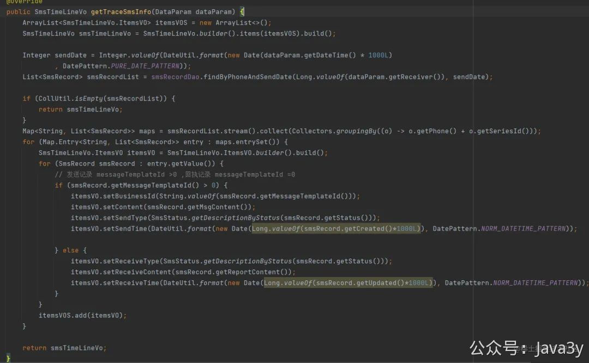
页面效果展示：
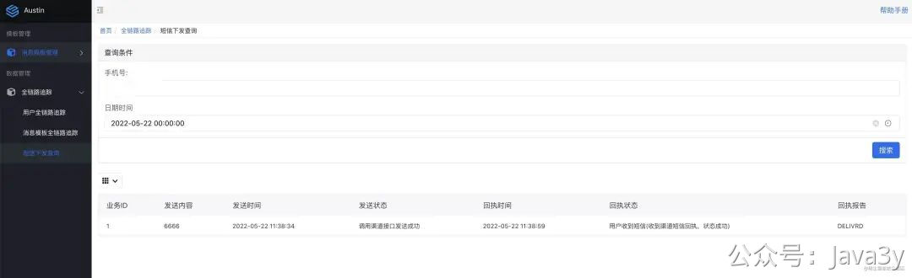

> 原文: <https://www.yuque.com/u37247843/dg9569/cf73xey9icrznlib>