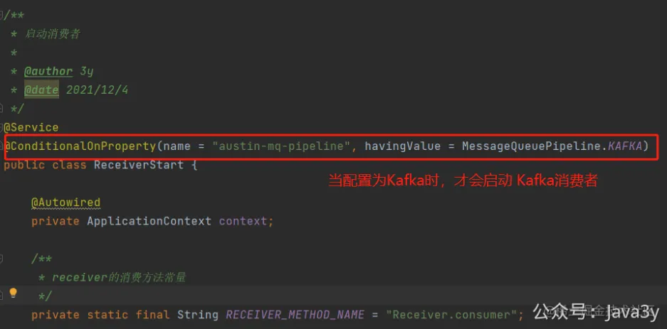
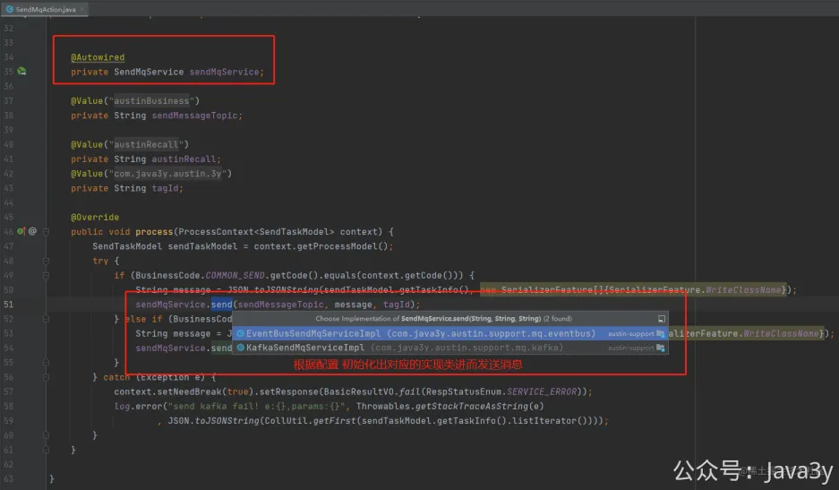

# 3.42 可插拔配置（选看）

在最开始的那一版需要**强依赖**MySQL/Redis/Kafka/Apollo（项目启动就需要部署这些中间件），**弱依赖**prometheus/graylog/flink/xxl-job（想要有完整的项目体验，就需要把这些给部署起来）。
● MySQL是没有人吐槽的，数据库这种东西，可以说是后端必需的了。 
● Redis暂时还没人吐槽，毕竟用的还是太多了，也没有什么强大的竞品。 
● Apollo经常被吐槽能不能换成Nacos。 
● Kafka时而有人吐槽，想要支持RabbitMQ、RocketMQ。 

我以前存在个观念：**在公司里中间件是不会轻易替换的**，现在我的代码已经实现了一种姿势，感觉没多大必要支持多种中间件实现，**你想换就自己动手改改嘛，又不难**。

为了开源，降低门槛，用**@ConditionAlOnProperties**这个注解来实现可插拔的配置，但其实如果是提供二方库的形式的话，**使用SPI的姿势**会更加优雅。不过，我这个系统的定位是一个应用，所以正常来说是单独部署的（**后面也会提供docker的部署姿势**）

为了让消息推送平台Austin易上手，我首先把**Apollo做成弱依赖**，可以通过配置选择**读本地文件**还是读配置中心（**Apollo**），也能选择是否使用**Nacos作为配置中心**。其实当我们使用Apollo时，即便Apollo挂了，Apollo本身就有很强的容灾能力（自带本地文件）

其次，我把**Kafka做成弱依赖**，可以通过配置选择**用Guava的eventbus**还是走分布式消息队列（Kafka），目前pull request的代码已经支持**RocketMQ**/**RabbitMQ**

当我的配置**austin.mq.pipeline=eventbus**时，我就不去实例化Kafka相关的生产者和消费者，转而去初始化eventBus的生产者和消费者，那自然**接口下的实现类**就是为eventbus的

若有收获，就点个赞吧

 

> 原文: <https://www.yuque.com/u37247843/dg9569/xfp2k7sviyrsgkf4>