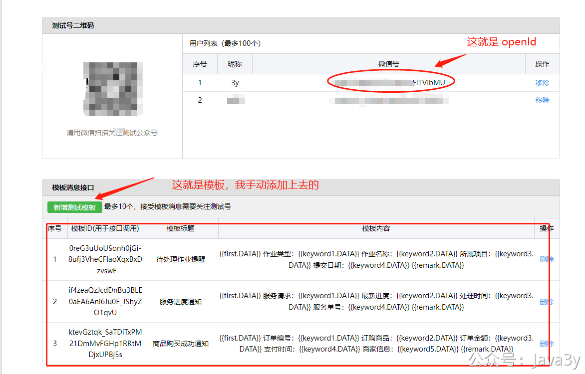
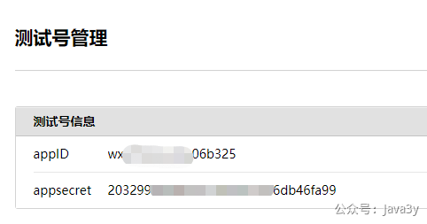
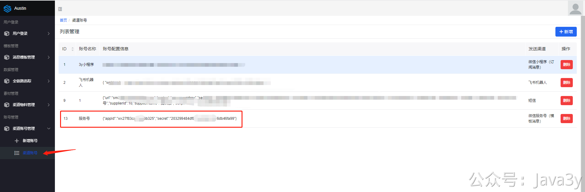

# 3.43 如何接入微信服务号模板消息

要实现微信服务号的模板消息推送，首先我们得有一个服务号。要值得注意的是，**服务号是服务号，订阅号是订阅号**。

没有服务号的同学，可以申请测试号进行调试：**https://mp.weixin.qq.com/debug/cgi-bin/sandbox?t=sandbox/login**

进入到测试号以后，我们能把自己加入到测试的微信号，拿到对应的**openId，并且**创建几个测试下发的模板；

可以粘贴下面的内容，新增测试模板
```
0reG3uUoUSonh0jGi-8ufj3VheCFlaoXqxBxD-zvswE
  
待处理作业提醒
  
{{first.DATA}} 作业类型：{{keyword1.DATA}} 作业名称：{{keyword2.DATA}} 所属项目：{{keyword3.DATA}} 提交日期：{{keyword4.DATA}} {{remark.DATA}}
```
我们还能直接拿到**appID**和**appsecret**，这就相当于当前服务号账号的信息。那我要做的就是把这个信息加入到消息推送平台的账号体系下。



几个关键代码入口：

- 前端交互：**com.java3y.austin.web.controller.OfficialAccountController**
- 发送消息：**com.java3y.austin.service.api.impl.service.SendServiceImpl#send**
- 真正处理微信服务号模板消息发送：**com.java3y.austin.handler.handler.impl.OfficialAccountHandler#handler**


> 原文: <https://www.yuque.com/u37247843/dg9569/iulhky79qhl1izi7>