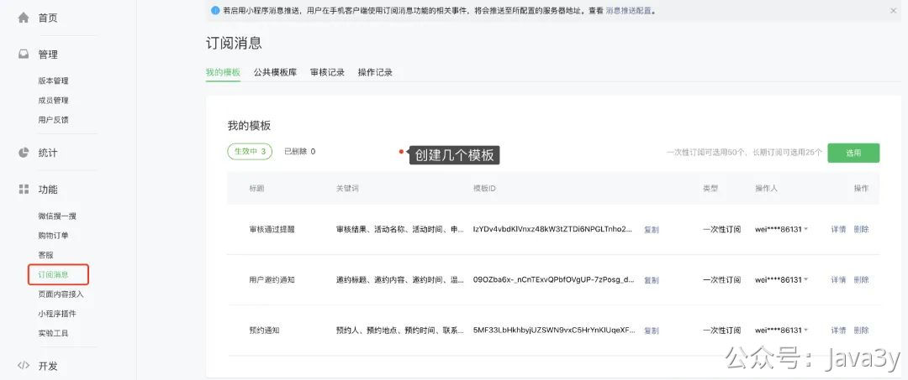
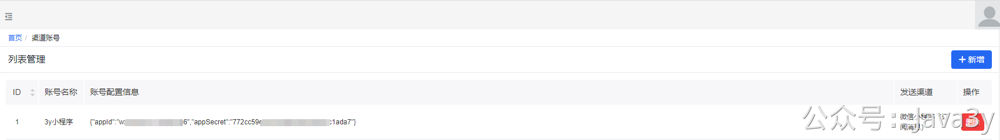
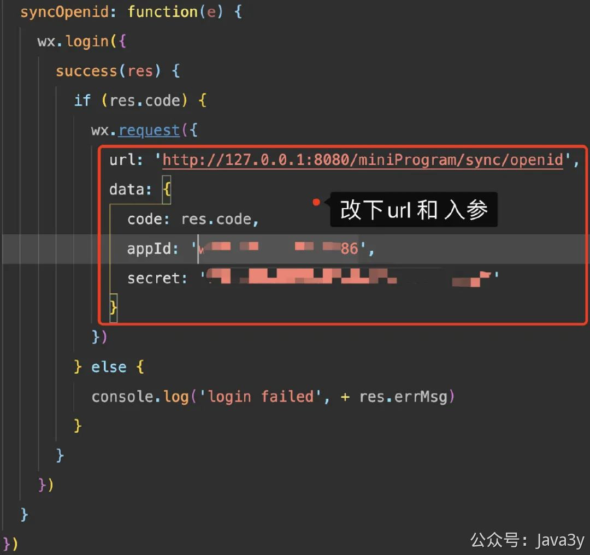
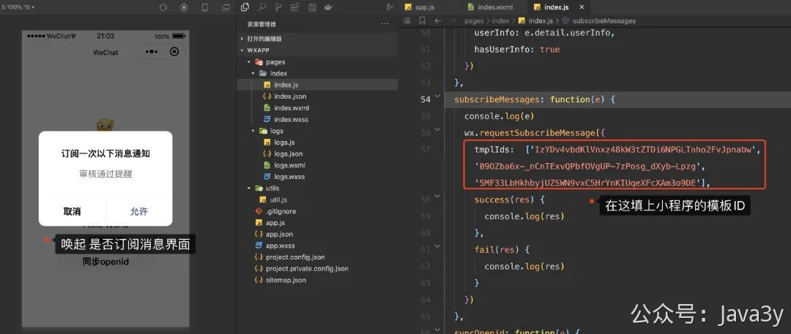
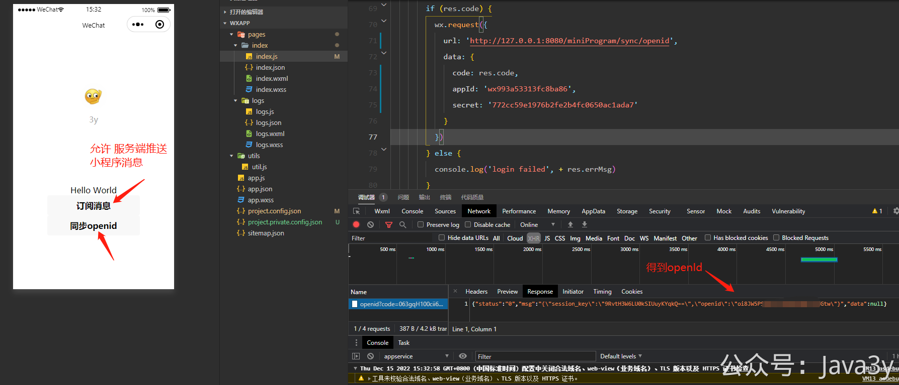
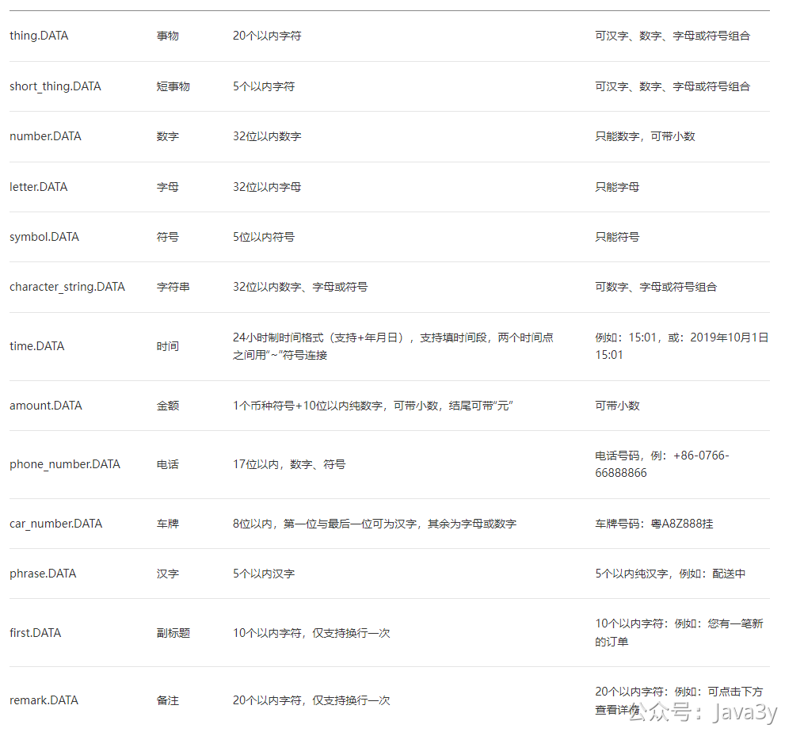

# 3.44 如何接入微信小程序订阅消息

首先注册了一个微信小程序，拿到小程序**appId**和**secret**，并在微信后台**创建了几个订阅消息**的模板。

**测试小程序**的链接：[https://mp.weixin.qq.com/wxopen/waregister?action=step1&token=&lang=zh_CN](https://mp.weixin.qq.com/wxopen/waregister?action=step1&token=&lang=zh_CN)

这个把小程序的账号就接入到消息推送平台的账号管理体系下：


下载一个微信小程序开发工具：[https://developers.weixin.qq.com/miniprogram/dev/devtools/download.html](https://developers.weixin.qq.com/miniprogram/dev/devtools/download.html)

下载调试微信小程序的demo的代码：[https://github.com/zhangkaizhao/wxapp-subscribe-message-demo](https://github.com/zhangkaizhao/wxapp-subscribe-message-demo)

将代码的「**wxapp**」文件夹导入到小程序的开发工具里，在工具内改动两块地方：

appId和secret以自己的为准：
```javascript
wx.request({
    url: 'http://127.0.0.1:8080/miniProgram/sync/openid',
    data: {
      code: res.code,
      appId: 'wx993axxxxba86',
      secret: '772ccxxxxxx650ac1ada7'
    }
  })
```


数组内的模板ID以自己的账号为准
```json
tmplIds: ['']
```

得到下发的**openId**和允许服务端推送小程序消息


在测试时，**要注意的是**：对于小程序订阅消息来说，模板的每个字段都是有类型的，**有类型意味着对于文案的内容是有要求的，比如如果是日期格式，那该字段的文案只能填日期，不能填其他了**。

类型的信息可以参照这：

链接：[https://developers.weixin.qq.com/doc/offiaccount/Message_Management/Template_Message_Interface.html#%E8%8E%B7%E5%8F%96%E6%A8%A1%E6%9D%BF%E5%88%9](https://developers.weixin.qq.com/doc/offiaccount/Message_Management/Template_Message_Interface.html#%E8%8E%B7%E5%8F%96%E6%A8%A1%E6%9D%BF%E5%88%97%E8%A1%A8)


> 原文: <https://www.yuque.com/u37247843/dg9569/wyprpif62u7opu88>